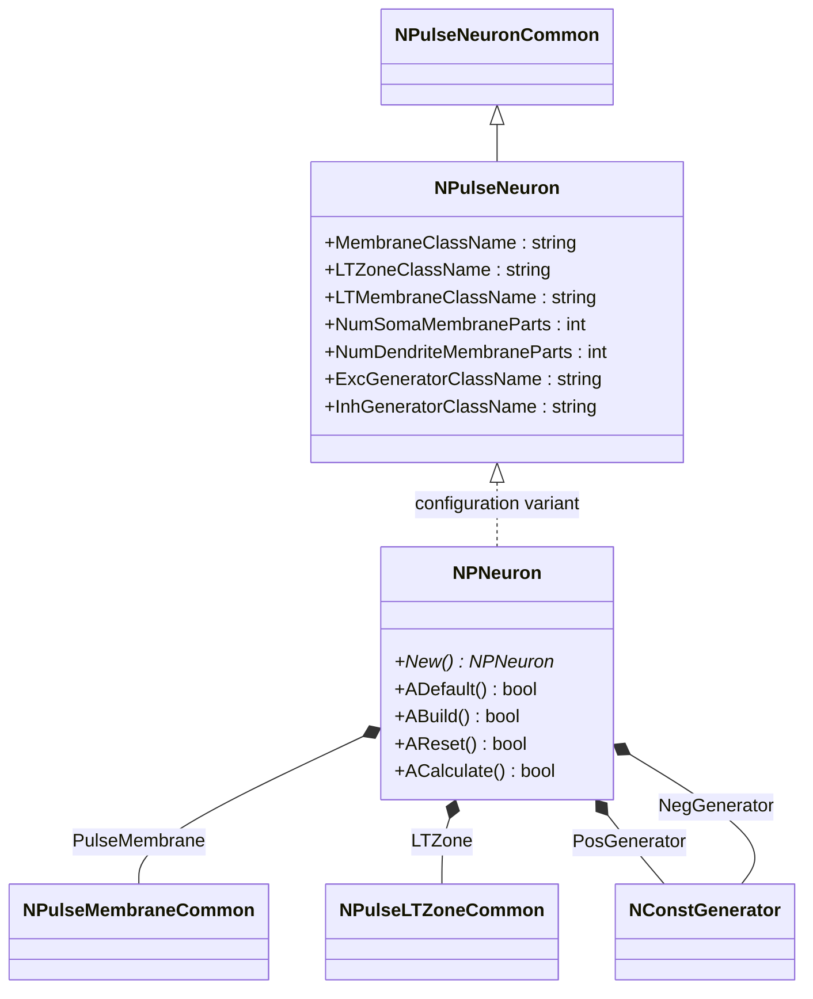
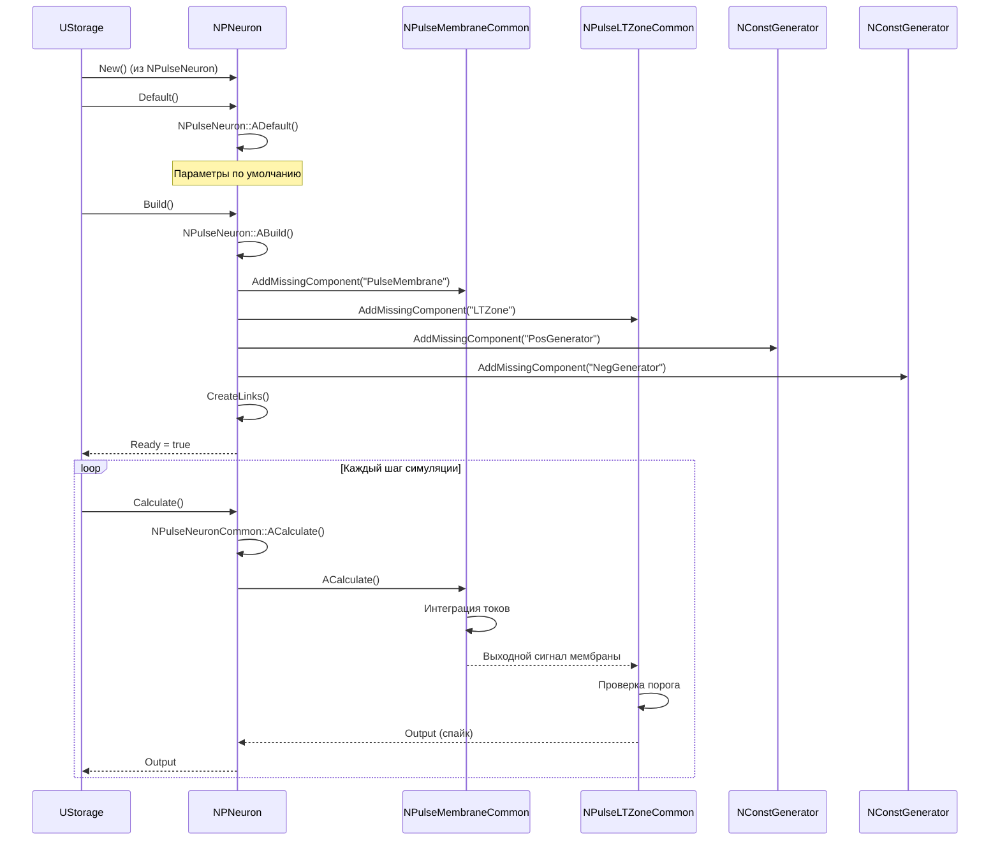
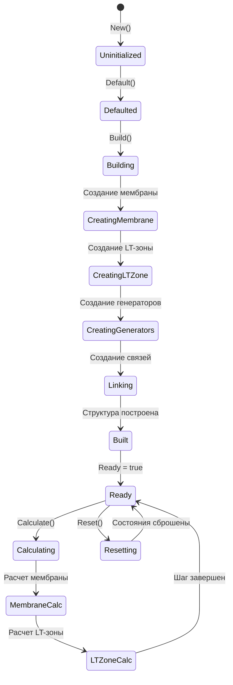
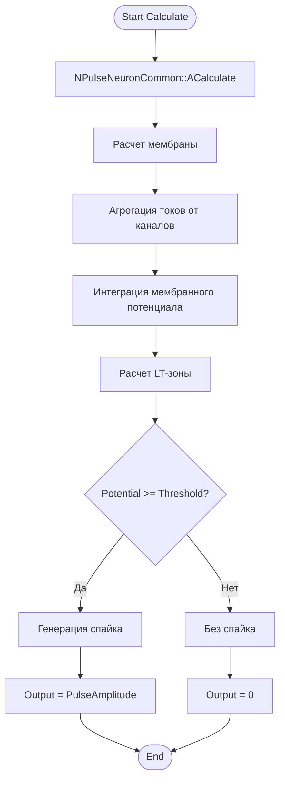
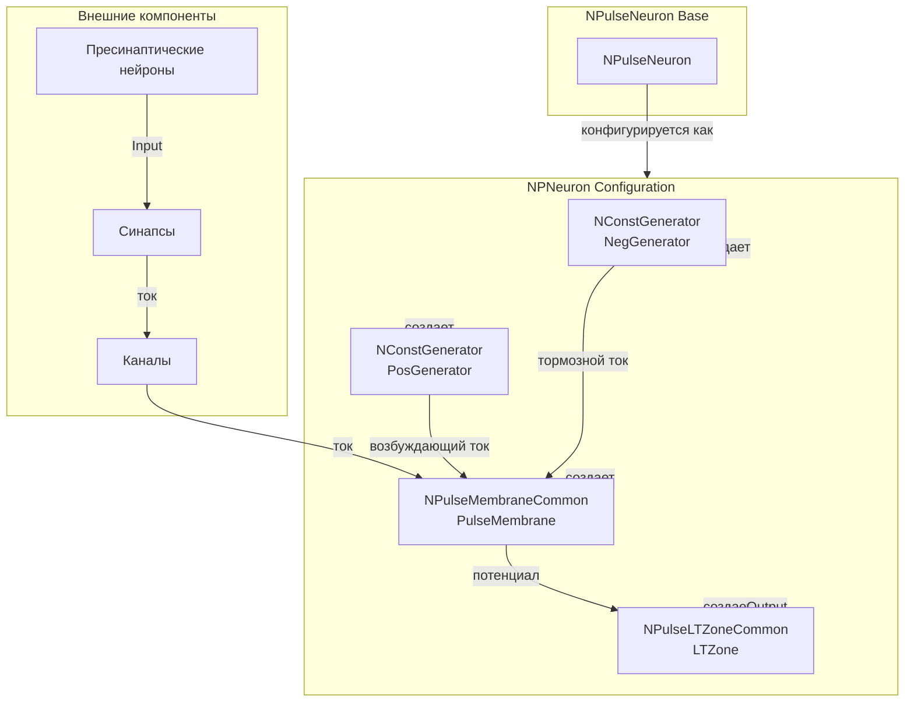
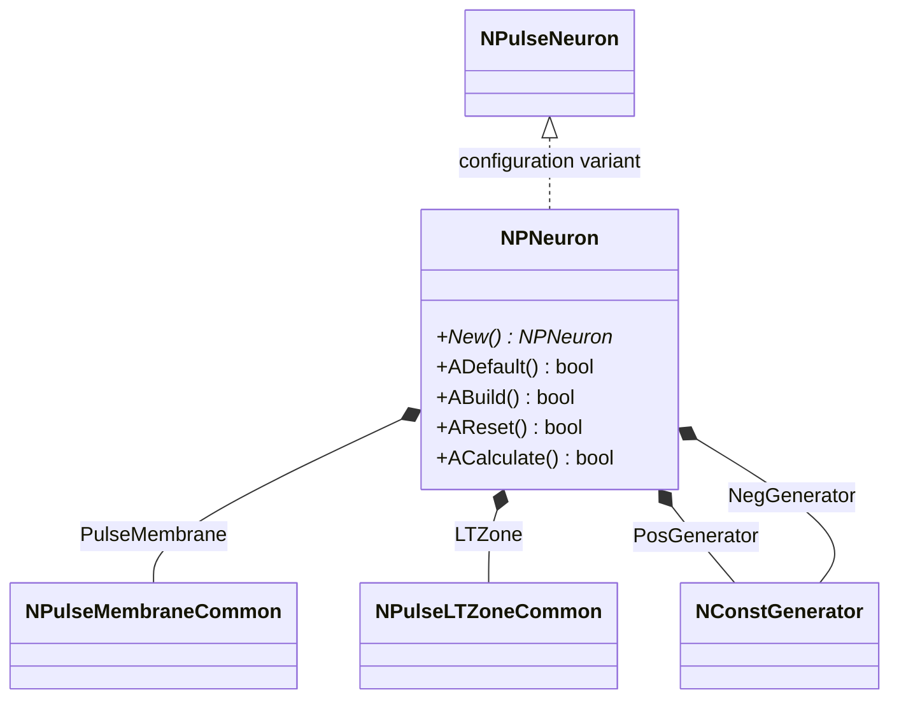
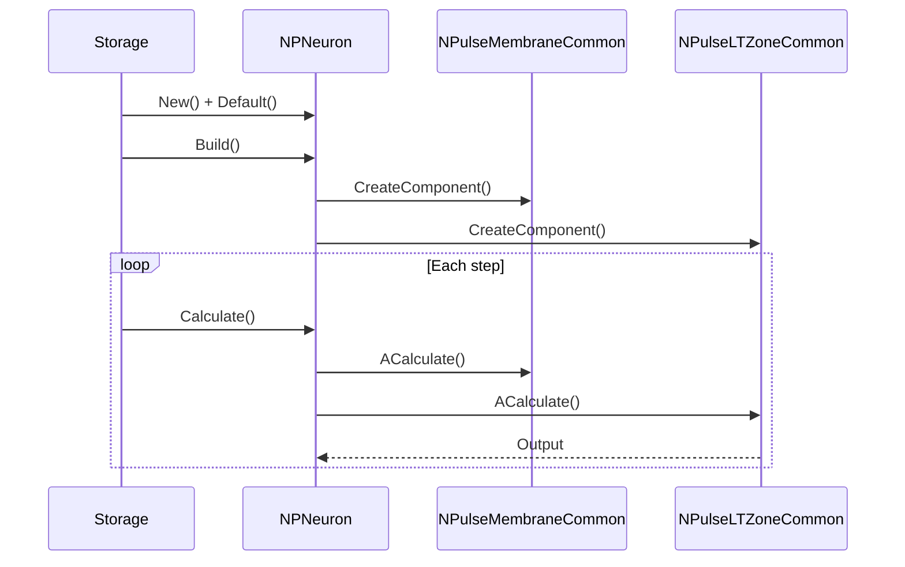
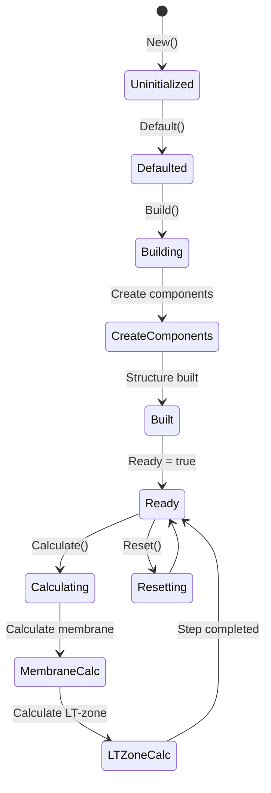
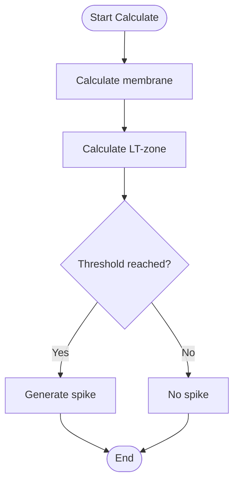
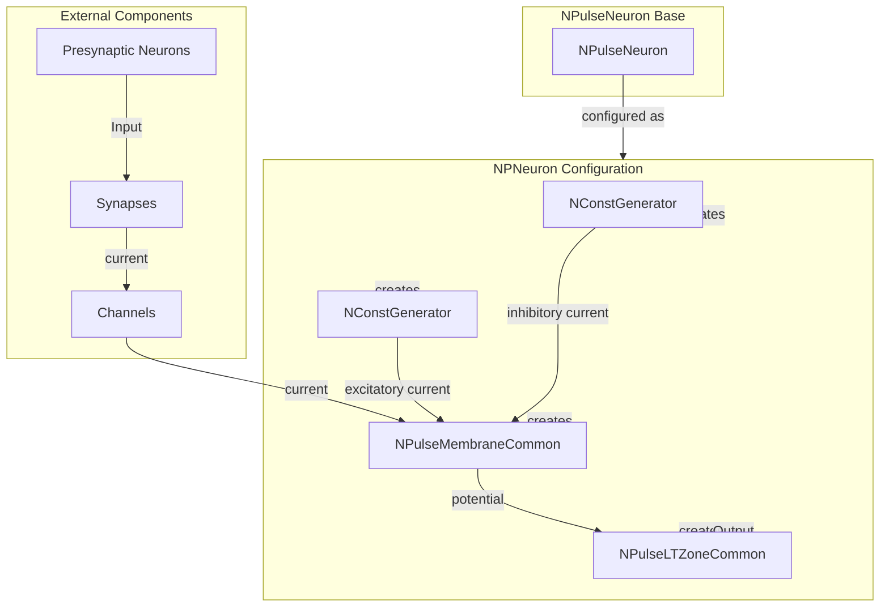

# NPNeuron — базовый пульсовый нейрон

## RU

### Назначение

**Класс**: `NPNeuron` — базовый пульсовый нейрон, конфигурационный вариант `NPulseNeuron` с параметрами по умолчанию.  
**Регистрация**: `NPulseLibrary.cpp` → `UploadClass("NPNeuron", ...)`.  
**Storage-инстансы**: `ClassName = "NPNeuron"` в `Bin/Configs/*/Model_*.xml`.

`NPNeuron` является базовым конфигурационным вариантом класса `NPulseNeuron` с параметрами по умолчанию. Создается из `NPulseNeuron` напрямую без дополнительных настроек. Используется как основа для создания других конфигурационных вариантов нейронов (SP, LP, мотонейроны и т.д.).

**Использование:** Базовый нейрон для экспериментов, основа для создания других типов нейронов

### UML-диаграмма классов



**Иерархия наследования:**
- `NPulseNeuronCommon` — общий импульсный нейрон
- `NPulseNeuron` — импульсный нейрон с параметрами структурирования
- `NPNeuron` — базовый конфигурационный вариант

**Внутренняя структура:**
- **PulseMembrane** (`NPulseMembraneCommon`) — мембрана нейрона
- **LTZone** (`NPulseLTZoneCommon`) — LT-зона для генерации спайков
- **PosGenerator** (`NConstGenerator`) — возбуждающий генератор
- **NegGenerator** (`NConstGenerator`) — тормозной генератор

### UML-диаграмма последовательности



**Жизненный цикл:**
1. **Инициализация**: `ADefault()` — установка параметров по умолчанию
2. **Сборка**: `ABuild()` — автоматическое создание мембраны, LT-зоны и генераторов
3. **Расчет**: `ACalculate()` — расчёт активности нейрона
4. **Сброс**: `AReset()` — сброс состояния

### UML-диаграмма состояний



**Состояния:**
- **Uninitialized** — создан, но не инициализирован
- **Defaulted** — параметры установлены по умолчанию
- **Building** — выполняется сборка структуры
- **CreatingMembrane** — создание мембраны
- **CreatingLTZone** — создание LT-зоны
- **CreatingGenerators** — создание генераторов
- **Linking** — создание связей между компонентами
- **Built** — структура нейрона построена
- **Ready** — готов к выполнению расчетов
- **Calculating** — выполняется расчет нейрона
- **MembraneCalc** — расчет мембраны
- **LTZoneCalc** — расчет LT-зоны
- **Resetting** — выполняется сброс состояний

### UML-диаграмма активности



**Алгоритм расчета:**
1. Вызов базового расчета нейрона (`NPulseNeuronCommon::ACalculate`)
2. Расчет мембраны: агрегация токов от каналов, интеграция мембранного потенциала
3. Расчет LT-зоны: проверка порога
4. Генерация спайка при достижении порога

### UML-диаграмма компонентов



**Зависимости:**
- **Базовый класс**: `NPulseNeuron` (конфигурационный вариант)
- **Внутренние компоненты**: `NPulseMembraneCommon` (мембрана), `NPulseLTZoneCommon` (LT-зона), `NConstGenerator` (генераторы)
- **Внешние компоненты**: синапсы, каналы, пресинаптические нейроны

### Свойства

`NPNeuron` использует все свойства базового класса `NPulseNeuron` с параметрами по умолчанию:
- Стандартные параметры структурирования
- Стандартные мембрана и LT-зона
- Стандартные генераторы

### Методы

`NPNeuron` использует все методы базового класса `NPulseNeuron`:
- `ADefault()` → `bool` — установка параметров по умолчанию
- `ABuild()` → `bool` — сборка структуры нейрона
- `AReset()` → `bool` — сброс состояния
- `ACalculate()` → `bool` — расчет активности нейрона

### Примеры использования

#### Пример 1: Создание базового нейрона в коде C++

```cpp
// Создание базового пульсового нейрона
auto neuron = storage->CreateComponent("NPNeuron");
neuron->SetName("PNeuron");

// Инициализация (использует параметры по умолчанию)
neuron->Default();

// Сборка (автоматически создает мембрану, LT-зону, генераторы)
neuron->Build();

// Использование
for (int step = 0; step < 1000; step++) {
    neuron->Calculate();
    // Нейрон генерирует спайки при достижении порога
}
```

#### Пример 2: Конфигурация XML

```xml
<PNeuron1 Class="NPNeuron">
    <Parameters>
        <!-- Параметры наследуются от NPulseNeuron -->
    </Parameters>
</PNeuron1>
```

### Использование в конфигурациях

`NPNeuron` используется как базовый нейрон для экспериментов:

- **Базовые эксперименты**: `Bin/Configs/!OldConfigs/*/Model_*.xml` (где используется базовый нейрон)
- **Основа для других нейронов**: используется для создания SP, LP, мотонейронов и других вариантов

**Типичные значения параметров:**
- Стандартные параметры по умолчанию из `NPulseNeuron`

**Особенности:**
- Базовый компонент: используется как основа для создания других типов нейронов
- Стандартная структура: включает мембрану, LT-зону и генераторы
- Гибкость: может быть настроен для различных экспериментов

### См. также

- [`NPulseNeuron`](NPulseNeuron.md) — импульсный нейрон с параметрами структурирования (базовый класс)
- [`NSPNeuron`](NSPNeuron.md) — мелкий импульсный нейрон
- [`NLPNeuron`](NLPNeuron.md) — крупный импульсный нейрон
- [`NPNeuron1x4`](NPNeuron1x4.md) — нейрон 1x4
- [`NPNeuron4x1`](NPNeuron4x1.md) — нейрон 4x1
- [`NPNeuron4x4`](NPNeuron4x4.md) — нейрон 4x4
- [Architecture.md](../Architecture.md) — архитектура библиотеки

---

## EN

### Purpose

**Class**: `NPNeuron` — base spiking neuron, configuration variant of `NPulseNeuron` with default parameters.  
**Registration**: `NPulseLibrary.cpp` → `UploadClass("NPNeuron", ...)`.  
**Instances**: `ClassName = "NPNeuron"` in `Bin/Configs/*/Model_*.xml`.

`NPNeuron` is a base configuration variant of the `NPulseNeuron` class with default parameters. Created from `NPulseNeuron` directly without additional settings. Used as a basis for creating other configuration variants of neurons (SP, LP, motoneurons, etc.).

**Usage:** Base neuron for experiments, basis for creating other neuron types

### UML Class Diagram



### UML Sequence Diagram



### UML State Diagram



### UML Activity Diagram



### UML Component Diagram



### Properties

`NPNeuron` uses all properties of base class `NPulseNeuron` with default parameters:
- Standard structuring parameters
- Standard membrane and LT-zone
- Standard generators

### Methods

`NPNeuron` uses all methods of base class `NPulseNeuron`:
- `ADefault()` → `bool` — set default parameters
- `ABuild()` → `bool` — build neuron structure
- `AReset()` → `bool` — reset state
- `ACalculate()` → `bool` — calculate neuron activity

### Usage in configurations

`NPNeuron` is used as a base neuron for experiments:

- **Base experiments**: `Bin/Configs/!OldConfigs/*/Model_*.xml` (where base neuron is used)
- **Basis for other neurons**: used to create SP, LP, motoneurons and other variants

**Typical parameter values:**
- Standard default parameters from `NPulseNeuron`

**Features:**
- Base component: used as a basis for creating other neuron types
- Standard structure: includes membrane, LT-zone and generators
- Flexibility: can be configured for various experiments

### See Also

- [`NPulseNeuron`](NPulseNeuron.md) — spiking neuron with structuring parameters (base class)
- [`NSPNeuron`](NSPNeuron.md) — small spiking neuron
- [`NLPNeuron`](NLPNeuron.md) — large spiking neuron
- [`NPNeuron1x4`](NPNeuron1x4.md) — neuron 1x4
- [`NPNeuron4x1`](NPNeuron4x1.md) — neuron 4x1
- [`NPNeuron4x4`](NPNeuron4x4.md) — neuron 4x4
- [Architecture.md](../Architecture.md) — library architecture
