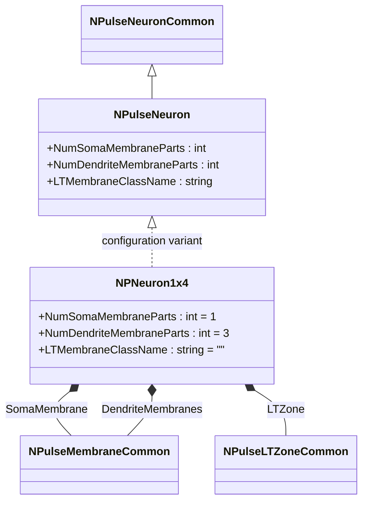
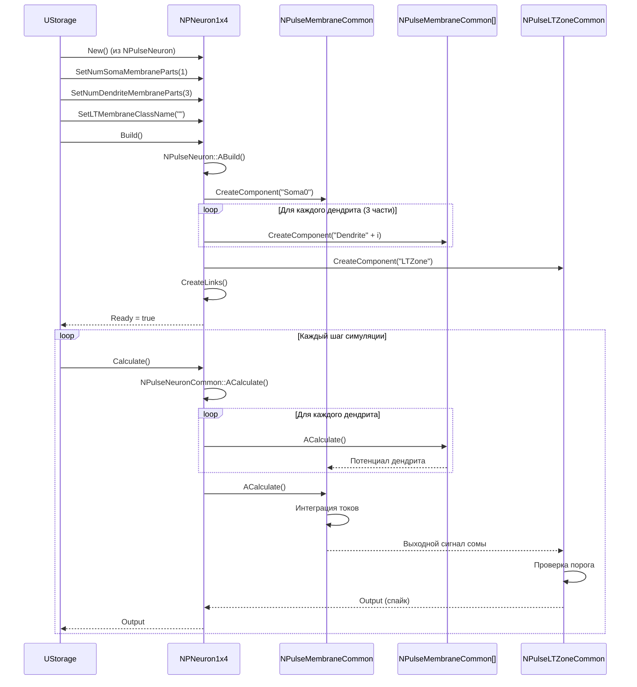
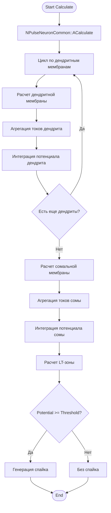
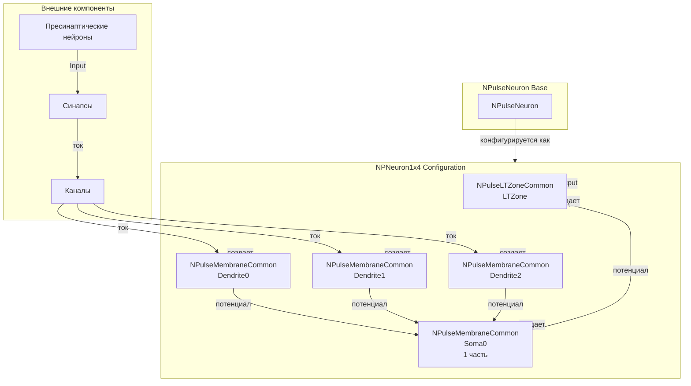
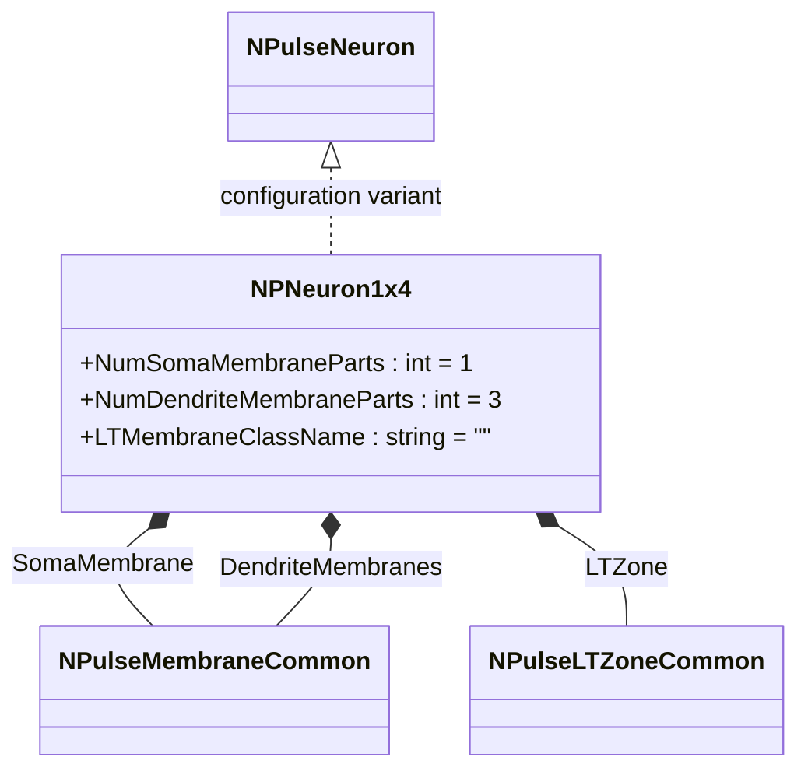
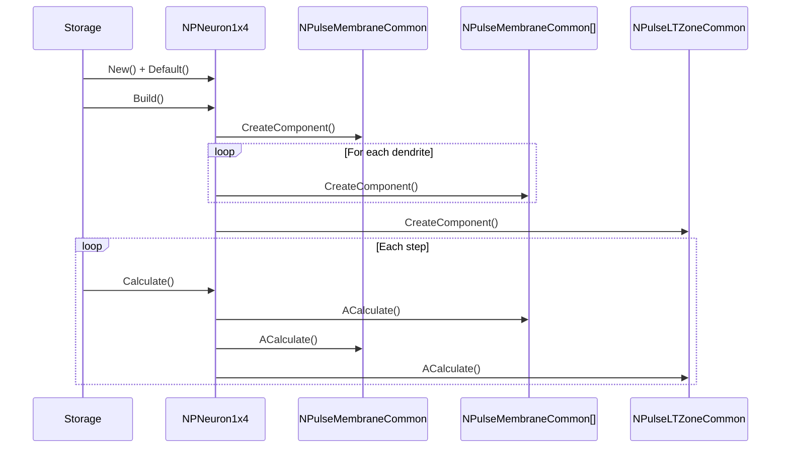
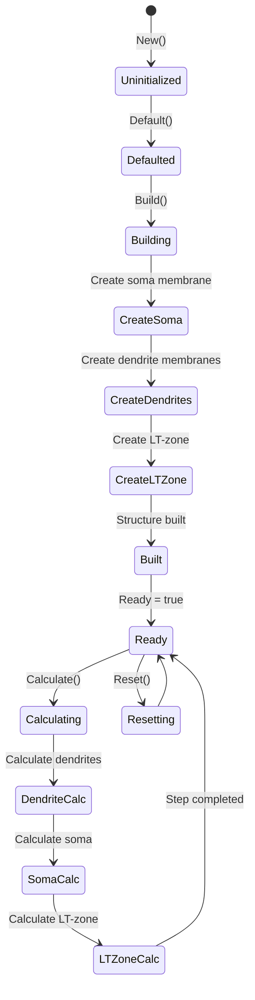
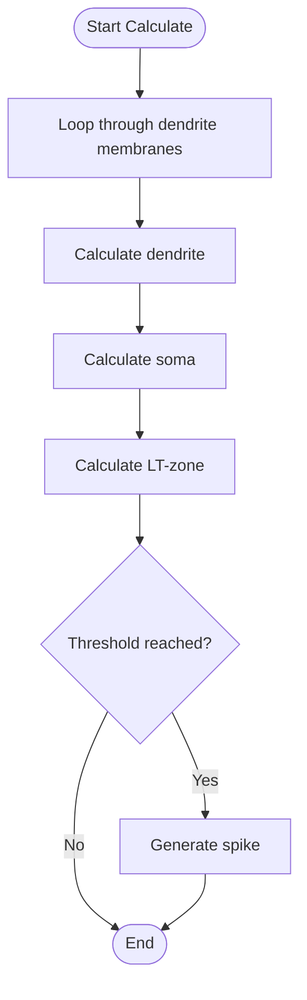
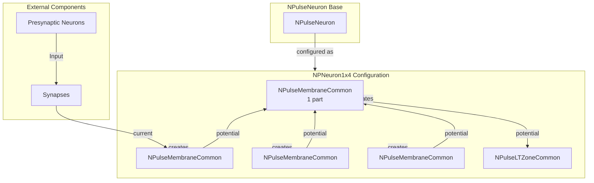

# NPNeuron1x4 — пульсовый нейрон 1x4

## RU

### Назначение

**Класс**: `NPNeuron1x4` — конфигурационный вариант пульсового нейрона с одной сомальной частью и четырьмя дендритными частями мембраны.  
**Регистрация**: `NPulseLibrary.cpp` → `UploadClass("NPNeuron1x4", ...)`.  
**Storage-инстансы**: `ClassName = "NPNeuron1x4"` в `Bin/Configs/*/Model_*.xml`.

`NPNeuron1x4` является конфигурационным вариантом базового класса `NPulseNeuron` с предустановленными параметрами структурирования. Создается из `NPulseNeuron` с настройками:
- `NumSomaMembraneParts = 1` — одна сомальная часть мембраны
- `NumDendriteMembraneParts = 3` — три дендритные части мембраны (обозначение "1x4" указывает на структуру: 1 сома, 4 дендрита)
- `LTMembraneClassName = ""` — без LT-мембраны

Нейрон с такой структурой имеет одну сомальную мембрану и несколько дендритных мембран, что позволяет моделировать более сложную морфологию нейрона.

**Использование:** Моделирование нейронов с простой сомой и разветвленными дендритами

### UML-диаграмма классов



**Иерархия наследования:**
- `NPulseNeuronCommon` — общий импульсный нейрон
- `NPulseNeuron` — импульсный нейрон с параметрами структурирования
- `NPNeuron1x4` — конфигурационный вариант с структурой 1x4

**Внутренняя структура:**
- **SomaMembrane** (`NPulseMembraneCommon`) — одна сомальная мембрана
- **DendriteMembranes** (`NPulseMembraneCommon[]`) — три дендритные мембраны
- **LTZone** (`NPulseLTZoneCommon`) — стандартная LT-зона

### UML-диаграмма последовательности



**Жизненный цикл:**
1. **Создание**: `NPNeuron1x4` создается из `NPulseNeuron` с настройкой параметров
2. **Настройка**: Устанавливается одна сомальная часть и три дендритные части
3. **Сборка**: Автоматически создается структура нейрона с сомой, дендритами и LT-зоной
4. **Расчет**: На каждом шаге рассчитываются дендриты, затем сома, затем LT-зона

### UML-диаграмма состояний

```mermaid
stateDiagram-v2
    [*] --> Uninitialized: New()
    Uninitialized --> Defaulted: Default()
    Defaulted --> Configuring: Настройка 1x4 структуры
    Configuring --> Set1x4Params: SetNumSomaMembraneParts(1)<br/>SetNumDendriteMembraneParts(3)
    Set1x4Params --> Building: Build()
    Building --> BuildBase: NPulseNeuron::ABuild()
    BuildBase --> CreateSoma: Создание сомальной мембраны
    CreateSoma --> CreateDendrites: Создание дендритных мембран (3 части)
    CreateDendrites --> CreateLTZone: Создание LT-зоны
    CreateLTZone --> LinkComponents: Создание связей
    LinkComponents --> Built: Структура создана
    Built --> Ready: Ready = true
    Ready --> Calculating: Calculate()
    Calculating --> DendriteCalc: Расчет дендритных мембран
    DendriteCalc --> SomaCalc: Расчет сомальной мембраны
    SomaCalc --> LTZoneCalc: Расчет LT-зоны
    LTZoneCalc --> Ready: Шаг завершен
    Ready --> Resetting: Reset()
    Resetting --> Ready: Состояния сброшены
```

**Состояния:**
- **Uninitialized** — создан, но не инициализирован
- **Defaulted** — параметры установлены по умолчанию
- **Configuring** — настройка параметров для структуры 1x4
- **Set1x4Params** — установка параметров (1 сома, 3 дендрита)
- **Building** — выполняется сборка структуры
- **BuildBase** — сборка базовой структуры нейрона
- **CreateSoma** — создание сомальной мембраны
- **CreateDendrites** — создание дендритных мембран
- **CreateLTZone** — создание LT-зоны
- **LinkComponents** — создание связей между компонентами
- **Built** — структура нейрона построена
- **Ready** — готов к выполнению расчетов
- **Calculating** — выполняется расчет нейрона
- **DendriteCalc** — расчет дендритных мембран
- **SomaCalc** — расчет сомальной мембраны
- **LTZoneCalc** — расчет LT-зоны
- **Resetting** — выполняется сброс состояний

### UML-диаграмма активности



**Алгоритм расчета:**
1. Вызов базового расчета нейрона
2. Для каждой дендритной мембраны: расчет токов и интеграция потенциала
3. Расчет сомальной мембраны: агрегация токов от дендритов и собственных каналов, интеграция потенциала
4. Расчет LT-зоны: проверка порога
5. Генерация спайка при достижении порога

### UML-диаграмма компонентов



**Зависимости:**
- **Базовый класс**: `NPulseNeuron` (конфигурационный вариант)
- **Внутренние компоненты**: `NPulseMembraneCommon` (1 сомальная мембрана, 3 дендритные мембраны), `NPulseLTZoneCommon` (LT-зона)
- **Внешние компоненты**: синапсы, каналы, пресинаптические нейроны

### Свойства

`NPNeuron1x4` использует все свойства базового класса `NPulseNeuron` с параметрами:
- `NumSomaMembraneParts = 1` — одна сомальная часть мембраны
- `NumDendriteMembraneParts = 3` — три дендритные части мембраны
- `LTMembraneClassName = ""` — без LT-мембраны

### Методы

`NPNeuron1x4` использует все методы базового класса `NPulseNeuron`.

### Примеры использования

#### Пример 1: Создание нейрона 1x4 в коде C++

```cpp
// Создание нейрона 1x4
auto neuron = storage->CreateComponent("NPNeuron1x4");
neuron->SetName("Neuron1x4");

// Инициализация (использует параметры по умолчанию)
neuron->Default();

// Сборка (автоматически создает 1 сомальную мембрану, 3 дендритные мембраны, LT-зону)
neuron->Build();

// Использование
for (int step = 0; step < 1000; step++) {
    neuron->Calculate();
    // Нейрон генерирует спайки при достижении порога
}
```

#### Пример 2: Конфигурация XML

```xml
<Neuron1x4_1 Class="NPNeuron1x4">
    <Parameters>
        <!-- Параметры наследуются от NPulseNeuron -->
    </Parameters>
</Neuron1x4_1>
```

### Использование в конфигурациях

`NPNeuron1x4` используется в экспериментах с нейронами, имеющими простую сому и разветвленные дендриты:

- **Сложная морфология**: `Bin/Configs/!OldConfigs/*/Model_*.xml` (где требуется моделирование нейронов с дендритной структурой)
- **Дендритная интеграция**: эксперименты с интеграцией сигналов от нескольких дендритов

**Типичные значения параметров:**
- **NumSomaMembraneParts**: 1 (одна сомальная часть)
- **NumDendriteMembraneParts**: 3 (три дендритные части)
- **LTMembraneClassName**: "" (без LT-мембраны)

**Особенности:**
- Дендритная структура: позволяет моделировать нейроны с разветвленными дендритами
- Интеграция сигналов: дендриты интегрируют сигналы и передают их в сому
- Морфология: отражает биологическую структуру нейрона с дендритным деревом

## Источники

См. [Literature-References.md](../Literature-References.md): **[A]**, **4**, **25**, **29**.

### См. также

- [`NPulseNeuron`](NPulseNeuron.md) — импульсный нейрон с параметрами структурирования
- [`NPNeuron`](NPNeuron.md) — базовый пульсовый нейрон
- [`NPNeuron4x1`](NPNeuron4x1.md) — нейрон 4x1
- [`NPNeuron4x4`](NPNeuron4x4.md) — нейрон 4x4
- [Architecture.md](../Architecture.md) — архитектура библиотеки

---

## EN

### Purpose

**Class**: `NPNeuron1x4` — configuration variant of spiking neuron with one soma part and four dendrite parts.  
**Registration**: `NPulseLibrary.cpp` → `UploadClass("NPNeuron1x4", ...)`.  
**Instances**: `ClassName = "NPNeuron1x4"` in `Bin/Configs/*/Model_*.xml`.

`NPNeuron1x4` is a configuration variant of the base class `NPulseNeuron` with preset structuring parameters. Created from `NPulseNeuron` with settings:
- `NumSomaMembraneParts = 1` — one soma membrane part
- `NumDendriteMembraneParts = 3` — three dendrite membrane parts (notation "1x4" indicates structure: 1 soma, 4 dendrites)
- `LTMembraneClassName = ""` — without LT-membrane

Neuron with such structure has one soma membrane and several dendrite membranes, allowing modeling of more complex neuron morphology.

**Usage:** Modeling neurons with simple soma and branched dendrites

### UML Class Diagram



### UML Sequence Diagram



### UML State Diagram



### UML Activity Diagram



### UML Component Diagram



### Properties

`NPNeuron1x4` uses all properties of base class `NPulseNeuron` with parameters:
- `NumSomaMembraneParts = 1` — one soma membrane part
- `NumDendriteMembraneParts = 3` — three dendrite membrane parts
- `LTMembraneClassName = ""` — without LT-membrane

### Methods

`NPNeuron1x4` uses all methods of base class `NPulseNeuron`.

### Usage in configurations

`NPNeuron1x4` is used in experiments with neurons having simple soma and branched dendrites:

- **Complex morphology**: `Bin/Configs/!OldConfigs/*/Model_*.xml` (where modeling of neurons with dendritic structure is required)
- **Dendritic integration**: experiments with signal integration from multiple dendrites

**Typical parameter values:**
- **NumSomaMembraneParts**: 1 (one soma part)
- **NumDendriteMembraneParts**: 3 (three dendrite parts)
- **LTMembraneClassName**: "" (without LT-membrane)

**Features:**
- Dendritic structure: allows modeling neurons with branched dendrites
- Signal integration: dendrites integrate signals and transmit them to soma
- Morphology: reflects biological neuron structure with dendritic tree

### References

See [Literature-References.md](../Literature-References.md): **[A]**, **4**, **25**, **29**.

### See Also

- [`NPulseNeuron`](NPulseNeuron.md) — spiking neuron with structuring parameters
- [`NPNeuron`](NPNeuron.md) — base spiking neuron
- [`NPNeuron4x1`](NPNeuron4x1.md) — neuron 4x1
- [`NPNeuron4x4`](NPNeuron4x4.md) — neuron 4x4
- [Architecture.md](../Architecture.md) — library architecture
