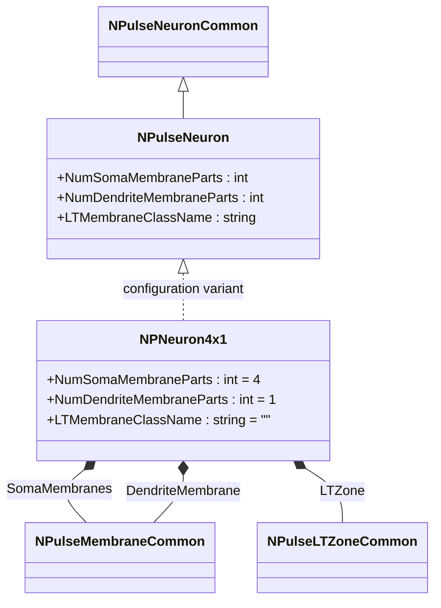
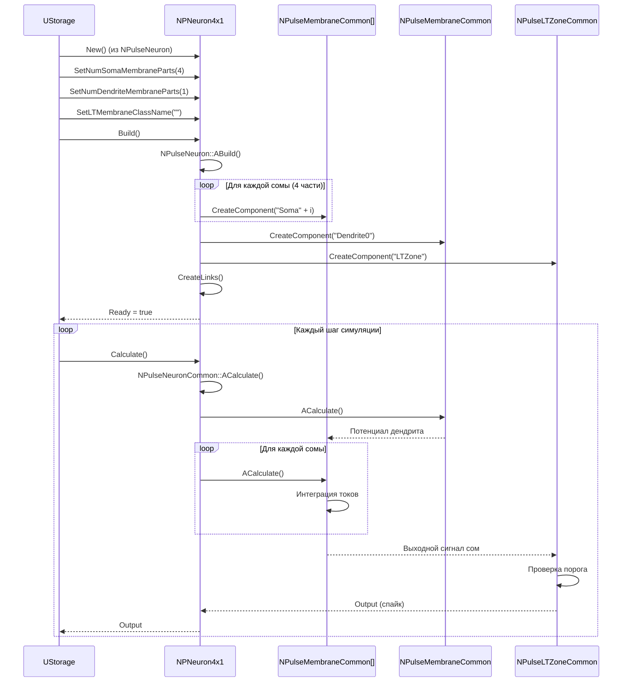
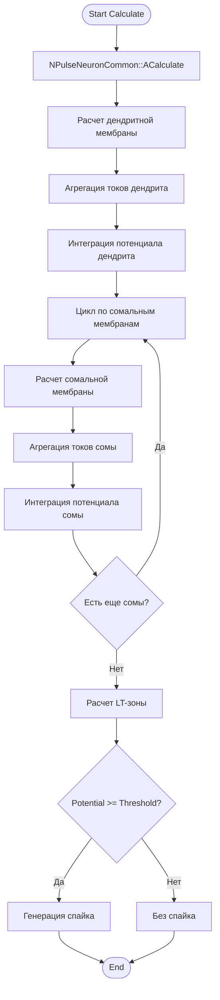
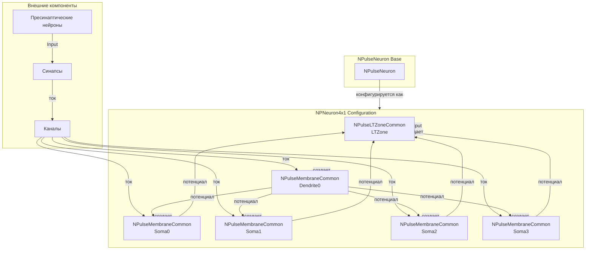
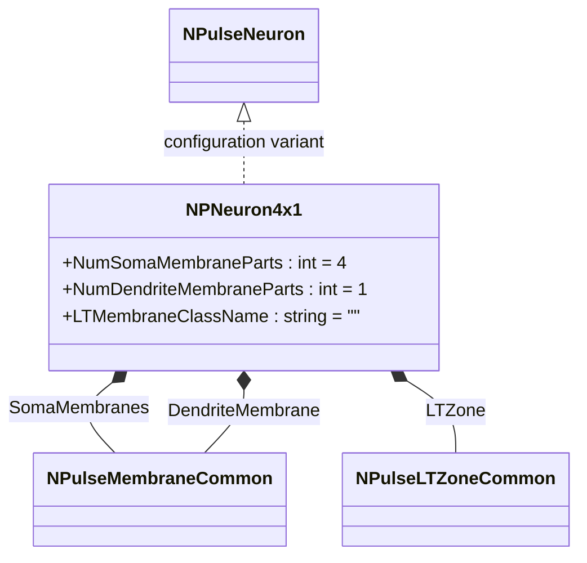
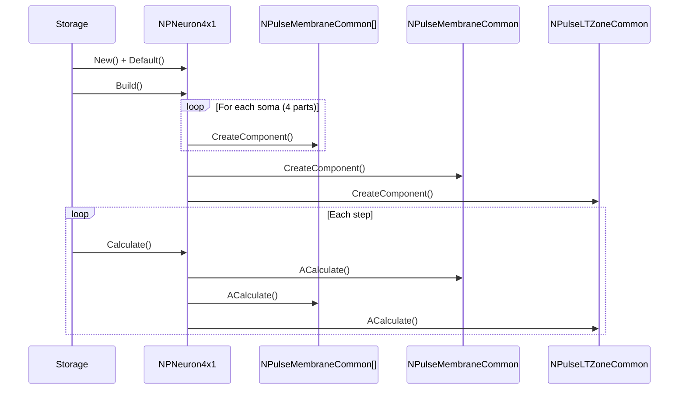
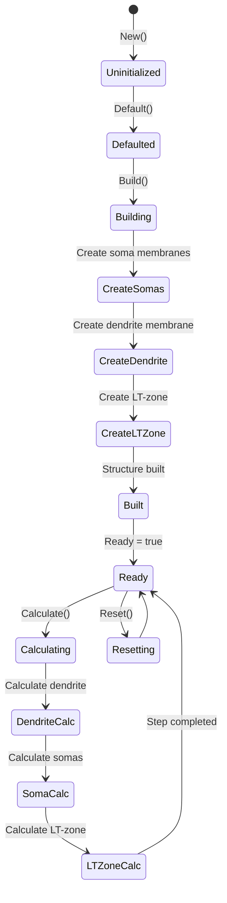
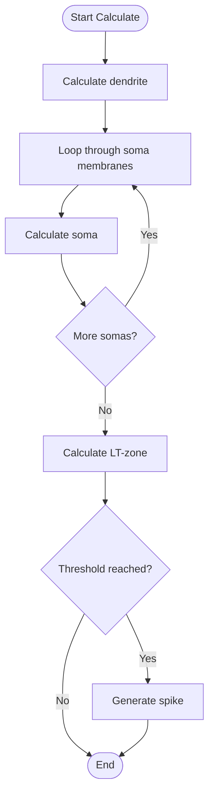
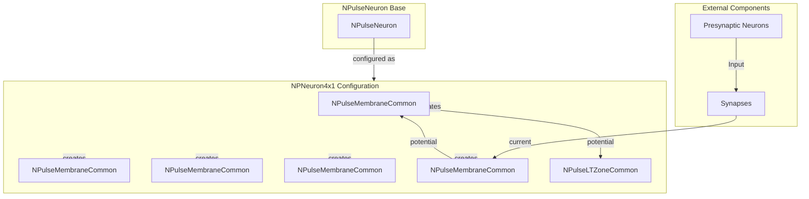

# NPNeuron4x1 — пульсовый нейрон 4x1

## RU

### Назначение

**Класс**: `NPNeuron4x1` — конфигурационный вариант пульсового нейрона с четырьмя сомальными частями и одной дендритной частью мембраны.  
**Регистрация**: `NPulseLibrary.cpp` → `UploadClass("NPNeuron4x1", ...)`.  
**Storage-инстансы**: `ClassName = "NPNeuron4x1"` в `Bin/Configs/*/Model_*.xml`.

`NPNeuron4x1` является конфигурационным вариантом базового класса `NPulseNeuron` с предустановленными параметрами структурирования. Создается из `NPulseNeuron` с настройками:
- `NumSomaMembraneParts = 4` — четыре сомальные части мембраны
- `NumDendriteMembraneParts = 1` — одна дендритная часть мембраны (обозначение "4x1" указывает на структуру: 4 сомы, 1 дендрит)
- `LTMembraneClassName = ""` — без LT-мембраны

Нейрон с такой структурой имеет четыре сомальные мембраны и одну дендритную мембрану, что позволяет моделировать нейроны с сложной сомальной структурой.

**Использование:** Моделирование нейронов со сложной сомальной структурой

### UML-диаграмма классов



**Иерархия наследования:**
- `NPulseNeuronCommon` — общий импульсный нейрон
- `NPulseNeuron` — импульсный нейрон с параметрами структурирования
- `NPNeuron4x1` — конфигурационный вариант с структурой 4x1

**Внутренняя структура:**
- **SomaMembranes** (`NPulseMembraneCommon[]`) — четыре сомальные мембраны
- **DendriteMembrane** (`NPulseMembraneCommon`) — одна дендритная мембрана
- **LTZone** (`NPulseLTZoneCommon`) — стандартная LT-зона

### UML-диаграмма последовательности



**Жизненный цикл:**
1. **Создание**: `NPNeuron4x1` создается из `NPulseNeuron` с настройкой параметров
2. **Настройка**: Устанавливается четыре сомальные части и одна дендритная часть
3. **Сборка**: Автоматически создается структура нейрона с четырьмя сомами, дендритом и LT-зоной
4. **Расчет**: На каждом шаге рассчитываются дендрит, затем сомы, затем LT-зона

### UML-диаграмма состояний

```mermaid
stateDiagram-v2
    [*] --> Uninitialized: New()
    Uninitialized --> Defaulted: Default()
    Defaulted --> Configuring: Настройка 4x1 структуры
    Configuring --> Set4x1Params: SetNumSomaMembraneParts(4)<br/>SetNumDendriteMembraneParts(1)
    Set4x1Params --> Building: Build()
    Building --> BuildBase: NPulseNeuron::ABuild()
    BuildBase --> CreateSomas: Создание сомальных мембран (4 части)
    CreateSomas --> CreateDendrite: Создание дендритной мембраны
    CreateDendrite --> CreateLTZone: Создание LT-зоны
    CreateLTZone --> LinkComponents: Создание связей
    LinkComponents --> Built: Структура создана
    Built --> Ready: Ready = true
    Ready --> Calculating: Calculate()
    Calculating --> DendriteCalc: Расчет дендритной мембраны
    DendriteCalc --> SomaCalc: Расчет сомальных мембран
    SomaCalc --> LTZoneCalc: Расчет LT-зоны
    LTZoneCalc --> Ready: Шаг завершен
    Ready --> Resetting: Reset()
    Resetting --> Ready: Состояния сброшены
```

**Состояния:**
- **Uninitialized** — создан, но не инициализирован
- **Defaulted** — параметры установлены по умолчанию
- **Configuring** — настройка параметров для структуры 4x1
- **Set4x1Params** — установка параметров (4 сомы, 1 дендрит)
- **Building** — выполняется сборка структуры
- **BuildBase** — сборка базовой структуры нейрона
- **CreateSomas** — создание сомальных мембран
- **CreateDendrite** — создание дендритной мембраны
- **CreateLTZone** — создание LT-зоны
- **LinkComponents** — создание связей между компонентами
- **Built** — структура нейрона построена
- **Ready** — готов к выполнению расчетов
- **Calculating** — выполняется расчет нейрона
- **DendriteCalc** — расчет дендритной мембраны
- **SomaCalc** — расчет сомальных мембран
- **LTZoneCalc** — расчет LT-зоны
- **Resetting** — выполняется сброс состояний

### UML-диаграмма активности



**Алгоритм расчета:**
1. Вызов базового расчета нейрона
2. Расчет дендритной мембраны: агрегация токов и интеграция потенциала
3. Для каждой сомальной мембраны: агрегация токов от дендрита и собственных каналов, интеграция потенциала
4. Расчет LT-зоны: проверка порога
5. Генерация спайка при достижении порога

### UML-диаграмма компонентов



**Зависимости:**
- **Базовый класс**: `NPulseNeuron` (конфигурационный вариант)
- **Внутренние компоненты**: `NPulseMembraneCommon` (4 сомальные мембраны, 1 дендритная мембрана), `NPulseLTZoneCommon` (LT-зона)
- **Внешние компоненты**: синапсы, каналы, пресинаптические нейроны

### Свойства

`NPNeuron4x1` использует все свойства базового класса `NPulseNeuron` с параметрами:
- `NumSomaMembraneParts = 4` — четыре сомальные части мембраны
- `NumDendriteMembraneParts = 1` — одна дендритная часть мембраны
- `LTMembraneClassName = ""` — без LT-мембраны

### Методы

`NPNeuron4x1` использует все методы базового класса `NPulseNeuron`.

### Примеры использования

#### Пример 1: Создание нейрона 4x1 в коде C++

```cpp
// Создание нейрона 4x1
auto neuron = storage->CreateComponent("NPNeuron4x1");
neuron->SetName("Neuron4x1");

// Инициализация (использует параметры по умолчанию)
neuron->Default();

// Сборка (автоматически создает 4 сомальные мембраны, 1 дендритную мембрану, LT-зону)
neuron->Build();

// Использование
for (int step = 0; step < 1000; step++) {
    neuron->Calculate();
    // Нейрон генерирует спайки при достижении порога
}
```

#### Пример 2: Конфигурация XML

```xml
<Neuron4x1_1 Class="NPNeuron4x1">
    <Parameters>
        <!-- Параметры наследуются от NPulseNeuron -->
    </Parameters>
</Neuron4x1_1>
```

### Использование в конфигурациях

`NPNeuron4x1` используется в экспериментах с нейронами, имеющими сложную сомальную структуру:

- **Сложная сома**: `Bin/Configs/!OldConfigs/*/Model_*.xml` (где требуется моделирование нейронов с множественными сомальными частями)
- **Сомальная интеграция**: эксперименты с интеграцией сигналов в нескольких сомальных частях

**Типичные значения параметров:**
- **NumSomaMembraneParts**: 4 (четыре сомальные части)
- **NumDendriteMembraneParts**: 1 (одна дендритная часть)
- **LTMembraneClassName**: "" (без LT-мембраны)

**Особенности:**
- Сложная сома: позволяет моделировать нейроны с множественными сомальными частями
- Интеграция сигналов: несколько сомальных частей интегрируют сигналы от дендрита
- Морфология: отражает биологическую структуру нейрона со сложной сомой

## Источники

См. [Literature-References.md](../Literature-References.md): **[A]**, **4**, **25**, **29**.

### См. также

- [`NPulseNeuron`](NPulseNeuron.md) — импульсный нейрон с параметрами структурирования
- [`NPNeuron`](NPNeuron.md) — базовый пульсовый нейрон
- [`NPNeuron1x4`](NPNeuron1x4.md) — нейрон 1x4
- [`NPNeuron4x4`](NPNeuron4x4.md) — нейрон 4x4
- [Architecture.md](../Architecture.md) — архитектура библиотеки

---

## EN

### Purpose

**Class**: `NPNeuron4x1` — configuration variant of spiking neuron with four soma parts and one dendrite part.  
**Registration**: `NPulseLibrary.cpp` → `UploadClass("NPNeuron4x1", ...)`.  
**Instances**: `ClassName = "NPNeuron4x1"` in `Bin/Configs/*/Model_*.xml`.

`NPNeuron4x1` is a configuration variant of the base class `NPulseNeuron` with preset structuring parameters. Created from `NPulseNeuron` with settings:
- `NumSomaMembraneParts = 4` — four soma membrane parts
- `NumDendriteMembraneParts = 1` — one dendrite membrane part (notation "4x1" indicates structure: 4 somas, 1 dendrite)
- `LTMembraneClassName = ""` — without LT-membrane

Neuron with such structure has four soma membranes and one dendrite membrane, allowing modeling of neurons with complex soma structure.

**Usage:** Modeling neurons with complex soma structure

### UML Class Diagram



### UML Sequence Diagram



### UML State Diagram



### UML Activity Diagram



### UML Component Diagram



### Properties

`NPNeuron4x1` uses all properties of base class `NPulseNeuron` with parameters:
- `NumSomaMembraneParts = 4` — four soma membrane parts
- `NumDendriteMembraneParts = 1` — one dendrite membrane part
- `LTMembraneClassName = ""` — without LT-membrane

### Methods

`NPNeuron4x1` uses all methods of base class `NPulseNeuron`.

### Usage in configurations

`NPNeuron4x1` is used in experiments with neurons having complex soma structure:

- **Complex soma**: `Bin/Configs/!OldConfigs/*/Model_*.xml` (where modeling of neurons with multiple soma parts is required)
- **Soma integration**: experiments with signal integration in multiple soma parts

**Typical parameter values:**
- **NumSomaMembraneParts**: 4 (four soma parts)
- **NumDendriteMembraneParts**: 1 (one dendrite part)
- **LTMembraneClassName**: "" (without LT-membrane)

**Features:**
- Complex soma: allows modeling neurons with multiple soma parts
- Signal integration: multiple soma parts integrate signals from dendrite
- Morphology: reflects biological neuron structure with complex soma

### References

See [Literature-References.md](../Literature-References.md): **[A]**, **4**, **25**, **29**.

### See Also

- [`NPulseNeuron`](NPulseNeuron.md) — spiking neuron with structuring parameters
- [`NPNeuron`](NPNeuron.md) — base spiking neuron
- [`NPNeuron1x4`](NPNeuron1x4.md) — neuron 1x4
- [`NPNeuron4x4`](NPNeuron4x4.md) — neuron 4x4
- [Architecture.md](../Architecture.md) — library architecture
