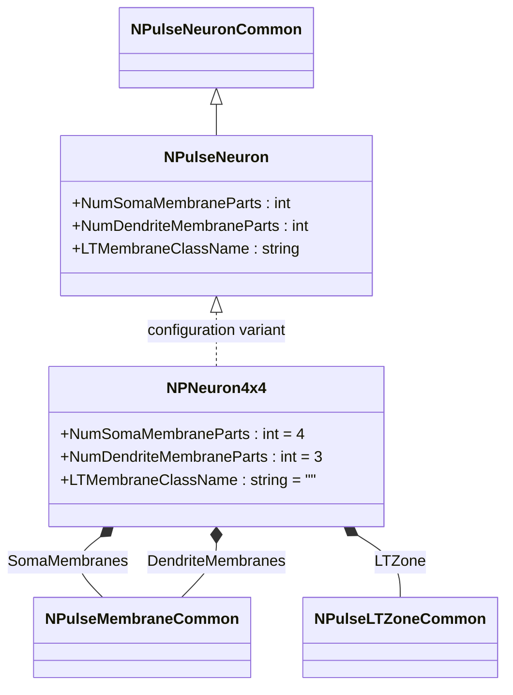
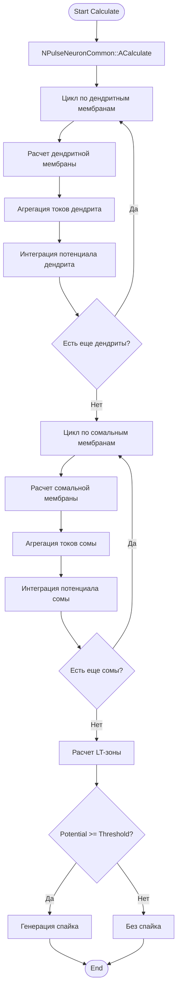
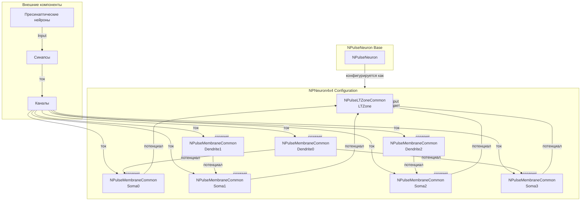
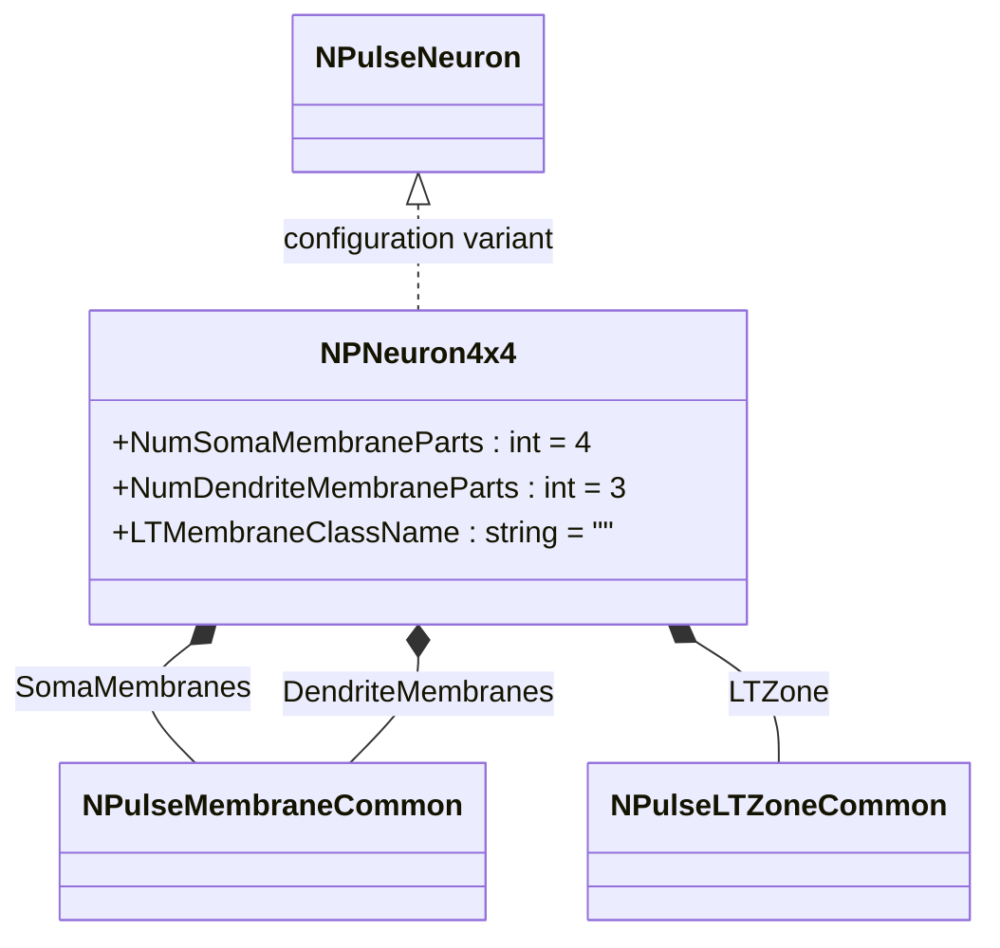
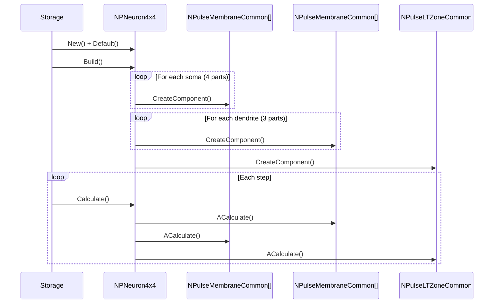
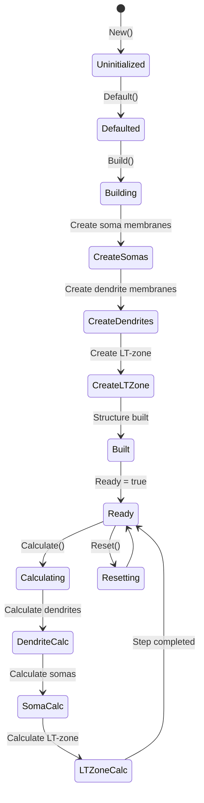
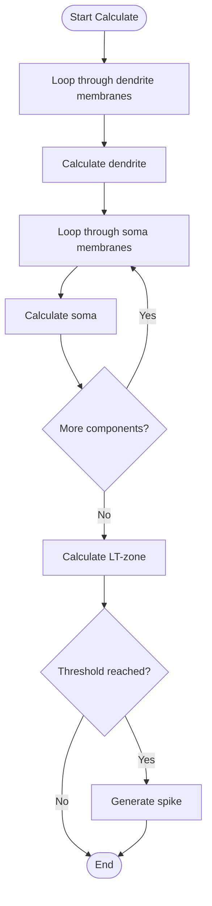
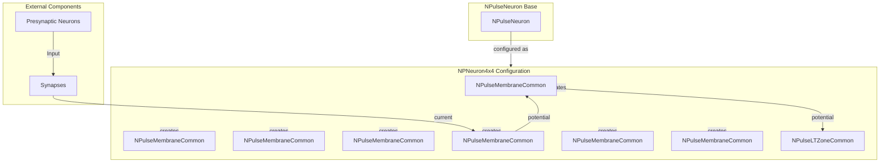

# NPNeuron4x4 — пульсовый нейрон 4x4

## RU

### Назначение

**Класс**: `NPNeuron4x4` — конфигурационный вариант пульсового нейрона с четырьмя сомальными частями и четырьмя дендритными частями мембраны.  
**Регистрация**: `NPulseLibrary.cpp` → `UploadClass("NPNeuron4x4", ...)`.  
**Storage-инстансы**: `ClassName = "NPNeuron4x4"` в `Bin/Configs/*/Model_*.xml`.

`NPNeuron4x4` является конфигурационным вариантом базового класса `NPulseNeuron` с предустановленными параметрами структурирования. Создается из `NPulseNeuron` с настройками:
- `NumSomaMembraneParts = 4` — четыре сомальные части мембраны
- `NumDendriteMembraneParts = 3` — три дендритные части мембраны (обозначение "4x4" указывает на структуру: 4 сомы, 4 дендрита)
- `LTMembraneClassName = ""` — без LT-мембраны

Нейрон с такой структурой имеет четыре сомальные мембраны и несколько дендритных мембран, что позволяет моделировать нейроны с наиболее сложной морфологией.

**Использование:** Моделирование нейронов с наиболее сложной структурой (сложная сома и разветвленные дендриты)

### UML-диаграмма классов



**Иерархия наследования:**
- `NPulseNeuronCommon` — общий импульсный нейрон
- `NPulseNeuron` — импульсный нейрон с параметрами структурирования
- `NPNeuron4x4` — конфигурационный вариант с структурой 4x4

**Внутренняя структура:**
- **SomaMembranes** (`NPulseMembraneCommon[]`) — четыре сомальные мембраны
- **DendriteMembranes** (`NPulseMembraneCommon[]`) — три дендритные мембраны
- **LTZone** (`NPulseLTZoneCommon`) — стандартная LT-зона

### UML-диаграмма последовательности

```mermaid
sequenceDiagram
    participant Storage as UStorage
    participant Neuron as NPNeuron4x4
    participant SomaMembranes as NPulseMembraneCommon[]
    participant DendriteMembranes as NPulseMembraneCommon[]
    participant LTZone as NPulseLTZoneCommon
    
    Storage->>Neuron: New() (из NPulseNeuron)
    Storage->>Neuron: SetNumSomaMembraneParts(4)
    Storage->>Neuron: SetNumDendriteMembraneParts(3)
    Storage->>Neuron: SetLTMembraneClassName("")
    Storage->>Neuron: Build()
    Neuron->>Neuron: NPulseNeuron::ABuild()
    loop Для каждой сомы (4 части)
        Neuron->>SomaMembranes: CreateComponent("Soma" + i)
    end
    loop Для каждого дендрита (3 части)
        Neuron->>DendriteMembranes: CreateComponent("Dendrite" + i)
    end
    Neuron->>LTZone: CreateComponent("LTZone")
    Neuron->>Neuron: CreateLinks()
    Neuron-->>Storage: Ready = true
    
    loop Каждый шаг симуляции
        Storage->>Neuron: Calculate()
        Neuron->>Neuron: NPulseNeuronCommon::ACalculate()
        loop Для каждого дендрита
            Neuron->>DendriteMembranes: ACalculate()
            DendriteMembranes-->>SomaMembranes: Потенциал дендрита
        end
        loop Для каждой сомы
            Neuron->>SomaMembranes: ACalculate()
            SomaMembranes->>SomaMembranes: Интеграция токов
        end
        SomaMembranes-->>LTZone: Выходной сигнал сом
        LTZone->>LTZone: Проверка порога
        LTZone-->>Neuron: Output (спайк)
        Neuron-->>Storage: Output
    end
```



**Жизненный цикл:**
1. **Создание**: `NPNeuron4x4` создается из `NPulseNeuron` с настройкой параметров
2. **Настройка**: Устанавливается четыре сомальные части и три дендритные части
3. **Сборка**: Автоматически создается структура нейрона с четырьмя сомами, тремя дендритами и LT-зоной
4. **Расчет**: На каждом шаге рассчитываются дендриты, затем сомы, затем LT-зона

### UML-диаграмма состояний

```mermaid
stateDiagram-v2
    [*] --> Uninitialized: New()
    Uninitialized --> Defaulted: Default()
    Defaulted --> Configuring: Настройка 4x4 структуры
    Configuring --> Set4x4Params: SetNumSomaMembraneParts(4)<br/>SetNumDendriteMembraneParts(3)
    Set4x4Params --> Building: Build()
    Building --> BuildBase: NPulseNeuron::ABuild()
    BuildBase --> CreateSomas: Создание сомальных мембран (4 части)
    CreateSomas --> CreateDendrites: Создание дендритных мембран (3 части)
    CreateDendrites --> CreateLTZone: Создание LT-зоны
    CreateLTZone --> LinkComponents: Создание связей
    LinkComponents --> Built: Структура создана
    Built --> Ready: Ready = true
    Ready --> Calculating: Calculate()
    Calculating --> DendriteCalc: Расчет дендритных мембран
    DendriteCalc --> SomaCalc: Расчет сомальных мембран
    SomaCalc --> LTZoneCalc: Расчет LT-зоны
    LTZoneCalc --> Ready: Шаг завершен
    Ready --> Resetting: Reset()
    Resetting --> Ready: Состояния сброшены
```

**Состояния:**
- **Uninitialized** — создан, но не инициализирован
- **Defaulted** — параметры установлены по умолчанию
- **Configuring** — настройка параметров для структуры 4x4
- **Set4x4Params** — установка параметров (4 сомы, 3 дендрита)
- **Building** — выполняется сборка структуры
- **BuildBase** — сборка базовой структуры нейрона
- **CreateSomas** — создание сомальных мембран
- **CreateDendrites** — создание дендритных мембран
- **CreateLTZone** — создание LT-зоны
- **LinkComponents** — создание связей между компонентами
- **Built** — структура нейрона построена
- **Ready** — готов к выполнению расчетов
- **Calculating** — выполняется расчет нейрона
- **DendriteCalc** — расчет дендритных мембран
- **SomaCalc** — расчет сомальных мембран
- **LTZoneCalc** — расчет LT-зоны
- **Resetting** — выполняется сброс состояний

### UML-диаграмма активности



**Алгоритм расчета:**
1. Вызов базового расчета нейрона
2. Для каждой дендритной мембраны: расчет токов и интеграция потенциала
3. Для каждой сомальной мембраны: агрегация токов от дендритов и собственных каналов, интеграция потенциала
4. Расчет LT-зоны: проверка порога
5. Генерация спайка при достижении порога

### UML-диаграмма компонентов



**Зависимости:**
- **Базовый класс**: `NPulseNeuron` (конфигурационный вариант)
- **Внутренние компоненты**: `NPulseMembraneCommon` (4 сомальные мембраны, 3 дендритные мембраны), `NPulseLTZoneCommon` (LT-зона)
- **Внешние компоненты**: синапсы, каналы, пресинаптические нейроны

### Свойства

`NPNeuron4x4` использует все свойства базового класса `NPulseNeuron` с параметрами:
- `NumSomaMembraneParts = 4` — четыре сомальные части мембраны
- `NumDendriteMembraneParts = 3` — три дендритные части мембраны
- `LTMembraneClassName = ""` — без LT-мембраны

### Методы

`NPNeuron4x4` использует все методы базового класса `NPulseNeuron`.

### Примеры использования

#### Пример 1: Создание нейрона 4x4 в коде C++

```cpp
// Создание нейрона 4x4
auto neuron = storage->CreateComponent("NPNeuron4x4");
neuron->SetName("Neuron4x4");

// Инициализация (использует параметры по умолчанию)
neuron->Default();

// Сборка (автоматически создает 4 сомальные мембраны, 3 дендритные мембраны, LT-зону)
neuron->Build();

// Использование
for (int step = 0; step < 1000; step++) {
    neuron->Calculate();
    // Нейрон генерирует спайки при достижении порога
}
```

#### Пример 2: Конфигурация XML

```xml
<Neuron4x4_1 Class="NPNeuron4x4">
    <Parameters>
        <!-- Параметры наследуются от NPulseNeuron -->
    </Parameters>
</Neuron4x4_1>
```

### Использование в конфигурациях

`NPNeuron4x4` используется в экспериментах с нейронами, имеющими наиболее сложную структуру:

- **Сложная морфология**: `Bin/Configs/!OldConfigs/*/Model_*.xml` (где требуется моделирование нейронов с наиболее сложной структурой)
- **Комплексная интеграция**: эксперименты с интеграцией сигналов от множественных дендритов в множественные сомы

**Типичные значения параметров:**
- **NumSomaMembraneParts**: 4 (четыре сомальные части)
- **NumDendriteMembraneParts**: 3 (три дендритные части)
- **LTMembraneClassName**: "" (без LT-мембраны)

**Особенности:**
- Наиболее сложная структура: позволяет моделировать нейроны с множественными сомами и дендритами
- Комплексная интеграция: множественные дендриты интегрируют сигналы и передают их в множественные сомы
- Морфология: отражает биологическую структуру нейрона с наиболее сложной морфологией

### См. также

- [`NPulseNeuron`](NPulseNeuron.md) — импульсный нейрон с параметрами структурирования
- [`NPNeuron`](NPNeuron.md) — базовый пульсовый нейрон
- [`NPNeuron1x4`](NPNeuron1x4.md) — нейрон 1x4
- [`NPNeuron4x1`](NPNeuron4x1.md) — нейрон 4x1
- [Architecture.md](../Architecture.md) — архитектура библиотеки

---

## EN

### Purpose

**Class**: `NPNeuron4x4` — configuration variant of spiking neuron with four soma parts and four dendrite parts.  
**Registration**: `NPulseLibrary.cpp` → `UploadClass("NPNeuron4x4", ...)`.  
**Instances**: `ClassName = "NPNeuron4x4"` in `Bin/Configs/*/Model_*.xml`.

`NPNeuron4x4` is a configuration variant of the base class `NPulseNeuron` with preset structuring parameters. Created from `NPulseNeuron` with settings:
- `NumSomaMembraneParts = 4` — four soma membrane parts
- `NumDendriteMembraneParts = 3` — three dendrite membrane parts (notation "4x4" indicates structure: 4 somas, 4 dendrites)
- `LTMembraneClassName = ""` — without LT-membrane

Neuron with such structure has four soma membranes and several dendrite membranes, allowing modeling of neurons with most complex morphology.

**Usage:** Modeling neurons with most complex structure (complex soma and branched dendrites)

### UML Class Diagram



### UML Sequence Diagram



### UML State Diagram



### UML Activity Diagram



### UML Component Diagram



### Properties

`NPNeuron4x4` uses all properties of base class `NPulseNeuron` with parameters:
- `NumSomaMembraneParts = 4` — four soma membrane parts
- `NumDendriteMembraneParts = 3` — three dendrite membrane parts
- `LTMembraneClassName = ""` — without LT-membrane

### Methods

`NPNeuron4x4` uses all methods of base class `NPulseNeuron`.

### Usage in configurations

`NPNeuron4x4` is used in experiments with neurons having most complex structure:

- **Complex morphology**: `Bin/Configs/!OldConfigs/*/Model_*.xml` (where modeling of neurons with most complex structure is required)
- **Complex integration**: experiments with signal integration from multiple dendrites into multiple somas

**Typical parameter values:**
- **NumSomaMembraneParts**: 4 (four soma parts)
- **NumDendriteMembraneParts**: 3 (three dendrite parts)
- **LTMembraneClassName**: "" (without LT-membrane)

**Features:**
- Most complex structure: allows modeling neurons with multiple somas and dendrites
- Complex integration: multiple dendrites integrate signals and transmit them to multiple somas
- Morphology: reflects biological neuron structure with most complex morphology

### See Also

- [`NPulseNeuron`](NPulseNeuron.md) — spiking neuron with structuring parameters
- [`NPNeuron`](NPNeuron.md) — base spiking neuron
- [`NPNeuron1x4`](NPNeuron1x4.md) — neuron 1x4
- [`NPNeuron4x1`](NPNeuron4x1.md) — neuron 4x1
- [Architecture.md](../Architecture.md) — library architecture
