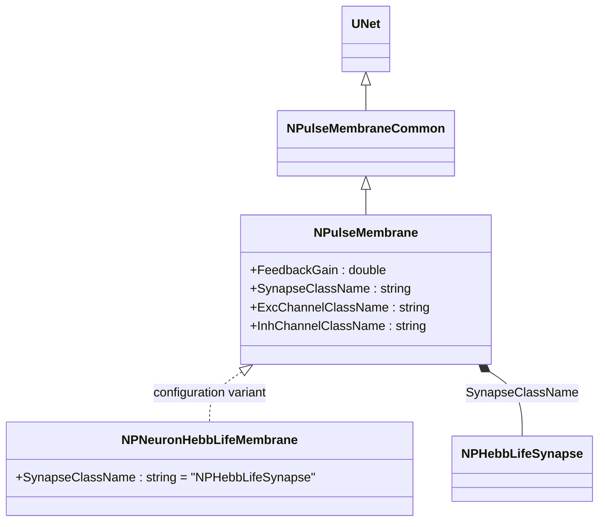
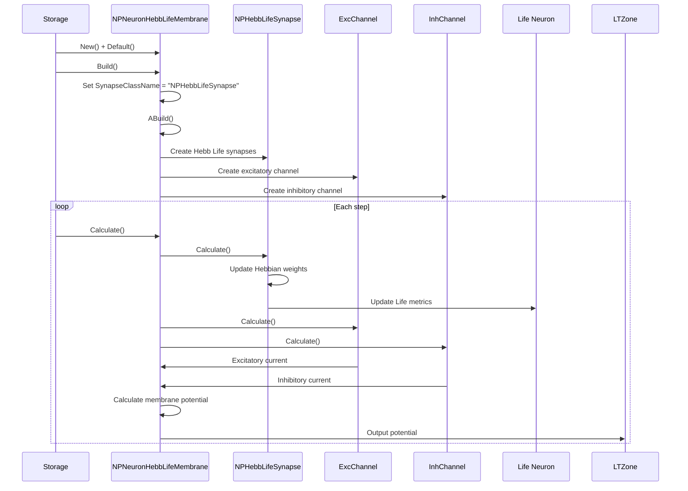
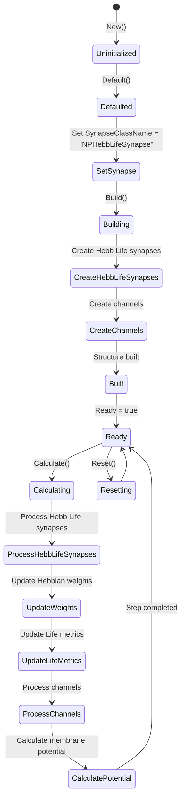
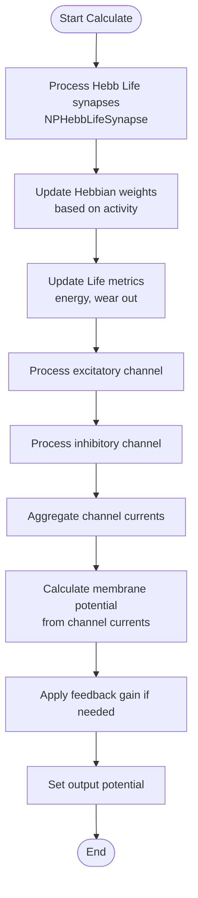

# NPNeuronHebbLifeMembrane — мембрана Life-нейрона с синапсами Хебба

## RU

### Назначение

**Класс**: `NPNeuronHebbLifeMembrane` — конфигурационный вариант импульсной мембраны для Life-нейронов с синапсами Хебба.  
**Регистрация**: `NPulseLibrary.cpp` → `UploadClass("NPNeuronHebbLifeMembrane", ...)`.  
**Storage-инстансы**: `ClassName = "NPNeuronHebbLifeMembrane"` в `Bin/Configs/*/Model_*.xml`.

`NPNeuronHebbLifeMembrane` является конфигурационным вариантом класса `NPulseMembrane` с параметрами для Life-нейронов с синапсами Хебба. При создании компонента с `ClassName = "NPNeuronHebbLifeMembrane"` создается экземпляр `NPulseMembrane` с параметром:
- `SynapseClassName = "NPHebbLifeSynapse"` — синапс Хебба для Life-нейронов

**Использование:** Мембрана Life-нейрона с синапсами Хебба, обучение по правилу Хебба для Life-нейронов

### UML-диаграмма классов



**Иерархия наследования:**
- `UNet` — базовая сеть Rdk Framework
- `NPulseMembraneCommon` — общая импульсная мембрана
- `NPulseMembrane` — базовая импульсная мембрана
- `NPNeuronHebbLifeMembrane` — конфигурационный вариант для Life-нейронов с синапсами Хебба

**Параметры конфигурации:**
- `SynapseClassName = "NPHebbLifeSynapse"` — синапс Хебба для Life-нейронов

### Свойства

`NPNeuronHebbLifeMembrane` использует все свойства базового класса `NPulseMembrane` с параметром:
- `SynapseClassName = "NPHebbLifeSynapse"`

### Методы

`NPNeuronHebbLifeMembrane` использует все методы базового класса `NPulseMembrane`.

### Примеры использования

#### Пример 1: Создание мембраны в коде C++

```cpp
// Создание мембраны для Life-нейрона с синапсами Хебба
auto membrane = storage->CreateComponent("NPNeuronHebbLifeMembrane");
membrane->SetName("PLifeMembrane");

// Инициализация (использует параметры по умолчанию)
membrane->Default();

// Использование
membrane->Build();
```

### См. также

- [`NPulseMembrane`](NPulseMembrane.md) — базовая импульсная мембрана (базовый класс)
- [`NPNeuronHebbMembrane`](NPNeuronHebbMembrane.md) — мембрана с синапсами Хебба
- [`NPHebbLifeSynapse`](NPHebbLifeSynapse.md) — синапс Хебба для Life-нейронов
- [`NPulseLifeNeuron`](NPulseLifeNeuron.md) — Life-нейрон
- [Architecture.md](../Architecture.md) — архитектура библиотеки

---

## EN

### Purpose

**Class**: `NPNeuronHebbLifeMembrane` — configuration variant of spiking membrane for Life-neurons with Hebb synapses.  
**Registration**: `NPulseLibrary.cpp` → `UploadClass("NPNeuronHebbLifeMembrane", ...)`.  
**Instances**: `ClassName = "NPNeuronHebbLifeMembrane"` in `Bin/Configs/*/Model_*.xml`.

`NPNeuronHebbLifeMembrane` is a configuration variant of `NPulseMembrane` class with parameters for Life-neurons with Hebb synapses. When creating a component with `ClassName = "NPNeuronHebbLifeMembrane"`, an instance of `NPulseMembrane` is created with parameter:
- `SynapseClassName = "NPHebbLifeSynapse"` — Hebb synapse for Life-neurons

**Usage:** Life-neuron membrane with Hebb synapses, Hebbian learning for Life-neurons

### UML Class Diagram


### UML Sequence Diagram



### UML State Diagram



### UML Activity Diagram



### UML Component Diagram

```mermaid
graph TB
    subgraph NPulseMembrane["NPulseMembrane Base"]
        BaseMembrane[NPulseMembrane]
    end
    
    subgraph NPNeuronHebbLifeMembrane["NPNeuronHebbLifeMembrane Configuration"]
        HebbLifeSynapseConfig[SynapseClassName<br/>= "NPHebbLifeSynapse"]
    end
    
    subgraph Synapses["Synapses"]
        HebbLifeSynapse[NPHebbLifeSynapse<br/>Hebb Life Synapse]
    end
    
    subgraph Channels["Channels"]
        ExcChannel[Excitatory Channel]
        InhChannel[Inhibitory Channel]
    end
    
    subgraph External["External Components"]
        PreNeurons[Presynaptic Neurons]
        LifeNeuron[Life Neuron]
        LTZone[LT-Zone]
    end
    
    BaseMembrane -->|configured as| NPNeuronHebbLifeMembrane
    NPNeuronHebbLifeMembrane -->|creates| HebbLifeSynapse
    NPNeuronHebbLifeMembrane -->|creates| ExcChannel
    NPNeuronHebbLifeMembrane -->|creates| InhChannel
    PreNeurons -->|Input| HebbLifeSynapse
    HebbLifeSynapse -->|current| NPNeuronHebbLifeMembrane
    HebbLifeSynapse -->|Life metrics| LifeNeuron
    ExcChannel -->|Excitatory current| NPNeuronHebbLifeMembrane
    InhChannel -->|Inhibitory current| NPNeuronHebbLifeMembrane
    NPNeuronHebbLifeMembrane -->|Output potential| LTZone
```

### Properties

`NPNeuronHebbLifeMembrane` uses all properties of base class `NPulseMembrane` with preset value:

**Configuration parameters:**
- `SynapseClassName = "NPHebbLifeSynapse"` — Hebb synapse for Life-neurons

**Inherited properties:**
- `SynapseClassName` (string) — synapse class name (preset to "NPHebbLifeSynapse")
- `FeedbackGain` (double) — feedback gain coefficient
- `ExcChannelClassName` (string) — excitatory channel class name
- `InhChannelClassName` (string) — inhibitory channel class name

### Methods

`NPNeuronHebbLifeMembrane` uses all methods of base class `NPulseMembrane`.

### Usage in configurations

`NPNeuronHebbLifeMembrane` is used in experiments with Life-neurons and Hebbian learning:

- **Life-neurons with Hebbian learning**: `Bin/Configs/*/Model_*.xml` (where Life-neurons with Hebbian learning are required)
- **Synaptic plasticity**: Experiments with Hebbian synaptic plasticity for Life-neurons

**Features:**
- Automatically configured with Hebb Life synapses (`SynapseClassName = "NPHebbLifeSynapse"`)
- Hebbian learning: Synapses update weights based on activity correlation
- Life integration: Synapses integrate with Life metrics (energy, wear out)
- Simplified configuration: Synapse class name is preset

**Typical parameter values:**
- **SynapseClassName**: "NPHebbLifeSynapse" (Hebb synapse for Life-neurons)

### See Also

- [`NPulseMembrane`](NPulseMembrane.md) — base spiking membrane (base class)
- [`NPNeuronHebbMembrane`](NPNeuronHebbMembrane.md) — Hebb membrane
- [`NPHebbLifeSynapse`](NPHebbLifeSynapse.md) — Hebb synapse for Life-neurons
- [`NPulseLifeNeuron`](NPulseLifeNeuron.md) — Life-neuron
- [Architecture.md](../Architecture.md) — library architecture
