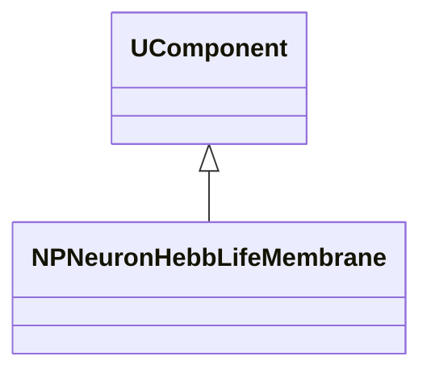
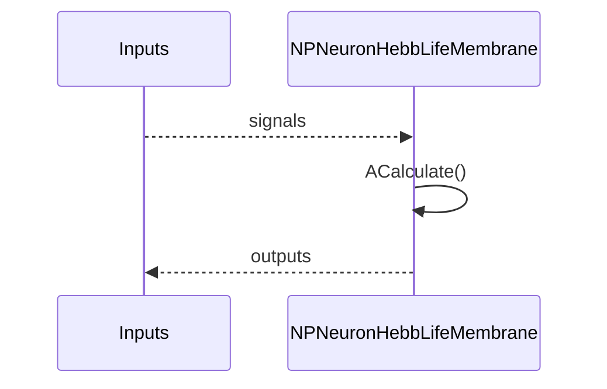
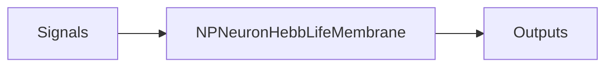
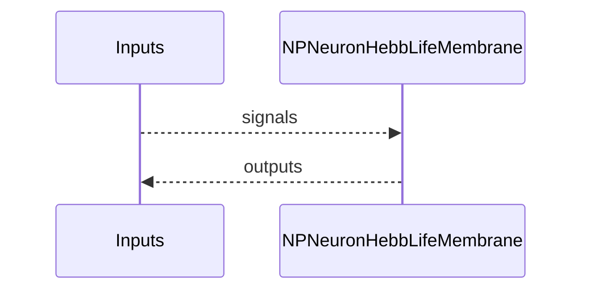

## NPNeuronHebbLifeMembrane — мембрана Hebb Life

**Класс**: `NPNeuronHebbLifeMembrane` — Мембранная модель с Hebb и Life.
**Регистрация**: `NPulseLibrary.cpp` → `UploadClass("NPNeuronHebbLifeMembrane", ...)`.
**Storage**: `ClassName = "NPNeuronHebbLifeMembrane"`.

### Lifecycle
- **ADefault**: параметры по умолчанию.
- **ABuild**: подключение входов/синапсов/каналов.
- **AReset**: сброс состояния/потенциалов.
- **ACalculate**: шаг расчёта (интеграция/передача/модуляция).

### I/O
- Вход: сигналы/токи/спайки (по назначению класса).
- Выход: потенциал/спайк/модулированный сигнал.



Пояснение: диаграмма классов показывает место компонента в иерархии и ключевые связи.



Пояснение: диаграмма последовательности показывает типовой сценарий взаимодействия и порядок вызовов.



Пояснение: блок-схема показывает поток данных/сигналов (входы → компонент → выходы).

### Config snippet
```ini
[Component]
ClassName = NPNeuronHebbLifeMembrane
Name = NPNeuronHebbLifeMembrane1
```

---

## NPNeuronHebbLifeMembrane — EN
Class `NPNeuronHebbLifeMembrane` — Мембранная модель с Hebb и Life.


Description: this class diagram shows the component position in the type hierarchy and key relations.



Description: this sequence diagram shows a typical runtime interaction and call order.


Description: this flowchart shows the data/signal flow (inputs → component → outputs).
