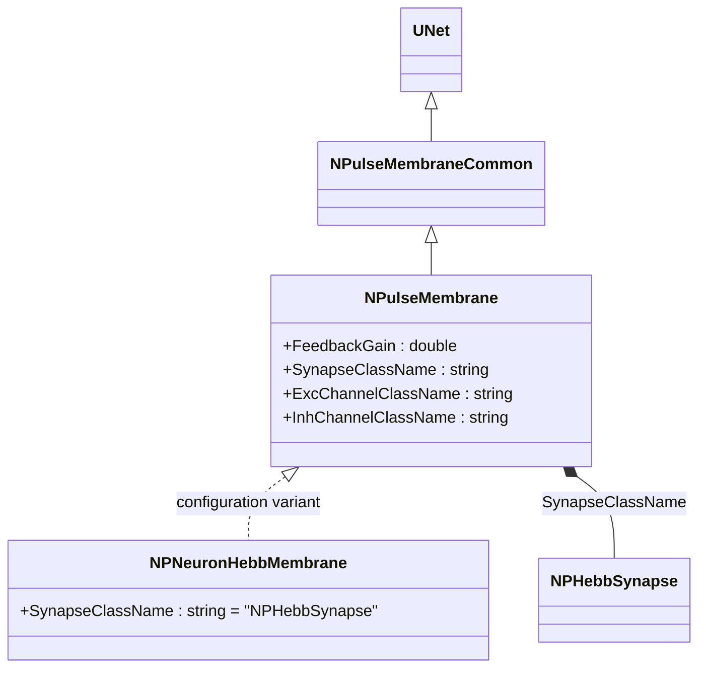
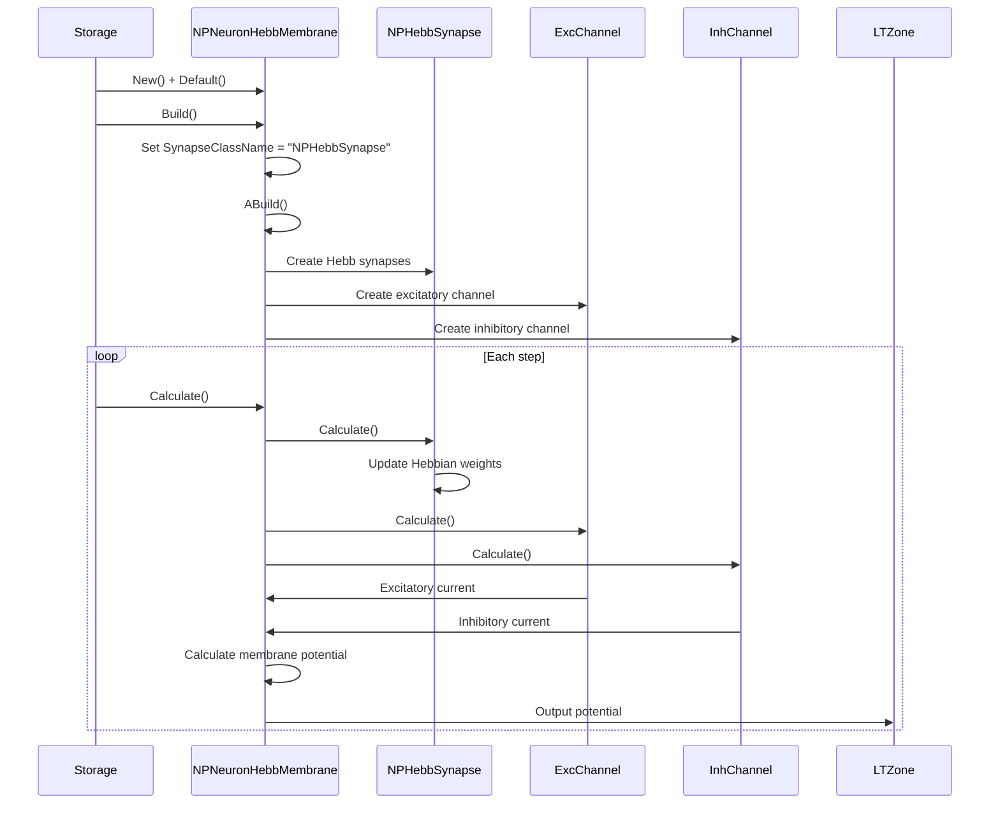
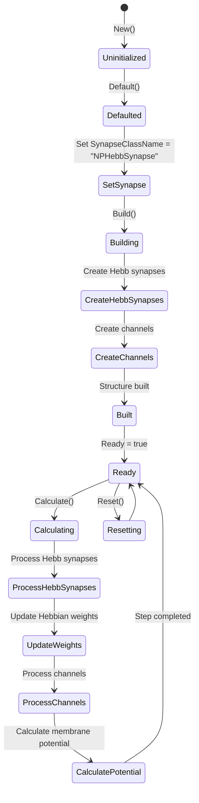
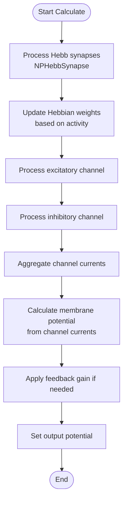

# NPNeuronHebbMembrane — мембрана нейрона с синапсами Хебба

## RU

### Назначение

**Класс**: `NPNeuronHebbMembrane` — конфигурационный вариант импульсной мембраны с синапсами Хебба.  
**Регистрация**: `NPulseLibrary.cpp` → `UploadClass("NPNeuronHebbMembrane", ...)`.  
**Storage-инстансы**: `ClassName = "NPNeuronHebbMembrane"` в `Bin/Configs/*/Model_*.xml`.

`NPNeuronHebbMembrane` является конфигурационным вариантом класса `NPulseMembrane` с параметрами для использования синапсов Хебба. При создании компонента с `ClassName = "NPNeuronHebbMembrane"` создается экземпляр `NPulseMembrane` с параметром:
- `SynapseClassName = "NPHebbSynapse"` — синапс Хебба

**Использование:** Мембрана нейрона с синапсами Хебба, обучение по правилу Хебба

### UML-диаграмма классов



**Иерархия наследования:**
- `UNet` — базовая сеть Rdk Framework
- `NPulseMembraneCommon` — общая импульсная мембрана
- `NPulseMembrane` — базовая импульсная мембрана
- `NPNeuronHebbMembrane` — конфигурационный вариант с синапсами Хебба

**Параметры конфигурации:**
- `SynapseClassName = "NPHebbSynapse"` — синапс Хебба

### Свойства

`NPNeuronHebbMembrane` использует все свойства базового класса `NPulseMembrane` с параметром:
- `SynapseClassName = "NPHebbSynapse"`

### Методы

`NPNeuronHebbMembrane` использует все методы базового класса `NPulseMembrane`.

### Примеры использования

#### Пример 1: Создание мембраны в коде C++

```cpp
// Создание мембраны с синапсами Хебба
auto membrane = storage->CreateComponent("NPNeuronHebbMembrane");
membrane->SetName("PMembrane");

// Инициализация (использует параметры по умолчанию)
membrane->Default();

// Использование
membrane->Build();
```

### См. также

- [`NPulseMembrane`](NPulseMembrane.md) — базовая импульсная мембрана (базовый класс)
- [`NPNeuronHebbLifeMembrane`](NPNeuronHebbLifeMembrane.md) — мембрана с синапсами Хебба для Life-нейронов
- [`NPHebbSynapse`](NPHebbSynapse.md) — синапс Хебба
- [Architecture.md](../Architecture.md) — архитектура библиотеки

---

## EN

### Purpose

**Class**: `NPNeuronHebbMembrane` — configuration variant of spiking membrane with Hebb synapses.  
**Registration**: `NPulseLibrary.cpp` → `UploadClass("NPNeuronHebbMembrane", ...)`.  
**Instances**: `ClassName = "NPNeuronHebbMembrane"` in `Bin/Configs/*/Model_*.xml`.

`NPNeuronHebbMembrane` is a configuration variant of `NPulseMembrane` class with parameters for using Hebb synapses. When creating a component with `ClassName = "NPNeuronHebbMembrane"`, an instance of `NPulseMembrane` is created with parameter:
- `SynapseClassName = "NPHebbSynapse"` — Hebb synapse

**Usage:** Neuron membrane with Hebb synapses, Hebbian learning

### UML Class Diagram


### UML Sequence Diagram



### UML State Diagram



### UML Activity Diagram



### UML Component Diagram

```mermaid
graph TB
    subgraph NPulseMembrane["NPulseMembrane Base"]
        BaseMembrane[NPulseMembrane]
    end
    
    subgraph NPNeuronHebbMembrane["NPNeuronHebbMembrane Configuration"]
        HebbSynapseConfig[SynapseClassName<br/>= "NPHebbSynapse"]
    end
    
    subgraph Synapses["Synapses"]
        HebbSynapse[NPHebbSynapse<br/>Hebb Synapse]
    end
    
    subgraph Channels["Channels"]
        ExcChannel[Excitatory Channel]
        InhChannel[Inhibitory Channel]
    end
    
    subgraph External["External Components"]
        PreNeurons[Presynaptic Neurons]
        LTZone[LT-Zone]
    end
    
    BaseMembrane -->|configured as| NPNeuronHebbMembrane
    NPNeuronHebbMembrane -->|creates| HebbSynapse
    NPNeuronHebbMembrane -->|creates| ExcChannel
    NPNeuronHebbMembrane -->|creates| InhChannel
    PreNeurons -->|Input| HebbSynapse
    HebbSynapse -->|current| NPNeuronHebbMembrane
    ExcChannel -->|Excitatory current| NPNeuronHebbMembrane
    InhChannel -->|Inhibitory current| NPNeuronHebbMembrane
    NPNeuronHebbMembrane -->|Output potential| LTZone
```

### Properties

`NPNeuronHebbMembrane` uses all properties of base class `NPulseMembrane` with preset value:

**Configuration parameters:**
- `SynapseClassName = "NPHebbSynapse"` — Hebb synapse

**Inherited properties:**
- `SynapseClassName` (string) — synapse class name (preset to "NPHebbSynapse")
- `FeedbackGain` (double) — feedback gain coefficient
- `ExcChannelClassName` (string) — excitatory channel class name
- `InhChannelClassName` (string) — inhibitory channel class name

### Methods

`NPNeuronHebbMembrane` uses all methods of base class `NPulseMembrane`.

### Usage in configurations

`NPNeuronHebbMembrane` is used in experiments with Hebbian learning:

- **Hebbian learning**: `Bin/Configs/*/Model_*.xml` (where Hebbian learning is required)
- **Synaptic plasticity**: Experiments with Hebbian synaptic plasticity

**Features:**
- Automatically configured with Hebb synapses (`SynapseClassName = "NPHebbSynapse"`)
- Hebbian learning: Synapses update weights based on activity correlation
- Simplified configuration: Synapse class name is preset

**Typical parameter values:**
- **SynapseClassName**: "NPHebbSynapse" (Hebb synapse)

### See Also

- [`NPulseMembrane`](NPulseMembrane.md) — base spiking membrane (base class)
- [`NPNeuronHebbLifeMembrane`](NPNeuronHebbLifeMembrane.md) — Hebb membrane for Life neurons
- [`NPHebbSynapse`](NPHebbSynapse.md) — Hebb synapse
- [Architecture.md](../Architecture.md) — library architecture
