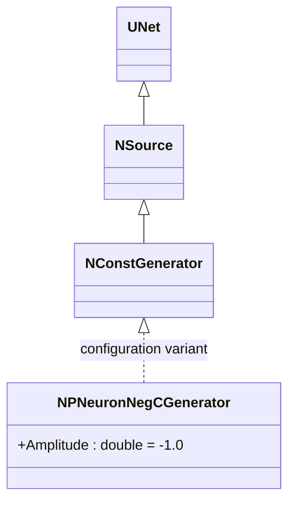
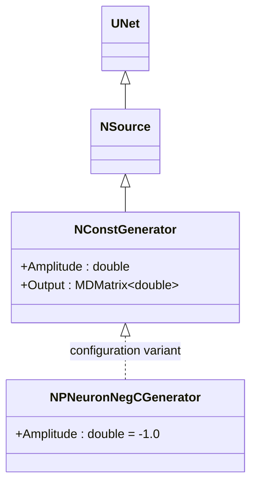
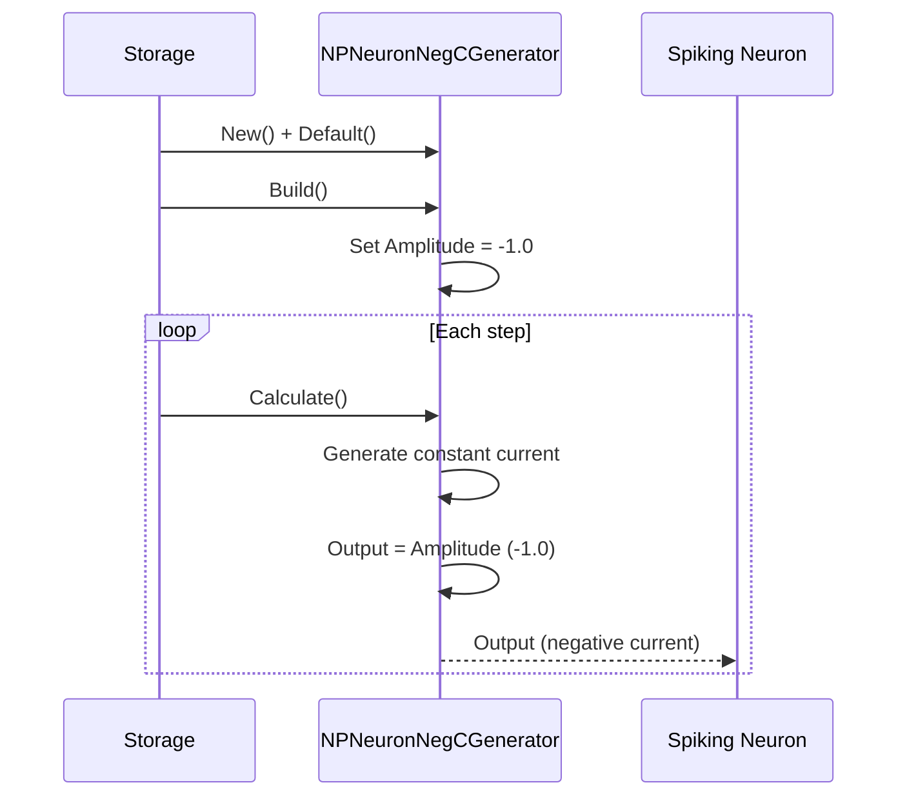
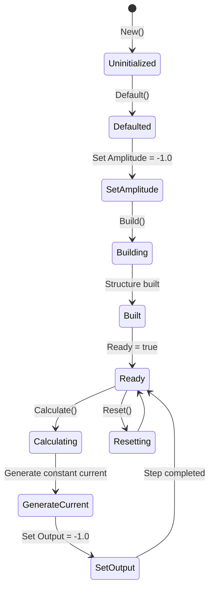
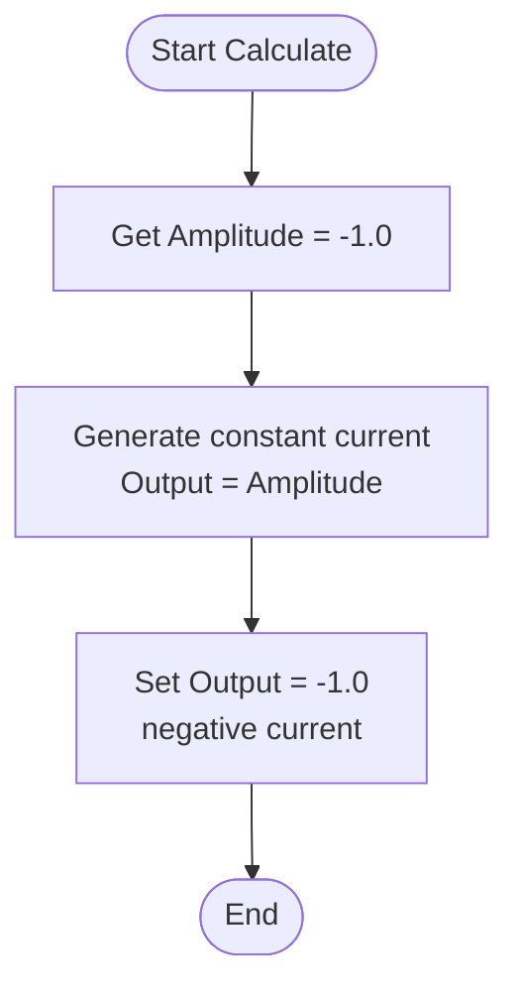
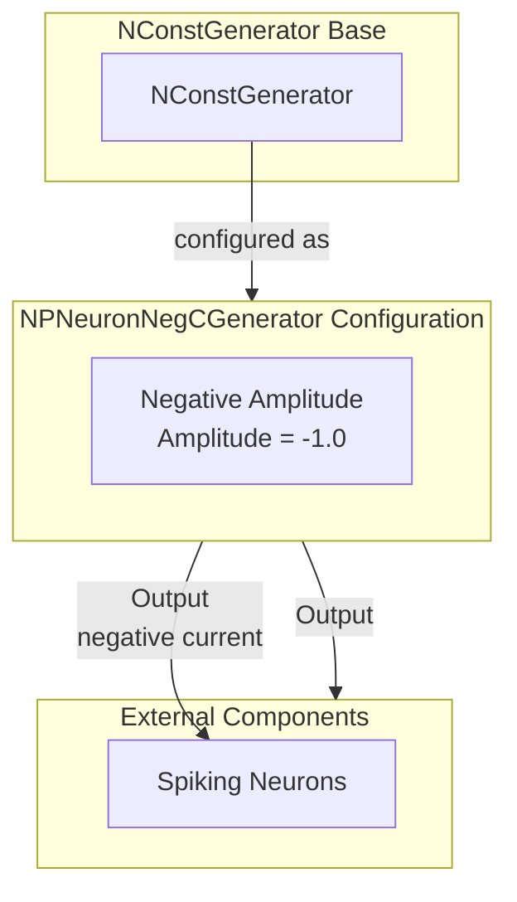

# NPNeuronNegCGenerator — генератор отрицательных токов для импульсных нейронов

## RU

### Назначение

**Класс**: `NPNeuronNegCGenerator` — конфигурационный вариант генератора постоянного тока с отрицательной амплитудой для импульсных нейронов.  
**Регистрация**: `NPulseLibrary.cpp` → `UploadClass("NPNeuronNegCGenerator", ...)`.  
**Storage-инстансы**: `ClassName = "NPNeuronNegCGenerator"` в `Bin/Configs/*/Model_*.xml`.

`NPNeuronNegCGenerator` является конфигурационным вариантом класса `NConstGenerator` с параметром `Amplitude = -1.0`. При создании компонента с `ClassName = "NPNeuronNegCGenerator"` создается экземпляр генератора постоянного тока с отрицательной амплитудой.

**Использование:** Генератор отрицательных токов для импульсных нейронов, источник тормозного потенциала

### UML-диаграмма классов

**Параметры конфигурации:**
- `Amplitude = -1.0` — отрицательная амплитуда

### См. также

- [`NConstGenerator`](NConstGenerator.md) — генератор постоянного тока (базовый класс)
- [`NPNeuronPosCGenerator`](NPNeuronPosCGenerator.md) — генератор положительных токов
- [`NPNeuronNegCGeneratorBio`](NPNeuronNegCGeneratorBio.md) — генератор для биоинспирированных моделей

---

## EN

### Purpose

**Class**: `NPNeuronNegCGenerator` — configuration variant of constant current generator with negative amplitude for spiking neurons.  
**Registration**: `NPulseLibrary.cpp` → `UploadClass("NPNeuronNegCGenerator", ...)`.  
**Instances**: `ClassName = "NPNeuronNegCGenerator"` in `Bin/Configs/*/Model_*.xml`.

`NPNeuronNegCGenerator` is a configuration variant of `NConstGenerator` class with parameter `Amplitude = -1.0`. When creating a component with `ClassName = "NPNeuronNegCGenerator"`, an instance of constant current generator with negative amplitude is created.

**Usage:** Negative current generator for spiking neurons, inhibitory potential source

### UML Class Diagram

### UML Sequence Diagram

### UML State Diagram

### UML Activity Diagram

### UML Component Diagram

### Properties

`NPNeuronNegCGenerator` uses all properties of base class `NConstGenerator` with preset value:

**Configuration parameters:**
- `Amplitude = -1.0` — negative amplitude for spiking neurons

**Inherited properties:**
- `Amplitude` (double) — current amplitude (preset to -1.0)
- `Output` (MDMatrix<double>) — output current signal

### Methods

`NPNeuronNegCGenerator` uses all methods of base class `NConstGenerator`.

### Usage in configurations

`NPNeuronNegCGenerator` is used in spiking neuron experiments:

- **Spiking neurons**: Generates negative constant current for spiking neurons
- **Inhibitory potential**: Provides negative amplitude (-1.0) for inhibition

**Features:**
- Automatically configured with negative amplitude (`Amplitude = -1.0`)
- Constant current: Generates constant negative current
- Spiking model: Optimized for spiking neuron models

**Typical parameter values:**
- **Amplitude**: -1.0 (negative amplitude for spiking neurons)

### See Also

- [`NConstGenerator`](NConstGenerator.md) — constant current generator (base class)
- [`NPNeuronPosCGenerator`](NPNeuronPosCGenerator.md) — positive current generator
- [`NPNeuronNegCGeneratorBio`](NPNeuronNegCGeneratorBio.md) — generator for bio-inspired models
