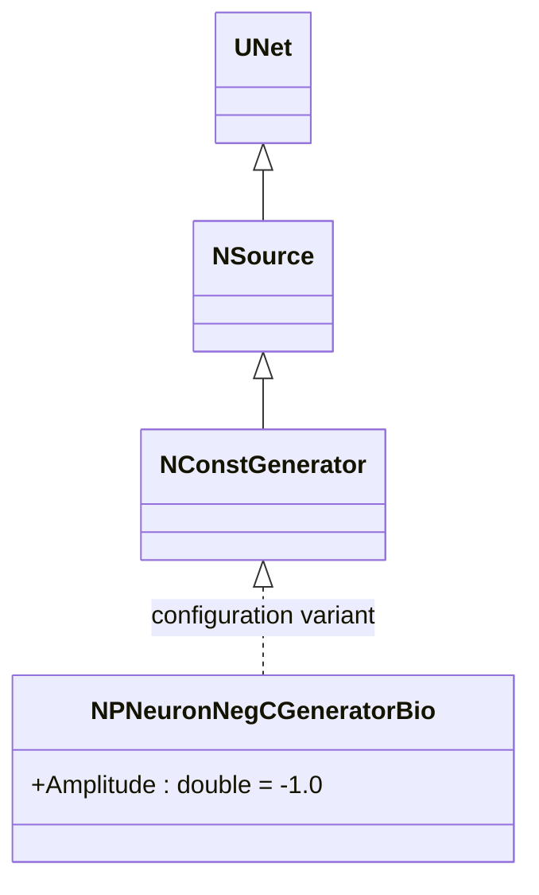
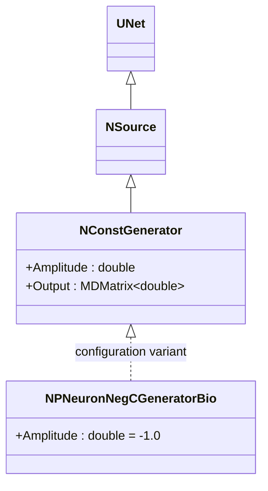
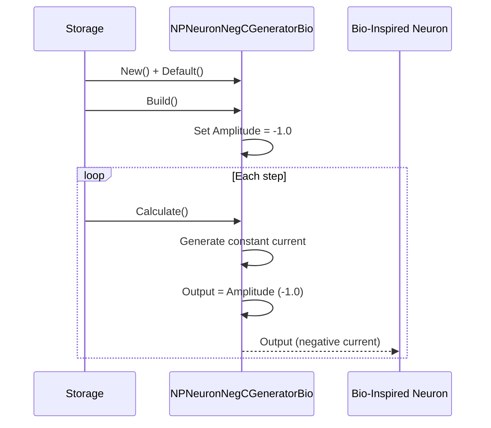
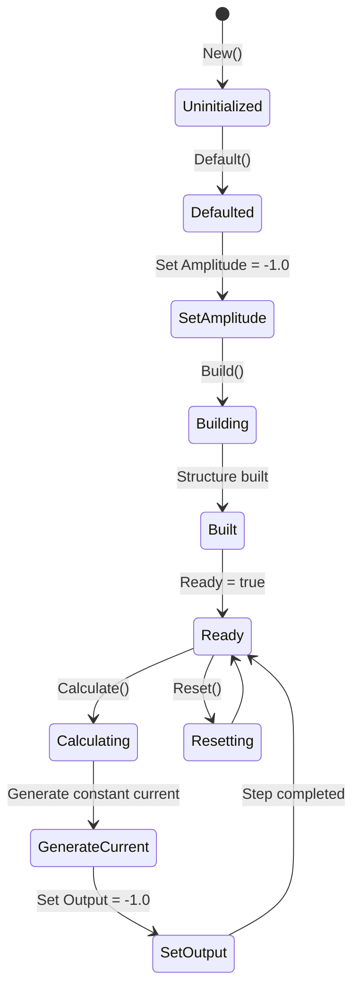
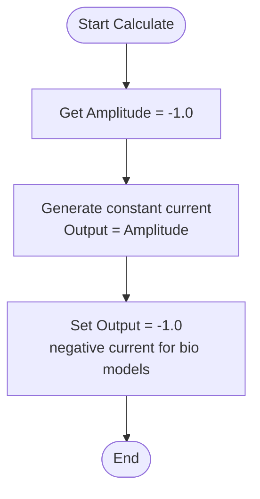
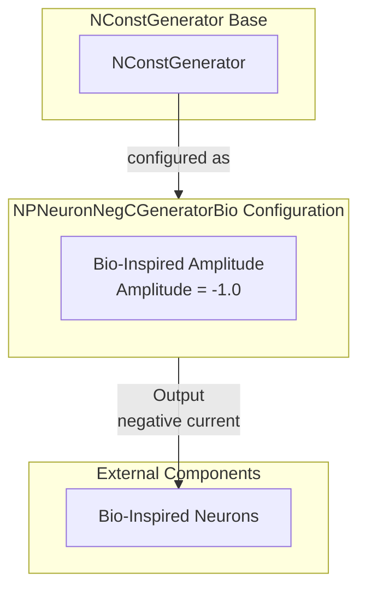

# NPNeuronNegCGeneratorBio — генератор отрицательных токов для биоинспирированных моделей

## RU

### Назначение

**Класс**: `NPNeuronNegCGeneratorBio` — конфигурационный вариант генератора постоянного тока с отрицательной амплитудой для биоинспирированных импульсных нейронов.  
**Аббревиатура**: `Bio` — **Bio**logical (биологическая модель).  
**Регистрация**: `NPulseLibrary.cpp` → `UploadClass("NPNeuronNegCGeneratorBio", ...)`.  
**Storage-инстансы**: `ClassName = "NPNeuronNegCGeneratorBio"` в `Bin/Configs/*/Model_*.xml`.

`NPNeuronNegCGeneratorBio` является конфигурационным вариантом класса `NConstGenerator` с параметром `Amplitude = -1.0`. При создании компонента с `ClassName = "NPNeuronNegCGeneratorBio"` создается экземпляр генератора постоянного тока с отрицательной амплитудой для биоинспирированных моделей.

**Использование:** Генератор отрицательных токов для биоинспирированных импульсных нейронов

### UML-диаграмма классов

**Параметры конфигурации:**
- `Amplitude = -1.0` — отрицательная амплитуда для биоинспирированных моделей

### См. также

- [`NConstGenerator`](NConstGenerator.md) — генератор постоянного тока (базовый класс)
- [`NPNeuronNegCGenerator`](NPNeuronNegCGenerator.md) — генератор отрицательных токов
- [`NPNeuronPosCGeneratorBio`](NPNeuronPosCGeneratorBio.md) — генератор положительных токов для биоинспирированных моделей

---

## EN

### Purpose

**Class**: `NPNeuronNegCGeneratorBio` — configuration variant of constant current generator with negative amplitude for bio-inspired spiking neurons.  
**Registration**: `NPulseLibrary.cpp` → `UploadClass("NPNeuronNegCGeneratorBio", ...)`.  
**Instances**: `ClassName = "NPNeuronNegCGeneratorBio"` in `Bin/Configs/*/Model_*.xml`.

`NPNeuronNegCGeneratorBio` is a configuration variant of `NConstGenerator` class with parameter `Amplitude = -1.0`. When creating a component with `ClassName = "NPNeuronNegCGeneratorBio"`, an instance of constant current generator with negative amplitude for bio-inspired models is created.

**Usage:** Negative current generator for bio-inspired spiking neurons

### UML Class Diagram

### UML Sequence Diagram

### UML State Diagram

### UML Activity Diagram

### UML Component Diagram

### Properties

`NPNeuronNegCGeneratorBio` uses all properties of base class `NConstGenerator` with preset value:

**Configuration parameters:**
- `Amplitude = -1.0` — negative amplitude for bio-inspired models

**Inherited properties:**
- `Amplitude` (double) — current amplitude (preset to -1.0)
- `Output` (MDMatrix<double>) — output current signal

### Methods

`NPNeuronNegCGeneratorBio` uses all methods of base class `NConstGenerator`.

### Usage in configurations

`NPNeuronNegCGeneratorBio` is used in bio-inspired neuron experiments:

- **Bio-inspired neurons**: Generates negative constant current for bio-inspired spiking neurons
- **Inhibitory potential**: Provides negative amplitude (-1.0) for inhibition in bio models

**Features:**
- Automatically configured with negative amplitude (`Amplitude = -1.0`)
- Constant current: Generates constant negative current
- Bio-optimized: Optimized for bio-inspired models

**Typical parameter values:**
- **Amplitude**: -1.0 (negative amplitude for bio-inspired models)

### See Also

- [`NConstGenerator`](NConstGenerator.md) — constant current generator (base class)
- [`NPNeuronNegCGenerator`](NPNeuronNegCGenerator.md) — negative current generator
- [`NPNeuronPosCGeneratorBio`](NPNeuronPosCGeneratorBio.md) — positive current generator for bio-inspired models
