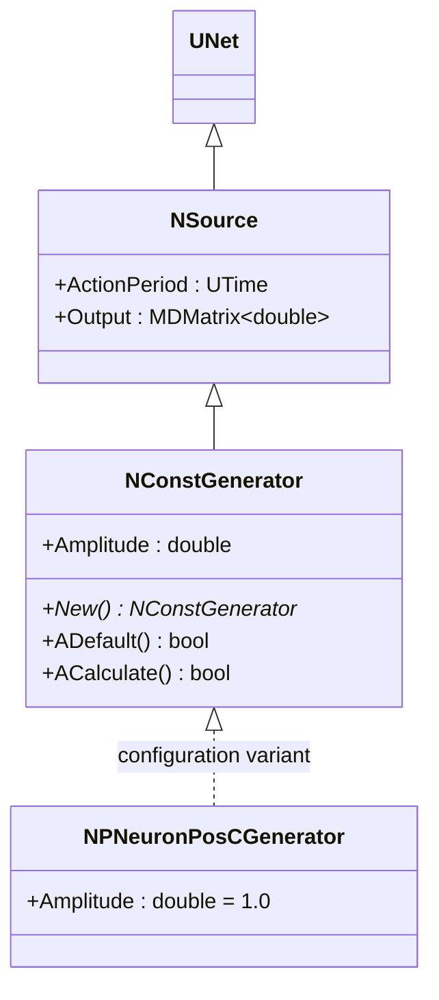
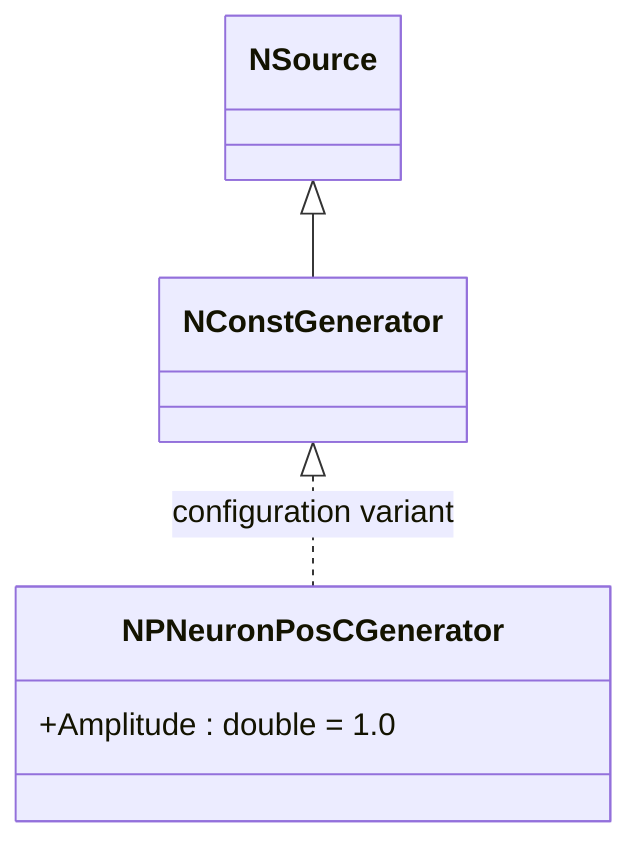

# NPNeuronPosCGenerator — генератор положительных токов для импульсных нейронов

## RU

### Назначение

**Класс**: `NPNeuronPosCGenerator` — конфигурационный вариант генератора постоянного тока с положительной амплитудой для импульсных нейронов.  
**Регистрация**: `NPulseLibrary.cpp` → `UploadClass("NPNeuronPosCGenerator", ...)`.  
**Storage-инстансы**: `ClassName = "NPNeuronPosCGenerator"` в `Bin/Configs/*/Model_*.xml`.

`NPNeuronPosCGenerator` является конфигурационным вариантом класса `NConstGenerator` (через `NCGenerator`) с параметром `Amplitude = 1.0`. При создании компонента с `ClassName = "NPNeuronPosCGenerator"` создается экземпляр генератора постоянного тока с положительной амплитудой.

**Использование:** Генератор положительных токов для импульсных нейронов, источник возбуждающего потенциала

### UML-диаграмма классов



**Иерархия наследования:**
- `UNet` — базовая сеть Rdk Framework
- `NSource` — базовый источник сигналов
- `NConstGenerator` — генератор постоянного тока
- `NPNeuronPosCGenerator` — конфигурационный вариант для импульсных нейронов

**Параметры конфигурации:**
- `Amplitude = 1.0` — положительная амплитуда

### Свойства

`NPNeuronPosCGenerator` использует все свойства базового класса `NConstGenerator` с параметром:
- `Amplitude = 1.0` (положительная амплитуда)

### Методы

`NPNeuronPosCGenerator` использует все методы базового класса `NConstGenerator`.

### Примеры использования

#### Пример 1: Создание генератора в коде C++

```cpp
// Создание генератора положительных токов
auto generator = storage->CreateComponent("NPNeuronPosCGenerator");
generator->SetName("PosGenerator");

// Инициализация (использует параметры по умолчанию)
generator->Default();

// Использование
generator->Build();
```

### См. также

- [`NConstGenerator`](NConstGenerator.md) — генератор постоянного тока (базовый класс)
- [`NPNeuronPosCGeneratorBio`](NPNeuronPosCGeneratorBio.md) — генератор для биоинспирированных моделей
- [`NPNeuronPosCGeneratorCable`](NPNeuronPosCGeneratorCable.md) — генератор для кабельных моделей
- [`NPNeuronNegCGenerator`](NPNeuronNegCGenerator.md) — генератор отрицательных токов
- [Architecture.md](../Architecture.md) — архитектура библиотеки

---

## EN

### Purpose

**Class**: `NPNeuronPosCGenerator` — configuration variant of constant current generator with positive amplitude for spiking neurons.  
**Registration**: `NPulseLibrary.cpp` → `UploadClass("NPNeuronPosCGenerator", ...)`.  
**Instances**: `ClassName = "NPNeuronPosCGenerator"` in `Bin/Configs/*/Model_*.xml`.

`NPNeuronPosCGenerator` is a configuration variant of `NConstGenerator` class (via `NCGenerator`) with parameter `Amplitude = 1.0`. When creating a component with `ClassName = "NPNeuronPosCGenerator"`, an instance of constant current generator with positive amplitude is created.

**Usage:** Positive current generator for spiking neurons, excitatory potential source

### UML Class Diagram



### See Also

- [`NConstGenerator`](NConstGenerator.md) — constant current generator (base class)
- [`NPNeuronPosCGeneratorBio`](NPNeuronPosCGeneratorBio.md) — generator for bio models
- [`NPNeuronPosCGeneratorCable`](NPNeuronPosCGeneratorCable.md) — generator for cable models
- [`NPNeuronNegCGenerator`](NPNeuronNegCGenerator.md) — negative current generator
- [Architecture.md](../Architecture.md) — library architecture
