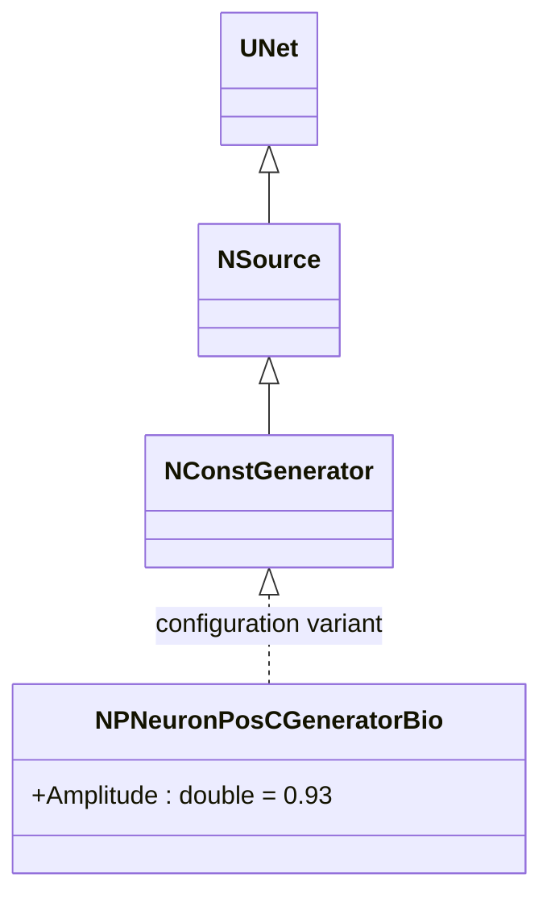
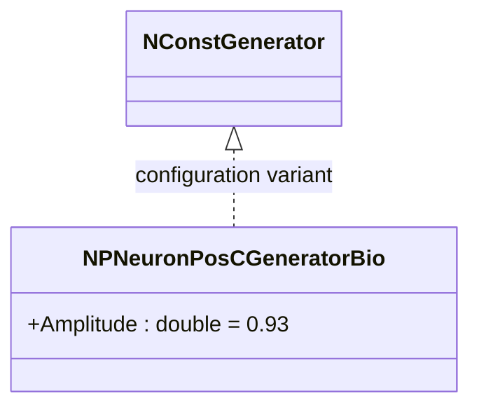

# NPNeuronPosCGeneratorBio — генератор положительных токов для биоинспирированных моделей

## RU

### Назначение

**Класс**: `NPNeuronPosCGeneratorBio` — конфигурационный вариант генератора постоянного тока с положительной амплитудой для биоинспирированных импульсных нейронов.  
**Регистрация**: `NPulseLibrary.cpp` → `UploadClass("NPNeuronPosCGeneratorBio", ...)`.  
**Storage-инстансы**: `ClassName = "NPNeuronPosCGeneratorBio"` в `Bin/Configs/*/Model_*.xml`.

`NPNeuronPosCGeneratorBio` является конфигурационным вариантом класса `NConstGenerator` с параметром `Amplitude = 0.93`. При создании компонента с `ClassName = "NPNeuronPosCGeneratorBio"` создается экземпляр генератора постоянного тока с положительной амплитудой, оптимизированной для биоинспирированных моделей.

**Использование:** Генератор положительных токов для биоинспирированных импульсных нейронов

### UML-диаграмма классов

**Параметры конфигурации:**
- `Amplitude = 0.93` — положительная амплитуда для биоинспирированных моделей

## Источники

См. [Literature-References.md](../Literature-References.md): **26**, **29**, **30**.

### См. также

- [`NConstGenerator`](NCGenerator.md) — генератор постоянного тока (базовый класс)
- [`NPNeuronPosCGenerator`](NPNeuronPosCGenerator.md) — генератор для импульсных нейронов
- [`NPNeuronNegCGeneratorBio`](NPNeuronNegCGeneratorBio.md) — генератор отрицательных токов для биоинспирированных моделей

---

## EN

### Purpose

**Class**: `NPNeuronPosCGeneratorBio` — configuration variant of constant current generator with positive amplitude for bio-inspired spiking neurons.  
**Registration**: `NPulseLibrary.cpp` → `UploadClass("NPNeuronPosCGeneratorBio", ...)`.  
**Instances**: `ClassName = "NPNeuronPosCGeneratorBio"` in `Bin/Configs/*/Model_*.xml`.

`NPNeuronPosCGeneratorBio` is a configuration variant of `NConstGenerator` class with parameter `Amplitude = 0.93`. When creating a component with `ClassName = "NPNeuronPosCGeneratorBio"`, an instance of constant current generator with positive amplitude optimized for bio-inspired models is created.

**Usage:** Positive current generator for bio-inspired spiking neurons

### UML Class Diagram

### References

See [Literature-References.md](../Literature-References.md): **26**, **29**, **30**.

### See Also

- [`NConstGenerator`](NCGenerator.md) — constant current generator (base class)
- [`NPNeuronPosCGenerator`](NPNeuronPosCGenerator.md) — generator for spiking neurons
- [`NPNeuronNegCGeneratorBio`](NPNeuronNegCGeneratorBio.md) — negative current generator for bio-inspired models
