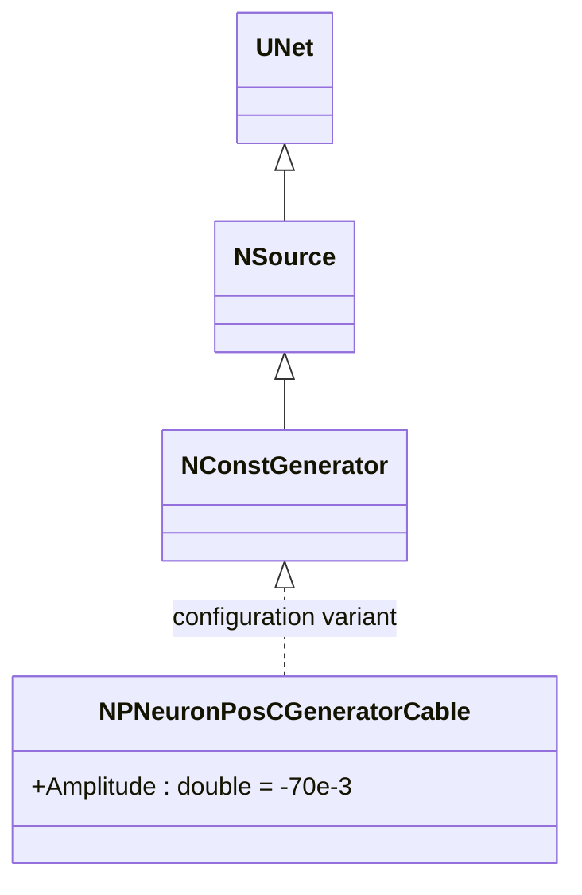
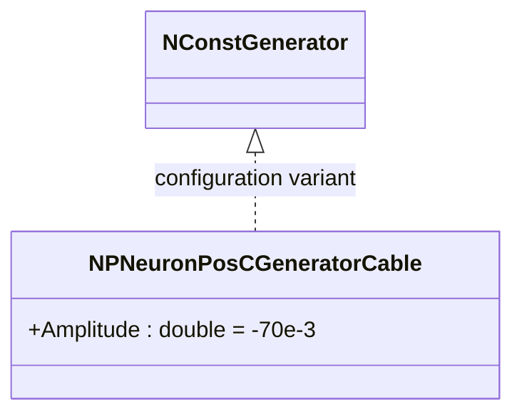

# NPNeuronPosCGeneratorCable — генератор положительных токов для кабельных моделей

## RU

### Назначение

**Класс**: `NPNeuronPosCGeneratorCable` — конфигурационный вариант генератора постоянного тока с отрицательной амплитудой для кабельных моделей.
**Регистрация**: `NPulseLibrary.cpp` → `UploadClass("NPNeuronPosCGeneratorCable", ...)`.
**Storage-инстансы**: `ClassName = "NPNeuronPosCGeneratorCable"` в `Bin/Configs/*/Model_*.xml`.

`NPNeuronPosCGeneratorCable` является конфигурационным вариантом класса `NConstGenerator` с параметром `Amplitude = -70e-3` (-70 мВ). При создании компонента с `ClassName = "NPNeuronPosCGeneratorCable"` создается экземпляр генератора постоянного тока с амплитудой, оптимизированной для кабельных моделей. В архитектуре CSNM [C] этот компонент реализует модель генератора потенциала действия (ПД) в сегментной спайковой модели.

**Использование:** Генератор токов для кабельных моделей

### UML-диаграмма классов

**Параметры конфигурации:**
- `Amplitude = -70e-3` (-70 мВ) — амплитуда для кабельных моделей

## Источники

См. [Literature-References.md](../Literature-References.md): **[C]**, **7**, **5**, **6**.

### См. также

- [`NConstGenerator`](NConstGenerator.md) — генератор постоянного тока (базовый класс)
- [`NPulseChannelCable`](NPulseChannelCable.md) — кабельный импульсный канал
- [`NPulseMembraneCable`](NPulseMembraneCable.md) — кабельная мембрана

---

## EN

### Purpose

**Class**: `NPNeuronPosCGeneratorCable` — configuration variant of constant current generator with negative amplitude for cable models.
**Registration**: `NPulseLibrary.cpp` → `UploadClass("NPNeuronPosCGeneratorCable", ...)`.
**Instances**: `ClassName = "NPNeuronPosCGeneratorCable"` in `Bin/Configs/*/Model_*.xml`.

`NPNeuronPosCGeneratorCable` is a configuration variant of `NConstGenerator` class with parameter `Amplitude = -70e-3` (-70 mV). When creating a component with `ClassName = "NPNeuronPosCGeneratorCable"`, an instance of constant current generator with amplitude optimized for cable models is created.

**Usage:** Current generator for cable models

### UML Class Diagram

### References

See [Literature-References.md](../Literature-References.md): **[C]**, **7**, **5**, **6**.

### See Also

- [`NConstGenerator`](NConstGenerator.md) — constant current generator (base class)
- [`NPulseChannelCable`](NPulseChannelCable.md) — cable spiking channel
- [`NPulseMembraneCable`](NPulseMembraneCable.md) — cable membrane
