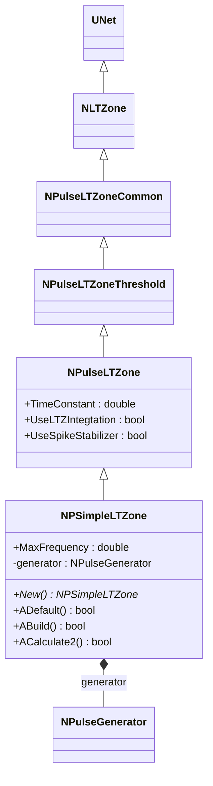
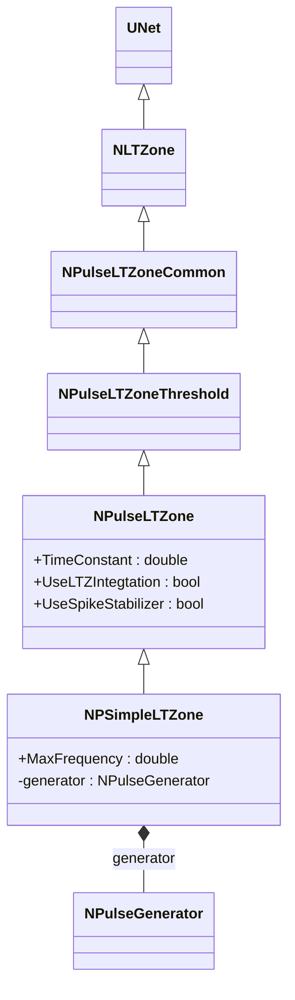
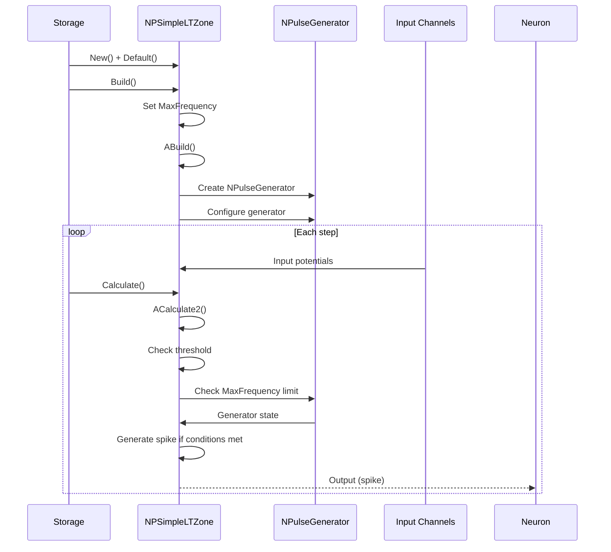
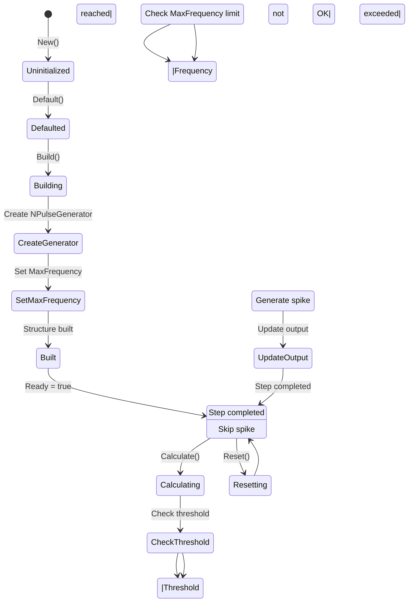
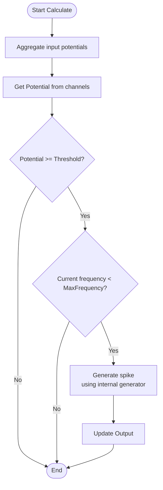
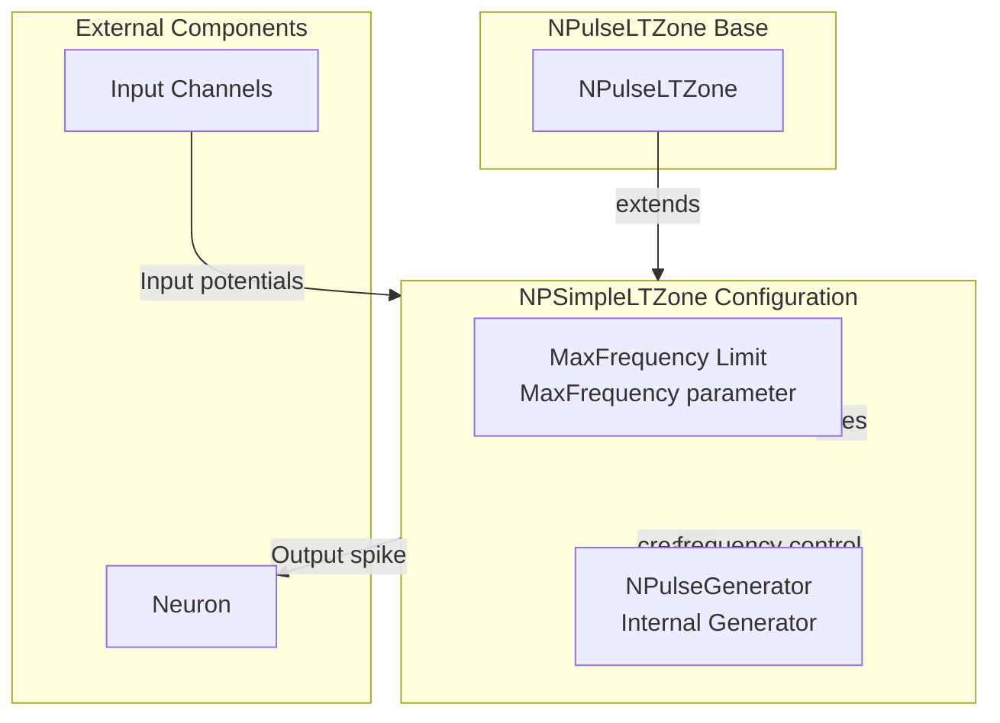

# NPSimpleLTZone — простая импульсная LT-зона

## RU

### Назначение

**Класс**: `NPSimpleLTZone` — простая импульсная LT-зона с встроенным генератором импульсов.  
**Аббревиатура**: `LT` — **L**ow **T**hreshold (низкопороговая зона).  
**Регистрация**: `NPulseLibrary.cpp` → `UploadClass("NPSimpleLTZone", ...)`.  
**Storage-инстансы**: `ClassName = "NPSimpleLTZone"` в `Bin/Configs/*/Model_*.xml`.

`NPSimpleLTZone` является расширением класса `NPulseLTZone` с встроенным генератором импульсов (`NPulseGenerator`). Наследуется от `NPulseLTZone` и добавляет параметр `MaxFrequency` для ограничения максимальной частоты генерации спайков. Внутренний генератор используется для управления генерацией импульсов.

**Использование:** Простая LT-зона с встроенным генератором, ограничение максимальной частоты

### UML-диаграмма классов



**Иерархия наследования:**
- `UNet` — базовая сеть Rdk Framework
- `NLTZone` — базовая LT-зона
- `NPulseLTZoneCommon` — общая импульсная LT-зона
- `NPulseLTZoneThreshold` — базовая импульсная LT-зона с порогом
- `NPulseLTZone` — импульсная LT-зона (расширенная)
- `NPSimpleLTZone` — простая импульсная LT-зона

### Свойства

#### Параметры (ptPubParameter)

- **`MaxFrequency`** (double) — максимальная частота генерации спайков (Гц). Диапазон: [0; 500]. Значение по умолчанию: 100.0

**Наследуемые от NPulseLTZone:**
- `TimeConstant` — временная константа
- `UseLTZIntegtation` — использовать интегрирование LT-зоны
- `UseSpikeStabilizer` — использовать стабилизатор спайков

**Наследуемые от NPulseLTZoneCommon:**
- `Threshold`, `ThresholdOff` — пороги
- `PulseAmplitude`, `PulseLength` — параметры импульсов
- `NumChannelsInGroup` — количество каналов в группе

### Методы

- **`ACalculate2()`** → `bool` — выполняет расчет простой LT-зоны. Использует встроенный генератор для управления генерацией импульсов с учетом ограничения `MaxFrequency`.

### Примеры использования

#### Пример 1: Создание простой LT-зоны в коде C++

```cpp
// Создание простой LT-зоны
auto ltZone = storage->CreateComponent("NPSimpleLTZone");
ltZone->SetName("SimpleLTZone");

// Инициализация
ltZone->Default();

// Настройка параметров
ltZone->MaxFrequency = 100.0;  // Максимальная частота 100 Гц
ltZone->Threshold = 30.0;
ltZone->PulseAmplitude = 1.0;

// Использование
ltZone->Build();
```

## Источники

См. [Literature-References.md](../Literature-References.md): **[A]**, **4**, **25**, **29**.

### См. также

- [`NPulseLTZone`](NPulseLTZone.md) — импульсная LT-зона (базовый класс)
- [`NCSimpleLTZone`](NCSimpleLTZone.md) — простая классическая LT-зона
- [`NPulseGenerator`](NPulseGenerator.md) — генератор импульсов
- [Architecture.md](../Architecture.md) — архитектура библиотеки

---

## EN

### Purpose

**Class**: `NPSimpleLTZone` — simple spiking LT-zone with built-in pulse generator.  
**Registration**: `NPulseLibrary.cpp` → `UploadClass("NPSimpleLTZone", ...)`.  
**Instances**: `ClassName = "NPSimpleLTZone"` in `Bin/Configs/*/Model_*.xml`.

`NPSimpleLTZone` is an extension of `NPulseLTZone` class with built-in pulse generator (`NPulseGenerator`). Inherits from `NPulseLTZone` and adds `MaxFrequency` parameter to limit maximum spike generation frequency. Internal generator is used for managing impulse generation.

**Usage:** Simple LT-zone with built-in generator, maximum frequency limiting

### UML Class Diagram



### UML Sequence Diagram



### UML State Diagram



### UML Activity Diagram



### UML Component Diagram



### Properties

`NPSimpleLTZone` uses all properties of base class `NPulseLTZone` with additional parameter:

**Configuration parameters:**
- `MaxFrequency` (double) — maximum spike generation frequency (Hz). Range: [0; 500]. Default: 100.0

**Inherited from NPulseLTZone:**
- `TimeConstant` — time constant
- `UseLTZIntegtation` — use LT-zone integration
- `UseSpikeStabilizer` — use spike stabilizer

**Inherited from NPulseLTZoneCommon:**
- `Threshold`, `ThresholdOff` — thresholds
- `PulseAmplitude`, `PulseLength` — pulse parameters
- `NumChannelsInGroup` — number of channels in group

### Methods

`NPSimpleLTZone` uses all methods of base class `NPulseLTZone` with additional method:

- **`ACalculate2()`** → `bool` — performs calculation of simple LT-zone. Uses built-in generator to manage impulse generation with `MaxFrequency` limit.

### Usage in configurations

`NPSimpleLTZone` is used in experiments requiring simple LT-zone with frequency limiting:

- **Simple LT-zones**: `Bin/Configs/*/Model_*.xml` (where simple LT-zone with frequency limit is required)
- **Frequency control**: experiments with maximum frequency limiting for spike generation

**Features:**
- Built-in generator: uses internal `NPulseGenerator` for spike generation control
- Frequency limiting: limits maximum spike generation frequency via `MaxFrequency` parameter
- Simple configuration: simplified setup compared to full `NPulseLTZone`

**Typical parameter values:**
- **MaxFrequency**: 100.0 (maximum frequency 100 Hz)
- **Threshold**: 30.0 (threshold for spike generation)
- **PulseAmplitude**: 1.0 (pulse amplitude)

### References

See [Literature-References.md](../Literature-References.md): **[A]**, **4**, **25**, **29**.

### See Also

- [`NPulseLTZone`](NPulseLTZone.md) — spiking LT-zone (base class)
- [`NCSimpleLTZone`](NCSimpleLTZone.md) — simple classic LT-zone
- [`NPulseGenerator`](NPulseGenerator.md) — pulse generator
- [Architecture.md](../Architecture.md) — library architecture
