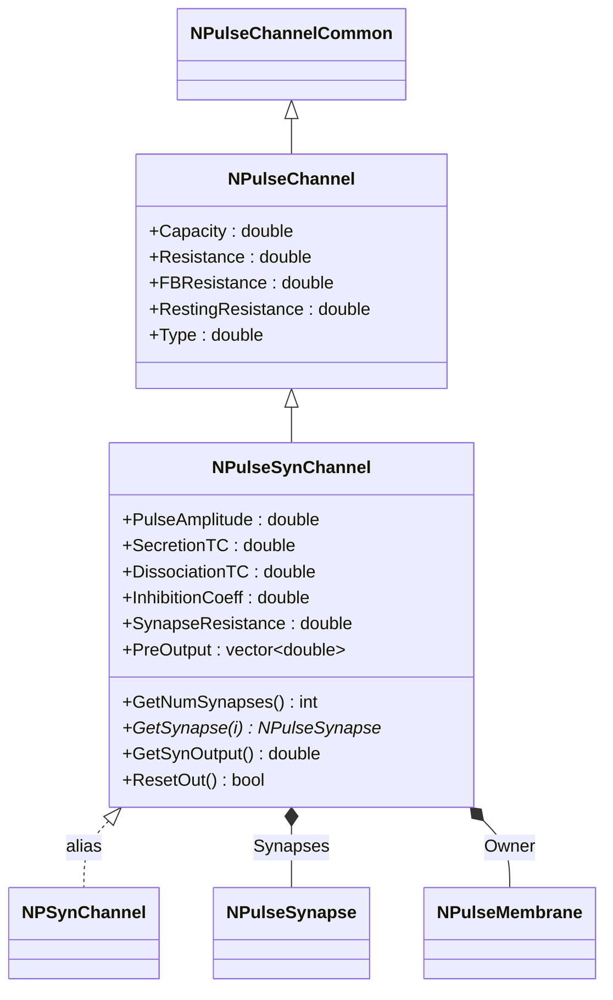
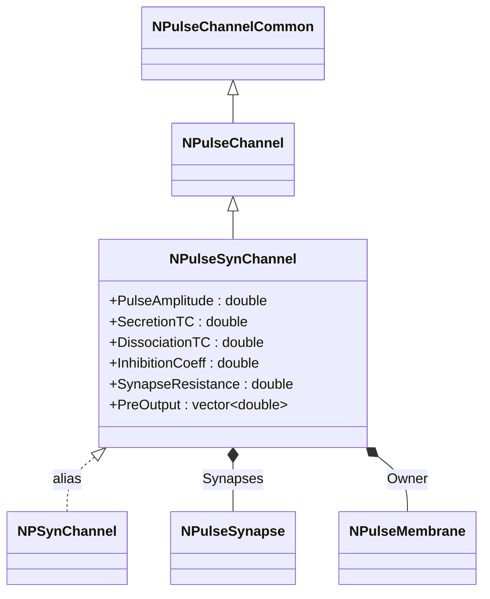
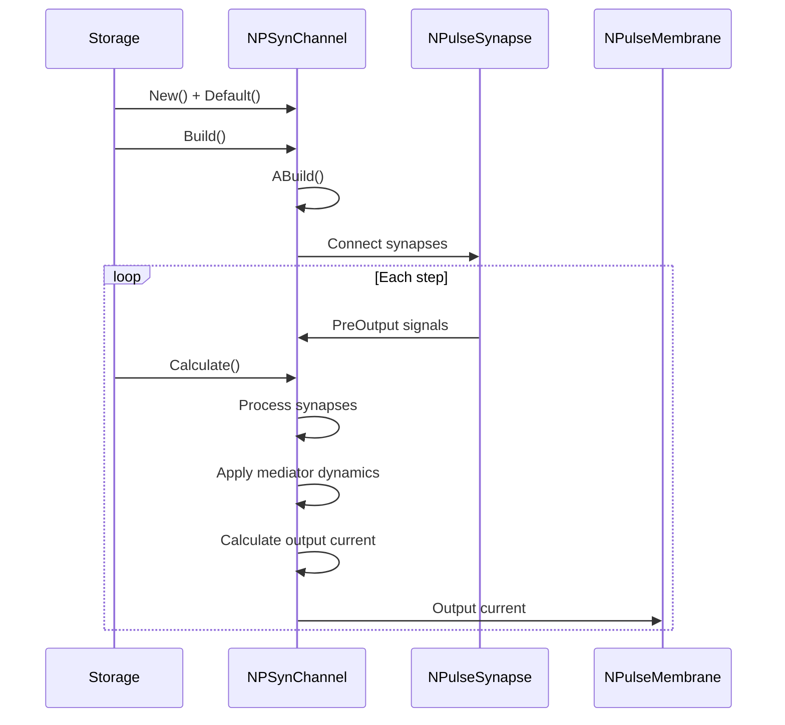
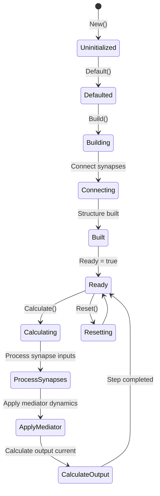
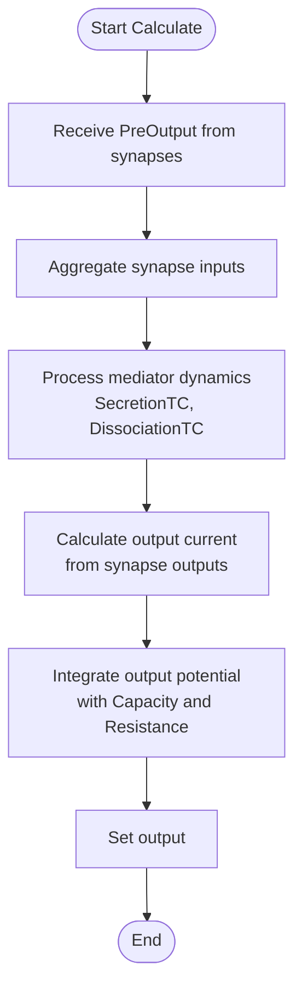
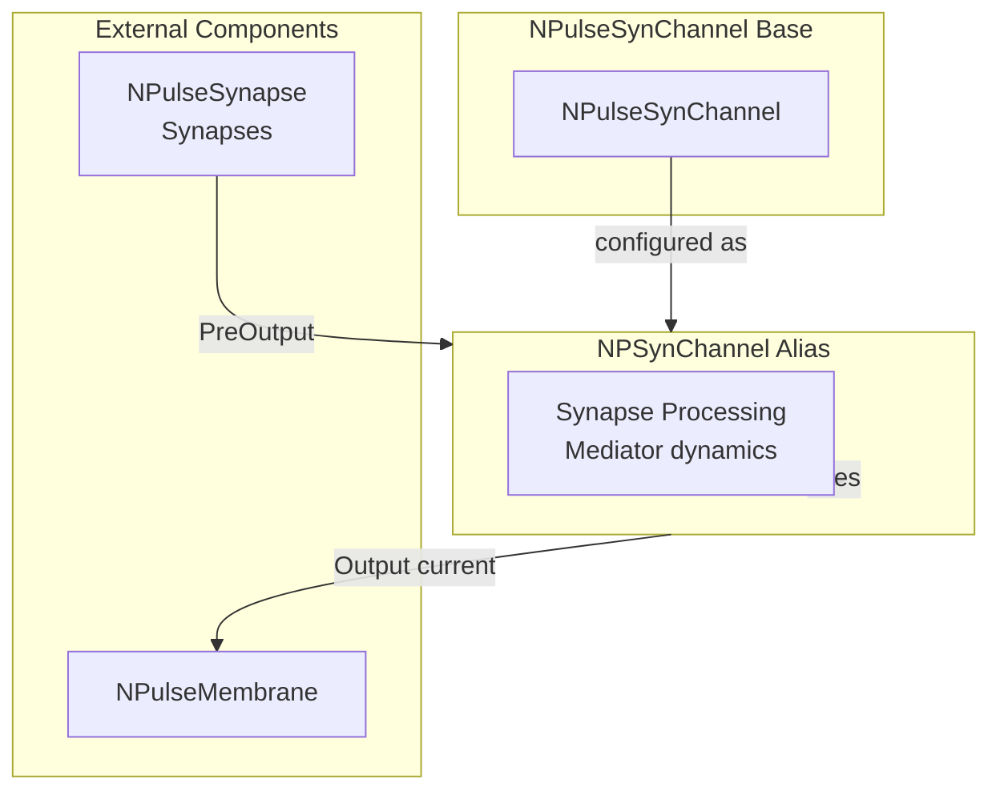

# NPSynChannel — синаптический импульсный канал

## RU

### Назначение

**Класс**: `NPSynChannel` — алиас для класса `NPulseSynChannel`.  
**Аббревиатура**: `Syn` — **Syn**apse (синапс).  
**Регистрация**: `NPulseLibrary.cpp` → `UploadClass("NPSynChannel", ...)`.  
**Storage-инстансы**: `ClassName = "NPSynChannel"` в `Bin/Configs/*/Model_*.xml`.

`NPSynChannel` является алиасом (синонимом) для класса `NPulseSynChannel`. При создании компонента с `ClassName = "NPSynChannel"` фактически создается экземпляр класса `NPulseSynChannel` с параметрами по умолчанию.

`NPulseSynChannel` реализует синаптический канал, который может содержать несколько синапсов и обрабатывает их выходы с учетом модели динамики медиатора. Канал суммирует токи от всех подключенных синапсов и интегрирует их с учетом емкости и сопротивления мембраны.

**Использование:** Упрощенное именование при конфигурации, обратная совместимость

### UML-диаграмма классов



**Иерархия наследования:**
- `NPulseChannelCommon` — общий импульсный канал
- `NPulseChannel` — базовый импульсный канал
- `NPulseSynChannel` — синаптический импульсный канал
- `NPSynChannel` — алиас для `NPulseSynChannel`

### Свойства

`NPSynChannel` использует все свойства класса `NPulseSynChannel` с параметрами по умолчанию.

**Параметры по умолчанию:**
- `PulseAmplitude = 1.0`
- `SecretionTC = 0.001` (1 мс)
- `DissociationTC = 0.01` (10 мс)
- `InhibitionCoeff = 0.0`
- `SynapseResistance = 1.0e8` (100 МОм)
- `Capacity = 1.0e-9` (1 нФ)
- `Resistance = 1.0e7` (10 МОм)
- `FBResistance = 1.0e8` (100 МОм)

### Методы

`NPSynChannel` использует все методы класса `NPulseSynChannel`.

### Примеры использования

#### Пример 1: Создание канала в коде C++

```cpp
// Создание синаптического канала через алиас
auto channel = storage->CreateComponent("NPSynChannel");
channel->SetName("SynChannel");

// Инициализация (использует параметры по умолчанию)
channel->Default();

// Использование
channel->Build();
```

#### Пример 2: Конфигурация XML

```xml
<Channel1 Class="NPSynChannel">
    <Parameters>
        <Type>0</Type>
        <Capacity>1.0e-9</Capacity>
        <Resistance>1.0e7</Resistance>
        <FBResistance>1.0e8</FBResistance>
        <PulseAmplitude>1.0</PulseAmplitude>
        <SecretionTC>0.001</SecretionTC>
        <DissociationTC>0.01</DissociationTC>
        <SynapseResistance>1.0e8</SynapseResistance>
    </Parameters>
</Channel1>
```

### Использование в конфигурациях

`NPSynChannel` используется как упрощенное имя для `NPulseSynChannel`:

- Упрощенное именование в конфигурациях
- Обратная совместимость со старыми конфигурациями
- Стандартные параметры по умолчанию

### См. также

- [`NPulseSynChannel`](NPulseSynChannel.md) — синаптический импульсный канал (базовый класс)
- [`NPulseChannel`](NPulseChannel.md) — базовый импульсный канал
- [`NPSynExcChannel`](NPSynExcChannel.md) — возбуждающий синаптический канал
- [`NPSynInhChannel`](NPSynInhChannel.md) — тормозной синаптический канал
- [`NPulseSynapse`](NPulseSynapse.md) — импульсный синапс
- [Architecture.md](../Architecture.md) — архитектура библиотеки

---

## EN

### Purpose

**Class**: `NPSynChannel` — alias for `NPulseSynChannel` class.  
**Registration**: `NPulseLibrary.cpp` → `UploadClass("NPSynChannel", ...)`.  
**Instances**: `ClassName = "NPSynChannel"` in `Bin/Configs/*/Model_*.xml`.

`NPSynChannel` is an alias (synonym) for the `NPulseSynChannel` class. When creating a component with `ClassName = "NPSynChannel"`, an instance of `NPulseSynChannel` with default parameters is actually created.

**Usage:** Simplified naming in configurations, backward compatibility

### UML Class Diagram



### UML Sequence Diagram



### UML State Diagram



### UML Activity Diagram



### UML Component Diagram



### Properties

`NPSynChannel` uses all properties of `NPulseSynChannel` class with default parameters:

**Default parameters:**
- `PulseAmplitude = 1.0`
- `SecretionTC = 0.001` (1 ms)
- `DissociationTC = 0.01` (10 ms)
- `InhibitionCoeff = 0.0`
- `SynapseResistance = 1.0e8` (100 MΩ)
- `Capacity = 1.0e-9` (1 nF)
- `Resistance = 1.0e7` (10 MΩ)
- `FBResistance = 1.0e8` (100 MΩ)

**Features:**
- Mediator dynamics: Uses secretion and dissociation time constants
- Multiple synapses: Can contain multiple synapses
- Membrane integration: Integrates currents with membrane capacity and resistance

### Methods

`NPSynChannel` uses all methods of `NPulseSynChannel` class:
- `GetNumSynapses()` → `int` — get number of connected synapses
- `GetSynapse(i)` → `NPulseSynapse*` — get synapse by index
- `GetSynOutput()` → `double` — get total synaptic output
- `ResetOut()` → `bool` — reset output

### Usage in configurations

`NPSynChannel` is used as a simplified name for `NPulseSynChannel`:

- **Simplified naming**: Used in configurations for easier naming
- **Backward compatibility**: Maintains compatibility with older configurations
- **Standard defaults**: Uses standard default parameters

**Typical parameter values:**
- **SecretionTC**: 0.001 (1 ms time constant for mediator secretion)
- **DissociationTC**: 0.01 (10 ms time constant for mediator dissociation)
- **SynapseResistance**: 1.0e8 (100 MΩ resistance for synapse output calculation)

**Features:**
- Mediator model: Uses mediator dynamics for synapse processing
- Multiple synapses: Supports multiple synapses in one channel
- Membrane integration: Integrates currents with membrane parameters

### See Also

- [`NPulseSynChannel`](NPulseSynChannel.md) — synaptic spiking channel (base class)
- [`NPulseChannel`](NPulseChannel.md) — base spiking channel
- [`NPSynExcChannel`](NPSynExcChannel.md) — excitatory synaptic channel
- [`NPSynInhChannel`](NPSynInhChannel.md) — inhibitory synaptic channel
- [`NPulseSynapse`](NPulseSynapse.md) — spiking synapse
- [Architecture.md](../Architecture.md) — library architecture
