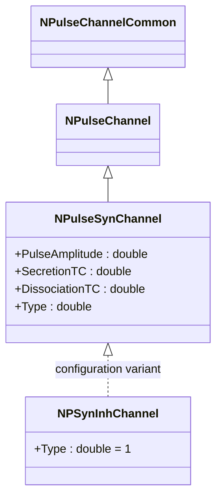
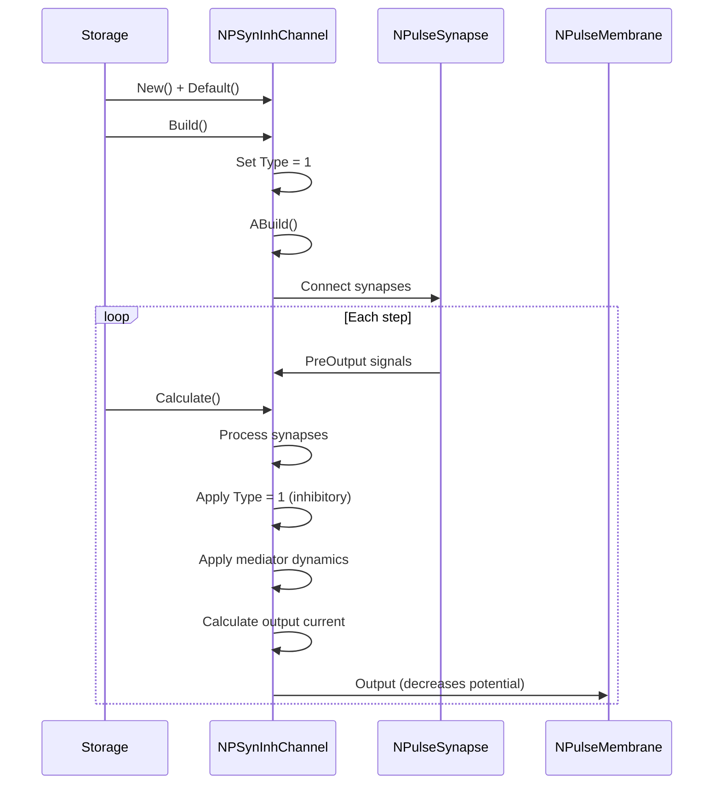
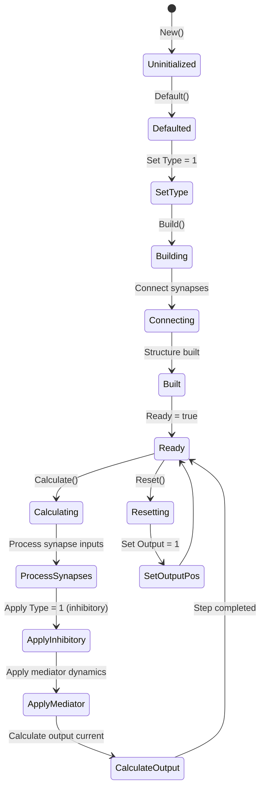
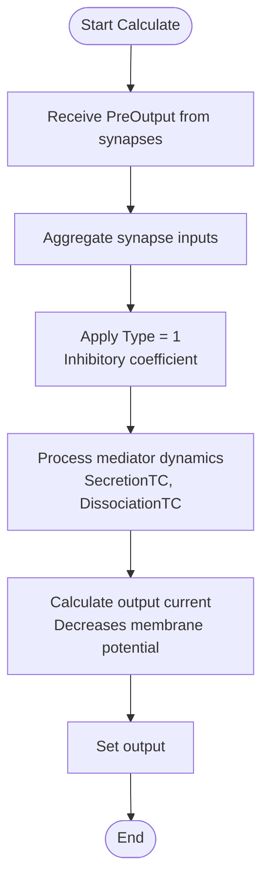
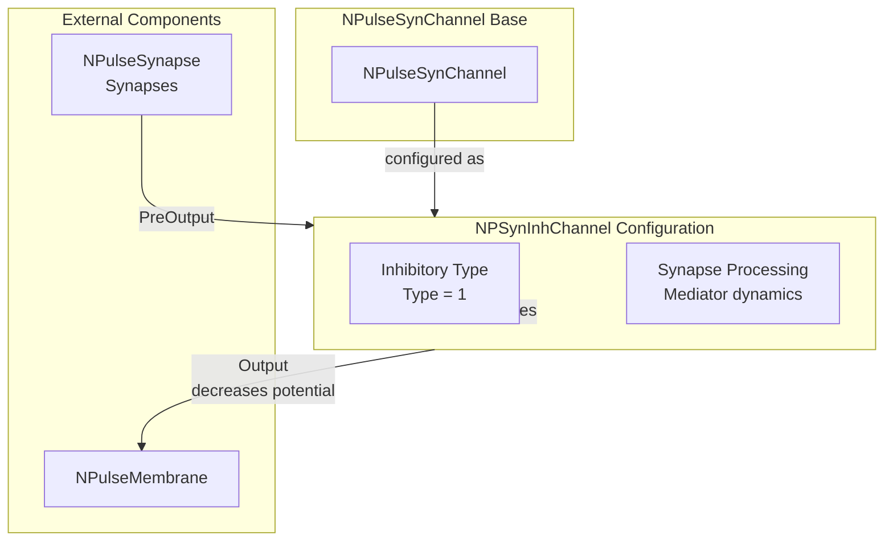

# NPSynInhChannel — тормозной синаптический импульсный канал

## RU

### Назначение

**Класс**: `NPSynInhChannel` — конфигурационный вариант синаптического импульсного канала с типом тормозного канала.  
**Аббревиатуры**: `Syn` — **Syn**apse (синапс); `Inh` — **Inh**ibitory (тормозной).  
**Регистрация**: `NPulseLibrary.cpp` → `UploadClass("NPSynInhChannel", ...)`.  
**Storage-инстансы**: `ClassName = "NPSynInhChannel"` в `Bin/Configs/*/Model_*.xml`.

`NPSynInhChannel` является конфигурационным вариантом базового класса `NPulseSynChannel` с предустановленным типом тормозного канала. Создается из `NPulseSynChannel` с настройкой:
- `Type = 1` — тормозной канал

Тормозной канал уменьшает потенциал мембраны при наличии входных сигналов от синапсов.

**Использование:** Моделирование тормозных синаптических каналов, обработка тормозных синапсов

### UML-диаграмма классов



**Иерархия наследования:**
- `NPulseChannelCommon` — общий импульсный канал
- `NPulseChannel` — базовый импульсный канал
- `NPulseSynChannel` — синаптический импульсный канал
- `NPSynInhChannel` — конфигурационный вариант для тормозного канала

### Свойства

`NPSynInhChannel` использует все свойства базового класса `NPulseSynChannel` с предустановленным значением:

**Параметры:**
- `Type = 1` — тормозной канал

**Остальные параметры по умолчанию:**
- `PulseAmplitude = 1.0`
- `SecretionTC = 0.001` (1 мс)
- `DissociationTC = 0.01` (10 мс)
- `SynapseResistance = 1.0e8` (100 МОм)
- `Capacity = 1.0e-9` (1 нФ)
- `Resistance = 1.0e7` (10 МОм)
- `FBResistance = 1.0e8` (100 МОм)

**Особенности:**
- При сбросе (`AReset()`) устанавливается `Output = 1` (для тормозного канала)
- В расчете используется логика для тормозных каналов (`Type > 0`)

### Методы

`NPSynInhChannel` использует все методы базового класса `NPulseSynChannel`.

### Примеры использования

#### Пример 1: Создание канала в коде C++

```cpp
// Создание тормозного синаптического канала
auto channel = storage->CreateComponent("NPSynInhChannel");
channel->SetName("InhSynChannel");

// Инициализация (использует Type = 1)
channel->Default();

// Использование
channel->Build();
```

#### Пример 2: Конфигурация XML

```xml
<Channel1 Class="NPSynInhChannel">
    <Parameters>
        <Type>1</Type>
        <Capacity>1.0e-9</Capacity>
        <Resistance>1.0e7</Resistance>
        <FBResistance>1.0e8</FBResistance>
        <PulseAmplitude>1.0</PulseAmplitude>
        <SecretionTC>0.001</SecretionTC>
        <DissociationTC>0.01</DissociationTC>
        <SynapseResistance>1.0e8</SynapseResistance>
    </Parameters>
</Channel1>
```

### Использование в конфигурациях

`NPSynInhChannel` используется в экспериментах с тормозными синаптическими каналами:

- Моделирование тормозных синаптических каналов
- Обработка тормозных синапсов
- Эксперименты с тормозной синаптической передачей

**Особенности:**
- Автоматически настроен как тормозной канал (`Type = 1`)
- Уменьшает потенциал мембраны при наличии входных сигналов
- Используется в составе тормозных мембран

## Источники

См. [Literature-References.md](../Literature-References.md): **[A]**, **4**, **25**, **29**.

### См. также

- [`NPulseSynChannel`](NPulseSynChannel.md) — синаптический импульсный канал (базовый класс)
- [`NPSynChannel`](NPSynChannel.md) — алиас для NPulseSynChannel
- [`NPSynExcChannel`](NPSynExcChannel.md) — возбуждающий синаптический канал
- [`NPulseChannel`](NPulseChannel.md) — базовый импульсный канал
- [`NPulseSynapse`](NPulseSynapse.md) — импульсный синапс
- [Architecture.md](../Architecture.md) — архитектура библиотеки

---

## EN

### Purpose

**Class**: `NPSynInhChannel` — configuration variant of synaptic spiking channel with inhibitory channel type.  
**Registration**: `NPulseLibrary.cpp` → `UploadClass("NPSynInhChannel", ...)`.  
**Instances**: `ClassName = "NPSynInhChannel"` in `Bin/Configs/*/Model_*.xml`.

`NPSynInhChannel` is a configuration variant of the base class `NPulseSynChannel` with preset inhibitory channel type. Created from `NPulseSynChannel` with setting:
- `Type = 1` — inhibitory channel

Inhibitory channel decreases membrane potential when input signals from synapses are present.

**Usage:** Modeling inhibitory synaptic channels, processing inhibitory synapses

### UML Class Diagram


### UML Sequence Diagram



### UML State Diagram



### UML Activity Diagram



### UML Component Diagram



### Properties

`NPSynInhChannel` uses all properties of base class `NPulseSynChannel` with preset value:

**Parameters:**
- `Type = 1` — inhibitory channel

**Other default parameters:**
- `PulseAmplitude = 1.0`
- `SecretionTC = 0.001` (1 ms)
- `DissociationTC = 0.01` (10 ms)
- `SynapseResistance = 1.0e8` (100 MΩ)
- `Capacity = 1.0e-9` (1 nF)
- `Resistance = 1.0e7` (10 MΩ)
- `FBResistance = 1.0e8` (100 MΩ)

**Features:**
- On reset (`AReset()`), `Output = 1` is set (for inhibitory channel)
- Uses logic for inhibitory channels (`Type > 0`)

### Methods

`NPSynInhChannel` uses all methods of base class `NPulseSynChannel`.

### Usage in configurations

`NPSynInhChannel` is used in experiments with inhibitory synaptic channels:

- **Inhibitory channels**: Modeling inhibitory synaptic channels
- **Inhibitory synapses**: Processing inhibitory synapses
- **Inhibitory transmission**: Experiments with inhibitory synaptic transmission

**Features:**
- Automatically configured as inhibitory channel (`Type = 1`)
- Decreases membrane potential when input signals are present
- Used in inhibitory membranes

**Typical parameter values:**
- **Type**: 1 (inhibitory channel type)
- **SecretionTC**: 0.001 (1 ms time constant)
- **DissociationTC**: 0.01 (10 ms time constant)

### References

See [Literature-References.md](../Literature-References.md): **[A]**, **4**, **25**, **29**.

### See Also

- [`NPulseSynChannel`](NPulseSynChannel.md) — synaptic spiking channel (base class)
- [`NPSynChannel`](NPSynChannel.md) — alias for NPulseSynChannel
- [`NPSynExcChannel`](NPSynExcChannel.md) — excitatory synaptic channel
- [`NPulseChannel`](NPulseChannel.md) — base spiking channel
- [`NPulseSynapse`](NPulseSynapse.md) — spiking synapse
- [Architecture.md](../Architecture.md) — library architecture

