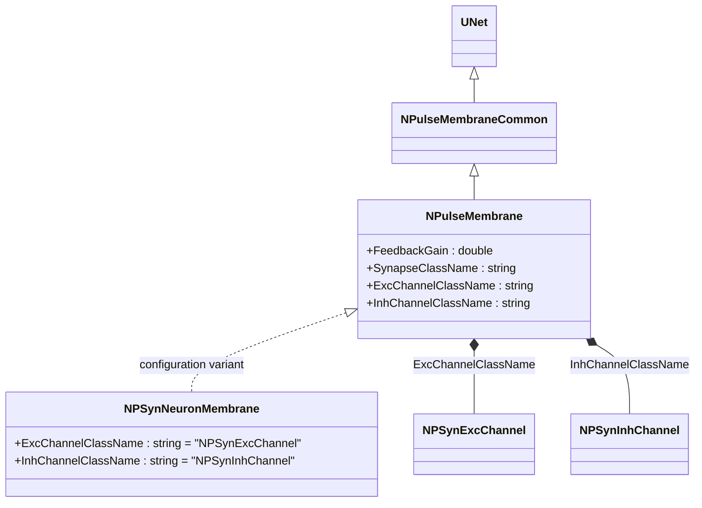
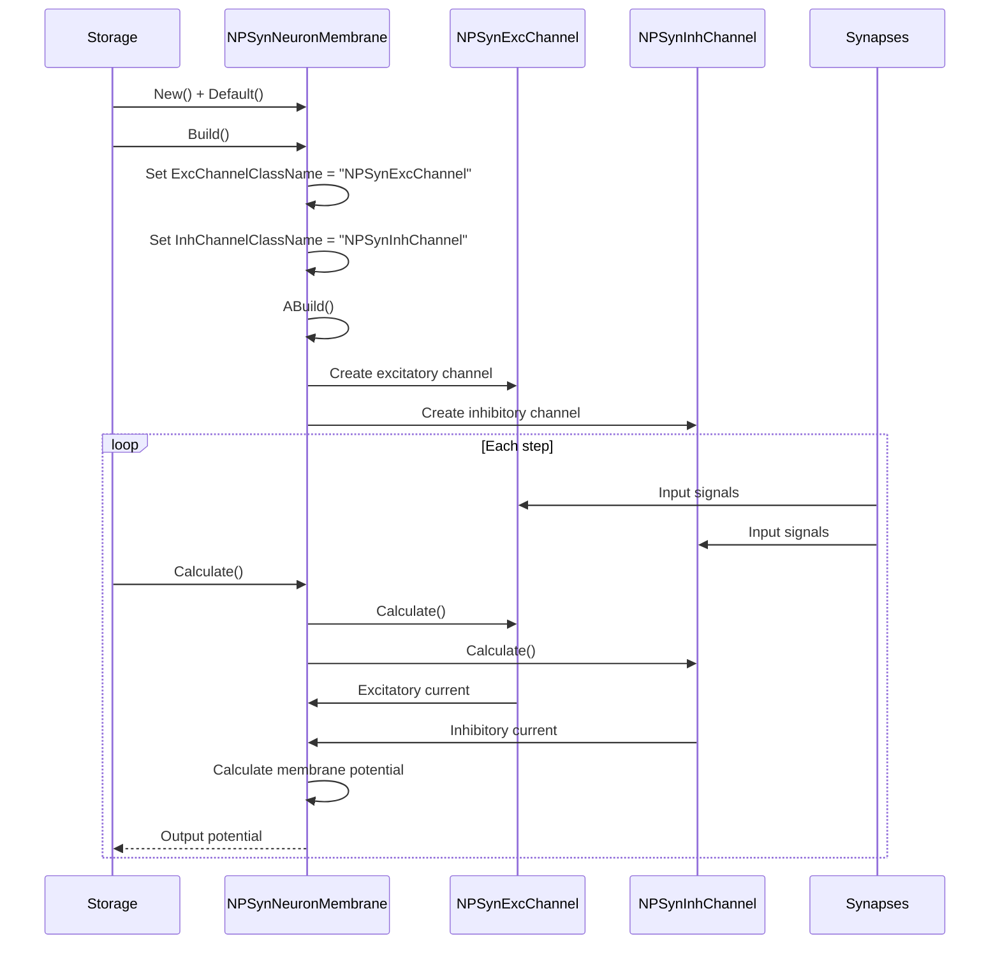
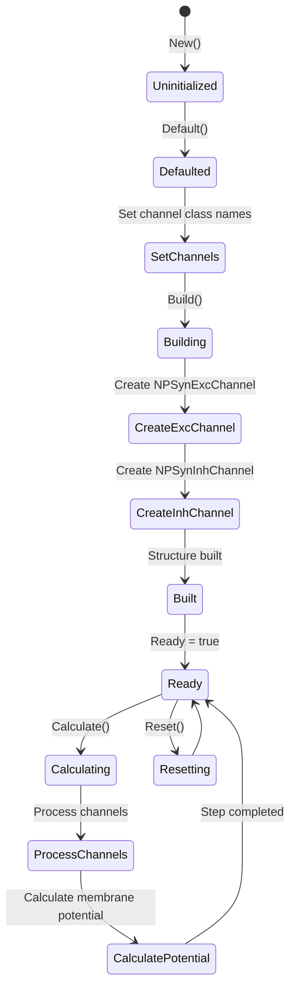
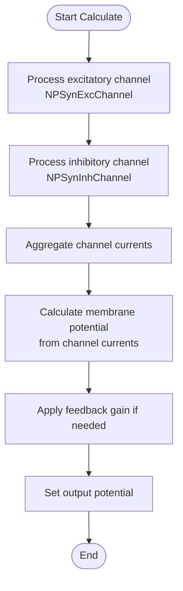
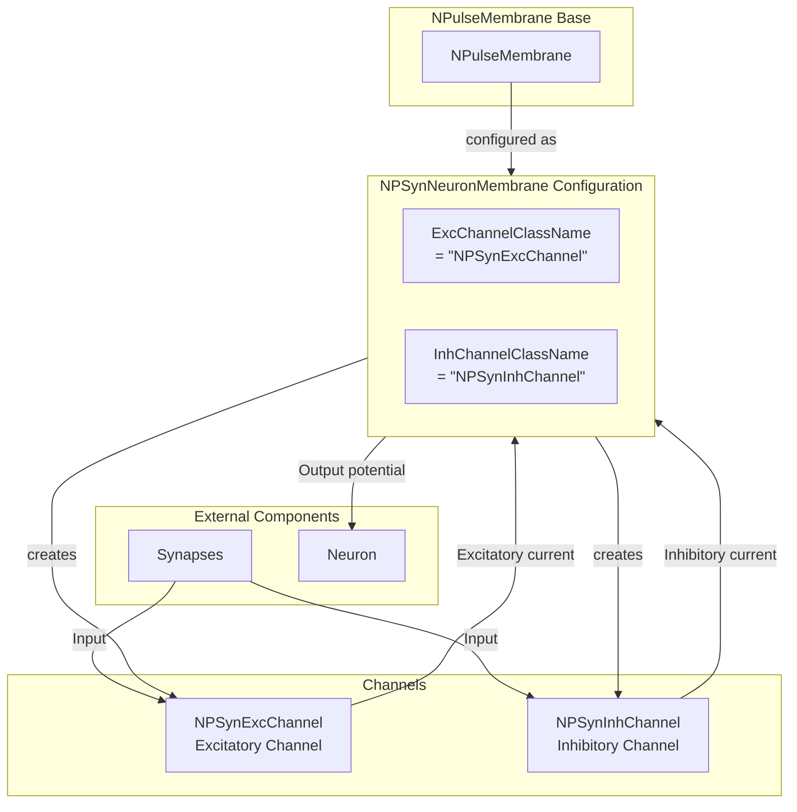

# NPSynNeuronMembrane — мембрана для syn-нейронов (импульсная)

## RU

### Назначение

**Класс**: `NPSynNeuronMembrane` — конфигурационный вариант импульсной мембраны для syn-нейронов (импульсных нейронов с синаптическими каналами).  
**Аббревиатура**: `Syn` — **Syn**apse (синапс).  
**Регистрация**: `NPulseLibrary.cpp` → `UploadClass("NPSynNeuronMembrane", ...)`.  
**Storage-инстансы**: `ClassName = "NPSynNeuronMembrane"` в `Bin/Configs/*/Model_*.xml`.

`NPSynNeuronMembrane` является конфигурационным вариантом класса `NPulseMembrane` с параметрами для syn-нейронов. При создании компонента с `ClassName = "NPSynNeuronMembrane"` создается экземпляр `NPulseMembrane` с параметрами:
- `ExcChannelClassName = "NPSynExcChannel"` — возбуждающий синаптический канал
- `InhChannelClassName = "NPSynInhChannel"` — тормозной синаптический канал

**Использование:** Мембрана для syn-нейронов, импульсные нейроны с синаптическими каналами

### UML-диаграмма классов



**Иерархия наследования:**
- `UNet` — базовая сеть Rdk Framework
- `NPulseMembraneCommon` — общая импульсная мембрана
- `NPulseMembrane` — базовая импульсная мембрана
- `NPSynNeuronMembrane` — конфигурационный вариант для syn-нейронов

**Параметры конфигурации:**
- `ExcChannelClassName = "NPSynExcChannel"` — возбуждающий синаптический канал
- `InhChannelClassName = "NPSynInhChannel"` — тормозной синаптический канал

### Свойства

`NPSynNeuronMembrane` использует все свойства базового класса `NPulseMembrane` с параметрами:
- `ExcChannelClassName = "NPSynExcChannel"`
- `InhChannelClassName = "NPSynInhChannel"`

### Методы

`NPSynNeuronMembrane` использует все методы базового класса `NPulseMembrane`.

### Примеры использования

#### Пример 1: Создание мембраны в коде C++

```cpp
// Создание мембраны для syn-нейрона
auto membrane = storage->CreateComponent("NPSynNeuronMembrane");
membrane->SetName("PMembrane");

// Инициализация (использует параметры по умолчанию)
membrane->Default();

// Использование
membrane->Build();
```

## Источники

См. [Literature-References.md](../Literature-References.md): **[A]**, **4**, **25**, **29**.

### См. также

- [`NPulseMembrane`](NPulseMembrane.md) — базовая импульсная мембрана (базовый класс)
- [`NCSynNeuronMembrane`](NCSynNeuronMembrane.md) — мембрана для непрерывных syn-нейронов
- [`NPSynExcChannel`](NPSynExcChannel.md) — возбуждающий синаптический канал
- [`NPSynInhChannel`](NPSynInhChannel.md) — тормозной синаптический канал
- [Architecture.md](../Architecture.md) — архитектура библиотеки

---

## EN

### Purpose

**Class**: `NPSynNeuronMembrane` — configuration variant of spiking membrane for syn-neurons (spiking neurons with synaptic channels).  
**Registration**: `NPulseLibrary.cpp` → `UploadClass("NPSynNeuronMembrane", ...)`.  
**Instances**: `ClassName = "NPSynNeuronMembrane"` in `Bin/Configs/*/Model_*.xml`.

`NPSynNeuronMembrane` is a configuration variant of `NPulseMembrane` class with parameters for syn-neurons. When creating a component with `ClassName = "NPSynNeuronMembrane"`, an instance of `NPulseMembrane` is created with parameters:
- `ExcChannelClassName = "NPSynExcChannel"` — excitatory synaptic channel
- `InhChannelClassName = "NPSynInhChannel"` — inhibitory synaptic channel

**Usage:** Membrane for syn-neurons, spiking neurons with synaptic channels

### UML Class Diagram


### UML Sequence Diagram



### UML State Diagram



### UML Activity Diagram



### UML Component Diagram



### Properties

`NPSynNeuronMembrane` uses all properties of base class `NPulseMembrane` with parameters:
- `ExcChannelClassName = "NPSynExcChannel"` — excitatory synaptic channel
- `InhChannelClassName = "NPSynInhChannel"` — inhibitory synaptic channel

**Configuration parameters:**
- `ExcChannelClassName = "NPSynExcChannel"` — preset excitatory channel class name
- `InhChannelClassName = "NPSynInhChannel"` — preset inhibitory channel class name

### Methods

`NPSynNeuronMembrane` uses all methods of base class `NPulseMembrane`.

### Usage in configurations

`NPSynNeuronMembrane` is used in experiments with syn-neurons:

- **Syn-neurons**: Spiking neurons with synaptic channels
- **Spiking models**: Used in spiking neural network models

**Features:**
- Automatically configured with synaptic channels (`NPSynExcChannel` and `NPSynInhChannel`)
- Simplified configuration: Channel class names are preset
- Spiking model: Optimized for spiking neuron models

**Typical parameter values:**
- **ExcChannelClassName**: "NPSynExcChannel" (excitatory synaptic channel)
- **InhChannelClassName**: "NPSynInhChannel" (inhibitory synaptic channel)

### References

See [Literature-References.md](../Literature-References.md): **[A]**, **4**, **25**, **29**.

### See Also

- [`NPulseMembrane`](NPulseMembrane.md) — base spiking membrane (base class)
- [`NCSynNeuronMembrane`](NCSynNeuronMembrane.md) — membrane for continuous syn-neurons
- [`NPSynExcChannel`](NPSynExcChannel.md) — excitatory synaptic channel
- [`NPSynInhChannel`](NPSynInhChannel.md) — inhibitory synaptic channel
- [Architecture.md](../Architecture.md) — library architecture
