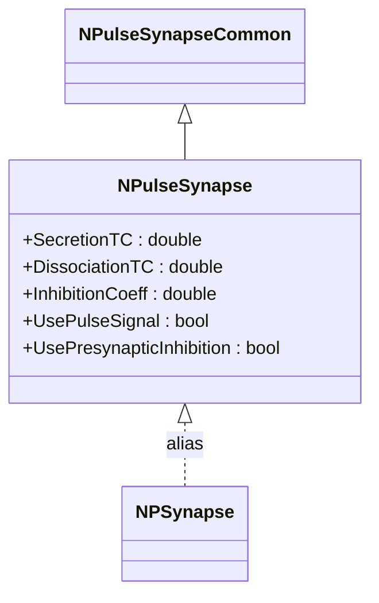
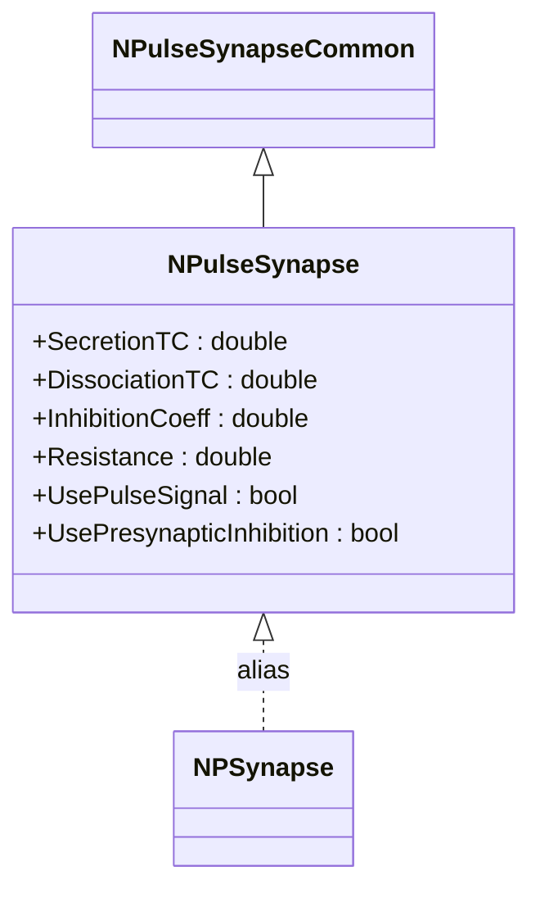
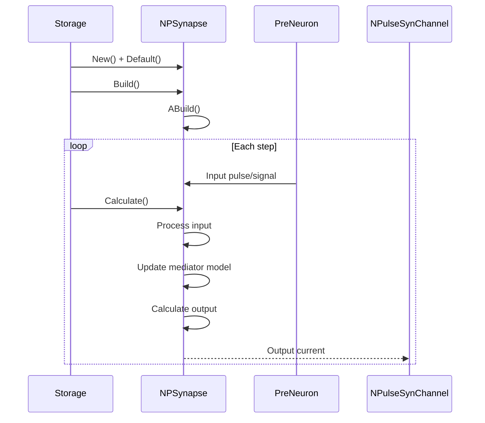
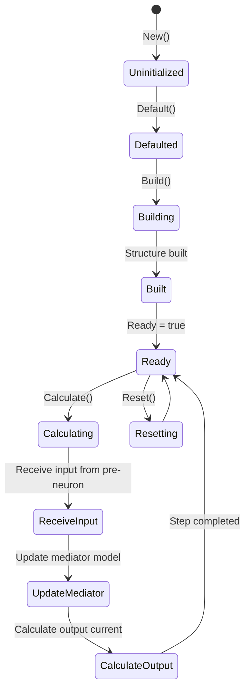
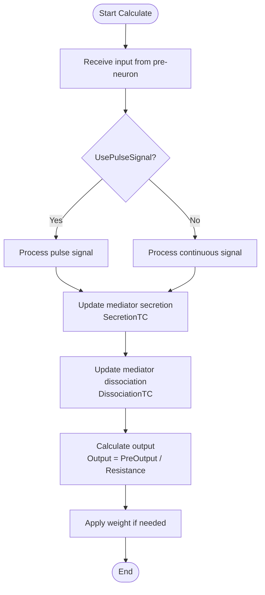
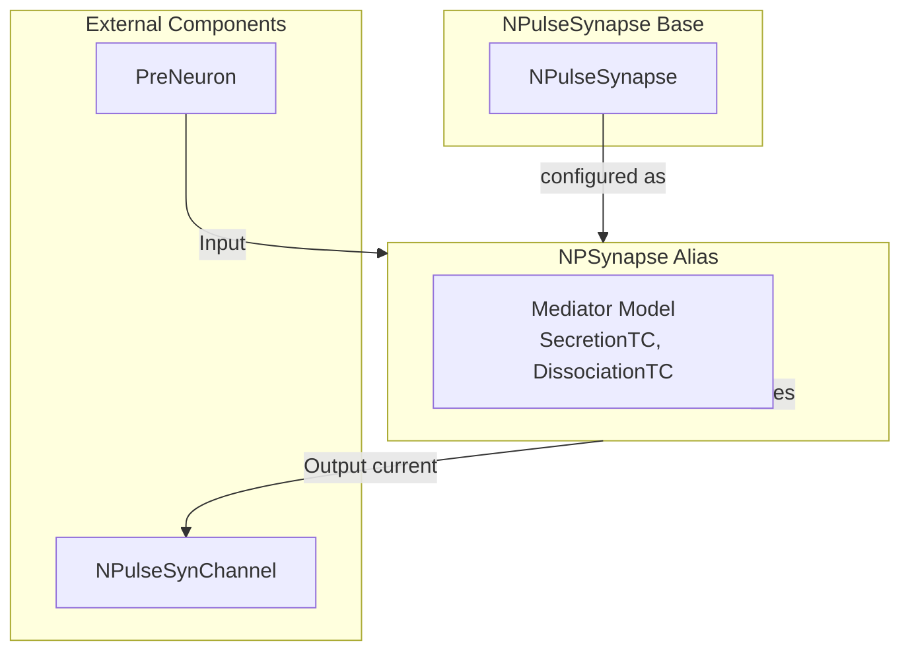

# NPSynapse — импульсный синапс (алиас)

## RU

### Назначение

**Класс**: `NPSynapse` — алиас для класса `NPulseSynapse`.  
**Регистрация**: `NPulseLibrary.cpp` → `UploadClass("NPSynapse", ...)`.  
**Storage-инстансы**: `ClassName = "NPSynapse"` в `Bin/Configs/*/Model_*.xml`.

`NPSynapse` является алиасом (синонимом) для класса `NPulseSynapse`. При создании компонента с `ClassName = "NPSynapse"` фактически создается экземпляр класса `NPulseSynapse` с параметрами по умолчанию.

**Использование:** Упрощенное именование при конфигурации, обратная совместимость

### UML-диаграмма классов



**Иерархия наследования:**
- `NPulseSynapseCommon` — общий импульсный синапс
- `NPulseSynapse` — импульсный синапс с моделью медиатора
- `NPSynapse` — алиас для `NPulseSynapse`

### Свойства

`NPSynapse` использует все свойства класса `NPulseSynapse` с параметрами по умолчанию.

**Параметры по умолчанию:**
- `SecretionTC = 0.001` (1 мс)
- `DissociationTC = 0.01` (10 мс)
- `Resistance = 1.0e9`
- `PulseAmplitude = 1.0`
- `UsePulseSignal = true`
- `UsePresynapticInhibition = false`

### Методы

`NPSynapse` использует все методы класса `NPulseSynapse`.

### Примеры использования

#### Пример 1: Создание синапса в коде C++

```cpp
// Создание синапса через алиас
auto synapse = storage->CreateComponent("NPSynapse");
synapse->SetName("PSynapse");

// Инициализация (использует параметры по умолчанию)
synapse->Default();

// Использование
synapse->Build();
for (int step = 0; step < 1000; step++) {
    synapse->Calculate();
}
```

#### Пример 2: Конфигурация XML

```xml
<Synapse1 Class="NPSynapse">
    <Parameters>
        <Type>1</Type>
        <PulseAmplitude>1.0</PulseAmplitude>
        <Resistance>1.0e9</Resistance>
        <Weight>1.0</Weight>
    </Parameters>
</Synapse1>
```

### Использование в конфигурациях

`NPSynapse` используется как упрощенное имя для `NPulseSynapse`:

- Упрощенное именование в конфигурациях
- Обратная совместимость со старыми конфигурациями
- Стандартные параметры по умолчанию

## Источники

См. [Literature-References.md](../Literature-References.md): **[A]**, **4**, **25**, **29**.

### См. также

- [`NPulseSynapse`](NPulseSynapse.md) — импульсный синапс с моделью медиатора
- [`NPulseSynapseCommon`](NPulseSynapseCommon.md) — общий импульсный синапс
- [`NPSynapseBio`](NPSynapseBio.md) — биоинспирированный вариант
- [`NPSynapseBio2`](NPSynapseBio2.md) — второй биоинспирированный вариант
- [Architecture.md](../Architecture.md) — архитектура библиотеки

---

## EN

### Purpose

**Class**: `NPSynapse` — alias for `NPulseSynapse` class.  
**Registration**: `NPulseLibrary.cpp` → `UploadClass("NPSynapse", ...)`.  
**Instances**: `ClassName = "NPSynapse"` in `Bin/Configs/*/Model_*.xml`.

`NPSynapse` is an alias (synonym) for the `NPulseSynapse` class. When creating a component with `ClassName = "NPSynapse"`, an instance of `NPulseSynapse` with default parameters is actually created.

**Usage:** Simplified naming in configurations, backward compatibility

### UML Class Diagram



### UML Sequence Diagram



### UML State Diagram



### UML Activity Diagram



### UML Component Diagram



### Properties

`NPSynapse` uses all properties of `NPulseSynapse` class with default parameters:

**Default parameters:**
- `SecretionTC = 0.001` (1 ms)
- `DissociationTC = 0.01` (10 ms)
- `Resistance = 1.0e9` (1 GΩ)
- `PulseAmplitude = 1.0`
- `UsePulseSignal = true`
- `UsePresynapticInhibition = false`

**Features:**
- Mediator dynamics: Uses secretion and dissociation time constants
- Pulse signal support: Can process pulse signals or continuous signals
- Presynaptic inhibition: Optional presynaptic inhibition support

### Methods

`NPSynapse` uses all methods of `NPulseSynapse` class.

### Usage in configurations

`NPSynapse` is used as a simplified name for `NPulseSynapse`:

- **Simplified naming**: Used in configurations for easier naming
- **Backward compatibility**: Maintains compatibility with older configurations
- **Standard defaults**: Uses standard default parameters

**Typical parameter values:**
- **SecretionTC**: 0.001 (1 ms time constant for mediator secretion)
- **DissociationTC**: 0.01 (10 ms time constant for mediator dissociation)
- **Resistance**: 1.0e9 (1 GΩ resistance for synapse output calculation)

**Features:**
- Mediator model: Uses mediator dynamics for synapse processing
- Pulse signal: Supports pulse signal processing
- Standard parameters: Uses standard default parameters

### References

See [Literature-References.md](../Literature-References.md): **[A]**, **4**, **25**, **29**.

### See Also

- [`NPulseSynapse`](NPulseSynapse.md) — spiking synapse with neurotransmitter model
- [`NPulseSynapseCommon`](NPulseSynapseCommon.md) — common spiking synapse
- [`NPSynapseBio`](NPSynapseBio.md) — bio-inspired variant
- [`NPSynapseBio2`](NPSynapseBio2.md) — second bio-inspired variant
- [Architecture.md](../Architecture.md) — library architecture

