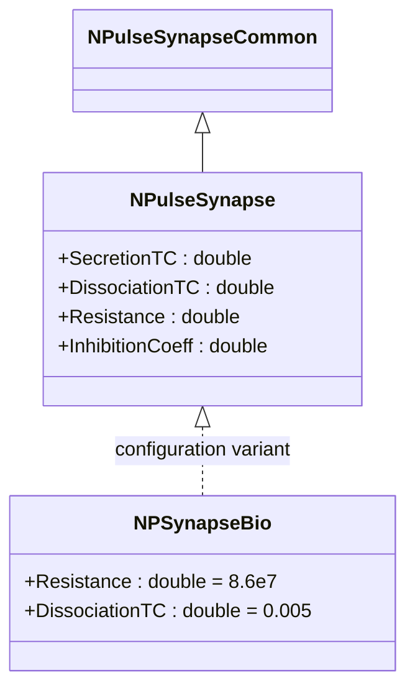
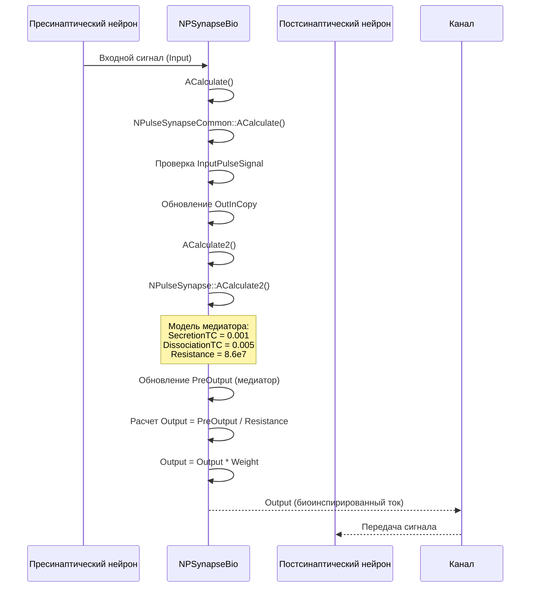
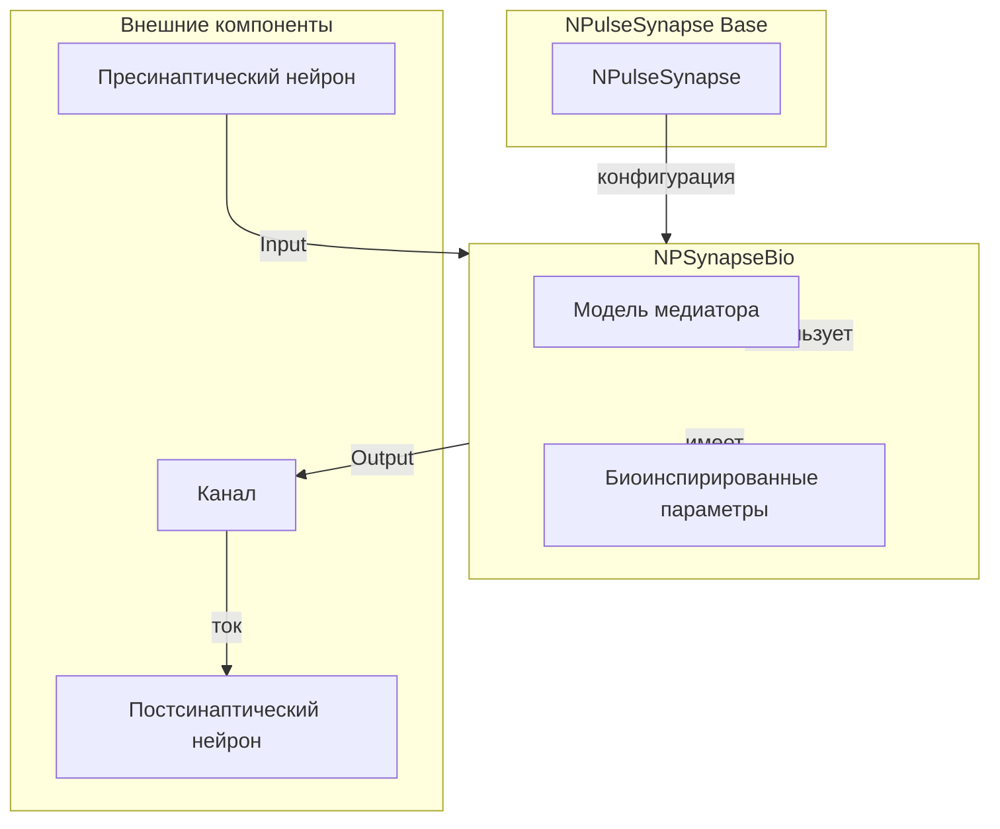
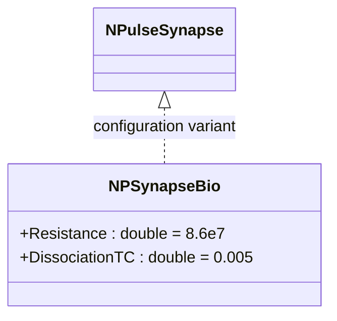
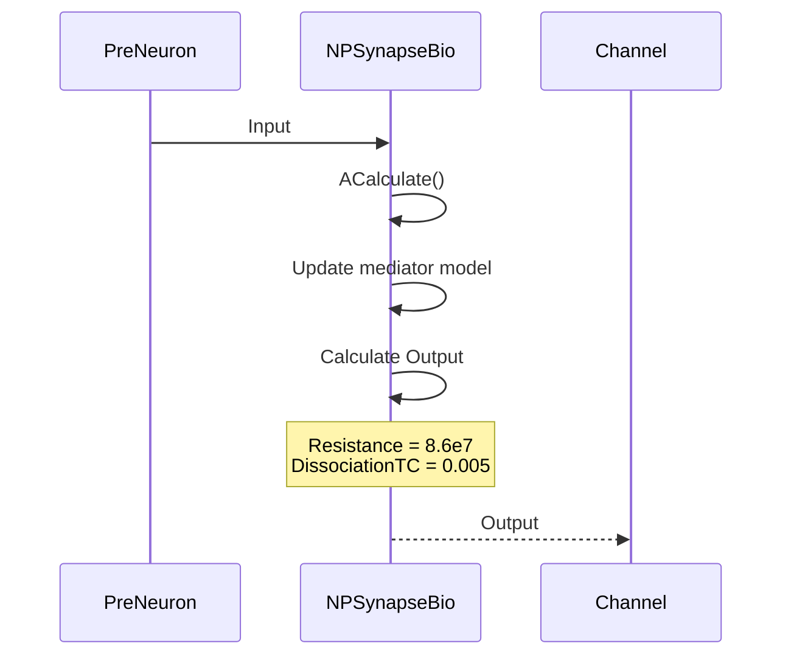
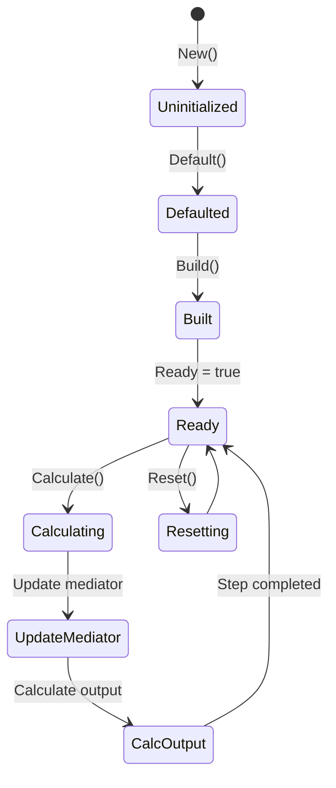
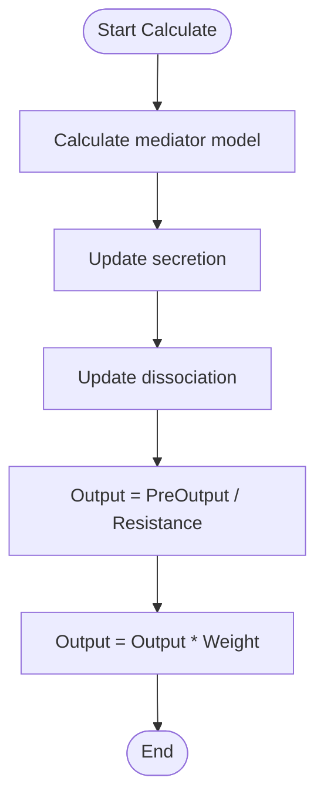

# NPSynapseBio — биоинспирированный импульсный синапс

## RU

### Назначение

**Класс**: `NPSynapseBio` — конфигурационный вариант импульсного синапса с биоинспирированными параметрами.  
**Регистрация**: `NPulseLibrary.cpp` → `UploadClass("NPSynapseBio", ...)`.  
**Storage-инстансы**: `ClassName = "NPSynapseBio"` в `Bin/Configs/*/Model_*.xml`.

`NPSynapseBio` является конфигурационным вариантом базового класса `NPulseSynapse` с предустановленными биоинспирированными параметрами. Создается из `NPulseSynapse` с настройками:
- `Resistance = 2e7 * 4.3` (86 МОм) — сопротивление синапса
- `DissociationTC = 0.005` (5 мс) — постоянная времени распада медиатора

Эти параметры соответствуют биологически реалистичным значениям для синаптической передачи.

**Использование:** Моделирование биологически реалистичных синапсов, эксперименты с биоинспирированными параметрами

### UML-диаграмма классов



**Иерархия наследования:**
- `NPulseSynapseCommon` — общий импульсный синапс
- `NPulseSynapse` — импульсный синапс с моделью медиатора
- `NPSynapseBio` — конфигурационный вариант с биоинспирированными параметрами

**Биоинспирированные параметры:**
- `Resistance = 8.6e7` (86 МОм) — биологически реалистичное сопротивление синапса
- `DissociationTC = 0.005` (5 мс) — постоянная времени распада медиатора

### UML-диаграмма последовательности



**Жизненный цикл:**
1. **Инициализация**: Установка биоинспирированных параметров (Resistance = 8.6e7, DissociationTC = 0.005)
2. **Расчет медиатора**: Моделирование динамики медиатора с биологическими параметрами
3. **Расчет тока**: Расчет выходного тока с учетом сопротивления
4. **Применение веса**: Умножение выходного сигнала на вес синапса

### UML-диаграмма состояний

```mermaid
stateDiagram-v2
    [*] --> Uninitialized: New()
    Uninitialized --> Defaulted: Default()
    Note over Defaulted: Resistance = 8.6e7<br/>DissociationTC = 0.005
    Defaulted --> Built: Build()
    Built --> Ready: Ready = true
    Ready --> Calculating: Calculate()
    Calculating --> CheckInput: Проверка Input
    CheckInput --> UpdateMediator: Обновление модели медиатора
    UpdateMediator --> CalcOutput: Расчет Output
    CalcOutput --> ApplyWeight: Применение Weight
    ApplyWeight --> Ready: Шаг завершен
    Ready --> Resetting: Reset()
    Resetting --> Ready: Состояния сброшены
```

**Состояния:**
- **Uninitialized** — создан, но не инициализирован
- **Defaulted** — биоинспирированные параметры установлены по умолчанию
- **Built** — структура синапса построена
- **Ready** — готов к обработке сигналов
- **Calculating** — обработка входного сигнала
- **CheckInput** — проверка наличия входного сигнала
- **UpdateMediator** — обновление модели медиатора (секреция и распад)
- **CalcOutput** — расчет выходного тока с учетом сопротивления
- **ApplyWeight** — применение веса к выходному сигналу
- **Resetting** — выполняется сброс состояний

### UML-диаграмма активности

```mermaid
flowchart TD
    Start([Start Calculate]) --> CheckInput{Input > 0?}
    CheckInput -->|Да| SetPulseSignal[InputPulseSignal = true]
    CheckInput -->|Нет| CheckPulseTemp{PulseSignalTemp?}
    SetPulseSignal --> SetPulseTemp[PulseSignalTemp = true]
    CheckPulseTemp -->|Да| ClearPulseTemp[PulseSignalTemp = false]
    CheckPulseTemp -->|Нет| CopyInput
    SetPulseTemp --> CopyInput[OutInCopy = Input]
    ClearPulseTemp --> CopyInput
    CopyInput --> CalcMediator[Расчет модели медиатора]
    CalcMediator --> UpdateSecretion[Обновление секреции медиатора]
    Note over UpdateSecretion: PreOutput += (Input - PreOutput) / SecretionTC
    UpdateSecretion --> UpdateDissociation[Обновление распада медиатора]
    Note over UpdateDissociation: PreOutput -= PreOutput / DissociationTC<br/>DissociationTC = 0.005
    UpdateDissociation --> CalcOutput[Output = PreOutput / Resistance]
    Note over CalcOutput: Resistance = 8.6e7 (86 МОм)
    CalcOutput --> ApplyWeight[Output = Output * Weight]
    ApplyWeight --> ClearPulseSignal[InputPulseSignal = false]
    ClearPulseSignal --> End([End])
```

**Алгоритм расчета:**
1. Проверка входного сигнала и установка флагов импульса
2. Копирование входного сигнала в `OutInCopy`
3. Обновление модели медиатора:
   - Секреция: `PreOutput += (Input - PreOutput) / SecretionTC`
   - Распад: `PreOutput -= PreOutput / DissociationTC` (где `DissociationTC = 0.005`)
4. Расчет выходного тока: `Output = PreOutput / Resistance` (где `Resistance = 8.6e7`)
5. Применение веса: `Output = Output * Weight`
6. Сброс флага `InputPulseSignal`

### UML-диаграмма компонентов



**Зависимости:**
- **Базовый класс**: `NPulseSynapse` (конфигурационный вариант)
- **Внешние компоненты**: пресинаптический нейрон (источник `Input`), постсинаптический нейрон (получатель через канал), канал (получатель `Output`)

### Свойства

`NPSynapseBio` использует все свойства базового класса `NPulseSynapse` с предустановленными биоинспирированными значениями:

**Параметры:**
- `Resistance = 8.6e7` (86 МОм) — сопротивление синапса, соответствующее биологическим значениям
- `DissociationTC = 0.005` (5 мс) — постоянная времени распада медиатора

**Остальные параметры по умолчанию:**
- `SecretionTC = 0.001` (1 мс)
- `PulseAmplitude = 1.0`
- `UsePulseSignal = true`
- `UsePresynapticInhibition = false`
- `InhibitionCoeff = 0.0`

### Методы

`NPSynapseBio` использует все методы базового класса `NPulseSynapse`.

### Примеры использования

#### Пример 1: Создание синапса в коде C++

```cpp
// Создание биоинспирированного синапса
auto synapse = storage->CreateComponent("NPSynapseBio");
synapse->SetName("BioSynapse");

// Инициализация (использует биоинспирированные параметры)
synapse->Default();

// Использование
synapse->Build();
for (int step = 0; step < 1000; step++) {
    synapse->Calculate();
    double output = synapse->Output(0, 0);
    std::cout << "Step " << step << ": Output = " << output << std::endl;
}
```

#### Пример 2: Конфигурация XML

```xml
<Synapse1 Class="NPSynapseBio">
    <Parameters>
        <Type>1</Type>
        <PulseAmplitude>1.0</PulseAmplitude>
        <Resistance>8.6e7</Resistance>
        <Weight>1.0</Weight>
        <SecretionTC>0.001</SecretionTC>
        <DissociationTC>0.005</DissociationTC>
    </Parameters>
</Synapse1>
```

### Использование в конфигурациях

`NPSynapseBio` используется в экспериментах с биологически реалистичными параметрами:

- Моделирование синаптической передачи с биологическими параметрами
- Сравнение различных моделей синапсов
- Изучение влияния параметров на синаптическую передачу

**Особенности:**
- Использует биологически реалистичные значения сопротивления и постоянной времени распада
- Подходит для моделирования реальных синапсов
- Параметры оптимизированы для биологической точности

### Использование в конфигурациях

`NPSynapseBio` используется в экспериментах с биологически реалистичными параметрами:

- **Когнитивная навигация**: `Bin/Configs/User/CognitiveNavigation/*/Model_*.xml`
- **Биоинспирированные модели**: Эксперименты с биологически реалистичными синапсами

**Типичные значения параметров:**
- **Resistance**: 8.6e7 (86 МОм) — биологически реалистичное сопротивление
- **DissociationTC**: 0.005 (5 мс) — постоянная времени распада медиатора
- **SecretionTC**: 0.001 (1 мс) — постоянная времени секреции медиатора

## Источники

См. [Literature-References.md](../Literature-References.md): **26**, **29**, **30**.

### См. также

- [`NPulseSynapse`](NPulseSynapse.md) — импульсный синапс с моделью медиатора
- [`NPSynapse`](NPSynapse.md) — базовый импульсный синапс
- [`NPSynapseBio2`](NPSynapseBio2.md) — второй биоинспирированный вариант
- [`NPulseSynapseCommon`](NPulseSynapseCommon.md) — общий импульсный синапс
- [`NPulseSynapseStdp`](NPulseSynapseStdp.md) — импульсный синапс с STDP
- [Architecture.md](../Architecture.md) — архитектура библиотеки
- [Scientific-Background.md](../Scientific-Background.md) — научный фон (синаптическая передача)

---

## EN

### Purpose

**Class**: `NPSynapseBio` — configuration variant of spiking synapse with bio-inspired parameters.  
**Registration**: `NPulseLibrary.cpp` → `UploadClass("NPSynapseBio", ...)`.  
**Instances**: `ClassName = "NPSynapseBio"` in `Bin/Configs/*/Model_*.xml`.

`NPSynapseBio` is a configuration variant of the base class `NPulseSynapse` with preset bio-inspired parameters. Created from `NPulseSynapse` with settings:
- `Resistance = 2e7 * 4.3` (86 MΩ) — synapse resistance
- `DissociationTC = 0.005` (5 ms) — neurotransmitter dissociation time constant

These parameters correspond to biologically realistic values for synaptic transmission.

**Usage:** Modeling biologically realistic synapses, experiments with bio-inspired parameters

### UML Class Diagram



### UML Sequence Diagram



### UML State Diagram



### UML Activity Diagram



### References

See [Literature-References.md](../Literature-References.md): **26**, **29**, **30**.

### See Also

- [`NPulseSynapse`](NPulseSynapse.md) — spiking synapse with neurotransmitter model
- [`NPSynapse`](NPSynapse.md) — base spiking synapse
- [`NPSynapseBio2`](NPSynapseBio2.md) — second bio-inspired variant
- [`NPulseSynapseCommon`](NPulseSynapseCommon.md) — common spiking synapse
- [`NPulseSynapseStdp`](NPulseSynapseStdp.md) — spiking synapse with STDP
- [Architecture.md](../Architecture.md) — library architecture

