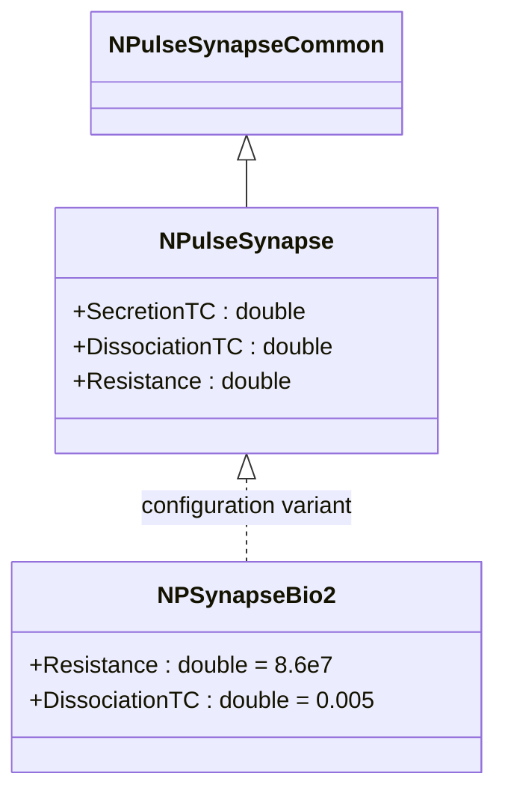
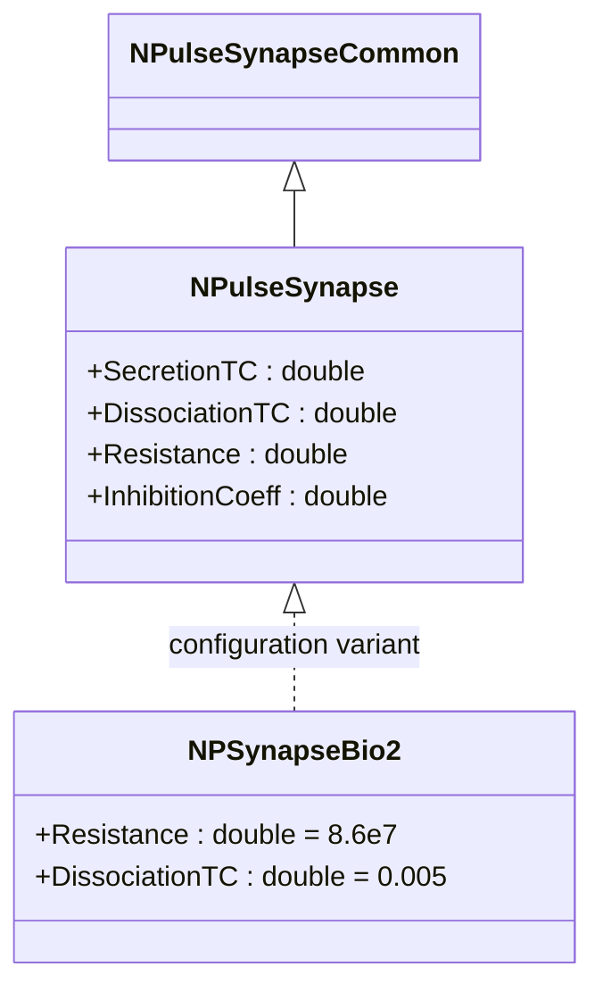
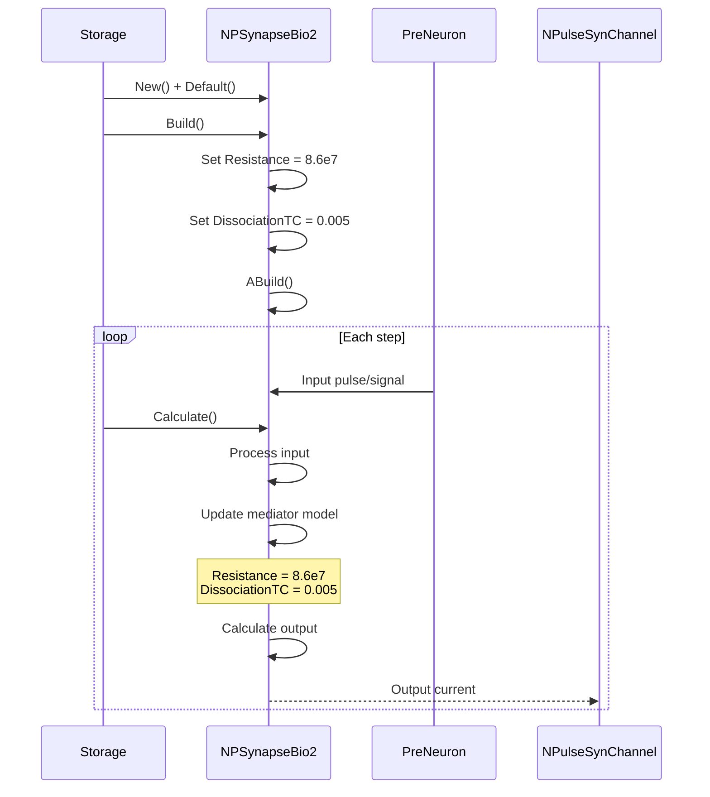
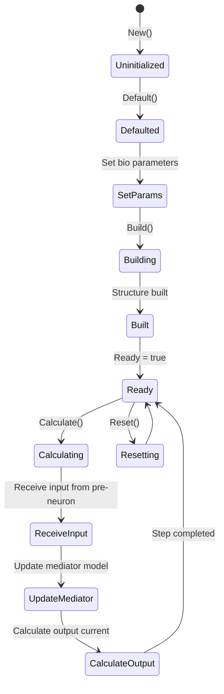
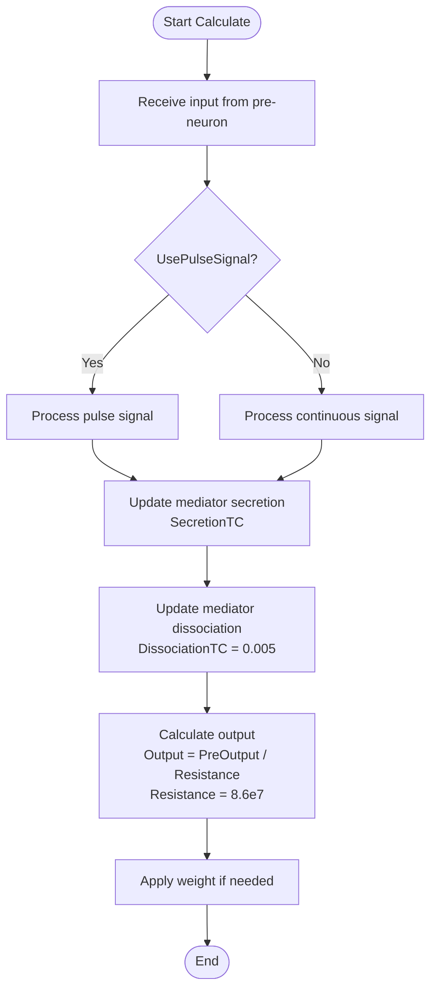
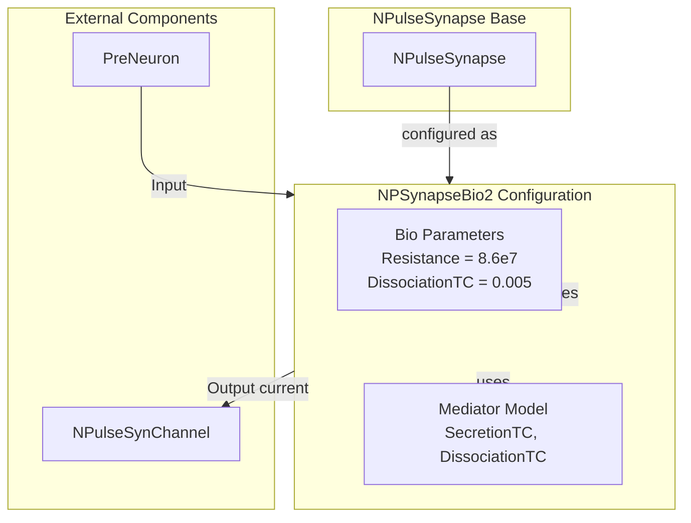

# NPSynapseBio2 — второй биоинспирированный импульсный синапс

## RU

### Назначение

**Класс**: `NPSynapseBio2` — конфигурационный вариант импульсного синапса с альтернативными биоинспирированными параметрами.  
**Аббревиатура**: `Bio` — **Bio**logical (биологическая модель).  
**Регистрация**: `NPulseLibrary.cpp` → `UploadClass("NPSynapseBio2", ...)`.  
**Storage-инстансы**: `ClassName = "NPSynapseBio2"` в `Bin/Configs/*/Model_*.xml`.

`NPSynapseBio2` является конфигурационным вариантом базового класса `NPulseSynapse` с предустановленными альтернативными биоинспирированными параметрами. Создается из `NPulseSynapse` с настройками:
- `Resistance = 86000000` (86 МОм) — сопротивление синапса
- `DissociationTC = 0.005` (5 мс) — постоянная времени распада медиатора

Отличие от `NPSynapseBio` заключается в способе задания сопротивления (прямое значение вместо вычисления).

**Использование:** Моделирование биологически реалистичных синапсов с альтернативными параметрами

### UML-диаграмма классов



**Иерархия наследования:**
- `NPulseSynapseCommon` — общий импульсный синапс
- `NPulseSynapse` — импульсный синапс с моделью медиатора
- `NPSynapseBio2` — конфигурационный вариант с альтернативными биоинспирированными параметрами

### Свойства

`NPSynapseBio2` использует все свойства базового класса `NPulseSynapse` с предустановленными биоинспирированными значениями:

**Параметры:**
- `Resistance = 86000000` (86 МОм) — сопротивление синапса
- `DissociationTC = 0.005` (5 мс) — постоянная времени распада медиатора

**Остальные параметры по умолчанию:**
- `SecretionTC = 0.001` (1 мс)
- `PulseAmplitude = 1.0`
- `UsePulseSignal = true`
- `UsePresynapticInhibition = false`
- `InhibitionCoeff = 0.0`

### Методы

`NPSynapseBio2` использует все методы базового класса `NPulseSynapse`.

### Примеры использования

#### Пример 1: Создание синапса в коде C++

```cpp
// Создание второго биоинспирированного синапса
auto synapse = storage->CreateComponent("NPSynapseBio2");
synapse->SetName("BioSynapse2");

// Инициализация (использует биоинспирированные параметры)
synapse->Default();

// Использование
synapse->Build();
for (int step = 0; step < 1000; step++) {
    synapse->Calculate();
}
```

#### Пример 2: Конфигурация XML

```xml
<Synapse1 Class="NPSynapseBio2">
    <Parameters>
        <Type>1</Type>
        <PulseAmplitude>1.0</PulseAmplitude>
        <Resistance>86000000</Resistance>
        <Weight>1.0</Weight>
        <SecretionTC>0.001</SecretionTC>
        <DissociationTC>0.005</DissociationTC>
    </Parameters>
</Synapse1>
```

### Использование в конфигурациях

`NPSynapseBio2` используется в экспериментах с альтернативными биологически реалистичными параметрами:

- Моделирование синаптической передачи с альтернативными параметрами
- Сравнение различных биоинспирированных вариантов
- Изучение влияния параметров на синаптическую передачу

**Особенности:**
- Использует биологически реалистичные значения сопротивления и постоянной времени распада
- Альтернативный вариант `NPSynapseBio` с теми же параметрами, но другим способом задания

## Источники

См. [Literature-References.md](../Literature-References.md): **26**, **29**, **30**.

### См. также

- [`NPulseSynapse`](NPulseSynapse.md) — импульсный синапс с моделью медиатора
- [`NPSynapse`](NPSynapse.md) — базовый импульсный синапс
- [`NPSynapseBio`](NPSynapseBio.md) — первый биоинспирированный вариант
- [`NPulseSynapseCommon`](NPulseSynapseCommon.md) — общий импульсный синапс
- [Architecture.md](../Architecture.md) — архитектура библиотеки
- [Scientific-Background.md](../Scientific-Background.md) — научный фон (синаптическая передача)

---

## EN

### Purpose

**Class**: `NPSynapseBio2` — configuration variant of spiking synapse with alternative bio-inspired parameters.  
**Registration**: `NPulseLibrary.cpp` → `UploadClass("NPSynapseBio2", ...)`.  
**Instances**: `ClassName = "NPSynapseBio2"` in `Bin/Configs/*/Model_*.xml`.

`NPSynapseBio2` is a configuration variant of the base class `NPulseSynapse` with preset alternative bio-inspired parameters. Created from `NPulseSynapse` with settings:
- `Resistance = 86000000` (86 MΩ) — synapse resistance
- `DissociationTC = 0.005` (5 ms) — neurotransmitter dissociation time constant

Difference from `NPSynapseBio` is the way resistance is set (direct value instead of calculation).

**Usage:** Modeling biologically realistic synapses with alternative parameters

### UML Class Diagram



### UML Sequence Diagram



### UML State Diagram



### UML Activity Diagram



### UML Component Diagram



### Properties

`NPSynapseBio2` uses all properties of base class `NPulseSynapse` with preset bio-inspired values:

**Configuration parameters:**
- `Resistance = 86000000` (86 MΩ) — synapse resistance
- `DissociationTC = 0.005` (5 ms) — neurotransmitter dissociation time constant

**Other default parameters:**
- `SecretionTC = 0.001` (1 ms)
- `PulseAmplitude = 1.0`
- `UsePulseSignal = true`
- `UsePresynapticInhibition = false`
- `InhibitionCoeff = 0.0`

**Features:**
- Bio-inspired parameters: Uses biologically realistic values
- Alternative variant: Same parameters as `NPSynapseBio`, but with direct value assignment

### Methods

`NPSynapseBio2` uses all methods of base class `NPulseSynapse`.

### Usage in configurations

`NPSynapseBio2` is used in experiments with alternative bio-inspired parameters:

- **Bio-inspired synapses**: `Bin/Configs/*/Model_*.xml` (where alternative bio parameters are required)
- **Parameter comparison**: Comparing different bio-inspired variants

**Features:**
- Bio-inspired parameters: Uses biologically realistic resistance and dissociation time constant
- Alternative variant: Alternative to `NPSynapseBio` with same parameters but different assignment method
- Mediator dynamics: Uses mediator model for synapse processing

**Typical parameter values:**
- **Resistance**: 86000000 (86 MΩ for bio-inspired models)
- **DissociationTC**: 0.005 (5 ms time constant)
- **SecretionTC**: 0.001 (1 ms time constant)

### References

See [Literature-References.md](../Literature-References.md): **26**, **29**, **30**.

### See Also

- [`NPulseSynapse`](NPulseSynapse.md) — spiking synapse with neurotransmitter model
- [`NPSynapse`](NPSynapse.md) — base spiking synapse
- [`NPSynapseBio`](NPSynapseBio.md) — first bio-inspired variant
- [`NPulseSynapseCommon`](NPulseSynapseCommon.md) — common spiking synapse
- [Architecture.md](../Architecture.md) — library architecture

