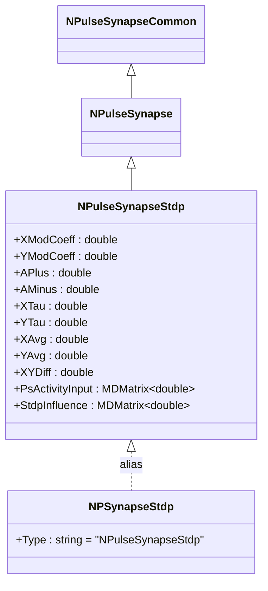
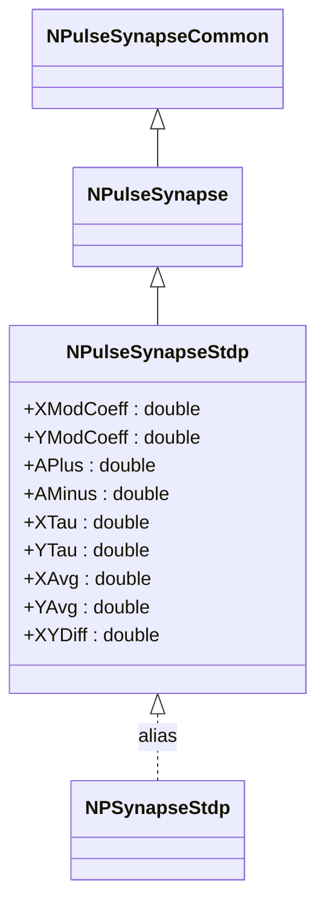
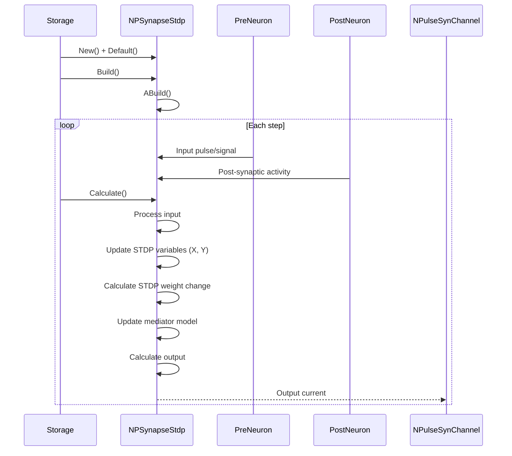
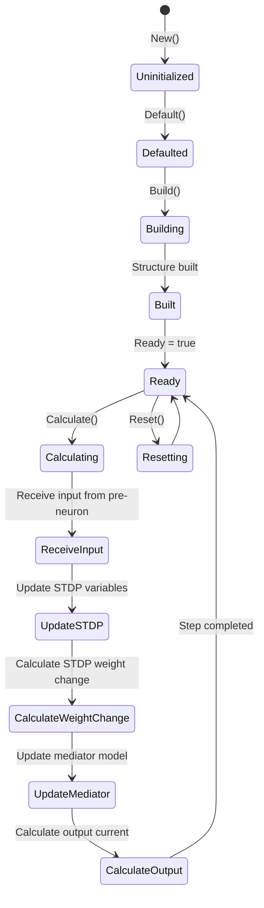
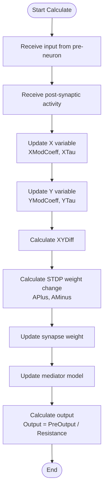
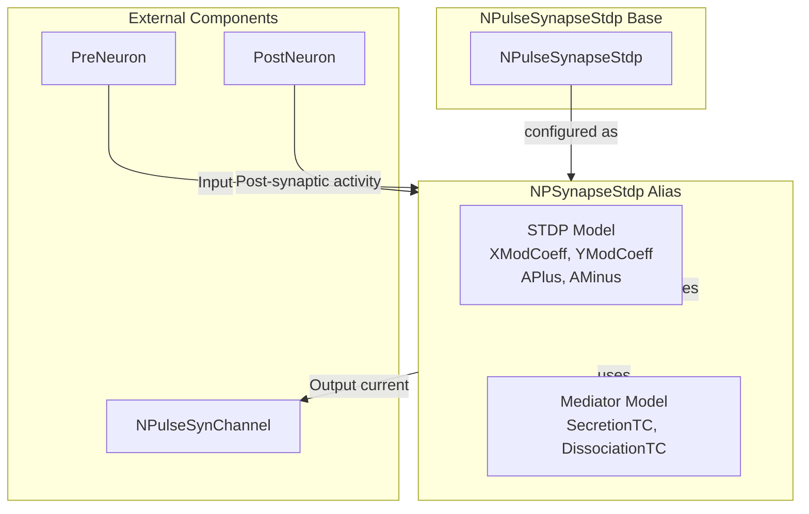

# NPSynapseStdp — импульсный STDP-синапс (алиас)

## RU

### Назначение

**Класс**: `NPSynapseStdp` — алиас для класса `NPulseSynapseStdp`.  
**Аббревиатура**: `STDP` — **S**pike-**T**iming **D**ependent **P**lasticity (пластичность, зависящая от времени спайков).  
**Регистрация**: `NPulseLibrary.cpp` → `UploadClass("NPSynapseStdp", ...)`.  
**Storage-инстансы**: `ClassName = "NPSynapseStdp"` в `Bin/Configs/*/Model_*.xml`.

`NPSynapseStdp` является алиасом (синонимом) для класса `NPulseSynapseStdp`. При создании компонента с `ClassName = "NPSynapseStdp"` фактически создается экземпляр класса `NPulseSynapseStdp` с параметрами по умолчанию.

**Использование:** Упрощенное именование при конфигурации, обратная совместимость

### UML-диаграмма классов



**Иерархия наследования:**
- `NPulseSynapseCommon` — общий импульсный синапс
- `NPulseSynapse` — импульсный синапс с моделью медиатора
- `NPulseSynapseStdp` — импульсный STDP-синапс с моделью медиатора
- `NPSynapseStdp` — алиас для `NPulseSynapseStdp`

### Свойства

`NPSynapseStdp` использует все свойства класса `NPulseSynapseStdp` с параметрами по умолчанию.

**Параметры по умолчанию:**
- `XModCoeff = 1.0`
- `YModCoeff = 1.0`
- `APlus = 1.0`
- `AMinus = 1.0`
- `XTau = 1e-2` (10 мс)
- `YTau = 1e-3` (1 мс)
- `SecretionTC = 0.001` (1 мс)
- `DissociationTC = 0.01` (10 мс)
- `Resistance = 1.0e9`

### Методы

`NPSynapseStdp` использует все методы класса `NPulseSynapseStdp`.

### Примеры использования

#### Пример 1: Создание STDP-синапса в коде C++

```cpp
// Создание STDP-синапса через алиас
auto synapse = storage->CreateComponent("NPSynapseStdp");
synapse->SetName("PSynapseStdp");

// Инициализация (использует параметры по умолчанию)
synapse->Default();

// Использование
synapse->Build();
for (int step = 0; step < 1000; step++) {
    synapse->Calculate();
}
```

#### Пример 2: Конфигурация XML

```xml
<Synapse1 Class="NPSynapseStdp">
    <Parameters>
        <Type>1</Type>
        <PulseAmplitude>1.0</PulseAmplitude>
        <Resistance>1.0e9</Resistance>
        <Weight>1.0</Weight>
        <XModCoeff>1.0</XModCoeff>
        <YModCoeff>1.0</YModCoeff>
        <APlus>0.01</APlus>
        <AMinus>0.012</AMinus>
        <XTau>0.02</XTau>
        <YTau>0.01</YTau>
    </Parameters>
</Synapse1>
```

### Использование в конфигурациях

`NPSynapseStdp` используется как упрощенное имя для `NPulseSynapseStdp`:

- Упрощенное именование в конфигурациях
- Обратная совместимость со старыми конфигурациями
- Стандартные параметры по умолчанию

## Источники

См. [Literature-References.md](../Literature-References.md): **[B]**.

### См. также

- [`NPulseSynapseStdp`](NPulseSynapseStdp.md) — импульсный STDP-синапс с моделью медиатора
- [`NSynapseStdp`](NSynapseStdp.md) — базовый STDP-синапс
- [`NPulseSynapse`](NPulseSynapse.md) — импульсный синапс с моделью медиатора
- [`NPulseSynapseCommon`](NPulseSynapseCommon.md) — общий импульсный синапс
- [Architecture.md](../Architecture.md) — архитектура библиотеки

---

## EN

### Purpose

**Class**: `NPSynapseStdp` — alias for `NPulseSynapseStdp` class.  
**Registration**: `NPulseLibrary.cpp` → `UploadClass("NPSynapseStdp", ...)`.  
**Instances**: `ClassName = "NPSynapseStdp"` in `Bin/Configs/*/Model_*.xml`.

`NPSynapseStdp` is an alias (synonym) for the `NPulseSynapseStdp` class. When creating a component with `ClassName = "NPSynapseStdp"`, an instance of `NPulseSynapseStdp` with default parameters is actually created.

**Usage:** Simplified naming in configurations, backward compatibility

### UML Class Diagram



### UML Sequence Diagram



### UML State Diagram



### UML Activity Diagram



### UML Component Diagram



### Properties

`NPSynapseStdp` uses all properties of `NPulseSynapseStdp` class with default parameters:

**Default parameters:**
- `XModCoeff = 1.0` — X modulation coefficient
- `YModCoeff = 1.0` — Y modulation coefficient
- `APlus = 1.0` — STDP potentiation coefficient
- `AMinus = 1.0` — STDP depression coefficient
- `XTau = 1e-2` (10 ms) — X time constant
- `YTau = 1e-3` (1 ms) — Y time constant
- `SecretionTC = 0.001` (1 ms)
- `DissociationTC = 0.01` (10 ms)
- `Resistance = 1.0e9` (1 GΩ)

**Features:**
- STDP learning: Implements spike-timing-dependent plasticity
- Mediator dynamics: Uses secretion and dissociation time constants
- Weight adaptation: Synapse weight changes based on spike timing

### Methods

`NPSynapseStdp` uses all methods of `NPulseSynapseStdp` class.

### Usage in configurations

`NPSynapseStdp` is used as a simplified name for `NPulseSynapseStdp`:

- **Simplified naming**: Used in configurations for easier naming
- **Backward compatibility**: Maintains compatibility with older configurations
- **STDP learning**: Implements spike-timing-dependent plasticity

**Typical parameter values:**
- **XModCoeff**: 1.0 (X modulation coefficient)
- **YModCoeff**: 1.0 (Y modulation coefficient)
- **APlus**: 0.01-0.1 (STDP potentiation coefficient)
- **AMinus**: 0.012-0.12 (STDP depression coefficient)
- **XTau**: 0.02 (20 ms time constant)
- **YTau**: 0.01 (10 ms time constant)

**Features:**
- STDP model: Uses spike-timing-dependent plasticity for weight adaptation
- Mediator model: Uses mediator dynamics for synapse processing
- Standard parameters: Uses standard default parameters

### References

See [Literature-References.md](../Literature-References.md): **[B]**.

### See Also

- [`NPulseSynapseStdp`](NPulseSynapseStdp.md) — spiking STDP synapse with neurotransmitter model
- [`NSynapseStdp`](NSynapseStdp.md) — base STDP synapse
- [`NPulseSynapse`](NPulseSynapse.md) — spiking synapse with neurotransmitter model
- [`NPulseSynapseCommon`](NPulseSynapseCommon.md) — common spiking synapse
- [Architecture.md](../Architecture.md) — library architecture
