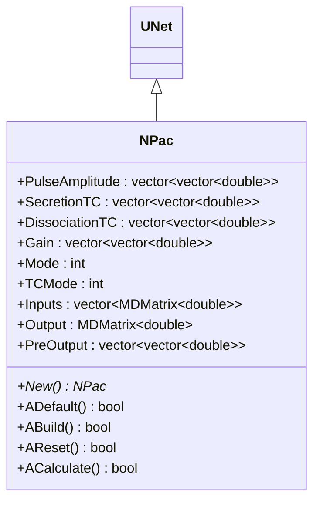
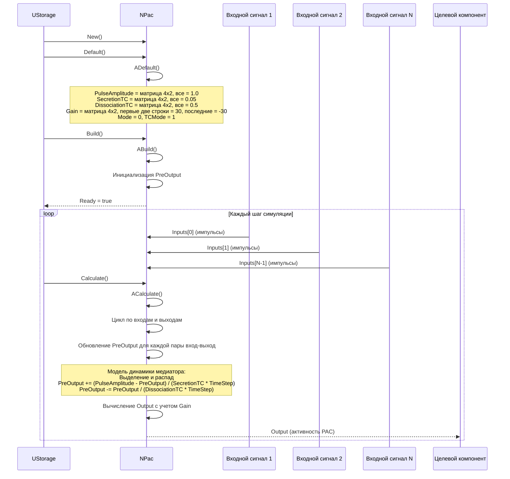
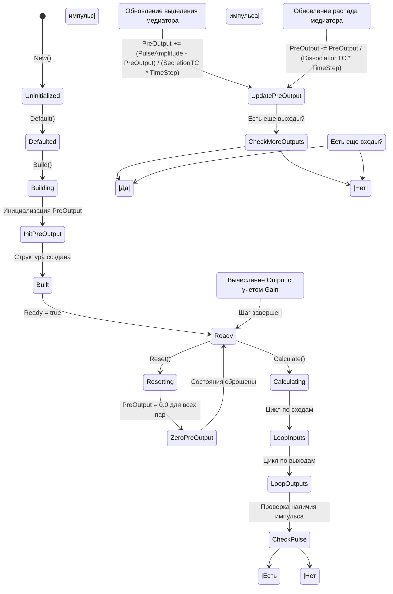
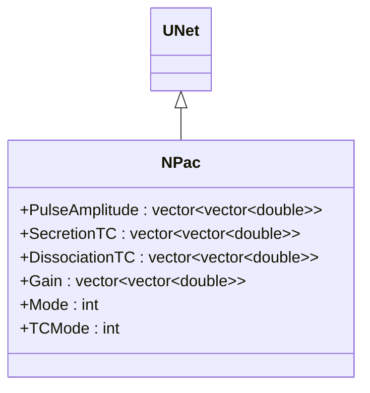
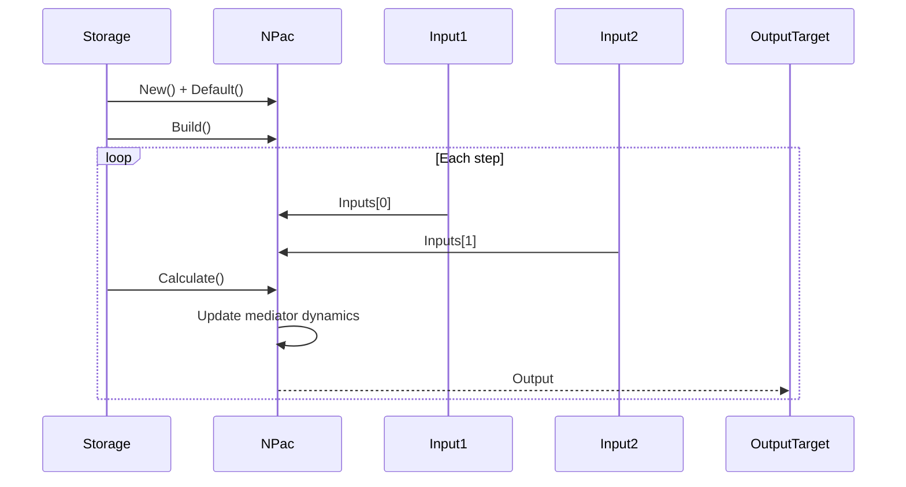
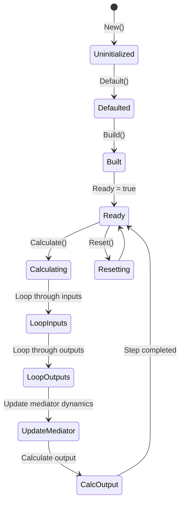
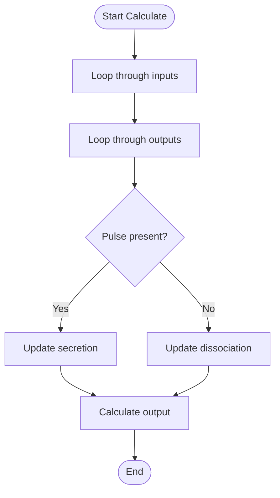

# NPac — PAC (Pulse Activity Counter)

## RU

### Назначение

**Класс**: `NPac` — компонент PAC (Pulse Activity Counter) для подсчета и активации на основе импульсов.  
**Регистрация**: `NPulseLibrary.cpp` → `UploadClass("NPac", ...)`.  
**Storage-инстансы**: `ClassName = "NPac"` в `Bin/Configs/*/Model_*.xml`.

`NPac` реализует компонент PAC, который обрабатывает входные импульсы с использованием модели динамики медиатора (выделение и распада) и выдает выходной сигнал с учетом усиления (`Gain`). Компонент может работать в различных режимах (`Mode`, `TCMode`) для обработки импульсов.

**Использование:** Подсчет активности импульсов, обработка импульсных сигналов

### UML-диаграмма классов



**Иерархия наследования:**
- `UNet` — базовая сеть Rdk Framework
- `NPac` — PAC компонент

### UML-диаграмма последовательности



**Жизненный цикл:**
1. **Инициализация**: Установка параметров по умолчанию (амплитуды импульсов, временные константы, коэффициенты усиления)
2. **Сброс**: Инициализация `PreOutput` (концентрация медиатора) нулевыми значениями
3. **Расчет**: Обновление концентрации медиатора для каждой пары вход-выход, вычисление выходного сигнала

### UML-диаграмма состояний



**Состояния:**
- **Uninitialized** — создан, но не инициализирован
- **Defaulted** — параметры установлены по умолчанию
- **Building** — выполняется сборка
- **InitPreOutput** — инициализация концентрации медиатора
- **Built** — структура PAC построена
- **Ready** — готов к выполнению расчетов
- **Resetting** — выполняется сброс
- **ZeroPreOutput** — обнуление концентрации медиатора
- **Calculating** — выполняется расчет PAC
- **LoopInputs** — цикл по входным сигналам
- **LoopOutputs** — цикл по выходным сигналам
- **CheckPulse** — проверка наличия импульса
- **UpdateSecretion** — обновление выделения медиатора
- **UpdateDissociation** — обновление распада медиатора
- **UpdatePreOutput** — обновление концентрации медиатора
- **CheckMoreOutputs** — проверка наличия еще выходов
- **CheckMoreInputs** — проверка наличия еще входов
- **CalcOutput** — вычисление выходного сигнала
- **Resetting** — выполняется сброс состояний

### UML-диаграмма активности

```mermaid
flowchart TD
    Start([Start Calculate]) --> LoopInputs[Цикл по входам input = 0..Inputs.size()-1]
    LoopInputs --> LoopOutputs[Цикл по выходам output = 0..num_outputs-1]
    LoopOutputs --> CheckPulse{Есть импульс на Inputs[input]?}
    CheckPulse -->|Да| UpdateSecretion[PreOutput[input][output] +=<br/>(PulseAmplitude[input][output] - PreOutput[input][output]) /<br/>(SecretionTC[input][output] * TimeStep)]
    CheckPulse -->|Нет| UpdateDissociation[PreOutput[input][output] -=<br/>PreOutput[input][output] /<br/>(DissociationTC[input][output] * TimeStep)]
    UpdateSecretion --> CheckMoreOutputs{Есть еще выходы?}
    UpdateDissociation --> CheckMoreOutputs
    CheckMoreOutputs -->|Да| LoopOutputs
    CheckMoreOutputs -->|Нет| CheckMoreInputs{Есть еще входы?}
    CheckMoreInputs -->|Да| LoopInputs
    CheckMoreInputs -->|Нет| CalcOutput[Вычисление Output с учетом Gain]
    CalcOutput --> End([End])
```

**Алгоритм расчета:**
1. Цикл по всем парам вход-выход
2. Для каждой пары:
   - Если есть импульс на входе: обновление выделения медиатора `PreOutput += (PulseAmplitude - PreOutput) / (SecretionTC * TimeStep)`
   - Если нет импульса: обновление распада медиатора `PreOutput -= PreOutput / (DissociationTC * TimeStep)`
3. Вычисление выходного сигнала с учетом коэффициентов усиления: `Output = sum(PreOutput[input][output] * Gain[input][output])`

### UML-диаграмма компонентов

```mermaid
graph TB
    subgraph UNet["UNet Base"]
        BaseNet[UNet]
    end
    
    subgraph NPac["NPac"]
        PacModel[Модель PAC]
        MediatorDynamics[Динамика медиатора]
        PreOutputStates[Состояния PreOutput]
    end
    
    subgraph External["Внешние компоненты"]
        Input1[Входной сигнал 1]
        Input2[Входной сигнал 2]
        InputN[Входной сигнал N]
        OutputTarget[Целевой компонент]
    end
    
    BaseNet -->|наследуется| NPac
    NPac -->|реализует| PacModel
    NPac -->|использует| MediatorDynamics
    NPac -->|хранит| PreOutputStates
    Input1 -->|Inputs[0]| NPac
    Input2 -->|Inputs[1]| NPac
    InputN -->|Inputs[N-1]| NPac
    NPac -->|Output| OutputTarget
```

**Зависимости:**
- **Базовый класс**: `UNet`
- **Внутренние компоненты**: модель PAC, динамика медиатора (выделение и распад), состояния концентрации медиатора (`PreOutput`)
- **Внешние компоненты**: входные сигналы (источники `Inputs`), целевой компонент (получатель `Output`)

### Свойства

#### Параметры (ptPubParameter)

- **`PulseAmplitude`** (vector<vector<double>>) — амплитуды импульсов для каждой пары вход-выход. Значение по умолчанию: матрица 4x2, все элементы = 1.0

- **`SecretionTC`** (vector<vector<double>>) — постоянные времени выделения медиатора для каждой пары вход-выход. Значение по умолчанию: матрица 4x2, все элементы = 0.05

- **`DissociationTC`** (vector<vector<double>>) — постоянные времени распада медиатора для каждой пары вход-выход. Значение по умолчанию: матрица 4x2, все элементы = 0.5

- **`Gain`** (vector<vector<double>>) — коэффициенты усиления для каждой пары вход-выход. Значение по умолчанию: матрица 4x2, первые две строки = 30, последние две = -30

- **`Mode`** (int) — режим работы:
  - 0 — обычный режим
  - 1 — другой режим
  Значение по умолчанию: 0

- **`TCMode`** (int) — режим временных констант:
  - 0 — обычный
  - 1 — другой
  Значение по умолчанию: 1

#### Входные свойства (ptInput | ptPubState)

- **`Inputs`** (vector<MDMatrix<double>>) — вектор входных сигналов. Значение по умолчанию: зависит от реализации

#### Выходные свойства (ptOutput | ptPubState)

- **`Output`** (MDMatrix<double>) — выходной сигнал PAC. Значение по умолчанию: 0.0

#### Состояния (ptPubState)

- **`PreOutput`** (vector<vector<double>>) — концентрация медиатора для каждой пары вход-выход. Интегрируется согласно модели выделения и распада. Начальное значение: все элементы 0.0

### Методы

- **`ACalculate()`** → `bool` — выполняет расчет PAC:
  1. Обрабатывает входные импульсы
  2. Обновляет `PreOutput` для каждой пары вход-выход
  3. Вычисляет выходной сигнал с учетом `Gain`
  4. Выдает результат как `Output`

### Использование в конфигурациях

`NPac` используется в экспериментах с подсчетом активности импульсов:

- **PAC-компоненты**: `Bin/Configs/!OldConfigs/*/Model_*.xml` (где требуется обработка импульсных сигналов)

**Типичные значения параметров:**
- **PulseAmplitude**: матрица 4x2, все элементы = 1.0 (амплитуды импульсов)
- **SecretionTC**: матрица 4x2, все элементы = 0.05 (5 мс, постоянная времени выделения)
- **DissociationTC**: матрица 4x2, все элементы = 0.5 (50 мс, постоянная времени распада)
- **Gain**: матрица 4x2, первые две строки = 30, последние две = -30 (коэффициенты усиления)
- **Mode**: 0 (обычный режим), 1 (другой режим)
- **TCMode**: 1 (режим временных констант)

**Особенности:**
- Модель динамики медиатора: выделение при наличии импульса, распад при отсутствии импульса
- Множественные входы и выходы: поддержка матрицы пар вход-выход
- Коэффициенты усиления: каждый выход может иметь свой коэффициент усиления

### См. также

- [`NCPac`](NCPac.md) — классический PAC
- [`NPulseSynapse`](NPulseSynapse.md) — импульсный синапс
- [Architecture.md](../Architecture.md) — архитектура библиотеки

---

## EN

### Purpose

**Class**: `NPac` — PAC (Pulse Activity Counter) component for counting and activation based on pulses.  
**Registration**: `NPulseLibrary.cpp` → `UploadClass("NPac", ...)`.  
**Instances**: `ClassName = "NPac"` in `Bin/Configs/*/Model_*.xml`.

`NPac` implements PAC component that processes input pulses using neurotransmitter dynamics model (secretion and dissociation) and outputs signal with gain (`Gain`) consideration. Component can work in various modes (`Mode`, `TCMode`) for pulse processing.

**Usage:** Pulse activity counting, pulse signal processing

### UML Class Diagram



### UML Sequence Diagram



### UML State Diagram



### UML Activity Diagram



### See Also

- [`NCPac`](NCPac.md) — classic PAC
- [`NPulseSynapse`](NPulseSynapse.md) — spiking synapse
- [Architecture.md](../Architecture.md) — library architecture
