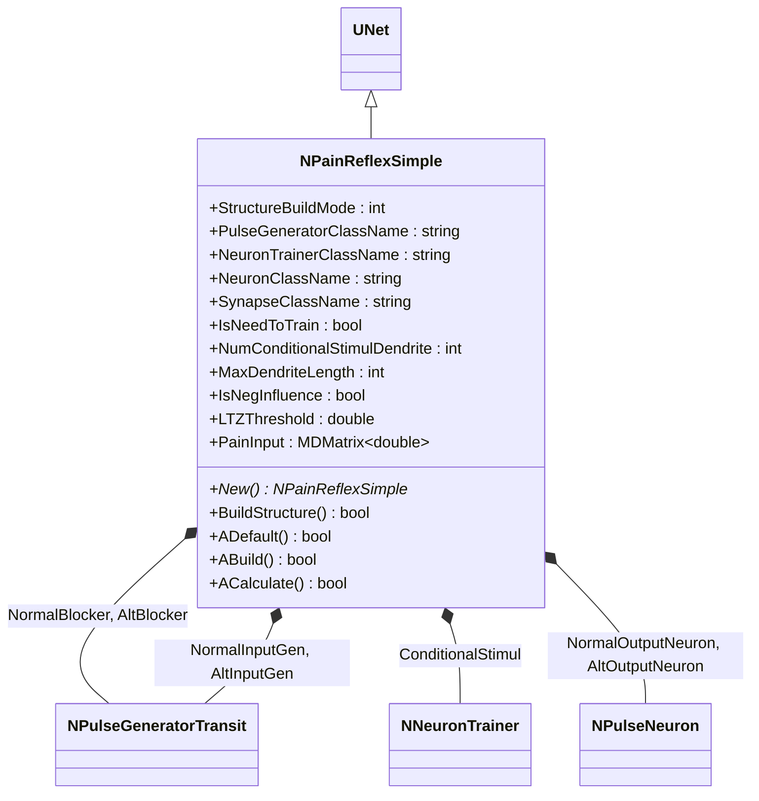
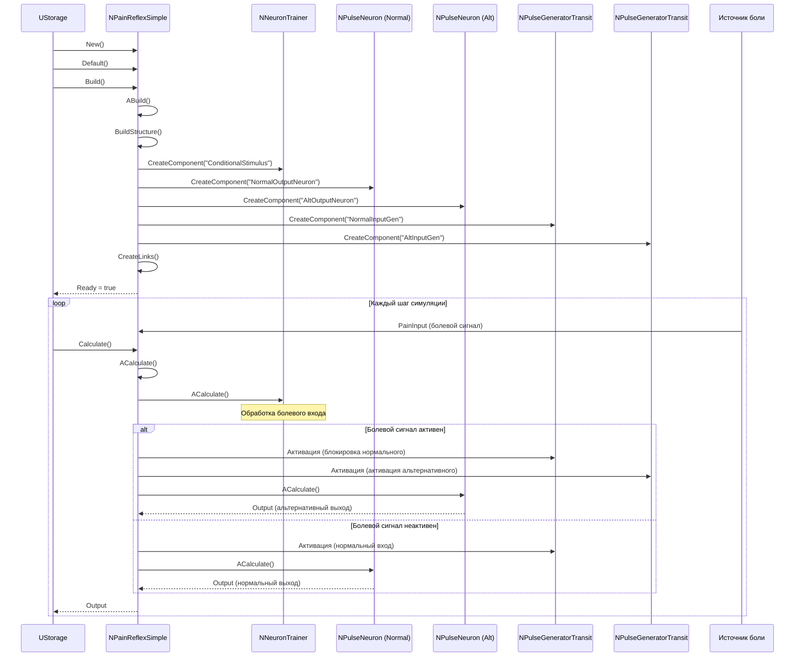
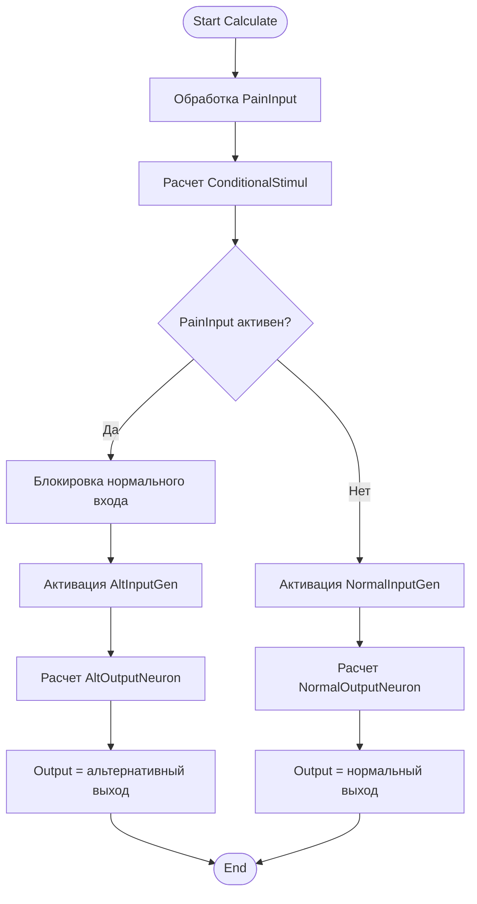
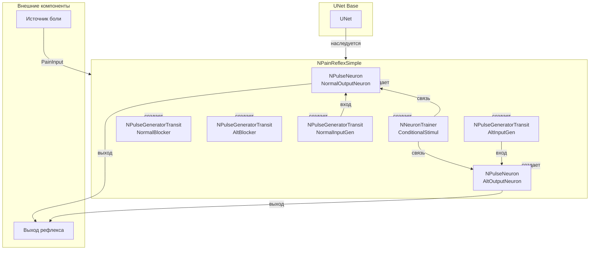
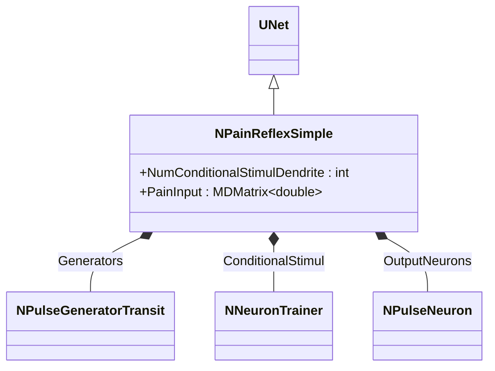
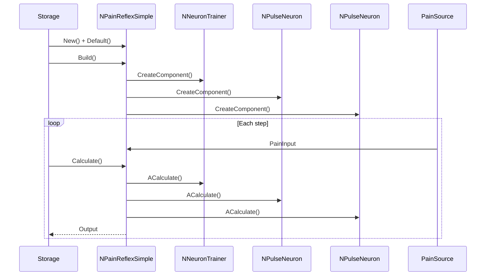
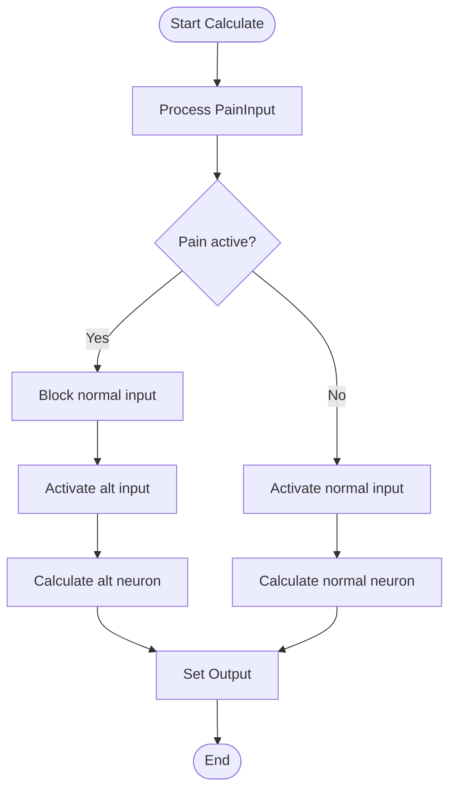
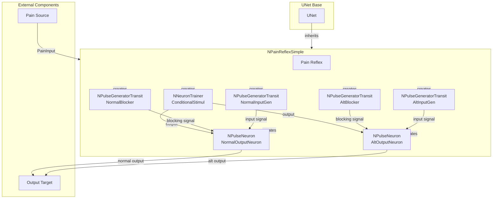

# NPainReflexSimple — простой болевой рефлекс

## RU

### Назначение

**Класс**: `NPainReflexSimple` — простой рефлекторный компонент для болевого стимула.  
**Регистрация**: `NPulseLibrary.cpp` → `UploadClass("NPainReflexSimple", ...)`.  
**Storage-инстансы**: `ClassName = "NPainReflexSimple"` в `Bin/Configs/*/Model_*.xml`.

`NPainReflexSimple` реализует простую модель болевого рефлекса, которая реагирует на болевой вход (`PainInput`) и генерирует рефлекторный ответ. Компонент создает структуру нейронов для обработки болевого сигнала и генерации нормального и альтернативного выходов.

**Использование:** Моделирование болевых рефлексов, обработка болевых сигналов

### UML-диаграмма классов



**Иерархия наследования:**
- `UNet` — базовая сеть Rdk Framework
- `NPainReflexSimple` — простой болевой рефлекс

**Связи:**
- Использует генераторы для блокировки и входных сигналов
- Использует тренер для условного стимула
- Использует нейроны для нормального и альтернативного выходов

**Внутренняя структура:**
- **ConditionalStimul** (`NNeuronTrainer`) — нейрон-тренер для условного стимула (болевой вход)
- **NormalOutputNeuron** (`NPulseNeuron`) — нормальный выходной нейрон
- **AltOutputNeuron** (`NPulseNeuron`) — альтернативный выходной нейрон
- **NormalBlocker** (`NPulseGeneratorTransit`) — генератор для блокировки нормального входа
- **AltBlocker** (`NPulseGeneratorTransit`) — генератор для блокировки альтернативного входа
- **NormalInputGen** (`NPulseGeneratorTransit`) — генератор для нормального входного сигнала
- **AltInputGen** (`NPulseGeneratorTransit`) — генератор для альтернативного входного сигнала

### UML-диаграмма последовательности



**Жизненный цикл:**
1. **Инициализация**: Установка параметров болевого рефлекса
2. **Сборка структуры**: Создание нейронов-тренеров, выходных нейронов, генераторов
3. **Расчет**: Обработка болевого входа, активация соответствующих выходов

### UML-диаграмма состояний

```mermaid
stateDiagram-v2
    [*] --> Uninitialized: New()
    Uninitialized --> Defaulted: Default()
    Defaulted --> Building: Build()
    Building --> CreatingTrainer: Создание ConditionalStimul
    CreatingTrainer --> CreatingNormalNeuron: Создание NormalOutputNeuron
    CreatingNormalNeuron --> CreatingAltNeuron: Создание AltOutputNeuron
    CreatingAltNeuron --> CreatingGenerators: Создание генераторов
    CreatingGenerators --> Linking: Создание связей
    Linking --> Built: Структура построена
    Built --> Ready: Ready = true
    Ready --> Calculating: Calculate()
    Calculating --> ProcessPainInput: Обработка PainInput
    ProcessPainInput --> CheckPain{PainInput активен?}
    CheckPain -->|Да| ActivateAlt: Активация альтернативного выхода
    CheckPain -->|Нет| ActivateNormal: Активация нормального выхода
    ActivateAlt --> AltNeuronCalc: Расчет AltOutputNeuron
    ActivateNormal --> NormalNeuronCalc: Расчет NormalOutputNeuron
    AltNeuronCalc --> Ready: Шаг завершен
    NormalNeuronCalc --> Ready: Шаг завершен
    Ready --> Resetting: Reset()
    Resetting --> Ready: Состояния сброшены
```

**Состояния:**
- **Uninitialized** — создан, но не инициализирован
- **Defaulted** — параметры установлены по умолчанию
- **Building** — выполняется сборка структуры
- **CreatingTrainer** — создание нейрона-тренера для условного стимула
- **CreatingNormalNeuron** — создание нормального выходного нейрона
- **CreatingAltNeuron** — создание альтернативного выходного нейрона
- **CreatingGenerators** — создание генераторов
- **Linking** — создание связей между компонентами
- **Built** — структура рефлекса построена
- **Ready** — готов к выполнению расчетов
- **Calculating** — выполняется расчет рефлекса
- **ProcessPainInput** — обработка болевого входа
- **CheckPain** — проверка активности болевого сигнала
- **ActivateAlt** — активация альтернативного выхода
- **ActivateNormal** — активация нормального выхода
- **AltNeuronCalc** — расчет альтернативного выходного нейрона
- **NormalNeuronCalc** — расчет нормального выходного нейрона
- **Resetting** — выполняется сброс состояний

### UML-диаграмма активности



**Алгоритм расчета:**
1. Обработка болевого входа (`PainInput`)
2. Расчет нейрона-тренера для условного стимула
3. Проверка активности болевого сигнала:
   - Если активен: блокировка нормального входа, активация альтернативного выхода
   - Если неактивен: активация нормального входа
4. Расчет соответствующего выходного нейрона
5. Генерация выходного сигнала

### UML-диаграмма компонентов



**Зависимости:**
- **Базовый класс**: `UNet`
- **Внутренние компоненты**: `NNeuronTrainer` (тренер для условного стимула), `NPulseNeuron` (выходные нейроны), `NPulseGeneratorTransit` (генераторы)
- **Внешние компоненты**: источник боли (источник `PainInput`), выход рефлекса (получатель результатов)

### Свойства

#### Параметры (ptPubParameter)

- **`NumConditionalStimulDendrite`** (int) — количество входных дендритов для нейрона условного стимула. Значение по умолчанию: зависит от реализации

- **`IsNegInfluence`** (bool) — флаг отрицательного влияния. Значение по умолчанию: зависит от реализации

#### Входные свойства (ptInput | ptPubState)

- **`PainInput`** (MDMatrix<double>) — входной болевой сигнал. Используется для активации рефлекса.

**Остальные параметры аналогичны `NConditionedReflex`.**

### Методы

- **`BuildStructure()`** → `bool` — строит структуру болевого рефлекса:
  1. Создает нейрон условного стимула
  2. Создает нормальный выходной нейрон
  3. Создает альтернативный выходной нейрон
  4. Создает генераторы для блокировки и входных сигналов
  5. Настраивает связи между компонентами

- **`ACalculate()`** → `bool` — выполняет расчет болевого рефлекса:
  1. Обрабатывает болевой вход
  2. Активирует соответствующие выходы (нормальный или альтернативный)

### Использование в конфигурациях

`NPainReflexSimple` используется в экспериментах с болевыми рефлексами:

- **Болевые рефлексы**: `Bin/Configs/!OldConfigs/*/Model_*.xml` (где требуется моделирование болевых рефлексов)

**Типичные значения параметров:**
- **StructureBuildMode**: 1 (классическая структура)
- **PulseGeneratorClassName**: "NPulseGeneratorTransit" (генератор импульсов)
- **NeuronTrainerClassName**: "NNeuronTrainer" (тренер нейронов)
- **NeuronClassName**: "NPulseNeuron" (импульсный нейрон)
- **SynapseClassName**: "NPulseSynapse" (импульсный синапс)
- **NumConditionalStimulDendrite**: 1-10 (количество дендритов для условного стимула)
- **IsNegInfluence**: false (возбуждающее влияние), true (тормозное влияние)

## Источники

См. [Literature-References.md](../Literature-References.md): **[A]**, **4**, **25**.

### См. также

- [`NConditionedReflex`](NConditionedReflex.md) — условный рефлекс
- [`NNeuronTrainer`](NNeuronTrainer.md) — тренер нейронов
- [`NPulseNeuron`](NPulseNeuron.md) — импульсный нейрон
- [`NPulseGeneratorTransit`](NPulseGeneratorTransit.md) — генератор импульсов
- [Architecture.md](../Architecture.md) — архитектура библиотеки

---

## EN

### Purpose

**Class**: `NPainReflexSimple` — simple reflex component for pain stimulus.  
**Registration**: `NPulseLibrary.cpp` → `UploadClass("NPainReflexSimple", ...)`.  
**Instances**: `ClassName = "NPainReflexSimple"` in `Bin/Configs/*/Model_*.xml`.

`NPainReflexSimple` implements simple pain reflex model that responds to pain input (`PainInput`) and generates reflex response. Component creates neuron structure for processing pain signal and generating normal and alternative outputs.

**Usage:** Modeling pain reflexes, processing pain signals

### UML Class Diagram



### UML Sequence Diagram



### UML State Diagram

```mermaid
stateDiagram-v2
    [*] --> Uninitialized: New()
    Uninitialized --> Defaulted: Default()
    Defaulted --> Building: Build()
    Building --> CreatingTrainer: Create trainer
    CreatingTrainer --> CreatingNeurons: Create neurons
    CreatingNeurons --> CreatingGenerators: Create generators
    CreatingGenerators --> Built: Structure built
    Built --> Ready: Ready = true
    Ready --> Calculating: Calculate()
    Calculating --> ProcessPainInput: Process pain input
    ProcessPainInput --> CheckPain{Pain active?}
    CheckPain -->|Yes| ActivateAlt: Activate alt output
    CheckPain -->|No| ActivateNormal: Activate normal output
    ActivateAlt --> Ready: Step completed
    ActivateNormal --> Ready: Step completed
    Ready --> Resetting: Reset()
    Resetting --> Ready
```

### UML Activity Diagram



### UML Component Diagram



### Properties

- `StructureBuildMode` — режим пересборки структуры
- `PulseGeneratorClassName` — имя класса генератора импульсов
- `NeuronTrainerClassName` — имя класса тренера нейронов
- `NeuronClassName` — имя класса нейрона
- `SynapseClassName` — имя класса синапса
- `IsNeedToTrain` — необходимость обучения
- `NumConditionalStimulDendrite` — количество дендритов для условного стимула
- `MaxDendriteLength` — максимальная длина дендрита
- `IsNegInfluence` — отрицательное влияние
- `LTZThreshold` — порог LT-зоны
- `PainInput` — входной болевой сигнал

### Methods

- `ADefault()` — установка параметров по умолчанию
- `ABuild()` — сборка структуры болевого рефлекса
- `ACalculate()` — выполнение шага обработки болевого сигнала
- `BuildStructure()` — построение структуры нейронов и генераторов

### Usage in configurations

`NPainReflexSimple` is used for modeling pain reflexes:

- **Pain reflexes**: `Bin/Configs/*/Model_*.xml` (where pain reflex modeling is required)
- **Pain processing**: experiments with processing pain signals
- **Reflex responses**: modeling normal and alternative reflex responses

**Features:**
- Automatic structure building: creates neurons and generators for pain processing
- Normal and alt outputs: provides normal and alternative reflex responses
- Pain blocking: blocks normal input when pain is active
- Flexible configuration: supports various neuron and synapse types

**Typical parameter values:**
- **NeuronClassName**: "NPulseNeuron" (spiking neuron)
- **NeuronTrainerClassName**: "NNeuronTrainer" (neuron trainer)
- **PulseGeneratorClassName**: "NPulseGeneratorTransit" (transit pulse generator)
- **SynapseClassName**: "NPulseSynapse" (pulse synapse)

### References

See [Literature-References.md](../Literature-References.md): **[A]**, **4**, **25**.

### See Also

- [`NConditionedReflex`](NConditionedReflex.md) — conditioned reflex
- [`NNeuronTrainer`](NNeuronTrainer.md) — neuron trainer
- [`NPulseNeuron`](NPulseNeuron.md) — spiking neuron
- [`NPulseGeneratorTransit`](NPulseGeneratorTransit.md) — pulse generator
- [Architecture.md](../Architecture.md) — library architecture
