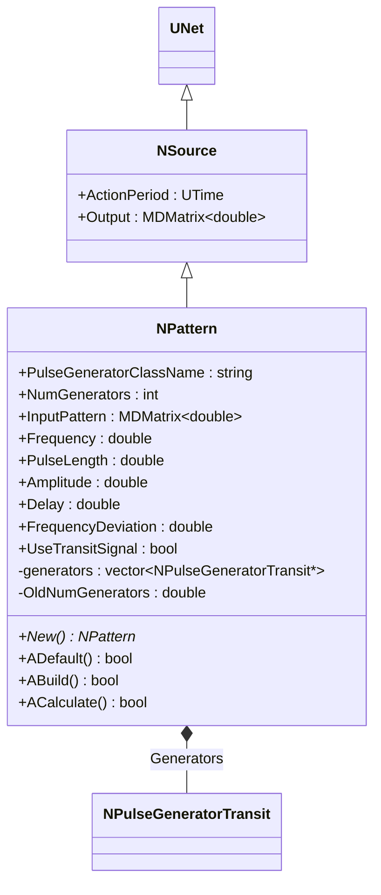
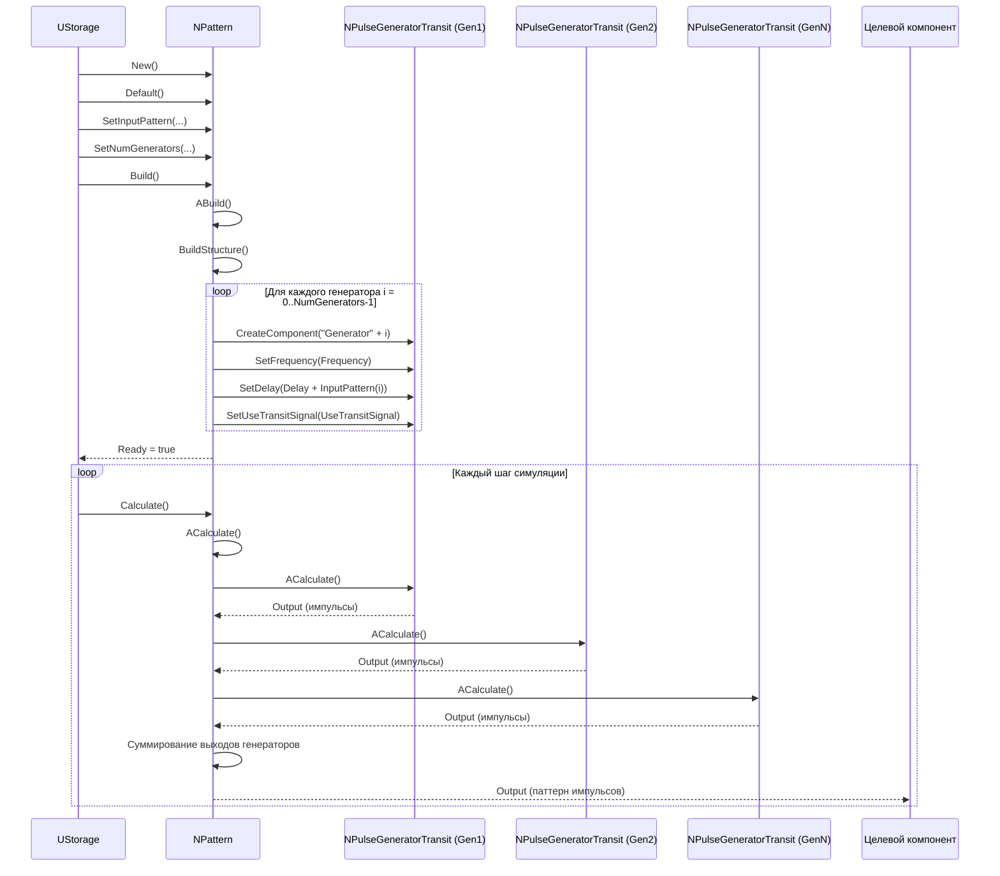
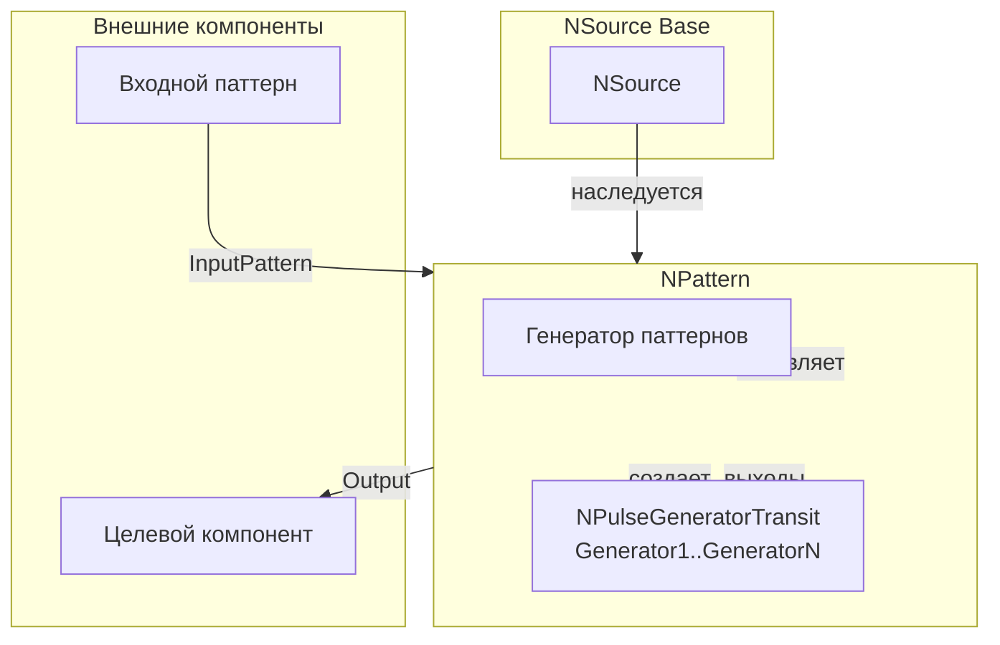
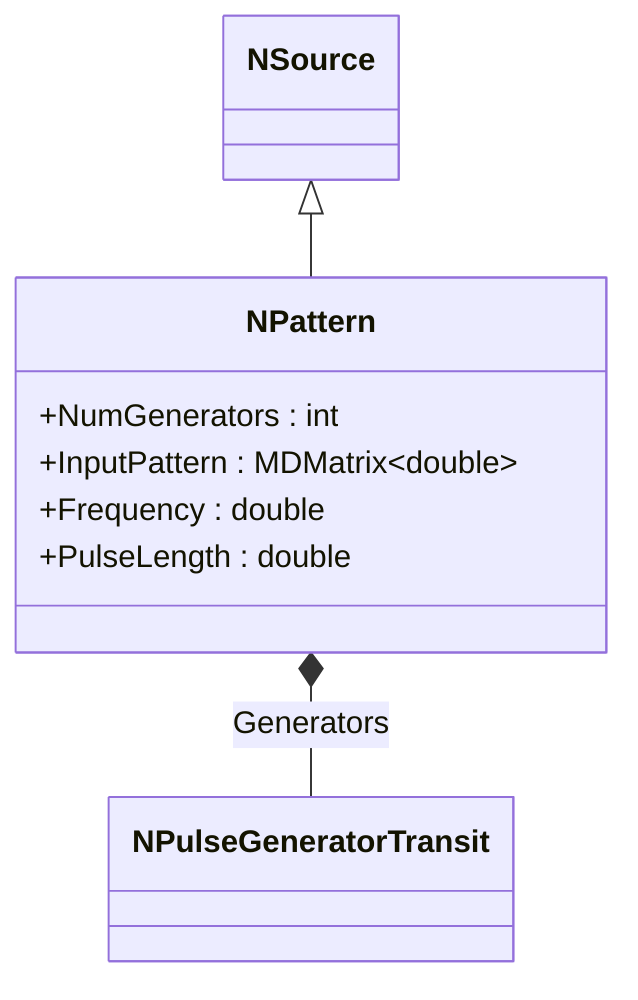
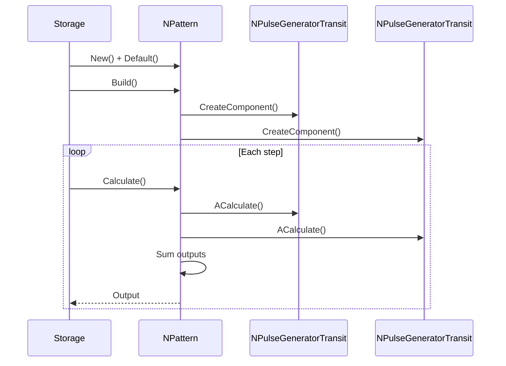
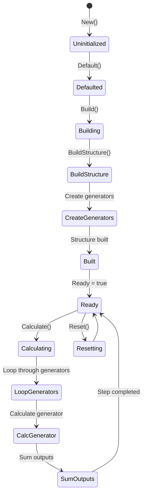
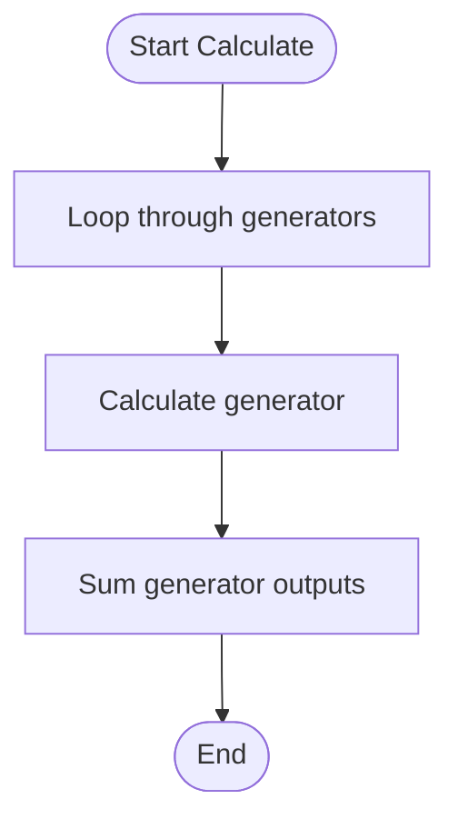
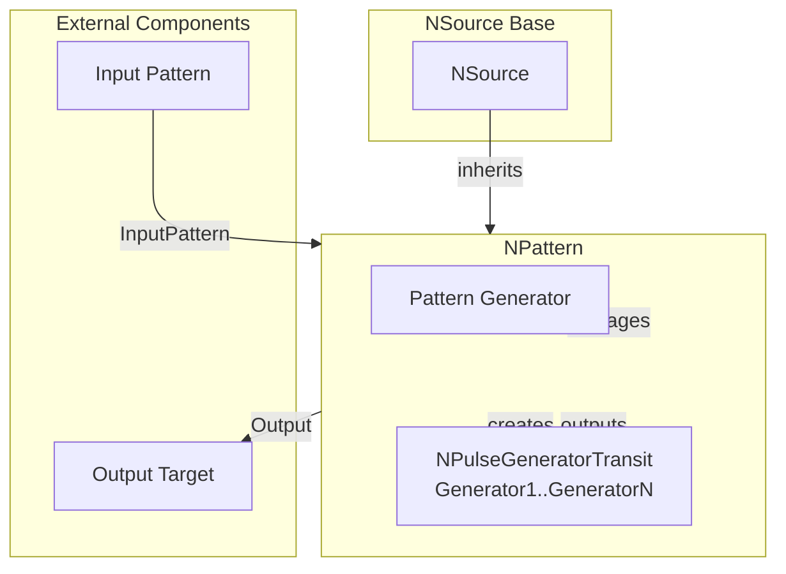

# NPattern — паттерн данных

## RU

### Назначение

**Класс**: `NPattern` — компонент для генерации паттернов импульсов на основе входного паттерна.  
**Регистрация**: `NPulseLibrary.cpp` → `UploadClass("NPattern", ...)`.  
**Storage-инстансы**: `ClassName = "NPattern"` в `Bin/Configs/*/Model_*.xml`.

`NPattern` реализует генератор паттернов импульсов, который создает группу генераторов (`NPulseGeneratorTransit`) для генерации паттерна импульсов на основе входного паттерна (`InputPattern`). Каждый генератор соответствует одному элементу входного паттерна и генерирует импульсы с задержкой, соответствующей значению элемента.

**Использование:** Генерация паттернов импульсов, создание временных паттернов

### UML-диаграмма классов



**Иерархия наследования:**
- `UNet` — базовая сеть Rdk Framework
- `NSource` — базовый источник сигналов
- `NPattern` — паттерн данных

**Связи:**
- Создает и управляет генераторами импульсов (`NPulseGeneratorTransit`)

**Внутренняя структура:**
- **Generators** (`NPulseGeneratorTransit`) — генераторы импульсов для каждого элемента паттерна

### UML-диаграмма последовательности



**Жизненный цикл:**
1. **Инициализация**: Установка параметров генератора паттернов
2. **Сборка структуры**: Создание генераторов импульсов для каждого элемента паттерна, настройка задержек на основе `InputPattern`
3. **Расчет**: Обновление генераторов, суммирование выходных сигналов

### UML-диаграмма состояний

```mermaid
stateDiagram-v2
    [*] --> Uninitialized: New()
    Uninitialized --> Defaulted: Default()
    Defaulted --> Building: Build()
    Building --> CheckMode{StructureBuildMode > 0?}
    CheckMode -->|Да| BuildStructure: BuildStructure()
    CheckMode -->|Нет| Built: Структура не пересобирается
    BuildStructure --> DeleteOld: Удаление старых генераторов
    DeleteOld --> LoopGenerators: Цикл по генераторам i = 0..NumGenerators-1
    LoopGenerators --> CreateGenerator: Создание Generator[i]
    CreateGenerator --> SetFrequency: SetFrequency(Frequency)
    SetFrequency --> SetDelay: SetDelay(Delay + InputPattern(i))
    SetDelay --> SetTransit: SetUseTransitSignal(UseTransitSignal)
    SetTransit --> CheckMoreGenerators: Есть еще генераторы?
    CheckMoreGenerators -->|Да| LoopGenerators
    CheckMoreGenerators -->|Нет| Built: Структура создана
    Built --> Ready: Ready = true
    Ready --> Calculating: Calculate()
    Calculating --> LoopGeneratorsCalc: Цикл по генераторам
    LoopGeneratorsCalc --> CalcGenerator: ACalculate() генератора
    CalcGenerator --> SumOutputs: Суммирование выходов генераторов
    SumOutputs --> CheckMoreGeneratorsCalc: Есть еще генераторы?
    CheckMoreGeneratorsCalc -->|Да| LoopGeneratorsCalc
    CheckMoreGeneratorsCalc -->|Нет| Ready: Шаг завершен
    Ready --> Resetting: Reset()
    Resetting --> Ready: Состояния сброшены
```

**Состояния:**
- **Uninitialized** — создан, но не инициализирован
- **Defaulted** — параметры установлены по умолчанию
- **Building** — выполняется сборка структуры
- **CheckMode** — проверка необходимости пересборки структуры
- **BuildStructure** — выполнение пересборки структуры
- **DeleteOld** — удаление старых генераторов
- **LoopGenerators** — цикл по генераторам
- **CreateGenerator** — создание генератора
- **SetFrequency** — установка частоты генератора
- **SetDelay** — установка задержки генератора
- **SetTransit** — установка использования транзитного сигнала
- **CheckMoreGenerators** — проверка наличия еще генераторов
- **Built** — структура паттерна построена
- **Ready** — готов к выполнению расчетов
- **Calculating** — выполняется расчет паттерна
- **LoopGeneratorsCalc** — цикл по генераторам для расчета
- **CalcGenerator** — расчет генератора
- **SumOutputs** — суммирование выходов генераторов
- **CheckMoreGeneratorsCalc** — проверка наличия еще генераторов для расчета
- **Resetting** — выполняется сброс состояний

### UML-диаграмма активности

```mermaid
flowchart TD
    Start([Start Calculate]) --> LoopGenerators[Цикл по генераторам i = 0..NumGenerators-1]
    LoopGenerators --> CalcGenerator[ACalculate() Generator[i]]
    CalcGenerator --> SumOutputs[Суммирование Output генераторов]
    SumOutputs --> CheckMoreGenerators{Есть еще генераторы?}
    CheckMoreGenerators -->|Да| LoopGenerators
    CheckMoreGenerators -->|Нет| SetOutput[Output = сумма выходов генераторов]
    SetOutput --> End([End])
```

**Алгоритм расчета:**
1. Цикл по всем генераторам паттерна
2. Расчет каждого генератора: `Generator[i]->ACalculate()`
3. Суммирование выходных сигналов всех генераторов: `Output = sum(Generator[i]->Output)`

### UML-диаграмма компонентов



**Зависимости:**
- **Базовый класс**: `NSource`
- **Внутренние компоненты**: генераторы импульсов (`NPulseGeneratorTransit`, создаются автоматически для каждого элемента паттерна)
- **Внешние компоненты**: входной паттерн (источник `InputPattern`), целевой компонент (получатель `Output`)

### Свойства

#### Параметры (ptPubParameter)

- **`PulseGeneratorClassName`** (string) — имя класса генератора импульсов. Значение по умолчанию: зависит от реализации

- **`NumGenerators`** (int) — количество генераторов (размер паттерна). Значение по умолчанию: зависит от реализации

- **`InputPattern`** (MDMatrix<double>) — входной паттерн. Каждый элемент определяет задержку для соответствующего генератора. Значение по умолчанию: зависит от реализации

- **`Frequency`** (double) — частота генерации импульсов (Гц). Значение по умолчанию: зависит от реализации

- **`PulseLength`** (double) — длительность импульса (сек). Значение по умолчанию: зависит от реализации

- **`Amplitude`** (double) — амплитуда импульса. Значение по умолчанию: зависит от реализации

- **`Delay`** (double) — базовая задержка запуска генераторов (сек). Значение по умолчанию: зависит от реализации

- **`FrequencyDeviation`** (double) — отклонение частоты. Значение по умолчанию: зависит от реализации

- **`UseTransitSignal`** (bool) — использовать транзитный сигнал. Значение по умолчанию: зависит от реализации

### Методы

- **`ABuild()`** → `bool` — строит структуру паттерна:
  1. Создает генераторы импульсов (`NumGenerators` штук)
  2. Настраивает параметры каждого генератора
  3. Устанавливает задержки на основе `InputPattern`

- **`ACalculate()`** → `bool` — выполняет расчет паттерна:
  1. Обновляет генераторы
  2. Суммирует выходные сигналы генераторов
  3. Выдает паттерн как выходной сигнал

### Примеры использования

#### Пример 1: Создание паттерна в коде C++

```cpp
// Создание паттерна
auto pattern = storage->CreateComponent<NPattern>();
pattern->SetName("Pattern");

// Инициализация
pattern->Default();

// Настройка параметров
pattern->NumGenerators = 10;
pattern->Frequency = 10.0;
pattern->PulseLength = 0.001;
pattern->Amplitude = 1.0;
pattern->Delay = 0.0;

// Загрузка входного паттерна
MDMatrix<double> inputPattern(10, 1);
for (int i = 0; i < 10; i++) {
    inputPattern(i, 0) = i * 0.01;  // Задержки от 0 до 0.09 сек
}
pattern->InputPattern = inputPattern;

// Сборка (создает генераторы)
pattern->Build();
```

### Использование в конфигурациях

`NPattern` используется в экспериментах с генерацией паттернов импульсов:

- **Генерация паттернов**: `Bin/Configs/!OldConfigs/*/Model_*.xml` (где требуется создание временных паттернов)

**Типичные значения параметров:**
- **PulseGeneratorClassName**: "NPulseGeneratorTransit" (генератор импульсов)
- **NumGenerators**: количество генераторов (размер паттерна)
- **Frequency**: 10.0 (10 Гц, частота генерации импульсов)
- **PulseLength**: 0.001 (1 мс, длительность импульса)
- **Amplitude**: 1.0 (амплитуда импульса)
- **Delay**: 0.0 (базовая задержка запуска генераторов)
- **FrequencyDeviation**: отклонение частоты
- **UseTransitSignal**: true (использовать транзитный сигнал)

**Особенности:**
- Автоматическое создание генераторов: для каждого элемента `InputPattern` создается отдельный генератор
- Задержки: каждый генератор имеет задержку `Delay + InputPattern(i)`, что создает временной паттерн
- Суммирование выходов: выходные сигналы всех генераторов суммируются в один паттерн

### См. также

- [`NSource`](NSource.md) — базовый источник сигналов
- [`NPulseGenerator`](NPulseGenerator.md) — генератор импульсов
- [`NPulseGeneratorTransit`](NPulseGeneratorTransit.md) — генератор с транзитным сигналом
- [Architecture.md](../Architecture.md) — архитектура библиотеки

---

## EN

### Purpose

**Class**: `NPattern` — component for generating pulse patterns based on input pattern.  
**Registration**: `NPulseLibrary.cpp` → `UploadClass("NPattern", ...)`.  
**Instances**: `ClassName = "NPattern"` in `Bin/Configs/*/Model_*.xml`.

`NPattern` implements pattern generator that creates group of generators (`NPulseGeneratorTransit`) to generate pulse pattern based on input pattern (`InputPattern`). Each generator corresponds to one element of input pattern and generates pulses with delay corresponding to element value.

**Usage:** Generating pulse patterns, creating temporal patterns

### UML Class Diagram



### UML Sequence Diagram



### UML State Diagram



### UML Activity Diagram



### UML Component Diagram



### Properties

`NPattern` uses the following properties:

**Parameters:**
- `PulseGeneratorClassName` (string) — pulse generator class name
- `NumGenerators` (int) — number of generators (pattern size)
- `InputPattern` (MDMatrix<double>) — input pattern (delays for each generator)
- `Frequency` (double) — pulse generation frequency (Hz)
- `PulseLength` (double) — pulse duration (sec)
- `Amplitude` (double) — pulse amplitude
- `Delay` (double) — base delay for generator start (sec)
- `FrequencyDeviation` (double) — frequency deviation
- `UseTransitSignal` (bool) — use transit signal

**Output properties:**
- `Output` (MDMatrix<double>) — output signal (sum of generator outputs)

**Internal components:**
- `generators` (vector<NPulseGeneratorTransit*>) — vector of pulse generators

### Methods

`NPattern` uses the following methods:

- `ABuild()` → `bool` — builds pattern structure:
  1. Creates pulse generators (`NumGenerators` pieces)
  2. Configures parameters for each generator
  3. Sets delays based on `InputPattern`

- `ACalculate()` → `bool` — performs pattern calculation:
  1. Updates generators
  2. Sums generator output signals
  3. Outputs pattern as output signal

### Usage in configurations

`NPattern` is used in pulse pattern generation experiments:

- **Pattern generation**: `Bin/Configs/!OldConfigs/*/Model_*.xml` (where temporal pattern creation is required)

**Typical parameter values:**
- **PulseGeneratorClassName**: "NPulseGeneratorTransit" (pulse generator)
- **NumGenerators**: number of generators (pattern size)
- **Frequency**: 10.0 (10 Hz, pulse generation frequency)
- **PulseLength**: 0.001 (1 ms, pulse duration)
- **Amplitude**: 1.0 (pulse amplitude)
- **Delay**: 0.0 (base delay for generator start)
- **FrequencyDeviation**: frequency deviation
- **UseTransitSignal**: true (use transit signal)

**Features:**
- Automatic generator creation: creates separate generator for each `InputPattern` element
- Delays: each generator has delay `Delay + InputPattern(i)`, creating temporal pattern
- Output summation: output signals from all generators are summed into one pattern

### See Also

- [`NSource`](NSource.md) — base signal source
- [`NPulseGenerator`](NPulseGenerator.md) — pulse generator
- [`NPulseGeneratorTransit`](NPulseGeneratorTransit.md) — generator with transit signal
- [Architecture.md](../Architecture.md) — library architecture
