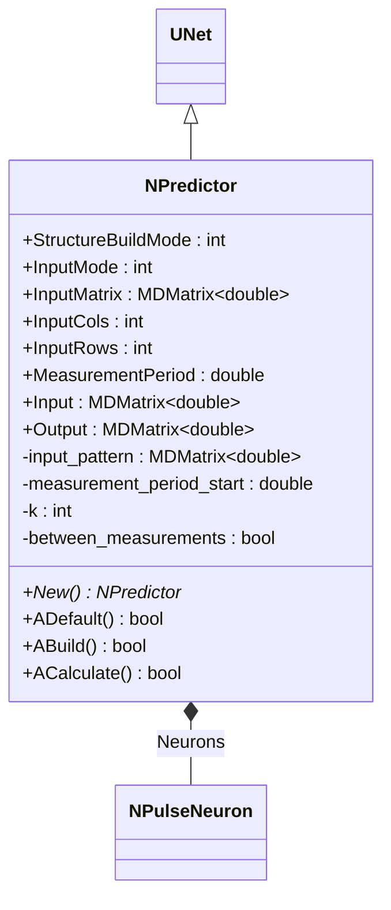
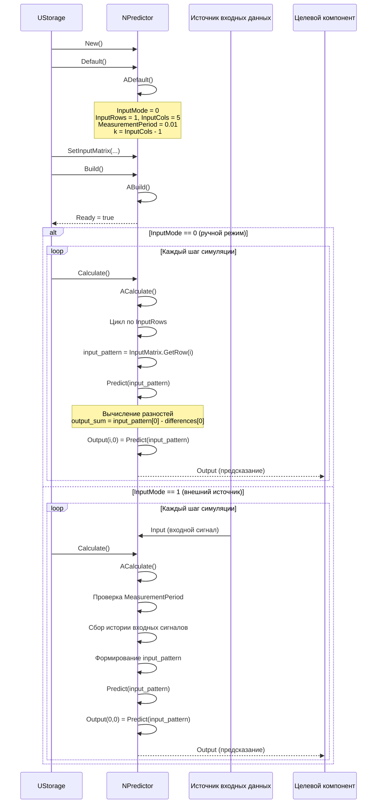
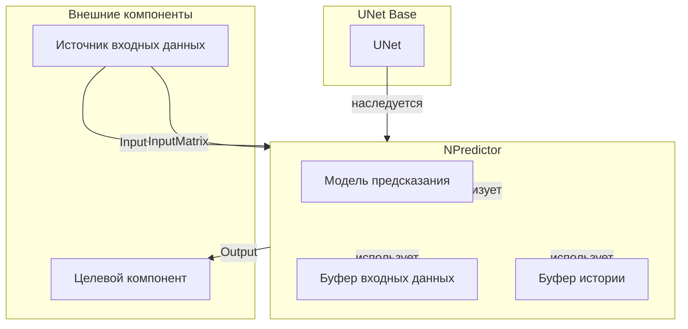
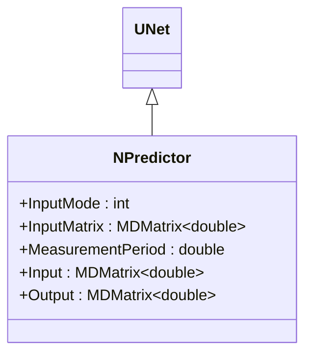
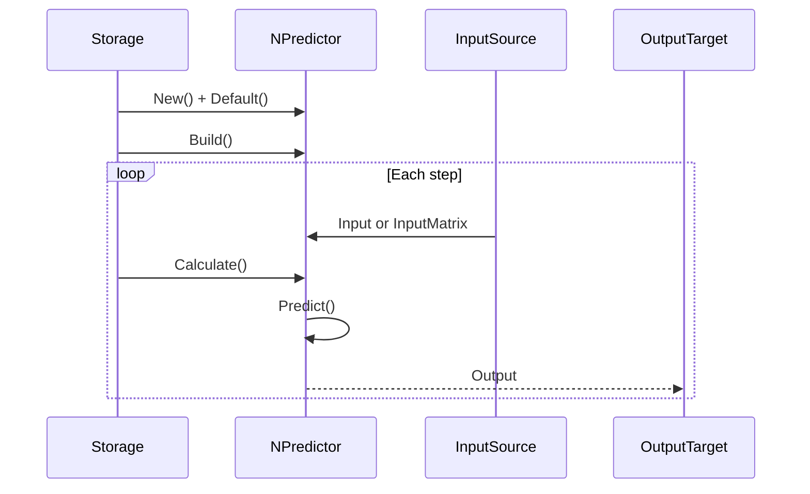
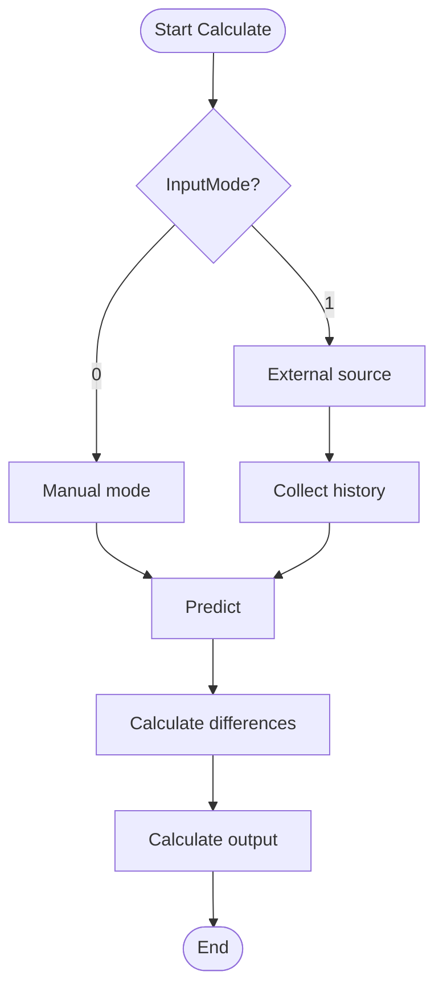
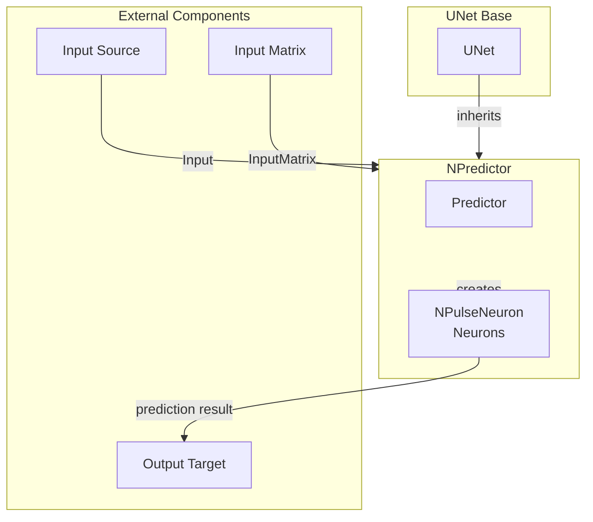

# NPredictor — предсказатель

## RU

### Назначение

**Класс**: `NPredictor` — предсказатель сигналов/состояний на основе временных рядов.  
**Регистрация**: `NPulseLibrary.cpp` → `UploadClass("NPredictor", ...)`.  
**Storage-инстансы**: `ClassName = "NPredictor"` в `Bin/Configs/*/Model_*.xml`.

`NPredictor` реализует предсказатель, который использует историю входных сигналов для предсказания будущих состояний. Компонент создает группу нейронов для обработки временных рядов и предсказания следующих значений на основе предыдущих измерений.

**Использование:** Предсказание сигналов, анализ временных рядов

### UML-диаграмма классов



**Иерархия наследования:**
- `UNet` — базовая сеть Rdk Framework
- `NPredictor` — предсказатель

### UML-диаграмма последовательности



**Жизненный цикл:**
1. **Инициализация**: Установка параметров по умолчанию (`InputMode=0`, `InputRows=1`, `InputCols=5`)
2. **Сброс**: Инициализация `InputMatrix` размером `InputRows x InputCols`
3. **Расчет**: Сбор истории входных сигналов, формирование паттерна, предсказание следующего значения

### UML-диаграмма состояний

```mermaid
stateDiagram-v2
    [*] --> Uninitialized: New()
    Uninitialized --> Defaulted: Default()
    Defaulted --> Building: Build()
    Building --> Built: Структура создана
    Built --> Ready: Ready = true
    Ready --> Resetting: Reset()
    Resetting --> InitMatrix: InputMatrix.Resize(InputRows, InputCols)
    InitMatrix --> Ready: Состояния сброшены
    Ready --> Calculating: Calculate()
    Calculating --> CheckInputMode{InputMode?}
    CheckInputMode -->|0| ManualMode: Ручной режим
    CheckInputMode -->|1| ExternalMode: Внешний источник
    ManualMode --> LoopRows: Цикл по InputRows
    LoopRows --> GetRow: input_pattern = InputMatrix.GetRow(i)
    GetRow --> Predict: Predict(input_pattern)
    Predict --> CalcDifferences: Вычисление разностей
    CalcDifferences --> CalcOutput: Output(i,0) = output_sum
    CalcOutput --> CheckMoreRows: Есть еще строки?
    CheckMoreRows -->|Да| LoopRows
    CheckMoreRows -->|Нет| Ready: Шаг завершен
    ExternalMode --> CheckPeriod: Проверка MeasurementPeriod
    CheckPeriod --> CollectHistory: Сбор истории входных сигналов
    CollectHistory --> FormPattern: Формирование input_pattern
    FormPattern --> Predict
    Predict --> Ready: Шаг завершен
```

**Состояния:**
- **Uninitialized** — создан, но не инициализирован
- **Defaulted** — параметры установлены по умолчанию
- **Building** — выполняется сборка
- **Built** — структура предсказателя построена
- **Ready** — готов к выполнению расчетов
- **Resetting** — выполняется сброс
- **InitMatrix** — инициализация входной матрицы
- **Calculating** — выполняется расчет предсказателя
- **CheckInputMode** — проверка режима ввода
- **ManualMode** — ручной режим (InputMatrix)
- **ExternalMode** — режим внешнего источника
- **LoopRows** — цикл по строкам входной матрицы
- **GetRow** — получение строки из матрицы
- **Predict** — выполнение предсказания
- **CalcDifferences** — вычисление разностей
- **CalcOutput** — вычисление выходного сигнала
- **CheckMoreRows** — проверка наличия еще строк
- **CheckPeriod** — проверка периода измерения
- **CollectHistory** — сбор истории входных сигналов
- **FormPattern** — формирование паттерна

### UML-диаграмма активности

```mermaid
flowchart TD
    Start([Start Calculate]) --> CheckInputMode{InputMode?}
    CheckInputMode -->|0| ManualMode[Ручной режим]
    CheckInputMode -->|1| ExternalMode[Внешний источник]
    
    ManualMode --> LoopRows[Цикл по InputRows i = 0..InputRows-1]
    LoopRows --> GetRow[input_pattern = InputMatrix.GetRow(i)]
    GetRow --> Predict[Predict(input_pattern)]
    
    ExternalMode --> CheckPeriod{MeasurementPeriod достигнут?}
    CheckPeriod -->|Нет| CollectInput[Сбор входного сигнала]
    CollectInput --> UpdateHistory[Обновление истории]
    UpdateHistory --> CheckPeriod
    CheckPeriod -->|Да| FormPattern[Формирование input_pattern из истории]
    FormPattern --> Predict
    
    Predict --> InitOutputSum[output_sum = input_pattern[0]]
    InitOutputSum --> InitPrevDiff[prev_differences = input_pattern]
    InitPrevDiff --> LoopLayers[Цикл по слоям layer_index = 0..num_of_layers-1]
    LoopLayers --> CalcDifferences[Вычисление разностей differences[j] = prev_differences[j+1] - prev_differences[j]]
    CalcDifferences --> UpdateOutputSum[output_sum = output_sum - differences[0]]
    UpdateOutputSum --> UpdatePrevDiff[prev_differences = differences]
    UpdatePrevDiff --> CheckMoreLayers{Есть еще слои?}
    CheckMoreLayers -->|Да| LoopLayers
    CheckMoreLayers -->|Нет| SetOutput[Output(i,0) = output_sum]
    SetOutput --> CheckMoreRows{Есть еще строки?}
    CheckMoreRows -->|Да| LoopRows
    CheckMoreRows -->|Нет| End([End])
```

**Алгоритм расчета:**
1. Проверка режима ввода: ручной (InputMatrix) или внешний источник
2. **Ручной режим**: цикл по строкам InputMatrix, предсказание для каждой строки
3. **Режим внешнего источника**: сбор истории входных сигналов, формирование паттерна при достижении MeasurementPeriod
4. **Метод Predict**: вычисление разностей между соседними значениями, предсказание следующего значения как `output_sum = input_pattern[0] - differences[0]`

### UML-диаграмма компонентов



**Зависимости:**
- **Базовый класс**: `UNet`
- **Внутренние компоненты**: модель предсказания (алгоритм вычисления разностей), буфер входных данных (`InputMatrix`), буфер истории (для режима внешнего источника)
- **Внешние компоненты**: источник входных данных (источник `Input` или `InputMatrix`), целевой компонент (получатель `Output`)

### Свойства

#### Параметры (ptPubParameter)

- **`InputMode`** (int) — режим ввода:
  - 0 — ручной ввод матрицы входных значений
  - 1 — при подключении внешнего блока-источника
  Значение по умолчанию: зависит от реализации

- **`InputMatrix`** (MDMatrix<double>) — матрица входных значений. Содержит N измерений для времени t, t-tau, ..., t-(N-1)tau, где tau — период измерения, N — количество измерений. Значение по умолчанию: зависит от реализации

- **`InputCols`** (int) — количество столбцов входной матрицы. Значение по умолчанию: зависит от реализации

- **`InputRows`** (int) — количество строк входной матрицы. Значение по умолчанию: зависит от реализации

- **`MeasurementPeriod`** (double) — период измерения tau (сек). Используется для определения интервала между измерениями. Значение по умолчанию: зависит от реализации

#### Входные свойства (ptInput | ptPubState)

- **`Input`** (MDMatrix<double>) — входной сигнал (в режиме работы с источником сигнала). Значение по умолчанию: зависит от реализации

#### Выходные свойства (ptOutput | ptPubState)

- **`Output`** (MDMatrix<double>) — выходной сигнал предсказания. Значение по умолчанию: зависит от реализации

### Методы

- **`ACalculate()`** → `bool` — выполняет расчет предсказателя:
  1. Собирает историю входных сигналов
  2. Формирует паттерн из N измерений
  3. Использует нейроны для предсказания следующего значения
  4. Выдает предсказание как выходной сигнал

## Источники

См. [Literature-References.md](../Literature-References.md): **[A]**, **4**, **25**.

### См. также

- [`NStatePredictor`](NStatePredictor.md) — предсказатель состояний
- [`NPulseNeuron`](NPulseNeuron.md) — импульсный нейрон
- [Architecture.md](../Architecture.md) — архитектура библиотеки

---

## EN

### Purpose

**Class**: `NPredictor` — predictor for signals/states based on time series.  
**Registration**: `NPulseLibrary.cpp` → `UploadClass("NPredictor", ...)`.  
**Instances**: `ClassName = "NPredictor"` in `Bin/Configs/*/Model_*.xml`.

`NPredictor` implements predictor that uses input signal history to predict future states. Component creates group of neurons for processing time series and predicting next values based on previous measurements.

**Usage:** Signal prediction, time series analysis

### UML Class Diagram



### UML Sequence Diagram



### UML State Diagram

```mermaid
stateDiagram-v2
    [*] --> Uninitialized: New()
    Uninitialized --> Defaulted: Default()
    Defaulted --> Built: Build()
    Built --> Ready: Ready = true
    Ready --> Calculating: Calculate()
    Calculating --> CheckInputMode{InputMode?}
    CheckInputMode -->|0| ManualMode: Manual mode
    CheckInputMode -->|1| ExternalMode: External source
    ManualMode --> Predict: Predict()
    ExternalMode --> CollectHistory: Collect history
    CollectHistory --> Predict
    Predict --> Ready: Step completed
    Ready --> Resetting: Reset()
    Resetting --> Ready
```

### UML Activity Diagram



### UML Component Diagram



### Properties

- `StructureBuildMode` — режим пересборки структуры
- `InputMode` — режим ввода (0 — ручной, 1 — внешний источник)
- `InputMatrix` — входная матрица данных
- `InputCols` — количество столбцов входных данных
- `InputRows` — количество строк входных данных
- `MeasurementPeriod` — период измерений
- `Input` — входной сигнал (для внешнего источника)
- `Output` — выходной сигнал (предсказание)

### Methods

- `ADefault()` — установка параметров по умолчанию
- `ABuild()` — сборка структуры предсказателя
- `ACalculate()` — выполнение шага предсказания
- `Predict(input_pattern)` — предсказание следующего значения на основе паттерна

### Usage in configurations

`NPredictor` is used for signal prediction:

- **Signal prediction**: `Bin/Configs/*/Model_*.xml` (where signal prediction is required)
- **Time series analysis**: experiments with time series prediction
- **State prediction**: prediction of future states based on history

**Features:**
- Manual mode: uses InputMatrix for prediction
- External source mode: collects input history and predicts
- Pattern-based: uses input patterns for prediction
- Flexible configuration: supports various input modes

**Typical parameter values:**
- **InputMode**: 0 (manual mode) or 1 (external source mode)
- **InputRows**: 1 (number of input rows)
- **InputCols**: 5 (number of input columns)
- **MeasurementPeriod**: 0.01 (measurement period)

### References

See [Literature-References.md](../Literature-References.md): **[A]**, **4**, **25**.

### See Also

- [`NStatePredictor`](NStatePredictor.md) — state predictor
- [`NPulseNeuron`](NPulseNeuron.md) — spiking neuron
- [Architecture.md](../Architecture.md) — library architecture
