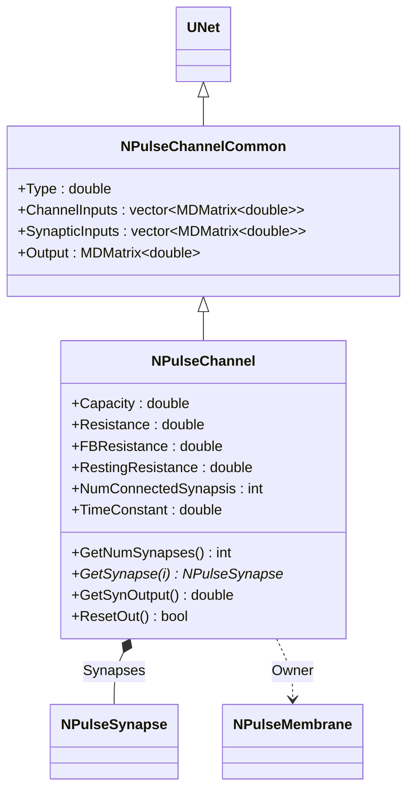
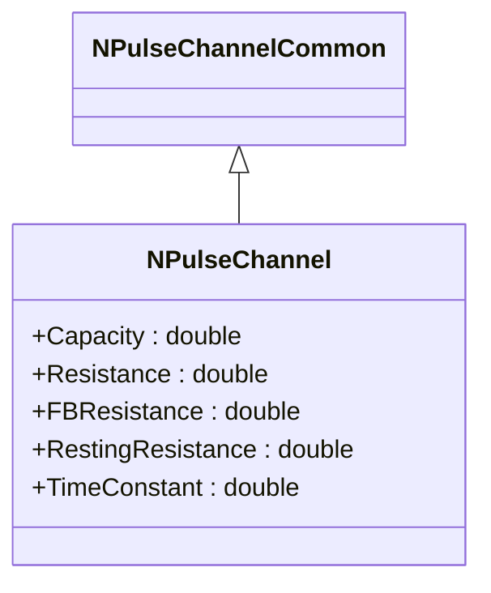
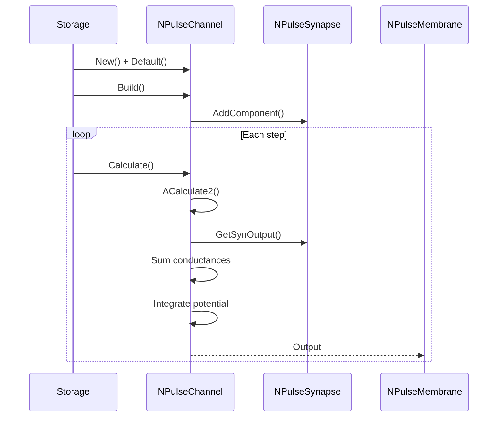
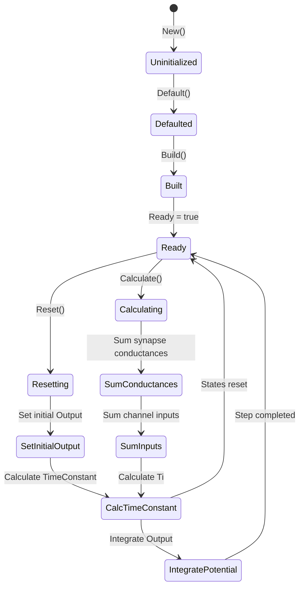
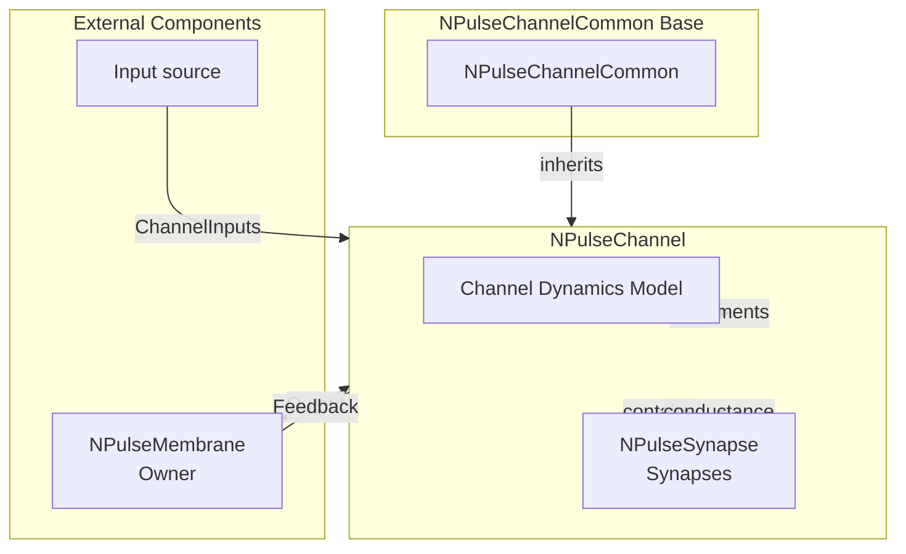

# NPulseChannel — импульсный канал

## RU

### Назначение

**Класс**: `NPulseChannel` — базовый импульсный канал с параметрами емкости и сопротивления.  
**Регистрация**: `NPulseLibrary.cpp` → `UploadClass("NPulseChannel", ...)`.  
**Storage-инстансы**: `ClassName = "NPulseChannel"` в `Bin/Configs/*/Model_*.xml`.

`NPulseChannel` реализует базовый импульсный канал с параметрами емкости (`Capacity`), сопротивления (`Resistance`), сопротивления обратной связи (`FBResistance`) и сопротивления покоя (`RestingResistance`). Наследуется от `NPulseChannelCommon` и добавляет физические параметры мембраны для расчета динамики потенциала канала.

**Использование:** Базовый импульсный канал, расчет динамики потенциала с учетом емкости и сопротивления

### UML-диаграмма классов



**Иерархия наследования:**
- `UNet` — базовая сеть Rdk Framework
- `NPulseChannelCommon` — общий импульсный канал
- `NPulseChannel` — базовый импульсный канал

### Свойства

#### Параметры (ptPubParameter)

- **`Capacity`** (double) — емкость мембраны канала. Используется для расчета временной константы. Значение по умолчанию: 1.0e-9 (1 нФ)

- **`Resistance`** (double) — сопротивление мембраны канала. Используется для расчета динамики потенциала. Значение по умолчанию: 1.0e7 (10 МОм)

- **`FBResistance`** (double) — сопротивление обратной связи мембраны. Используется при наличии обратной связи. Значение по умолчанию: 1.0e8 (100 МОм)

- **`RestingResistance`** (double) — сопротивление покоя мембраны. Используется, когда потенциал канала стремится к входному сигналу. Значение по умолчанию: 1.0e7 (10 МОм)

#### Состояния (ptPubState)

- **`NumConnectedSynapsis`** (int) — количество подключенных синапсов. Начальное значение: 0

- **`TimeConstant`** (double) — временная константа канала. Вычисляется как `Ti = Capacity / (G + 1.0/resistance)`, где `G` — суммарная проводимость синапсов. Начальное значение: вычисляется в `AReset()`

### Методы

#### Публичные методы

- **`GetNumSynapses()`** → `int` — возвращает количество синапсов, подключенных к каналу.

- **`GetSynapse(int i)`** → `UEPtr<NPulseSynapse>` — возвращает синапс по индексу.

- **`GetSynOutput()`** → `double` — возвращает выходной сигнал синапсов (в базовом классе возвращает 0).

- **`ResetOut()`** → `bool` — сбрасывает выходной сигнал (в базовом классе возвращает `false`).

#### Защищенные методы жизненного цикла

- **`ADefault()`** → `bool` — инициализирует параметры по умолчанию. Устанавливает `Capacity = 1.0e-9`, `Resistance = 1.0e7`, `FBResistance = 1.0e8`, `RestingResistance = 1.0e7`, `Type = 0`, `NumConnectedSynapsis = 0`.

- **`AReset()`** → `bool` — сбрасывает состояния канала. Устанавливает начальное значение `Output` в зависимости от типа канала (`Type > 0` → `Output = 1`, `Type < 0` → `Output = -1`), вычисляет `TimeConstant = Resistance * Capacity`.

- **`ACalculate2()`** → `bool` — выполняет расчет канала на одном шаге:
  1. Суммирует проводимости синапсов (`G`)
  2. Суммирует входные сигналы канала (`channel_input`)
  3. Учитывает обратную связь от мембраны (если есть)
  4. Вычисляет временную константу `Ti` и коэффициент `sum_u`
  5. Интегрирует выходной потенциал: `Output += (channel_input - Output*sum_u) / (Ti*TimeStep)`

### Примеры использования

#### Пример 1: Создание канала в коде C++

```cpp
// Создание импульсного канала
auto channel = storage->CreateComponent<NPulseChannel>();
channel->SetName("PulseChannel");

// Инициализация
channel->Default();

// Настройка параметров
channel->Capacity = 1.0e-9;
channel->Resistance = 1.0e7;
channel->FBResistance = 1.0e8;
channel->RestingResistance = 1.0e7;
channel->Type = 1.0;  // Возбуждающий канал

// Добавление синапсов
auto synapse = storage->CreateComponent<NPulseSynapse>();
channel->AddComponent(synapse);

// Сборка
channel->Build();
```

### Использование в конфигурациях

`NPulseChannel` используется в экспериментах с импульсными каналами:

- **Базовые каналы**: `Bin/Configs/!OldConfigs/NM-Neurons/` (эксперименты с нейронами)

**Типичные значения параметров:**
- **Capacity**: 1.0e-9 (1 нФ, емкость мембраны канала)
- **Resistance**: 1.0e7 (10 МОм, сопротивление мембраны канала)
- **FBResistance**: 1.0e8 (100 МОм, сопротивление обратной связи)
- **RestingResistance**: 1.0e7 (10 МОм, сопротивление покоя)
- **Type**: 1.0 (возбуждающий канал), -1.0 (тормозной канал)

**Особенности:**
- Динамика потенциала: интегрирование выходного потенциала с учетом емкости и сопротивления
- Временная константа: `TimeConstant = Resistance * Capacity`
- Обратная связь: поддержка обратной связи от мембраны через `FBResistance`

## Источники

См. [Literature-References.md](../Literature-References.md): **[A]**, **4**, **25**, **29**.

### См. также

- [`NPulseChannelCommon`](NPulseChannelCommon.md) — общий импульсный канал
- [`NPulseChannelIzhikevich`](NPulseChannelIzhikevich.md) — канал модели Ижикевича
- [`NPulseChannelIaF`](NPulseChannelIaF.md) — канал модели IaF
- [`NPulseMembrane`](NPulseMembrane.md) — импульсная мембрана
- [Architecture.md](../Architecture.md) — архитектура библиотеки

---

## EN

### Purpose

**Class**: `NPulseChannel` — base spiking channel with capacitance and resistance parameters.  
**Registration**: `NPulseLibrary.cpp` → `UploadClass("NPulseChannel", ...)`.  
**Instances**: `ClassName = "NPulseChannel"` in `Bin/Configs/*/Model_*.xml`.

`NPulseChannel` implements base spiking channel with capacitance (`Capacity`), resistance (`Resistance`), feedback resistance (`FBResistance`), and resting resistance (`RestingResistance`) parameters. Inherits from `NPulseChannelCommon` and adds physical membrane parameters for channel potential dynamics calculation.

**Usage:** Base spiking channel, potential dynamics calculation with capacitance and resistance

### UML Class Diagram



### UML Sequence Diagram



### UML State Diagram



### UML Activity Diagram

```mermaid
flowchart TD
    Start([Start Calculate]) --> SumConductances[Sum synapse conductances G]
    SumConductances --> SumInputs[Sum channel inputs]
    SumInputs --> CheckFeedback{Feedback exists?}
    CheckFeedback -->|Yes| AddFeedback[Add feedback term]
    CheckFeedback -->|No| CalcTi[Calculate Ti = Capacity / (G + 1/Resistance)]
    AddFeedback --> CalcTi
    CalcTi --> CalcSumU[Calculate sum_u]
    CalcSumU --> IntegratePotential[Output += (channel_input - Output*sum_u) / (Ti*TimeStep)]
    IntegratePotential --> End([End])
```

### UML Component Diagram



### References

See [Literature-References.md](../Literature-References.md): **[A]**, **4**, **25**, **29**.

### See Also

- [`NPulseChannelCommon`](NPulseChannelCommon.md) — common spiking channel
- [`NPulseChannelIzhikevich`](NPulseChannelIzhikevich.md) — Izhikevich channel
- [`NPulseChannelIaF`](NPulseChannelIaF.md) — IaF channel
- [`NPulseMembrane`](NPulseMembrane.md) — spiking membrane
- [Architecture.md](../Architecture.md) — library architecture
