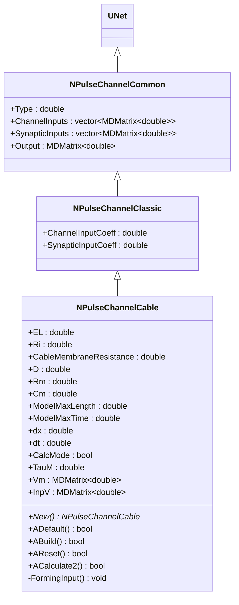
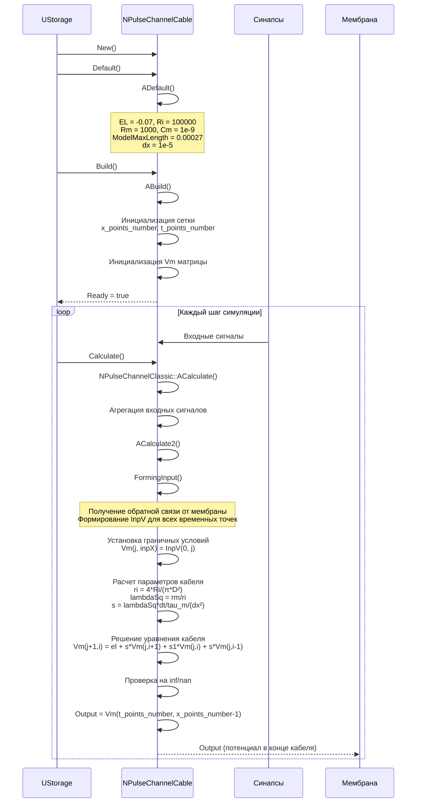
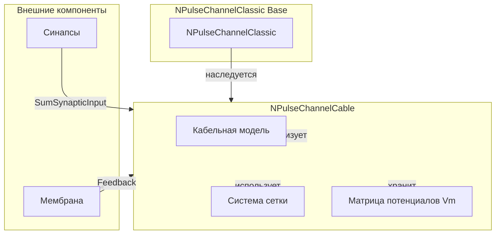
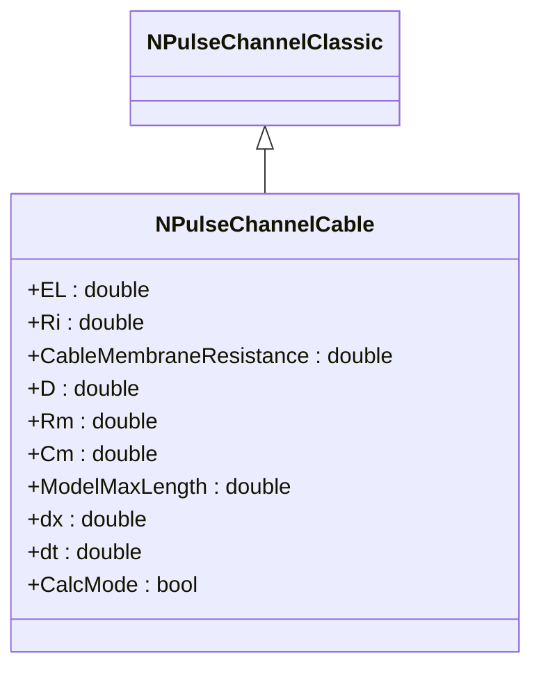
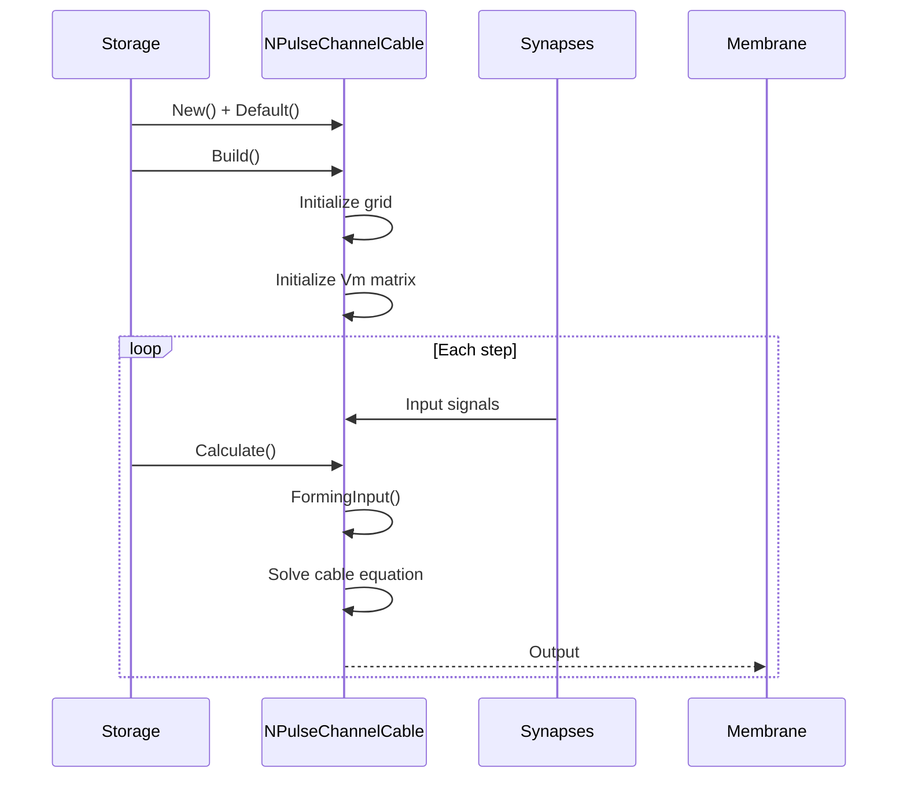
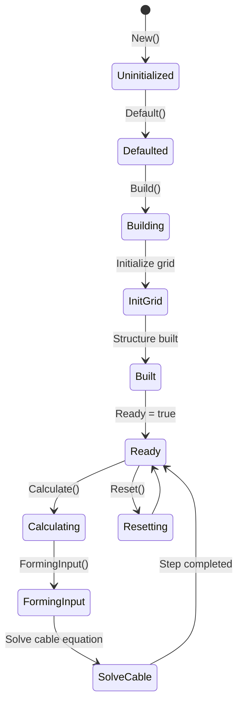
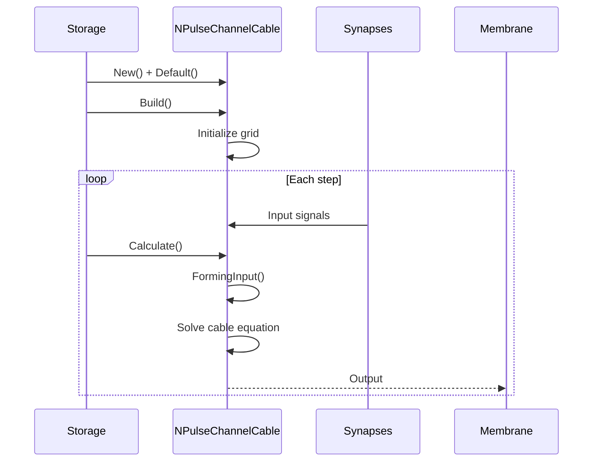
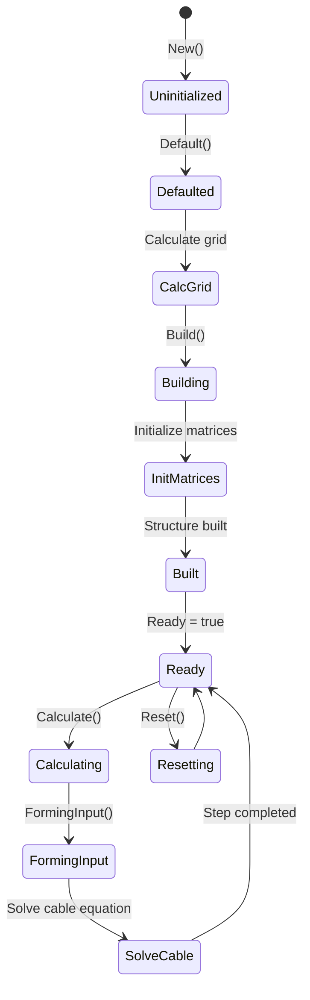
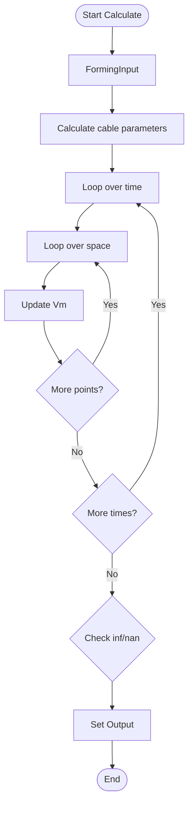
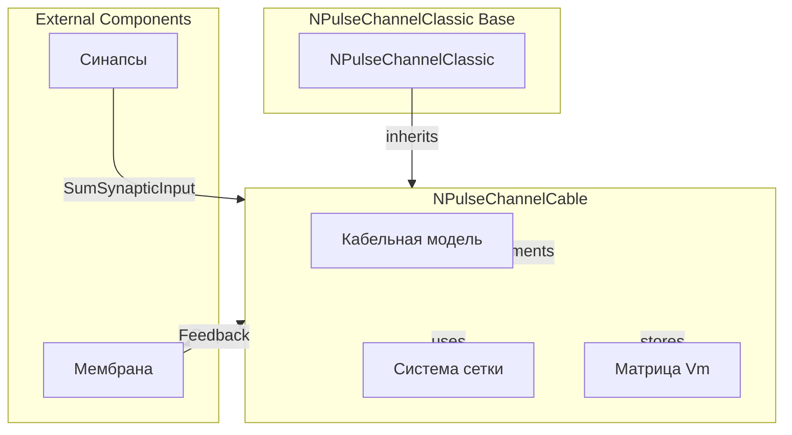

# NPulseChannelCable — кабельный импульсный канал

## RU

### Назначение

**Класс**: `NPulseChannelCable` — импульсный канал для кабельной модели (cable model).  
**Регистрация**: `NPulseLibrary.cpp` → `UploadClass("NPulseChannelCable", ...)`.  
**Storage-инстансы**: `ClassName = "NPulseChannelCable"` в `Bin/Configs/*/Model_*.xml`.

`NPulseChannelCable` реализует кабельный импульсный канал, который использует кабельную модель для расчета распространения потенциала вдоль кабеля. Наследуется от `NPulseChannelClassic` и добавляет параметры кабельной модели: потенциал покоя (`EL`), внутреннее сопротивление (`Ri`), сопротивление мембраны кабеля (`CableMembraneResistance`), диаметр (`D`), сопротивление мембраны (`Rm`), емкость мембраны (`Cm`), максимальная длина модели (`ModelMaxLength`), шаги сетки (`dx`, `dt`).

**Использование:** Кабельная модель распространения потенциала, моделирование дендритов

### UML-диаграмма классов



**Иерархия наследования:**
- `UNet` — базовая сеть Rdk Framework
- `NPulseChannelCommon` — общий импульсный канал
- `NPulseChannelClassic` — классический импульсный канал
- `NPulseChannelCable` — кабельный импульсный канал

### UML-диаграмма последовательности



**Жизненный цикл:**
1. **Инициализация**: Установка параметров кабельной модели по умолчанию
2. **Сборка**: Инициализация сетки (x_points_number, t_points_number), создание матрицы Vm
3. **Расчет**: Формирование входного потенциала, решение уравнения кабеля методом конечных разностей
4. **Выход**: Генерация выходного сигнала (потенциал в конце кабеля)

### UML-диаграмма состояний

```mermaid
stateDiagram-v2
    [*] --> Uninitialized: New()
    Uninitialized --> Defaulted: Default()
    Note over Defaulted: EL = -0.07, Ri = 100000<br/>Rm = 1000, Cm = 1e-9<br/>ModelMaxLength = 0.00027
    Defaulted --> Building: Build()
    Building --> InitGrid: Инициализация сетки
    InitGrid --> CalcPoints: Расчет x_points_number, t_points_number
    CalcPoints --> InitVm: Инициализация матрицы Vm
    InitVm --> Built: Структура создана
    Built --> Ready: Ready = true
    Ready --> Calculating: Calculate()
    Calculating --> AggregateInputs: Агрегация входных сигналов
    AggregateInputs --> FormingInput: FormingInput()
    FormingInput --> SetBoundary: Установка граничных условий
    SetBoundary --> CalcCableParams: Расчет параметров кабеля
    CalcCableParams --> SolveCable: Решение уравнения кабеля
    SolveCable --> CheckInf: Проверка на inf/nan
    CheckInf --> UpdateOutput: Обновление Output
    UpdateOutput --> Ready: Шаг завершен
    Ready --> Resetting: Reset()
    Resetting --> Ready: Vm обнулена
```

**Состояния:**
- **Uninitialized** — создан, но не инициализирован
- **Defaulted** — параметры кабельной модели установлены по умолчанию
- **Building** — выполняется сборка
- **InitGrid** — инициализация сетки для кабельной модели
- **CalcPoints** — расчет количества точек сетки
- **InitVm** — инициализация матрицы потенциалов Vm
- **Built** — структура канала построена
- **Ready** — готов к выполнению расчетов
- **Calculating** — выполняется расчет кабельной модели
- **AggregateInputs** — агрегация входных сигналов
- **FormingInput** — формирование входного потенциала
- **SetBoundary** — установка граничных условий
- **CalcCableParams** — расчет параметров кабеля (ri, lambdaSq, s)
- **SolveCable** — решение уравнения кабеля методом конечных разностей
- **CheckInf** — проверка на inf/nan
- **UpdateOutput** — обновление выходного сигнала
- **Resetting** — выполняется сброс состояний

### UML-диаграмма активности

```mermaid
flowchart TD
    Start([Start Calculate]) --> AggregateInputs[Агрегация SumChannelInput и SumSynapticInput]
    AggregateInputs --> FormingInput[FormingInput]
    FormingInput --> GetFeedback[Получение обратной связи от мембраны]
    GetFeedback --> FormInpV[Формирование InpV для всех временных точек]
    FormInpV --> SetBoundary[Установка граничных условий<br/>Vm(j, inpX) = InpV(0, j)]
    SetBoundary --> CalcParams[Расчет параметров кабеля<br/>ri = 4*Ri/(π*D²)<br/>lambdaSq = rm/ri<br/>s = lambdaSq*dt/tau_m/(dx²)<br/>s1 = 1 - dt/tau_m - 2*s]
    CalcParams --> LoopTime[Цикл по времени j = 0..t_points_number-1]
    LoopTime --> LoopSpace[Цикл по пространству i = 1..x_points_number-1]
    LoopSpace --> SolveEquation[Vm(j+1,i) = el + s*Vm(j,i+1) + s1*Vm(j,i) + s*Vm(j,i-1)]
    SolveEquation --> NextSpace{Еще точки?}
    NextSpace -->|Да| LoopSpace
    NextSpace -->|Нет| NextTime{Еще времена?}
    NextTime -->|Да| LoopTime
    NextTime -->|Нет| CheckInf{isnan или isinf?}
    CheckInf -->|Да| SetError[Output = -1]
    CheckInf -->|Нет| SetOutput[Output = Vm(t_points_number, x_points_number-1)]
    SetError --> End([End])
    SetOutput --> End
```

**Алгоритм расчета:**
1. Агрегация входных сигналов от синапсов и каналов
2. Формирование входного потенциала: получение обратной связи от мембраны, формирование InpV для всех временных точек
3. Установка граничных условий: Vm(j, inpX) = InpV(0, j) для всех временных точек
4. Расчет параметров кабеля: ri, lambdaSq, s, s1
5. Решение уравнения кабеля методом конечных разностей: двойной цикл по времени и пространству
6. Проверка на inf/nan: если обнаружено, Output = -1, иначе Output = потенциал в конце кабеля

### UML-диаграмма компонентов



**Зависимости:**
- **Базовый класс**: `NPulseChannelClassic`
- **Внутренние компоненты**: кабельная модель, система сетки, матрица потенциалов Vm
- **Внешние компоненты**: синапсы (источники входных сигналов), мембрана (получатель выходного сигнала и источник обратной связи)

### Свойства

#### Параметры (ptPubParameter)

- **`EL`** (double) — потенциал покоя (В). Значение по умолчанию: -0.07 (-70 мВ)

- **`Ri`** (double) — внутреннее сопротивление (Ом·м²). Значение по умолчанию: 100000 (100 кОм·м²)

- **`CableMembraneResistance`** (double) — сопротивление мембраны кабеля (Ом). Значение по умолчанию: 1e7 (10 МОм)

- **`D`** (double) — диаметр кабеля (м). Вычисляется из `CableMembraneResistance` и `Rm`, если `CalcMode = false`. Значение по умолчанию: вычисляется

- **`Rm`** (double) — сопротивление мембраны (Ом·м²). Значение по умолчанию: 1000 (1 кОм·м²)

- **`Cm`** (double) — емкость мембраны (Ф). Значение по умолчанию: 1.0e-9 (1 нФ)

- **`ModelMaxLength`** (double) — максимальная длина модели (м). Значение по умолчанию: 0.00027 (270 мкм)

- **`dx`** (double) — шаг по пространству (м). Значение по умолчанию: 1e-5 (10 мкм)

- **`CalcMode`** (bool) — режим расчета:
  - `false` — вычислять `D` из `CableMembraneResistance` и `Rm`
  - `true` — вычислять `CableMembraneResistance` из `D` и `Rm`
  Значение по умолчанию: `false`

#### Состояния (ptPubState)

- **`ModelMaxTime`** (double) — максимальное время модели (сек). Вычисляется как `1.0/TimeStep`. Значение по умолчанию: вычисляется

- **`dt`** (double) — шаг по времени (сек). Вычисляется на основе `dx`, `Ri`, `Rm`, `Cm`. Значение по умолчанию: вычисляется

- **`TauM`** (double) — временная константа мембраны. Вычисляется как `CableMembraneResistance * Cm`. Значение по умолчанию: вычисляется

- **`Vm`** (MDMatrix<double>) — матрица потенциалов (время × пространство). Размер: `(t_points_number+1) × (x_points_number+1)`. Значение по умолчанию: инициализируется в `AReset()`

- **`InpV`** (MDMatrix<double>) — входной потенциал (время). Размер: `1 × (t_points_number+1)`. Значение по умолчанию: вычисляется в `FormingInput()`

### Методы

- **`FormingInput()`** → `void` — формирует входной потенциал:
  1. Получает информацию об обратной связи от мембраны
  2. Формирует входной потенциал для всех временных точек

- **`ACalculate2()`** → `bool` — выполняет расчет кабельной модели:
  1. Формирует входной потенциал (`FormingInput()`)
  2. Устанавливает граничные условия (вход в точке `inpX = 0`)
  3. Решает уравнение кабеля методом конечных разностей
  4. Выдает потенциал в конце кабеля как выходной сигнал

### Примеры использования

#### Пример 1: Создание кабельного канала в коде C++

```cpp
// Создание кабельного канала
auto channel = storage->CreateComponent<NPulseChannelCable>();
channel->SetName("CableChannel");

// Инициализация
channel->Default();

// Настройка параметров
channel->EL = -0.07;  // -70 мВ
channel->Ri = 100000;  // 100 кОм·м²
channel->Rm = 1000;  // 1 кОм·м²
channel->Cm = 1.0e-9;  // 1 нФ
channel->ModelMaxLength = 0.00027;  // 270 мкм
channel->dx = 1e-5;  // 10 мкм
channel->CalcMode = false;

// Сборка
channel->Build();
```

### Использование в конфигурациях

`NPulseChannelCable` используется в экспериментах с кабельной моделью:

- **Кабельная модель**: `Bin/Configs/!OldConfigs/*/Model_*.xml` (где требуется кабельная модель распространения потенциала)

**Типичные значения параметров:**
- **EL**: -0.07 (-70 мВ, потенциал покоя)
- **Ri**: 100000 (100 кОм·м², внутреннее сопротивление)
- **Rm**: 1000 (1 кОм·м², сопротивление мембраны)
- **Cm**: 1.0e-9 (1 нФ, емкость мембраны)
- **ModelMaxLength**: 0.00027 (270 мкм, максимальная длина модели)
- **dx**: 1e-5 (10 мкм, шаг по пространству)
- **CalcMode**: false (вычислять D из CableMembraneResistance и Rm)

### Использование в конфигурациях

`NPulseChannelCable` используется в экспериментах с кабельной моделью:

- **Кабельная модель**: `Bin/Configs/!OldConfigs/*/Model_*.xml` (где требуется моделирование распространения потенциала вдоль кабеля)

**Типичные значения параметров:**
- **EL**: -0.07 (-70 мВ, потенциал покоя)
- **Ri**: 100000 (100 кОм·м², внутреннее сопротивление)
- **Rm**: 1000 (1 кОм·м², сопротивление мембраны)
- **Cm**: 1.0e-9 (1 нФ, емкость мембраны)
- **ModelMaxLength**: 0.00027 (270 мкм, максимальная длина модели)
- **dx**: 1e-5 (10 мкм, шаг по пространству)
- **dt**: 1.0e-7 (0.1 мкс, шаг по времени)
- **CalcMode**: false (вычислять D из CableMembraneResistance и Rm)

### См. также

- [`NPulseChannelClassic`](NPulseChannelClassic.md) — классический импульсный канал (базовый класс)
- [`NPulseChannelCableMulti`](NPulseChannelCableMulti.md) — многоканальный кабельный канал
- [`NPulseMembraneCable`](NPulseMembraneCable.md) — кабельная мембрана
- [Architecture.md](../Architecture.md) — архитектура библиотеки

---

## EN

### Purpose

**Class**: `NPulseChannelCable` — spiking channel for cable model.  
**Registration**: `NPulseLibrary.cpp` → `UploadClass("NPulseChannelCable", ...)`.  
**Instances**: `ClassName = "NPulseChannelCable"` in `Bin/Configs/*/Model_*.xml`.

`NPulseChannelCable` implements cable spiking channel that uses cable model for calculating potential propagation along cable. Inherits from `NPulseChannelClassic` and adds cable model parameters: resting potential (`EL`), internal resistance (`Ri`), cable membrane resistance (`CableMembraneResistance`), diameter (`D`), membrane resistance (`Rm`), membrane capacitance (`Cm`), model max length (`ModelMaxLength`), grid steps (`dx`, `dt`).

**Usage:** Cable model potential propagation, dendrite modeling

### UML Class Diagram



### UML Sequence Diagram



### UML State Diagram



### UML Activity Diagram

```mermaid
flowchart TD
    Start([Start Calculate]) --> AggregateInputs[Aggregate inputs]
    AggregateInputs --> FormingInput[FormingInput]
    FormingInput --> SetBoundary[Set boundary conditions]
    SetBoundary --> CalcParams[Calculate cable parameters]
    CalcParams --> SolveCable[Solve cable equation]
    SolveCable --> CheckInf{Check inf/nan}
    CheckInf -->|Error| SetError[Output = -1]
    CheckInf -->|OK| SetOutput[Output = Vm(end)]
    SetError --> End([End])
    SetOutput --> End
```

### UML Sequence Diagram



### UML State Diagram



### UML Activity Diagram



### UML Component Diagram



### See Also

- [`NPulseChannelClassic`](NPulseChannelClassic.md) — classic spiking channel (base class)
- [`NPulseChannelCableMulti`](NPulseChannelCableMulti.md) — multi-channel cable channel
- [`NPulseMembraneCable`](NPulseMembraneCable.md) — cable membrane
- [Architecture.md](../Architecture.md) — library architecture
