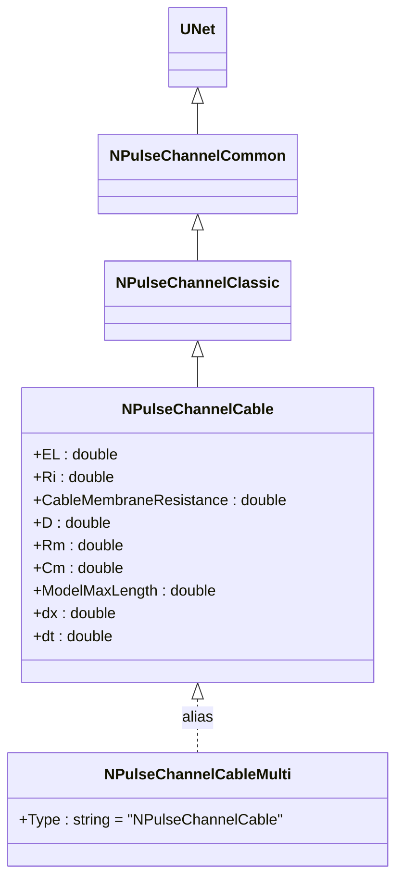
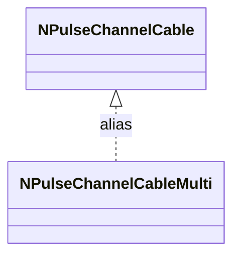
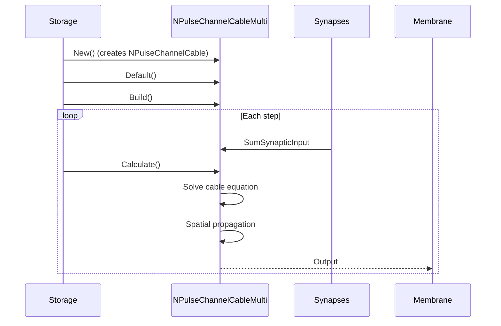
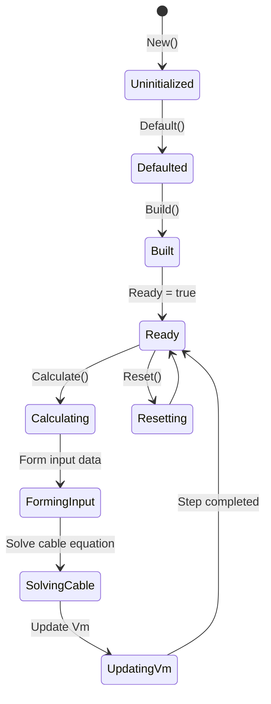
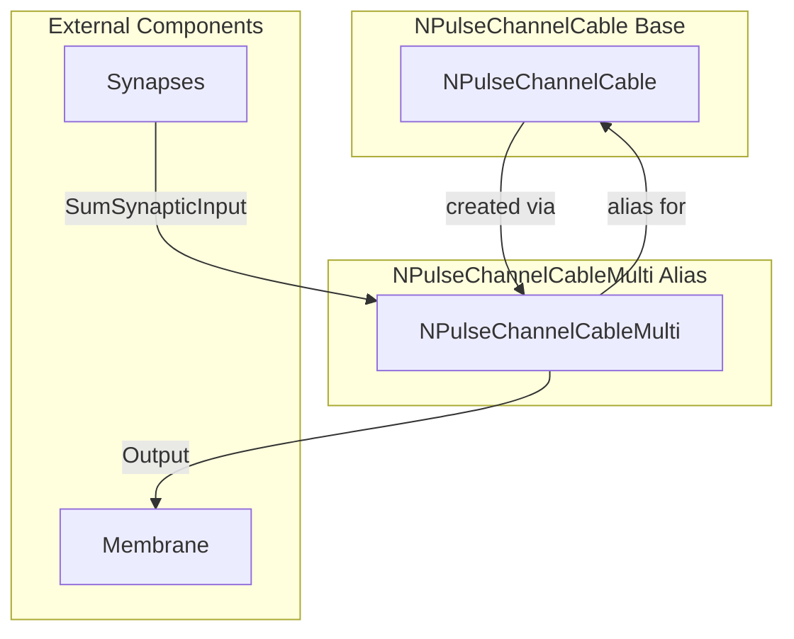

# NPulseChannelCableMulti — многоканальный кабельный импульсный канал

## RU

### Назначение

**Класс**: `NPulseChannelCableMulti` — алиас для класса `NPulseChannelCable`.  
**Регистрация**: `NPulseLibrary.cpp` → `UploadClass("NPulseChannelCableMulti", ...)`.  
**Storage-инстансы**: `ClassName = "NPulseChannelCableMulti"` в `Bin/Configs/*/Model_*.xml`.

`NPulseChannelCableMulti` является алиасом (синонимом) для класса `NPulseChannelCable`. При создании компонента с `ClassName = "NPulseChannelCableMulti"` фактически создается экземпляр класса `NPulseChannelCable` с параметрами по умолчанию.

`NPulseChannelCable` реализует кабельный импульсный канал, который использует кабельную модель для расчета распространения потенциала вдоль кабеля.

**Использование:** Упрощенное именование при конфигурации, многоканальные кабельные модели

### UML-диаграмма классов



**Иерархия наследования:**
- `UNet` — базовая сеть Rdk Framework
- `NPulseChannelCommon` — общий импульсный канал
- `NPulseChannelClassic` — классический импульсный канал
- `NPulseChannelCable` — кабельный импульсный канал
- `NPulseChannelCableMulti` — алиас для `NPulseChannelCable`

### Свойства

`NPulseChannelCableMulti` использует все свойства базового класса `NPulseChannelCable` с параметрами по умолчанию.

### Методы

`NPulseChannelCableMulti` использует все методы базового класса `NPulseChannelCable`.

### Примеры использования

#### Пример 1: Создание канала в коде C++

```cpp
// Создание многоканального кабельного канала
auto channel = storage->CreateComponent("NPulseChannelCableMulti");
channel->SetName("CableChannelMulti");

// Инициализация (использует параметры по умолчанию)
channel->Default();

// Использование
channel->Build();
```

### См. также

- [`NPulseChannelCable`](NPulseChannelCable.md) — кабельный импульсный канал (базовый класс)
- [`NPulseMembraneCableMulti`](NPulseMembraneCableMulti.md) — многоканальная кабельная мембрана
- [Architecture.md](../Architecture.md) — архитектура библиотеки

---

## EN

### Purpose

**Class**: `NPulseChannelCableMulti` — alias for `NPulseChannelCable` class.  
**Registration**: `NPulseLibrary.cpp` → `UploadClass("NPulseChannelCableMulti", ...)`.  
**Instances**: `ClassName = "NPulseChannelCableMulti"` in `Bin/Configs/*/Model_*.xml`.

`NPulseChannelCableMulti` is an alias (synonym) for the `NPulseChannelCable` class. When creating a component with `ClassName = "NPulseChannelCableMulti"`, an instance of `NPulseChannelCable` with default parameters is actually created.

**Usage:** Simplified naming in configurations, multi-channel cable models

### UML Class Diagram



### UML Sequence Diagram



### UML State Diagram



### UML Activity Diagram

```mermaid
flowchart TD
    Start([Start Calculate]) --> FormingInput[Form input data]
    FormingInput --> SolveCable[Solve cable equation]
    Note over SolveCable: dV/dt = D * d²V/dx² - (V - EL) / TauM + I/Cm
    SolveCable --> UpdateVm[Update Vm for all spatial points]
    UpdateVm --> End([End])
```

### UML Component Diagram



### Usage in configurations

`NPulseChannelCableMulti` is used as an alias for `NPulseChannelCable`:

- **Multi-channel cable models**: `Bin/Configs/!OldConfigs/*/Model_*.xml` (where multi-channel cable channels are required)
- **Simplified naming**: Provides clearer naming in configurations for multi-channel setups

**Features:**
- Alias: creates `NPulseChannelCable` instance with default parameters
- Same functionality as `NPulseChannelCable`
- Used in multi-channel cable membrane configurations

### See Also

- [`NPulseChannelCable`](NPulseChannelCable.md) — cable spiking channel (base class)
- [`NPulseMembraneCableMulti`](NPulseMembraneCableMulti.md) — multi-channel cable membrane
- [Architecture.md](../Architecture.md) — library architecture
