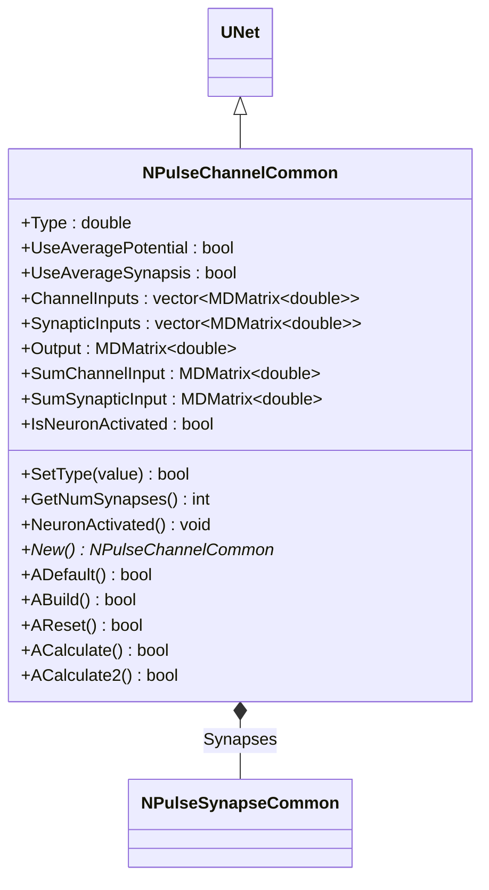
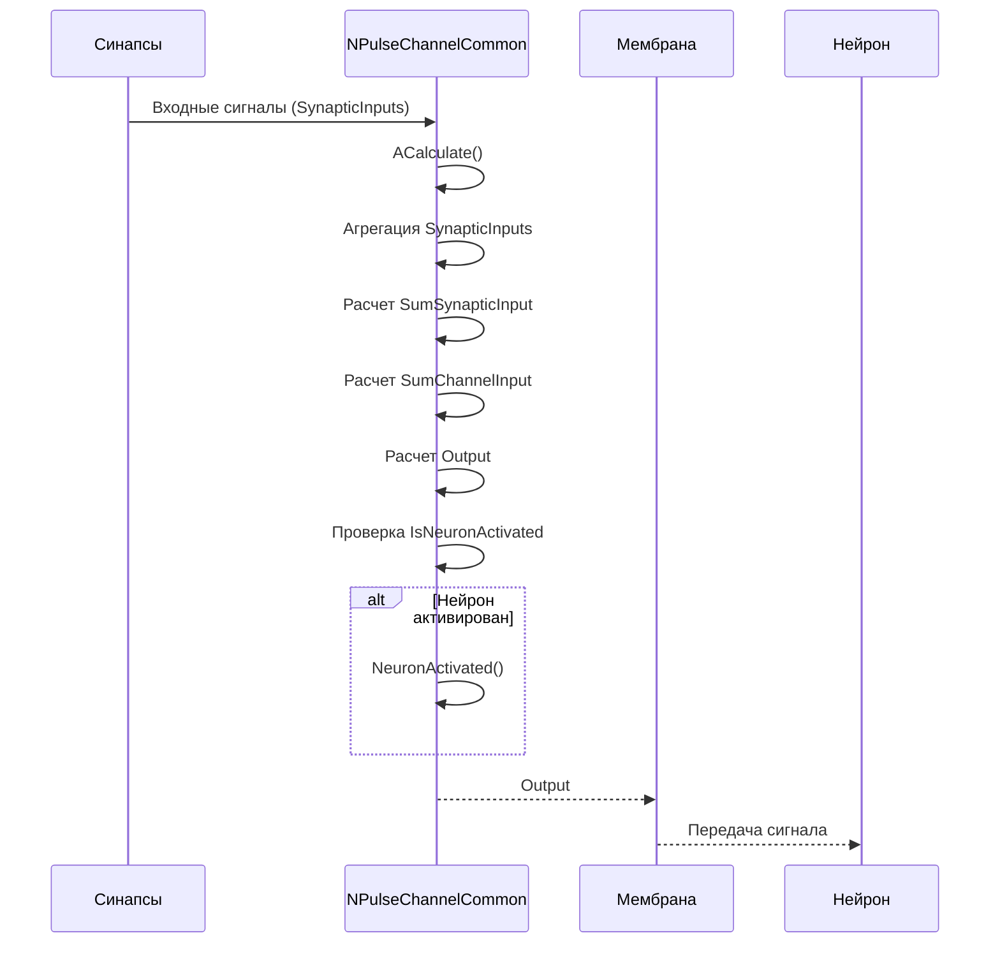
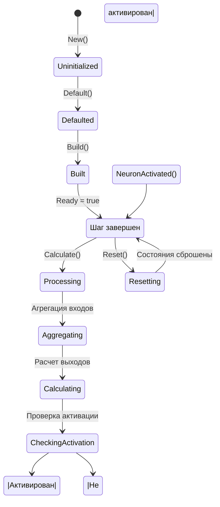
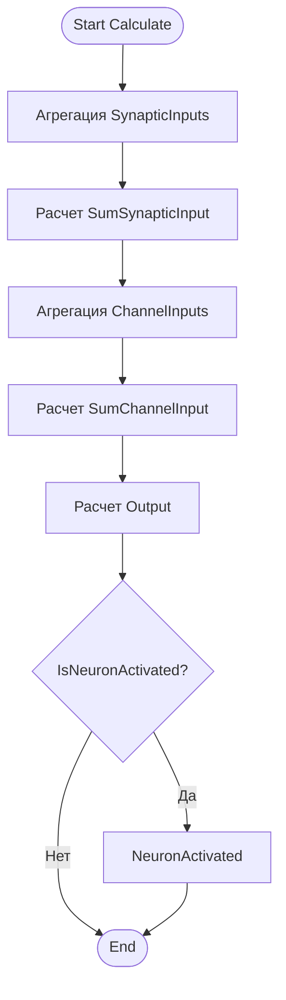
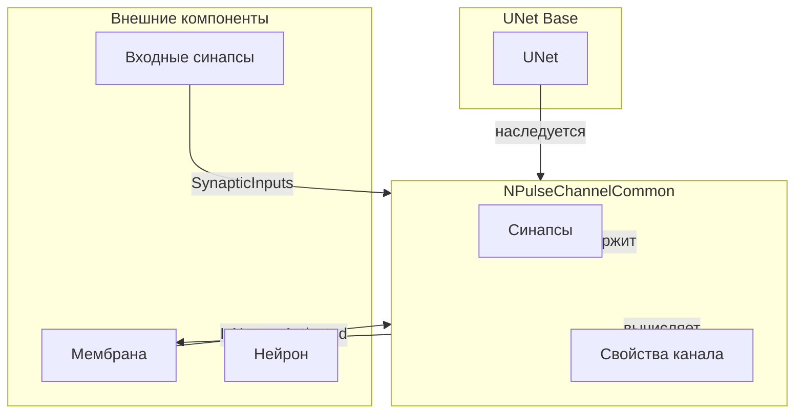
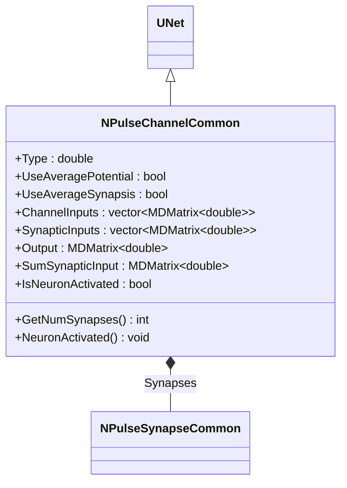
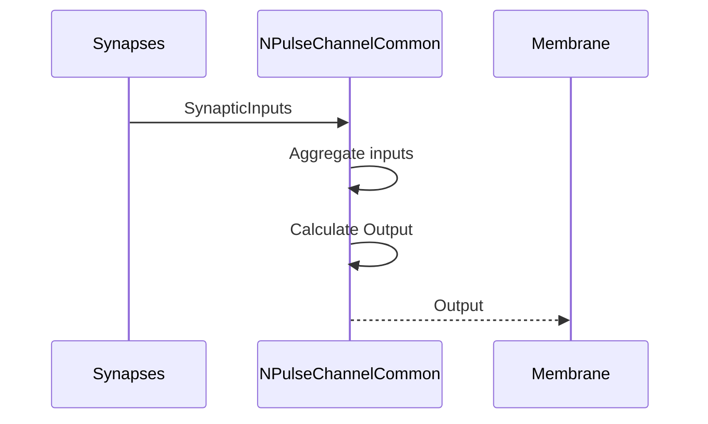
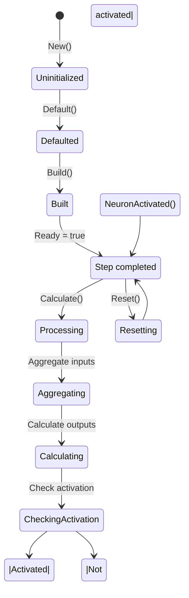
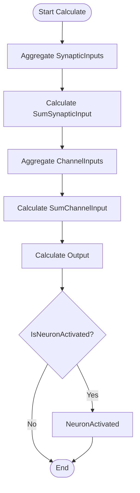
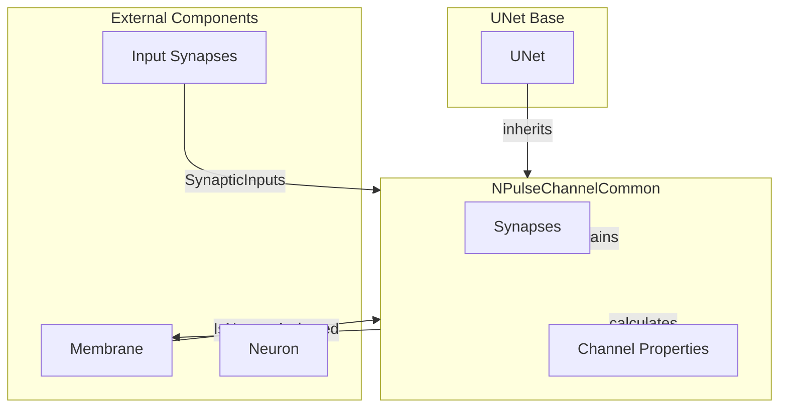

# NPulseChannelCommon — общий импульсный канал

## RU

### Назначение

**Класс**: `NPulseChannelCommon` — базовый класс для импульсных каналов с общей функциональностью.  
**Регистрация**: `NPulseLibrary.cpp` → `UploadClass("NPulseChannelCommon", ...)`.  
**Storage-инстансы**: `ClassName = "NPulseChannelCommon"` (обычно используется через наследников).

`NPulseChannelCommon` является базовым классом для всех импульсных каналов в библиотеке PulseLib. Наследуется от `UNet` и предоставляет базовую функциональность для передачи импульсов от синапсов к мембране, агрегации входных сигналов и отслеживания активности нейрона.

### UML-диаграмма классов



**Иерархия наследования:**
- `UNet` (Rdk) — базовый класс для сетей компонентов
- `NPulseChannelCommon` — общий импульсный канал

**Ключевые свойства:**
- Параметры канала: `Type`, `UseAveragePotential`, `UseAverageSynapsis`
- Входы: `ChannelInputs`, `SynapticInputs` (векторы входных сигналов)
- Выходы: `Output`, `SumChannelInput`, `SumSynapticInput`
- Состояние: `IsNeuronActivated` — флаг активации нейрона

### UML-диаграмма последовательности



**Жизненный цикл:**
1. **Инициализация**: Установка параметров по умолчанию
2. **Сборка**: Построение структуры канала
3. **Расчет**: Агрегация входных сигналов от синапсов, расчет выходного сигнала
4. **Активация**: При активации нейрона вызывается `NeuronActivated()`

### UML-диаграмма состояний



**Состояния:**
- **Uninitialized** — создан, но не инициализирован
- **Defaulted** — параметры установлены по умолчанию
- **Built** — структура канала построена
- **Ready** — готов к обработке сигналов
- **Processing** — обработка входных сигналов
- **Aggregating** — агрегация входных сигналов от синапсов
- **Calculating** — расчет выходных сигналов
- **CheckingActivation** — проверка активации нейрона
- **NeuronActivated** — обработка активации нейрона
- **Resetting** — выполняется сброс состояний

### UML-диаграмма активности



**Алгоритм расчета:**
1. Агрегация входных сигналов от синапсов (`SynapticInputs`)
2. Расчет суммарного синаптического входа (`SumSynapticInput`)
3. Агрегация входных сигналов канала (`ChannelInputs`)
4. Расчет суммарного входа канала (`SumChannelInput`)
5. Расчет выходного сигнала (`Output`)
6. Проверка активации нейрона и вызов `NeuronActivated()` при необходимости

### UML-диаграмма компонентов



**Зависимости:**
- **Базовый класс**: `UNet`
- **Внутренние компоненты**: `NPulseSynapseCommon` (синапсы)
- **Внешние компоненты**: входные синапсы (источники `SynapticInputs`), мембрана (получатель `Output`), нейрон (источник сигнала активации)

### Свойства

#### Параметры (ptPubParameter)

- **`Type`** (double) — тип канала:
  - < 0 — тормозной (ингибиторный) канал
  - > 0 — возбуждающий (эксайтаторный) канал
  Значение по умолчанию: зависит от реализации

- **`UseAveragePotential`** (bool) — использовать усреднение потенциалов. Если `true`, канал использует усреднение входных потенциалов. Значение по умолчанию: `false`

- **`UseAverageSynapsis`** (bool) — использовать усреднение синапсов. Если `true`, канал использует усреднение входных сигналов от синапсов. Значение по умолчанию: `false`

#### Входные свойства (ptInput | ptPubState)

- **`ChannelInputs`** (vector<MDMatrix<double>>) — вектор входных сигналов канала. Может содержать несколько входных сигналов от различных источников.

- **`SynapticInputs`** (vector<MDMatrix<double>>) — вектор входных сигналов от синапсов. Содержит сигналы от всех подключенных синапсов.

#### Выходные свойства (ptOutput | ptPubState)

- **`Output`** (MDMatrix<double>) — выходной сигнал канала. Рассчитывается на основе агрегированных входных сигналов.

- **`SumChannelInput`** (MDMatrix<double>) — суммарный входной сигнал канала. Сумма всех сигналов из `ChannelInputs`.

- **`SumSynapticInput`** (MDMatrix<double>) — суммарный синаптический вход. Сумма всех сигналов из `SynapticInputs`.

#### Состояния (ptPubState)

- **`IsNeuronActivated`** (bool) — флаг активации нейрона. Устанавливается в `true`, когда нейрон генерирует спайк. Используется для обработки событий активации.

### Методы

#### Публичные методы

- **`New()`** → `NPulseChannelCommon*` — создает новый экземпляр класса.

- **`GetNumSynapses()`** → `int` — возвращает количество синапсов, подключенных к каналу.

- **`SetType(const double &value)`** → `bool` — устанавливает тип канала.

- **`NeuronActivated()`** → `void` — вызывается при активации нейрона. Виртуальный метод, может быть переопределен в производных классах для обработки событий активации.

#### Защищенные методы жизненного цикла

- **`ADefault()`** → `bool` — инициализирует параметры по умолчанию. Устанавливает параметры канала, инициализирует выходные матрицы.

- **`ABuild()`** → `bool` — строит структуру канала. Базовая реализация не выполняет дополнительных действий.

- **`AReset()`** → `bool` — сбрасывает состояния канала. Обнуляет выходные сигналы, сбрасывает флаг активации.

- **`ACalculate()`** → `bool` — выполняет расчет канала на одном шаге. Агрегирует входные сигналы, рассчитывает выходной сигнал, проверяет активацию нейрона.

- **`ACalculate2()`** → `bool` — виртуальный метод для дополнительных расчетов. Должен быть переопределен в производных классах.

- **`AAddComponent(UEPtr<UContainer> comp)`** → `bool` — обрабатывает добавление компонента. Регистрирует синапсы в канале.

- **`ADelComponent(UEPtr<UContainer> comp)`** → `bool` — обрабатывает удаление компонента. Удаляет синапс из канала.

- **`CheckComponentType(UEPtr<UContainer> comp)`** → `bool` — проверяет допустимость типа компонента. Разрешает добавление `NPulseSynapseCommon`.

### Примеры использования

#### Пример 1: Создание канала в коде C++

```cpp
// Создание канала
auto channel = storage->CreateComponent<NPulseChannelCommon>();
channel->SetName("Channel1");

// Инициализация
channel->Default();

// Настройка параметров
channel->Type = 1.0;                    // Возбуждающий канал
channel->UseAveragePotential = false;
channel->UseAverageSynapsis = false;

// Добавление синапсов
auto synapse1 = storage->CreateComponent<NSynapseStdp>();
channel->AddComponent(synapse1);

auto synapse2 = storage->CreateComponent<NSynapseStdp>();
channel->AddComponent(synapse2);

// Сборка
channel->Build();

// Использование
for (int step = 0; step < 1000; step++) {
    channel->Calculate();
    double output = channel->Output(0, 0);
    double sumSynaptic = channel->SumSynapticInput(0, 0);
    std::cout << "Step " << step << ": Output = " << output 
              << ", SumSynaptic = " << sumSynaptic << std::endl;
}
```

#### Пример 2: Конфигурация XML

```xml
<InhChannel Class="NPulseChannelCommon">
    <Parameters>
        <Type>1</Type>
        <UseAveragePotential>0</UseAveragePotential>
        <UseAverageSynapsis>0</UseAverageSynapsis>
    </Parameters>
    <Components>
        <Synapse1 Class="NSynapseStdp">
            <!-- Параметры синапса -->
        </Synapse1>
        <Synapse2 Class="NSynapseStdp">
            <!-- Параметры синапса -->
        </Synapse2>
    </Components>
</InhChannel>
```

### Использование в конфигурациях

`NPulseChannelCommon` обычно не используется напрямую в конфигурациях. Вместо него используются специализированные классы:

- `NPulseChannelIzhikevich` — для каналов модели Ижикевича
- `NPulseChannelIaF` — для каналов модели IaF
- `NPExcChannelBio` — для биоинспирированных возбуждающих каналов
- `NPInhChannelBio` — для биоинспирированных тормозных каналов

## Источники

См. [Literature-References.md](../Literature-References.md): **[A]**, **4**, **25**, **29**.

### См. также

- [`NPulseChannelIzhikevich`](NPulseChannelIzhikevich.md) — канал модели Ижикевича
- [`NPulseChannelIaF`](NPulseChannelIaF.md) — канал модели IaF
- [`NPulseMembraneCommon`](NPulseMembraneCommon.md) — общая мембрана
- [`NPulseSynapseCommon`](NPulseSynapseCommon.md) — общий синапс
- [Architecture.md](../Architecture.md) — архитектура библиотеки

---

## EN

### Purpose

**Class**: `NPulseChannelCommon` — base class for spiking channels with common functionality.  
**Registration**: `NPulseLibrary.cpp` → `UploadClass("NPulseChannelCommon", ...)`.  
**Instances**: `ClassName = "NPulseChannelCommon"` (typically used via derived classes).

`NPulseChannelCommon` is the base class for all spiking channels in the PulseLib library. It inherits from `UNet` and provides basic functionality for transmitting impulses from synapses to membrane, aggregating input signals, and tracking neuron activity.

### UML Class Diagram



### UML Sequence Diagram



### UML State Diagram



### UML Activity Diagram



### UML Component Diagram



### Properties

`NPulseChannelCommon` uses the following properties:

**Parameters:**
- `Type` (double) — channel type (-1 for excitatory, 1 for inhibitory)
- `UseAveragePotential` (bool) — use averaging for potentials
- `UseAverageSynapsis` (bool) — use averaging for synapses

**Input properties:**
- `ChannelInputs` (vector<MDMatrix<double>>) — vector of channel input signals
- `SynapticInputs` (vector<MDMatrix<double>>) — vector of synaptic input signals

**Output properties:**
- `Output` (MDMatrix<double>) — channel output signal
- `SumChannelInput` (MDMatrix<double>) — sum of channel inputs
- `SumSynapticInput` (MDMatrix<double>) — sum of synaptic inputs
- `IsNeuronActivated` (bool) — flag indicating neuron activation

**Internal components:**
- `Synapses` (vector<NPulseSynapseCommon*>) — vector of synapses

### Methods

`NPulseChannelCommon` uses the following methods:

- `SetType(value)` → `bool` — set channel type
- `GetNumSynapses()` → `int` — get number of synapses
- `NeuronActivated()` → `void` — called when neuron is activated
- `ADefault()` → `bool` — initialize default parameters
- `ABuild()` → `bool` — build channel structure
- `AReset()` → `bool` — reset channel state
- `ACalculate()` → `bool` — perform one calculation step

### Usage in configurations

`NPulseChannelCommon` is used as a base class for all spiking channels:

- **Base class**: Used as base for all spiking channel types
- **Synapse aggregation**: Aggregates signals from multiple synapses
- **Signal transmission**: Transmits signals from synapses to membrane
- **Activity tracking**: Tracks neuron activation

**Features:**
- Multiple synapses: supports multiple synapses per channel
- Input aggregation: aggregates channel and synaptic inputs
- Type support: supports excitatory and inhibitory channels
- Activity tracking: tracks neuron activation state

**Typical parameter values:**
- **Type**: -1 (excitatory) or 1 (inhibitory)
- **UseAveragePotential**: false (do not use averaging)
- **UseAverageSynapsis**: false (do not use averaging)

### References

See [Literature-References.md](../Literature-References.md): **[A]**, **4**, **25**, **29**.

### See Also

- [`NPulseChannelIzhikevich`](NPulseChannelIzhikevich.md) — Izhikevich channel
- [`NPulseChannelIaF`](NPulseChannelIaF.md) — IaF channel
- [`NPulseMembraneCommon`](NPulseMembraneCommon.md) — common membrane
- [`NPulseSynapseCommon`](NPulseSynapseCommon.md) — common synapse
- [Architecture.md](../Architecture.md) — library architecture
