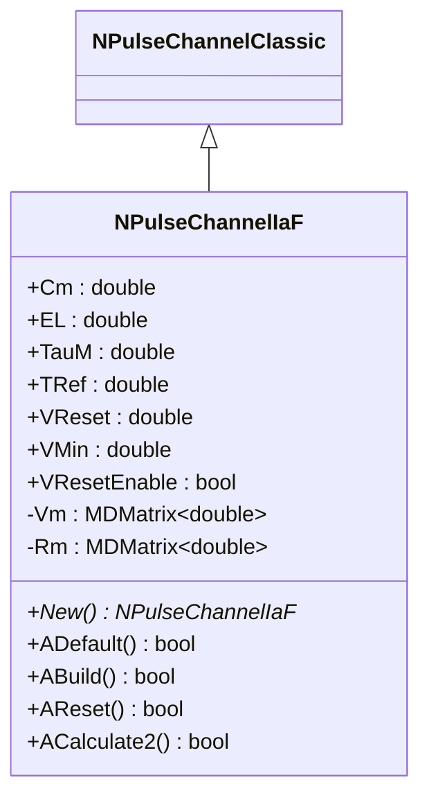
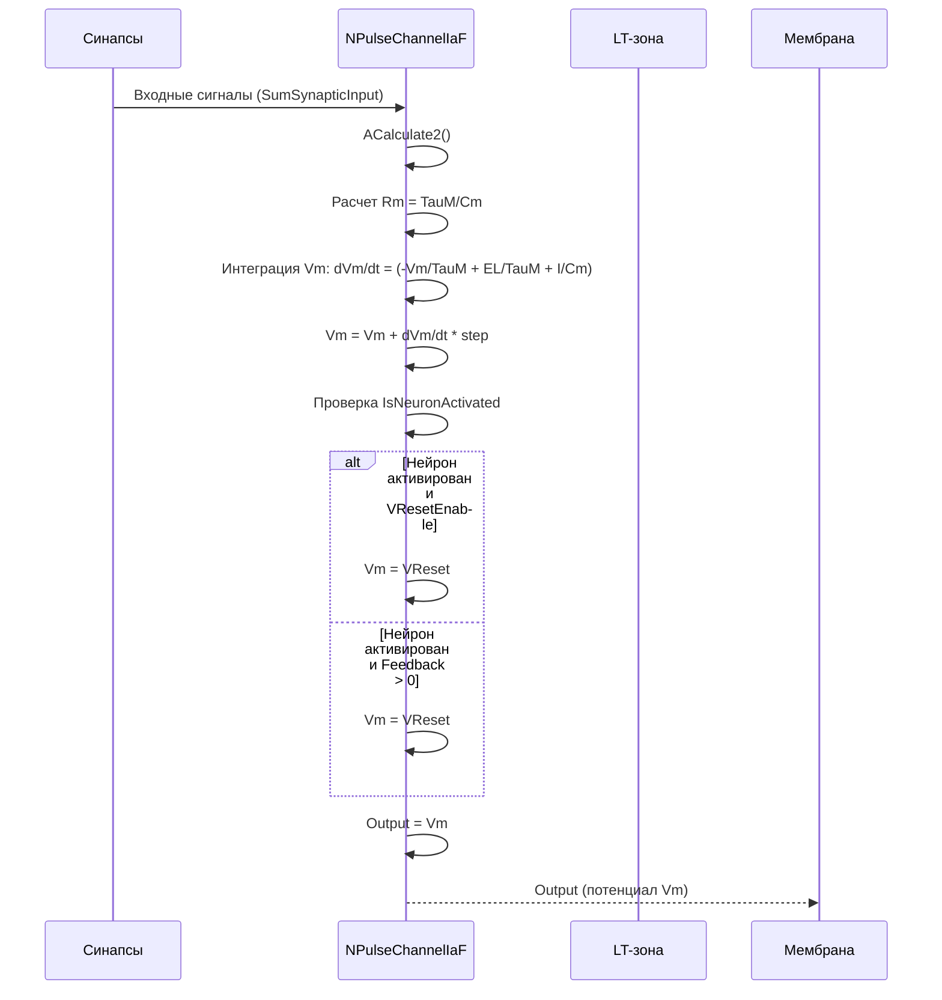
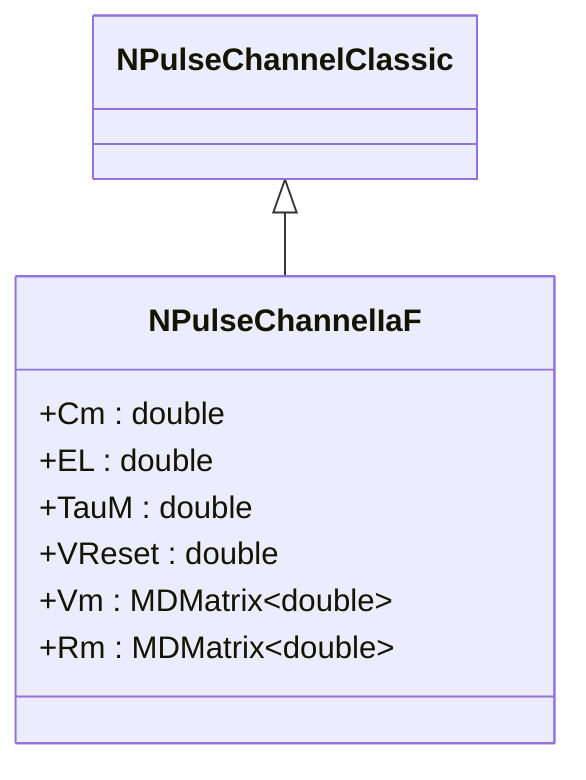
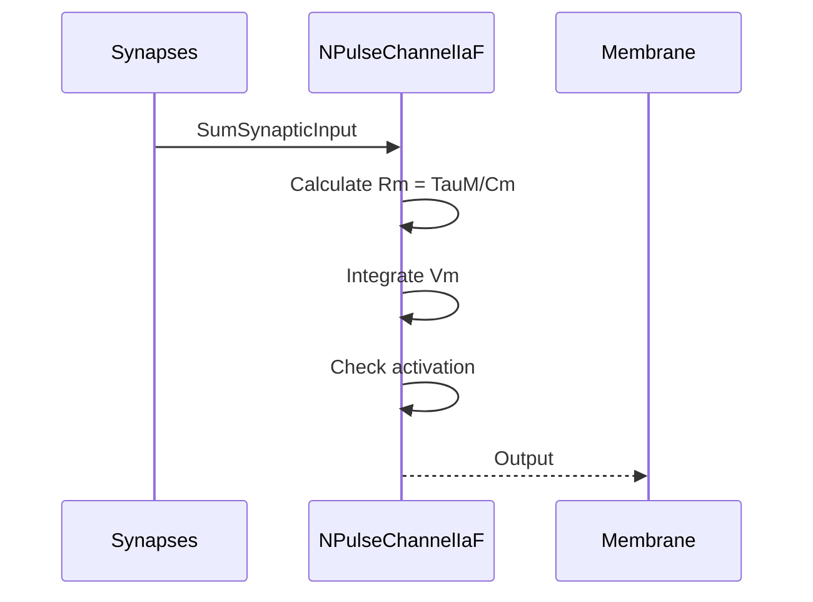
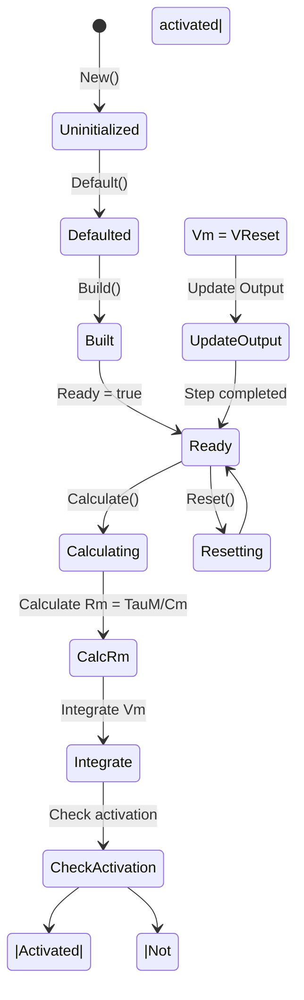
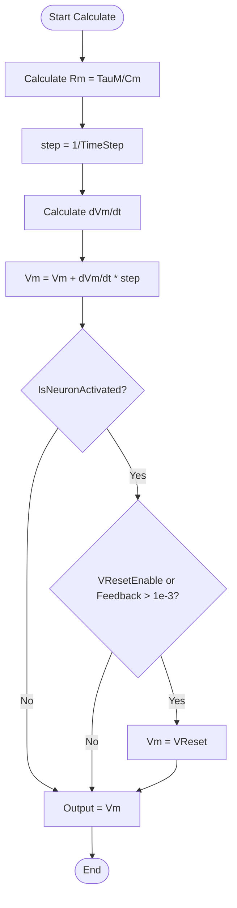

# NPulseChannelIaF — канал модели Integrate-and-Fire

## RU

### Назначение

**Класс**: `NPulseChannelIaF` — канал модели Integrate-and-Fire для импульсных нейронов.  
**Аббревиатура**: `IaF` — **I**ntegrate and **F**ire (интегрировать и стрелять).  
**Регистрация**: `NPulseLibrary.cpp` → `UploadClass("NPulseChannelIaF", ...)`.  
**Storage-инстансы**: `ClassName = "NPulseChannelIaF"` в `Bin/Configs/*/Model_*.xml`.

`NPulseChannelIaF` реализует канал модели Integrate-and-Fire (IaF), который интегрирует мембранный потенциал согласно простой модели IaF. Используется в мембранах нейронов модели IaF (`NPulseMembraneIaF`).

**Использование:** Эксперименты с нейронами модели IaF, обучение нейросетей

### UML-диаграмма классов



**Иерархия наследования:**
- `NPulseChannelClassic` — классический импульсный канал
- `NPulseChannelIaF` — канал модели IaF

**Ключевые свойства:**
- Параметры модели: `Cm` (емкость), `EL` (потенциал покоя), `TauM` (постоянная времени), `VReset` (потенциал сброса)
- Состояния: `Vm` (мембранный потенциал), `Rm` (мембранное сопротивление)

### UML-диаграмма последовательности



**Жизненный цикл:**
1. **Инициализация**: Установка параметров модели IaF по умолчанию
2. **Сброс**: Инициализация `Vm=EL`, `Rm=TauM/Cm`
3. **Расчет**: Интеграция уравнения модели IaF
4. **Активация**: При активации нейрона выполняется сброс `Vm=VReset` (если включено)
5. **Выход**: Генерация выходного сигнала `Vm`

### UML-диаграмма состояний

```mermaid
stateDiagram-v2
    [*] --> Uninitialized: New()
    Uninitialized --> Defaulted: Default()
    Defaulted --> Built: Build()
    Built --> Ready: Ready = true
    Ready --> Calculating: Calculate()
    Calculating --> CalcRm: Расчет Rm = TauM/Cm
    CalcRm --> Integrate: Интеграция Vm
    Integrate --> CheckActivation{IsNeuronActivated?}
    CheckActivation -->|Да| CheckReset{VResetEnable или Feedback?}
    CheckActivation -->|Нет| UpdateOutput
    CheckReset -->|Да| ResetVm: Vm = VReset
    CheckReset -->|Нет| UpdateOutput
    ResetVm --> UpdateOutput: Обновление Output
    UpdateOutput --> Ready: Шаг завершен
    Ready --> Resetting: Reset()
    Resetting --> Ready: Vm = EL, Rm = TauM/Cm
```

**Состояния:**
- **Uninitialized** — создан, но не инициализирован
- **Defaulted** — параметры установлены по умолчанию (Cm=100e-12, EL=-70e-3, TauM=1e-3, VReset=-0.08)
- **Built** — структура канала построена
- **Ready** — готов к выполнению расчетов
- **Calculating** — выполняется расчет канала
- **CalcRm** — расчет мембранного сопротивления
- **Integrate** — интеграция мембранного потенциала
- **CheckActivation** — проверка активации нейрона
- **CheckReset** — проверка условий сброса
- **ResetVm** — сброс потенциала после спайка
- **UpdateOutput** — обновление выходного сигнала
- **Resetting** — выполняется сброс состояний

### UML-диаграмма активности

```mermaid
flowchart TD
    Start([Start Calculate]) --> CalcRm[Расчет Rm = TauM/Cm]
    CalcRm --> CalcStep[step = 1/TimeStep]
    CalcStep --> CalcDVm[Расчет dVm/dt]
    Note over CalcDVm: dVm/dt = -Vm/TauM + EL/TauM + SumSynapticInput/Cm + SumChannelInput/TauM
    CalcDVm --> UpdateVm[Vm = Vm + dVm/dt * step]
    UpdateVm --> CheckActivation{IsNeuronActivated?}
    CheckActivation -->|Да| CheckVResetEnable{VResetEnable?}
    CheckActivation -->|Нет| UpdateOutput
    CheckVResetEnable -->|Да| ResetVm[Vm = VReset]
    CheckVResetEnable -->|Нет| CheckFeedback{Feedback > 1e-3?}
    CheckFeedback -->|Да| ResetVm
    CheckFeedback -->|Нет| UpdateOutput
    ResetVm --> UpdateOutput[Output = Vm]
    UpdateOutput --> End([End])
```

**Алгоритм расчета (модель IaF):**
1. Расчет мембранного сопротивления: `Rm = TauM/Cm`
2. Расчет шага интегрирования: `step = 1/TimeStep`
3. Интеграция потенциала:
   - `dVm/dt = -Vm/TauM + EL/TauM + SumSynapticInput/Cm + SumChannelInput/TauM`
   - `Vm = Vm + dVm/dt * step`
4. Проверка активации нейрона (`IsNeuronActivated`)
5. При активации: сброс потенциала `Vm = VReset` (если `VResetEnable=true` или `Feedback>1e-3`)
6. Обновление выходного сигнала: `Output = Vm`

### UML-диаграмма компонентов

```mermaid
graph TB
    subgraph NPulseChannelClassic["NPulseChannelClassic Base"]
        BaseChannel[NPulseChannelClassic]
    end
    
    subgraph NPulseChannelIaF["NPulseChannelIaF"]
        IaFParams[Параметры модели IaF]
        IaFVars[Переменные Vm, Rm]
    end
    
    subgraph External["Внешние компоненты"]
        Synapses[Синапсы]
        Membrane[Мембрана]
        LTZone[LT-зона]
    end
    
    BaseChannel -->|наследуется| NPulseChannelIaF
    NPulseChannelIaF -->|использует| IaFParams
    NPulseChannelIaF -->|вычисляет| IaFVars
    Synapses -->|SumSynapticInput| NPulseChannelIaF
    NPulseChannelIaF -->|Output (Vm)| Membrane
    LTZone -->|IsNeuronActivated| NPulseChannelIaF
    Membrane -->|Feedback| NPulseChannelIaF
```

**Зависимости:**
- **Базовый класс**: `NPulseChannelClassic`
- **Внешние компоненты**: синапсы (источники `SumSynapticInput`), мембрана (получатель `Output`, источник `Feedback`), LT-зона (источник сигнала активации)

### Свойства

#### Параметры (ptPubParameter)

- **`Cm`** (double) — мембранная емкость (в Фарадах). Определяет скорость изменения потенциала. Значение по умолчанию: 100e-12 (100 пФ)

- **`EL`** (double) — потенциал покоя (в Вольтах). Потенциал, к которому стремится мембрана при отсутствии входных сигналов. Значение по умолчанию: -70e-3 (-70 мВ)

- **`TauM`** (double) — мембранная постоянная времени (в секундах). Определяет скорость затухания потенциала. Значение по умолчанию: 1e-3 (1 мс)

- **`TRef`** (double) — рефрактерный период (в секундах). Время после спайка, в течение которого нейрон не может генерировать новые спайки. Значение по умолчанию: 2e-3 (2 мс)

- **`VReset`** (double) — потенциал сброса (в Вольтах). Значение потенциала после генерации спайка. Значение по умолчанию: -0.08 (-80 мВ)

- **`VMin`** (double) — минимальный потенциал (в Вольтах). Нижняя граница потенциала. Значение по умолчанию: -0.01 (-10 мВ)

- **`VResetEnable`** (bool) — включить автоматический сброс потенциала. Если `true`, при активации нейрона `Vm` устанавливается в `VReset`. Значение по умолчанию: false

**Наследуемые параметры от NPulseChannelClassic:**
- `Type` (double) — тип канала (<0 — тормозной, >0 — возбуждающий)
- `UseAveragePotential` (bool) — использовать усреднение потенциалов
- `UseAverageSynapsis` (bool) — использовать усреднение синапсов
- `ChannelInputCoeff` (double) — коэффициент входного сигнала канала
- `SynapticInputCoeff` (double) — коэффициент синаптического входного сигнала

#### Выходные свойства (ptOutput | ptPubState)

- **`Output`** (MDMatrix<double>) — выходной сигнал канала (мембранный потенциал Vm). Рассчитывается на каждом шаге и передается в мембрану.

#### Состояния (ptPubState)

- **`Vm`** (MDMatrix<double>) — мембранный потенциал. Интегрируется согласно уравнению модели IaF. Начальное значение: `EL` (-70 мВ)

- **`Rm`** (MDMatrix<double>) — мембранное сопротивление. Рассчитывается как `Rm = TauM/Cm`. Используется для расчета динамики потенциала.

**Наследуемые состояния от NPulseChannelClassic:**
- `ChannelInputs` (vector<MDMatrix<double>>) — входные сигналы канала
- `SynapticInputs` (vector<MDMatrix<double>>) — входные сигналы от синапсов
- `SumChannelInput` (MDMatrix<double>) — суммарный входной сигнал канала
- `SumSynapticInput` (MDMatrix<double>) — суммарный синаптический вход
- `IsNeuronActivated` (bool) — флаг активации нейрона

### Методы

#### Публичные методы

- **`New()`** → `NPulseChannelIaF*` — создает новый экземпляр класса.

#### Защищенные методы жизненного цикла

- **`ADefault()`** → `bool` — инициализирует параметры по умолчанию. Устанавливает `Cm=100e-12`, `EL=-70e-3`, `TauM=1e-3`, `TRef=2e-3`, `VReset=-0.08`, `VMin=-0.01`, `VResetEnable=false`.

- **`ABuild()`** → `bool` — строит структуру канала. Инициализирует матрицы `Vm` и `Rm` размером 1x1.

- **`AReset()`** → `bool` — сбрасывает состояния канала. Устанавливает `Vm=EL`, `Rm=TauM/Cm` (если `Cm>0`), обнуляет выходные матрицы.

- **`ACalculate2()`** → `bool` — выполняет расчет канала на одном шаге. Интегрирует уравнение модели IaF и выполняет сброс потенциала при активации нейрона.

### Примеры использования

#### Пример 1: Создание канала в коде C++

```cpp
// Создание канала
auto channel = storage->CreateComponent<NPulseChannelIaF>();
channel->SetName("IaFChannel");

// Инициализация
channel->Default();

// Настройка параметров модели IaF
channel->Cm = 100e-12;      // Емкость мембраны (100 пФ)
channel->EL = -70e-3;      // Потенциал покоя (-70 мВ)
channel->TauM = 20e-3;     // Постоянная времени (20 мс)
channel->TRef = 2e-3;      // Рефрактерный период (2 мс)
channel->VReset = -65e-3;  // Потенциал сброса (-65 мВ)
channel->VMin = -100e-3;   // Минимальный потенциал (-100 мВ)
channel->VResetEnable = true;  // Включить автоматический сброс

// Настройка типа канала
channel->Type = 1.0;  // Возбуждающий канал

// Сброс для установки начальных значений
channel->Reset();
// Vm = EL = -70 мВ, Rm = TauM/Cm

// Использование
for (int step = 0; step < 1000; step++) {
    channel->Calculate();
    double vm = channel->Output(0, 0);
    double rm = channel->Rm(0, 0);
    std::cout << "Step " << step << ": Vm = " << vm << ", Rm = " << rm << std::endl;
}
```

#### Пример 2: Конфигурация XML

```xml
<InhChannel Class="NPulseChannelIaF">
    <Parameters>
        <Type>1</Type>
        <UseAveragePotential>0</UseAveragePotential>
        <UseAverageSynapsis>0</UseAverageSynapsis>
        <Cm>100e-12</Cm>
        <EL>-70e-3</EL>
        <TauM>20e-3</TauM>
        <TRef>2e-3</TRef>
        <VReset>-65e-3</VReset>
        <VMin>-100e-3</VMin>
        <VResetEnable>1</VResetEnable>
    </Parameters>
    <Components>
        <Synapse1 Class="NSynapseIaF">
            <!-- Параметры синапса -->
        </Synapse1>
    </Components>
</InhChannel>
```

### Использование в конфигурациях

`NPulseChannelIaF` используется в нейронах модели IaF:

- Эксперименты с нейронами модели IaF
- Обучение нейросетей с простой моделью нейрона
- Сравнение различных моделей нейронов

**Типичные значения параметров:**

1. **Быстрый нейрон**: Cm=100e-12, EL=-70e-3, TauM=10e-3, VReset=-65e-3
2. **Медленный нейрон**: Cm=200e-12, EL=-70e-3, TauM=50e-3, VReset=-65e-3
3. **Высокочувствительный нейрон**: Cm=50e-12, EL=-70e-3, TauM=5e-3, VReset=-60e-3

## Источники

См. [Literature-References.md](../Literature-References.md): **25**, **29**, **30**.

### См. также

- [`NPulseChannelCommon`](NPulseChannelCommon.md) — общий импульсный канал
- [`NPulseChannelClassic`](NPulseChannelClassic.md) — классический импульсный канал
- [`NPulseMembraneIaF`](NPulseMembraneIaF.md) — мембрана модели IaF
- [`NPulseNeuronIaF`](NPulseNeuronIaF.md) — нейрон модели IaF
- [`NPulseLTZoneIaF`](NPulseLTZoneIaF.md) — LT-зона модели IaF
- [Architecture.md](../Architecture.md) — архитектура библиотеки
- [Scientific-Background.md](../Scientific-Background.md) — научный фон (модель IaF)

---

## EN

### Purpose

**Class**: `NPulseChannelIaF` — Integrate-and-Fire model channel for spiking neurons.  
**Registration**: `NPulseLibrary.cpp` → `UploadClass("NPulseChannelIaF", ...)`.  
**Instances**: `ClassName = "NPulseChannelIaF"` in `Bin/Configs/*/Model_*.xml`.

`NPulseChannelIaF` implements the Integrate-and-Fire (IaF) model channel, which integrates membrane potential according to the simple IaF model. Used in IaF model neuron membranes (`NPulseMembraneIaF`).

**Usage:** Experiments with IaF model neurons, neural network training

### UML Class Diagram



### UML Sequence Diagram



### UML State Diagram



### UML Activity Diagram



### UML Component Diagram

```mermaid
graph TB
    subgraph NPulseChannelClassic["NPulseChannelClassic Base"]
        BaseChannel[NPulseChannelClassic]
    end
    
    subgraph NPulseChannelIaF["NPulseChannelIaF"]
        IaFParams[IaF parameters<br/>(Cm, EL, TauM, VReset, TRef)]
        IaFVars[State variables<br/>Vm, Rm]
    end
    
    subgraph External["External Components"]
        Synapses[Synapses]
        Membrane[Membrane]
        LTZone[LT-zone]
    end
    
    BaseChannel -->|inherits| NPulseChannelIaF
    NPulseChannelIaF -->|uses| IaFParams
    NPulseChannelIaF -->|computes| IaFVars
    Synapses -->|SumSynapticInput| NPulseChannelIaF
    NPulseChannelIaF -->|Output (Vm)| Membrane
    LTZone -->|IsNeuronActivated| NPulseChannelIaF
    Membrane -->|Feedback| NPulseChannelIaF
```

### Properties

- `Cm` — емкость мембраны
- `EL` — потенциал покоя
- `TauM` — постоянная времени мембраны
- `TRef` — рефрактерный период
- `VReset` — потенциал сброса
- `VMin` — минимальный потенциал
- `VResetEnable` — включение сброса потенциала
- `Vm` — текущий мембранный потенциал (внутреннее состояние)
- `Rm` — мембранное сопротивление (внутреннее состояние, вычисляется как TauM/Cm)
- `Output` — выходной сигнал (потенциал Vm)

### Methods

- `ADefault()` — установка параметров по умолчанию
- `ABuild()` — сборка структуры канала (вычисление Rm = TauM/Cm)
- `AReset()` — сброс состояния (Vm=EL, Rm=TauM/Cm)
- `ACalculate2()` — выполнение шага расчета (интеграция уравнения IaF, проверка активации, сброс при необходимости)

### Usage in configurations

`NPulseChannelIaF` is used in IaF model neurons:

- **IaF neurons**: `Bin/Configs/*/Model_*.xml` (where IaF model neurons are used)
- **Neural network training**: experiments with IaF model neurons

**Typical parameter values:**
- **Cm**: 100e-12 - 200e-12 (100-200 pF)
- **EL**: -70e-3 (-70 mV)
- **TauM**: 5e-3 - 50e-3 (5-50 ms)
- **VReset**: -65e-3 - -60e-3 (-65 to -60 mV)
- **TRef**: 0.0 - 5e-3 (0-5 ms)

### References

See [Literature-References.md](../Literature-References.md): **25**, **29**, **30**.

### See Also

- [`NPulseChannelCommon`](NPulseChannelCommon.md) — common spiking channel
- [`NPulseMembraneIaF`](NPulseMembraneIaF.md) — IaF membrane
- [`NPulseNeuronIaF`](NPulseNeuronIaF.md) — IaF model neuron
- [`NPulseLTZoneIaF`](NPulseLTZoneIaF.md) — IaF LT-zone
- [Architecture.md](../Architecture.md) — library architecture
- [Scientific-Background.md](../Scientific-Background.md) — scientific background (IaF model)

