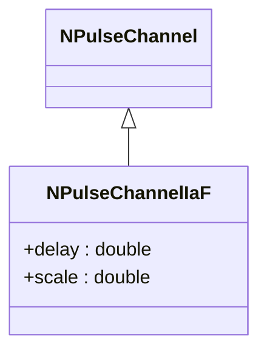
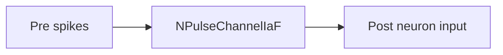
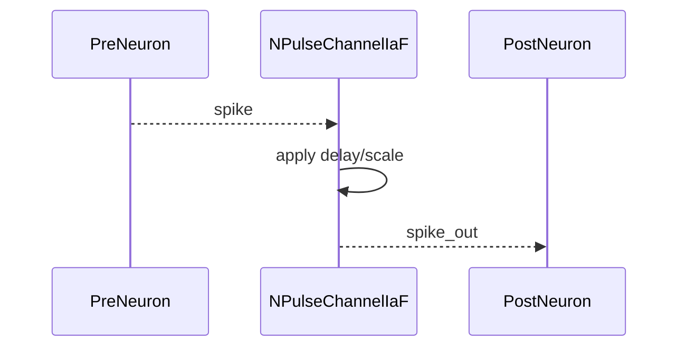

## NPulseChannelIaF — канал импульсов (Integrate-and-Fire)

**Класс**: `NPulseChannelIaF` — передаёт импульсы с учётом модели IaF.  
**Регистрация**: `NPulseLibrary.cpp` → `UploadClass("NPulseChannelIaF", ...)`.  
**Storage-инстансы**: `ClassName = "NPulseChannelIaF"`; параметры задержек/масштабов.

### Входы/выходы
- Вход: спайки/токи от пресинаптических нейронов.
- Выход: скорректированные импульсы к постнейрону.

Пояснение: блок-схема показывает поток данных/сигналов (входы → компонент → выходы).

Пояснение: диаграмма последовательности показывает типовой сценарий взаимодействия и порядок вызовов.

---

## NPulseChannelIaF — spike channel (IaF)

Routes spikes with delay/scale for integrate-and-fire style processing.
