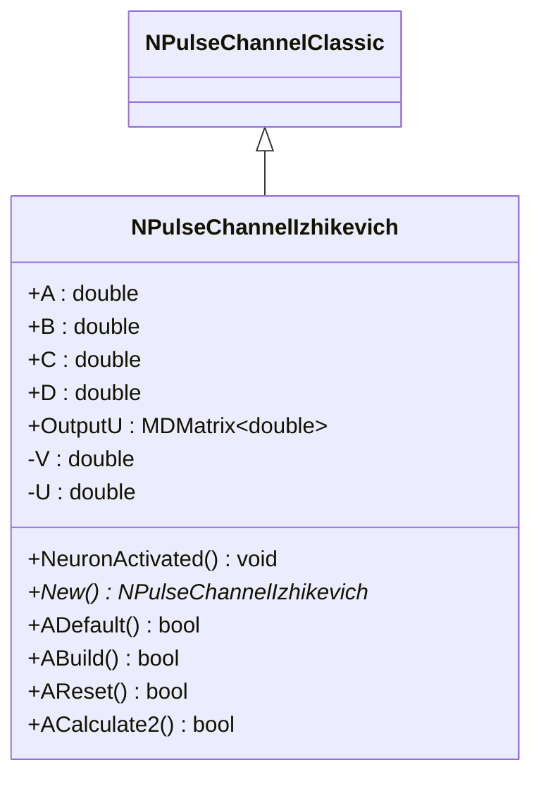
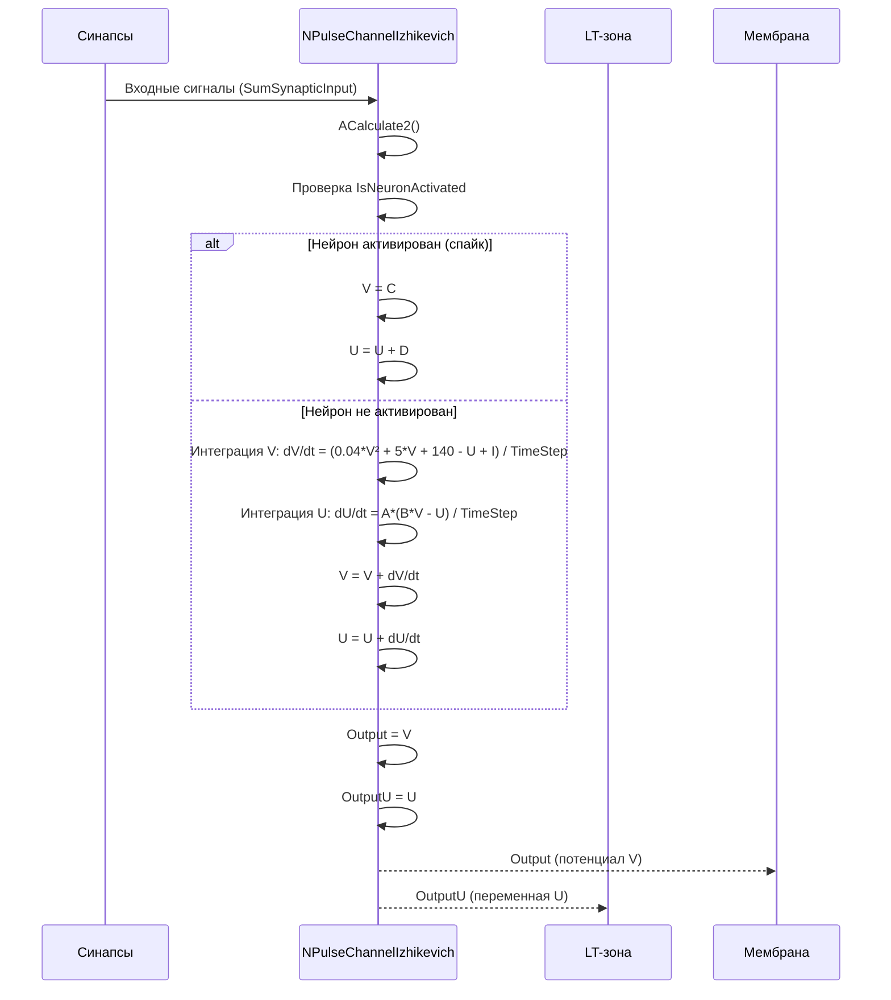
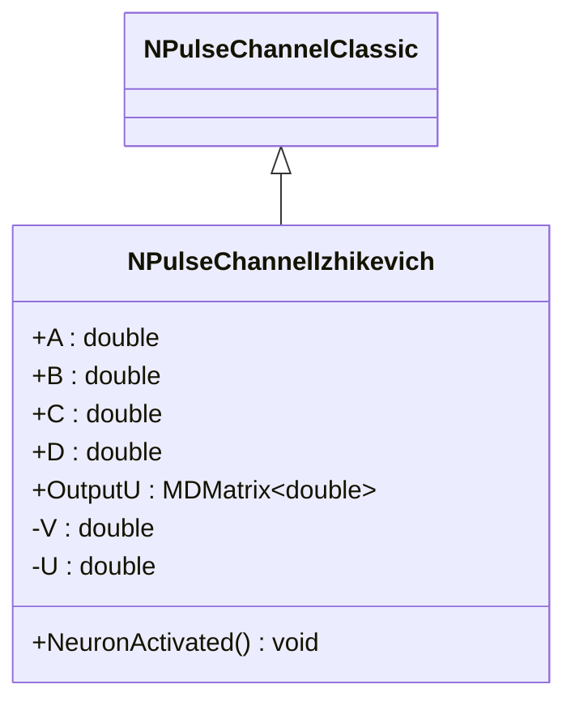
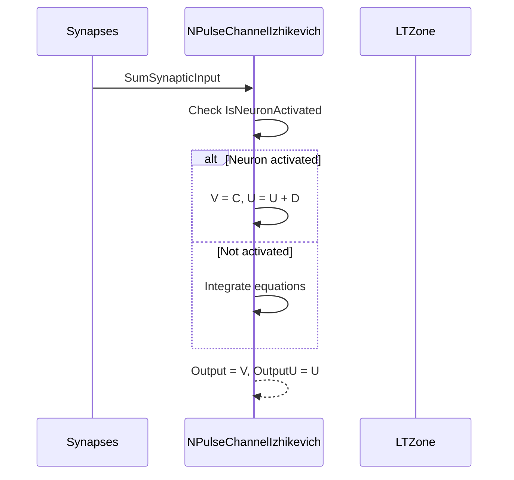
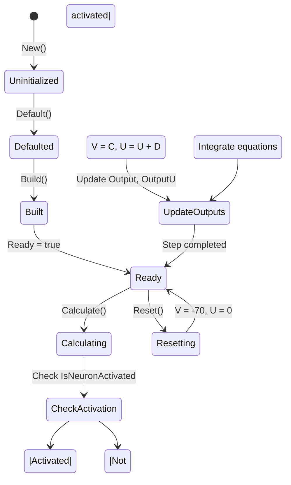
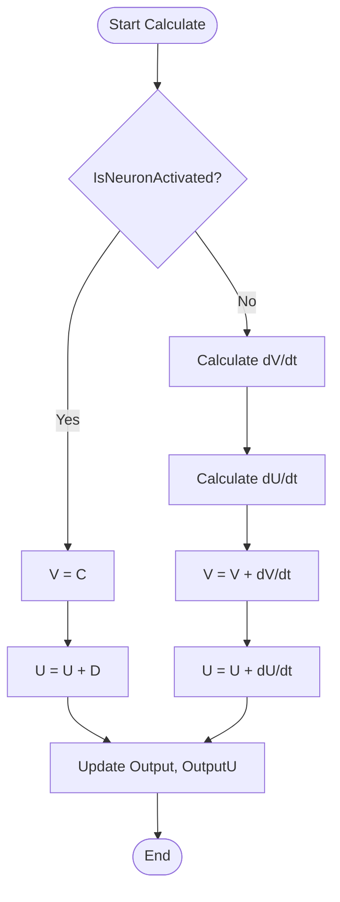

# NPulseChannelIzhikevich — канал модели Ижикевича

## RU

### Назначение

**Класс**: `NPulseChannelIzhikevich` — канал модели Ижикевича для импульсных нейронов.  
**Регистрация**: `NPulseLibrary.cpp` → `UploadClass("NPulseChannelIzhikevich", ...)`.  
**Storage-инстансы**: `ClassName = "NPulseChannelIzhikevich"` в `Bin/Configs/*/Model_*.xml`.

`NPulseChannelIzhikevich` реализует канал модели Ижикевича, который интегрирует уравнения модели Ижикевича для расчета мембранного потенциала и переменной восстановления. Используется в мембранах нейронов модели Ижикевича (`NPulseMembraneIzhikevich`).

**Использование:** `Bin/Configs/!OldConfigs/OldExperiments/IzhikevichTest/`, `Bin/Configs/User/CognitiveNavigation/`

### UML-диаграмма классов



**Иерархия наследования:**
- `NPulseChannelClassic` — классический импульсный канал
- `NPulseChannelIzhikevich` — канал модели Ижикевича

**Ключевые свойства:**
- Параметры модели: `A`, `B`, `C`, `D` — параметры модели Ижикевича
- Состояния: `V` (мембранный потенциал), `U` (переменная восстановления)
- Выходы: `Output` (потенциал V), `OutputU` (переменная U)

### UML-диаграмма последовательности



**Жизненный цикл:**
1. **Инициализация**: Установка параметров модели Ижикевича по умолчанию
2. **Сброс**: Инициализация V=-70, U=0
3. **Расчет**: Интеграция уравнений модели Ижикевича
4. **Активация**: При активации нейрона выполняется сброс V=C, U=U+D
5. **Выход**: Генерация выходных сигналов V и U

### UML-диаграмма состояний

```mermaid
stateDiagram-v2
    [*] --> Uninitialized: New()
    Uninitialized --> Defaulted: Default()
    Defaulted --> Built: Build()
    Built --> Ready: Ready = true
    Ready --> Calculating: Calculate()
    Calculating --> CheckActivation{IsNeuronActivated?}
    CheckActivation -->|Да| SpikeReset: V = C, U = U + D
    CheckActivation -->|Нет| Integrate: Интеграция уравнений
    SpikeReset --> UpdateOutputs: Обновление Output, OutputU
    Integrate --> UpdateOutputs
    UpdateOutputs --> Ready: Шаг завершен
    Ready --> Resetting: Reset()
    Resetting --> Ready: V = -70, U = 0
```

**Состояния:**
- **Uninitialized** — создан, но не инициализирован
- **Defaulted** — параметры установлены по умолчанию (A=0.02, B=0.2, C=-65, D=2.0)
- **Built** — структура канала построена
- **Ready** — готов к выполнению расчетов
- **Calculating** — выполняется расчет канала
- **CheckActivation** — проверка активации нейрона
- **SpikeReset** — сброс потенциала после спайка
- **Integrate** — интеграция уравнений модели Ижикевича
- **UpdateOutputs** — обновление выходных сигналов
- **Resetting** — выполняется сброс состояний

### UML-диаграмма активности

```mermaid
flowchart TD
    Start([Start Calculate]) --> CheckActivation{IsNeuronActivated?}
    CheckActivation -->|Да| ResetV[V = C]
    CheckActivation -->|Нет| CalcDV[Расчет dV/dt]
    ResetV --> ResetU[U = U + D]
    CalcDV --> CalcDU[Расчет dU/dt]
    Note over CalcDV: dV/dt = (0.04*V² + 5*V + 140 - U + SumSynapticInput) / TimeStep
    Note over CalcDU: dU/dt = A*(B*V - U) / TimeStep
    CalcDU --> UpdateV[V = V + dV/dt]
    ResetU --> UpdateOutputs
    UpdateV --> UpdateU[U = U + dU/dt]
    UpdateU --> UpdateOutputs[Обновление Output, OutputU]
    UpdateOutputs --> End([End])
```

**Алгоритм расчета (модель Ижикевича):**
1. Проверка активации нейрона (`IsNeuronActivated`)
2. При активации: `V = C`, `U = U + D` (сброс после спайка)
3. Без активации: интеграция уравнений:
   - `dV/dt = (0.04*V² + 5*V + 140 - U + SumSynapticInput) / TimeStep`
   - `dU/dt = A*(B*V - U) / TimeStep`
   - `V = V + dV/dt`
   - `U = U + dU/dt`
4. Обновление выходных сигналов: `Output = V`, `OutputU = U`

### UML-диаграмма компонентов

```mermaid
graph TB
    subgraph NPulseChannelClassic["NPulseChannelClassic Base"]
        BaseChannel[NPulseChannelClassic]
    end
    
    subgraph NPulseChannelIzhikevich["NPulseChannelIzhikevich"]
        IzhikevichParams[Параметры модели Ижикевича]
        IzhikevichVars[Переменные V, U]
    end
    
    subgraph External["Внешние компоненты"]
        Synapses[Синапсы]
        Membrane[Мембрана]
        LTZone[LT-зона]
    end
    
    BaseChannel -->|наследуется| NPulseChannelIzhikevich
    NPulseChannelIzhikevich -->|использует| IzhikevichParams
    NPulseChannelIzhikevich -->|вычисляет| IzhikevichVars
    Synapses -->|SumSynapticInput| NPulseChannelIzhikevich
    NPulseChannelIzhikevich -->|Output (V)| Membrane
    NPulseChannelIzhikevich -->|OutputU (U)| LTZone
    LTZone -->|IsNeuronActivated| NPulseChannelIzhikevich
```

**Зависимости:**
- **Базовый класс**: `NPulseChannelClassic`
- **Внешние компоненты**: синапсы (источники `SumSynapticInput`), мембрана (получатель `Output`), LT-зона (источник сигнала активации, получатель `OutputU`)

### Свойства

#### Параметры (ptPubParameter)

- **`A`** (double) — параметр восстановления мембраны. Определяет скорость восстановления переменной U. Значение по умолчанию: 0.02

- **`B`** (double) — чувствительность переменной восстановления. Определяет зависимость скорости восстановления от потенциала. Значение по умолчанию: 0.2

- **`C`** (double) — значение потенциала после спайка. При активации нейрона V устанавливается в это значение. Значение по умолчанию: -65.0

- **`D`** (double) — приращение переменной восстановления после спайка. При активации нейрона U увеличивается на это значение. Значение по умолчанию: 2.0

**Наследуемые параметры от NPulseChannelClassic:**
- `Type` (double) — тип канала (<0 — тормозной, >0 — возбуждающий)
- `UseAveragePotential` (bool) — использовать усреднение потенциалов
- `UseAverageSynapsis` (bool) — использовать усреднение синапсов

#### Выходные свойства (ptOutput | ptPubState)

- **`Output`** (MDMatrix<double>) — выходной сигнал канала (мембранный потенциал V). Рассчитывается на каждом шаге и передается в мембрану.

- **`OutputU`** (MDMatrix<double>) — выходной сигнал переменной восстановления U. Передается в LT-зону для дополнительной обработки.

#### Состояния (ptPubState)

- **`V`** (double) — мембранный потенциал. Интегрируется согласно уравнениям модели Ижикевича. Начальное значение: -70.0

- **`U`** (double) — переменная восстановления. Интегрируется согласно уравнениям модели Ижикевича. Начальное значение: 0.0

**Наследуемые состояния от NPulseChannelClassic:**
- `ChannelInputs` (vector<MDMatrix<double>>) — входные сигналы канала
- `SynapticInputs` (vector<MDMatrix<double>>) — входные сигналы от синапсов
- `SumChannelInput` (MDMatrix<double>) — суммарный входной сигнал канала
- `SumSynapticInput` (MDMatrix<double>) — суммарный синаптический вход
- `IsNeuronActivated` (bool) — флаг активации нейрона

### Методы

#### Публичные методы

- **`New()`** → `NPulseChannelIzhikevich*` — создает новый экземпляр класса.

- **`NeuronActivated()`** → `void` — вызывается при активации нейрона. В текущей реализации не выполняет дополнительных действий (сброс выполняется в `ACalculate2()`).

#### Защищенные методы жизненного цикла

- **`ADefault()`** → `bool` — инициализирует параметры по умолчанию. Устанавливает `A=0.02`, `B=0.2`, `C=-65.0`, `D=2.0`, инициализирует выходные матрицы.

- **`ABuild()`** → `bool` — строит структуру канала. Вызывает `NPulseChannelClassic::ABuild()`.

- **`AReset()`** → `bool` — сбрасывает состояния канала. Устанавливает `V=-70.0`, `U=0.0`, обнуляет выходные матрицы.

- **`ACalculate2()`** → `bool` — выполняет расчет канала на одном шаге. Интегрирует уравнения модели Ижикевича или выполняет сброс при активации нейрона.

### Примеры использования

#### Пример 1: Создание канала в коде C++

```cpp
// Создание канала
auto channel = storage->CreateComponent<NPulseChannelIzhikevich>();
channel->SetName("IzhikevichChannel");

// Инициализация
channel->Default();

// Настройка параметров модели Ижикевича
channel->A = 0.02;   // Параметр восстановления
channel->B = 0.2;    // Чувствительность восстановления
channel->C = -65.0;  // Потенциал после спайка
channel->D = 8.0;    // Приращение восстановления (для регулярно спайкующего нейрона)

// Настройка типа канала
channel->Type = 1.0;  // Возбуждающий канал

// Сброс для установки начальных значений
channel->Reset();
// V = -70.0, U = 0.0

// Использование
for (int step = 0; step < 1000; step++) {
    channel->Calculate();
    double v = channel->Output(0, 0);
    double u = channel->OutputU(0, 0);
    std::cout << "Step " << step << ": V = " << v << ", U = " << u << std::endl;
}
```

#### Пример 2: Конфигурация XML

```xml
<InhChannel Class="NPulseChannelIzhikevich">
    <Parameters>
        <Type>1</Type>
        <UseAveragePotential>0</UseAveragePotential>
        <UseAverageSynapsis>0</UseAverageSynapsis>
        <A>0.02</A>
        <B>0.2</B>
        <C>-65.0</C>
        <D>8.0</D>
    </Parameters>
    <Components>
        <Synapse1 Class="NSynapseStdp">
            <!-- Параметры синапса -->
        </Synapse1>
    </Components>
</InhChannel>
```

### Использование в конфигурациях

`NPulseChannelIzhikevich` используется в нейронах модели Ижикевича:

- **Нейроны Ижикевича**: `Bin/Configs/!OldConfigs/OldExperiments/IzhikevichTest/`
- **Когнитивная навигация**: `Bin/Configs/User/CognitiveNavigation/*/Model_*.xml`

**Типичные значения параметров для разных типов нейронов:**

1. **Регулярно спайкующий (RS)**: A=0.02, B=0.2, C=-65, D=8
2. **Интегрирующий и спайкующий (IB)**: A=0.02, B=0.2, C=-55, D=4
3. **Хаотический спайкующий (CH)**: A=0.02, B=0.2, C=-50, D=2
4. **Быстро спайкующий (FS)**: A=0.1, B=0.2, C=-65, D=2

## Источники

См. [Literature-References.md](../Literature-References.md): **25**, **29**, **30**.

### См. также

- [`NPulseChannelCommon`](NPulseChannelCommon.md) — общий импульсный канал
- [`NPulseChannelClassic`](NPulseChannel.md) — классический импульсный канал
- [`NPulseMembraneIzhikevich`](NPulseMembraneIzhikevich.md) — мембрана модели Ижикевича
- [`NPulseNeuronIzhikevich`](NPulseNeuronIzhikevich.md) — нейрон модели Ижикевича
- [Architecture.md](../Architecture.md) — архитектура библиотеки
- [Scientific-Background.md](../Scientific-Background.md) — научный фон (модель Ижикевича)

---

## EN

### Purpose

**Class**: `NPulseChannelIzhikevich` — Izhikevich model channel for spiking neurons.  
**Registration**: `NPulseLibrary.cpp` → `UploadClass("NPulseChannelIzhikevich", ...)`.  
**Instances**: `ClassName = "NPulseChannelIzhikevich"` in `Bin/Configs/*/Model_*.xml`.

`NPulseChannelIzhikevich` implements the Izhikevich model channel, which integrates Izhikevich model equations to calculate membrane potential and recovery variable. Used in Izhikevich model neuron membranes (`NPulseMembraneIzhikevich`).

**Usage:** `Bin/Configs/!OldConfigs/OldExperiments/IzhikevichTest/`, `Bin/Configs/User/CognitiveNavigation/`

### UML Class Diagram



### UML Sequence Diagram



### UML State Diagram



### UML Activity Diagram



### UML Component Diagram

```mermaid
graph TB
    subgraph NPulseChannelClassic["NPulseChannelClassic Base"]
        BaseChannel[NPulseChannelClassic]
    end
    
    subgraph NPulseChannelIzhikevich["NPulseChannelIzhikevich"]
        IzhikevichParams["Izhikevich parameters<br/>(A, B, C, D)"]
        IzhikevichVars["State variables<br/>V, U"]
    end
    
    subgraph External["External Components"]
        Synapses[Synapses]
        Membrane[NPulseMembraneIzhikevich]
        LTZone[NPulseLTZoneIzhikevich]
    end
    
    BaseChannel -->|inherits| NPulseChannelIzhikevich
    NPulseChannelIzhikevich -->|uses| IzhikevichParams
    NPulseChannelIzhikevich -->|computes| IzhikevichVars
    Synapses -->|SumSynapticInput| NPulseChannelIzhikevich
    NPulseChannelIzhikevich -->|Output (V)| Membrane
    NPulseChannelIzhikevich -->|OutputU (U)| LTZone
    LTZone -->|IsNeuronActivated| NPulseChannelIzhikevich
```

### Properties

- `A` — Izhikevich model parameter (recovery rate)
- `B` — Izhikevich model parameter (recovery sensitivity)
- `C` — Izhikevich model parameter (post-spike potential)
- `D` — Izhikevich model parameter (post-spike recovery change)
- `Output` — output signal (potential V)
- `OutputU` — output signal (recovery variable U)
- `V` — current membrane potential (internal state)
- `U` — current recovery variable (internal state)

### Methods

- `NeuronActivated()` — called on neuron activation (reset V=C, U=U+D)
- `ADefault()` — setting default parameters
- `ABuild()` — building channel structure
- `AReset()` — state reset (V=-70, U=0)
- `ACalculate2()` — calculation step (Izhikevich equation integration)

### Usage in configurations

`NPulseChannelIzhikevich` is used in Izhikevich model neurons:

- **Izhikevich neurons**: `Bin/Configs/!OldConfigs/OldExperiments/IzhikevichTest/`
- **Cognitive navigation**: `Bin/Configs/User/CognitiveNavigation/*/Model_*.xml`

**Typical parameter values for different neuron types:**

1. **Regular spiking (RS)**: A=0.02, B=0.2, C=-65, D=8
2. **Intrinsically bursting (IB)**: A=0.02, B=0.2, C=-55, D=4
3. **Chattering (CH)**: A=0.02, B=0.2, C=-50, D=2
4. **Fast spiking (FS)**: A=0.1, B=0.2, C=-65, D=2

### References

See [Literature-References.md](../Literature-References.md): **25**, **29**, **30**.

### See Also

- [`NPulseChannelCommon`](NPulseChannelCommon.md) — common spiking channel
- [`NPulseMembraneIzhikevich`](NPulseMembraneIzhikevich.md) — Izhikevich membrane
- [`NPulseNeuronIzhikevich`](NPulseNeuronIzhikevich.md) — Izhikevich model neuron
- [Architecture.md](../Architecture.md) — library architecture
- [Scientific-Background.md](../Scientific-Background.md) — scientific background (Izhikevich model)

