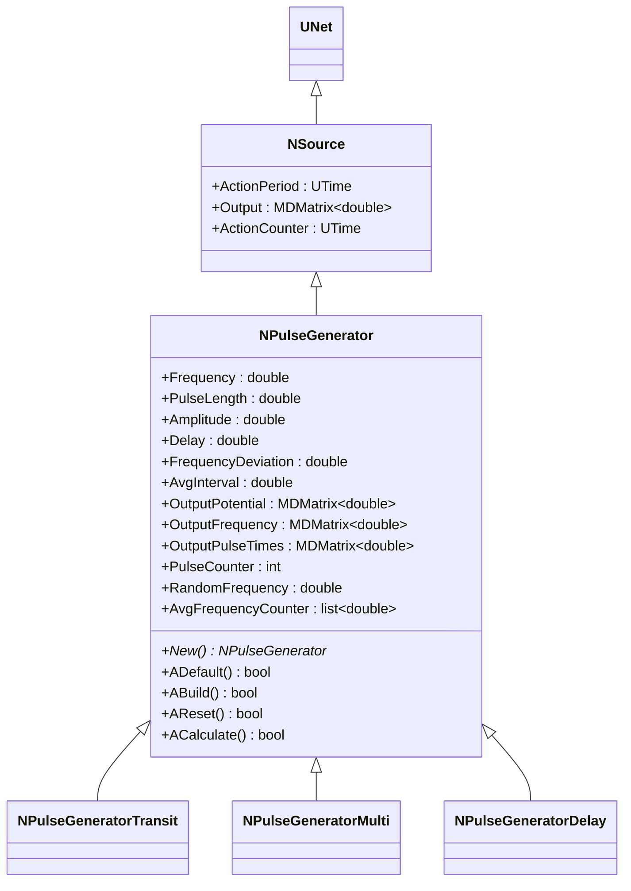
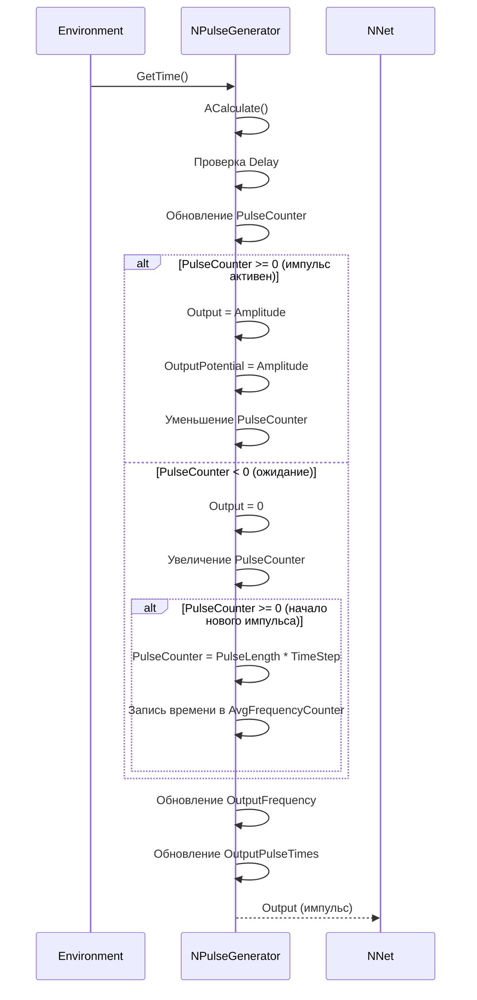
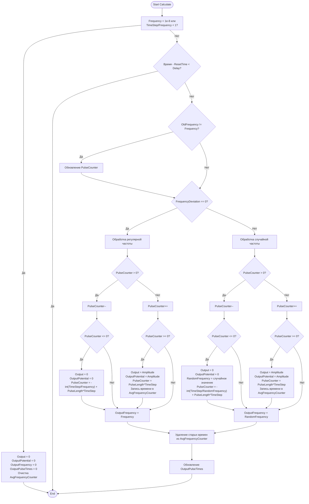
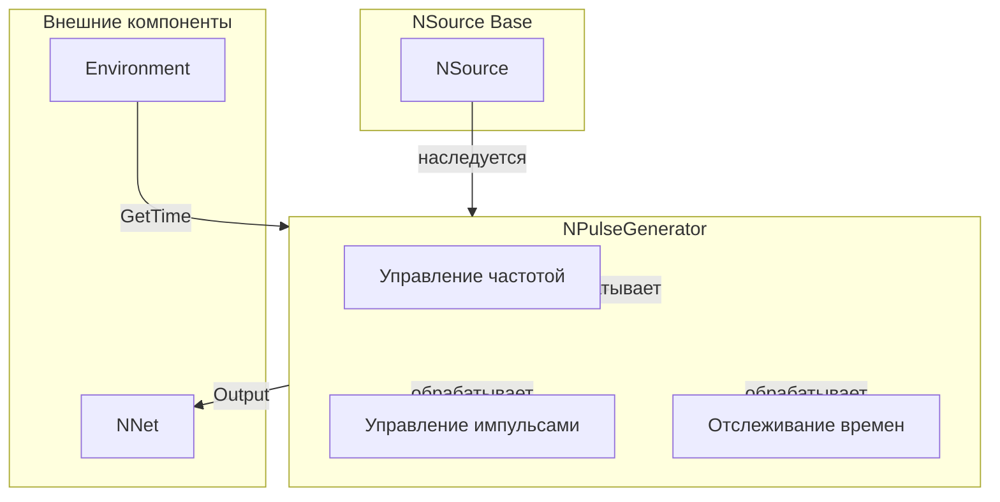
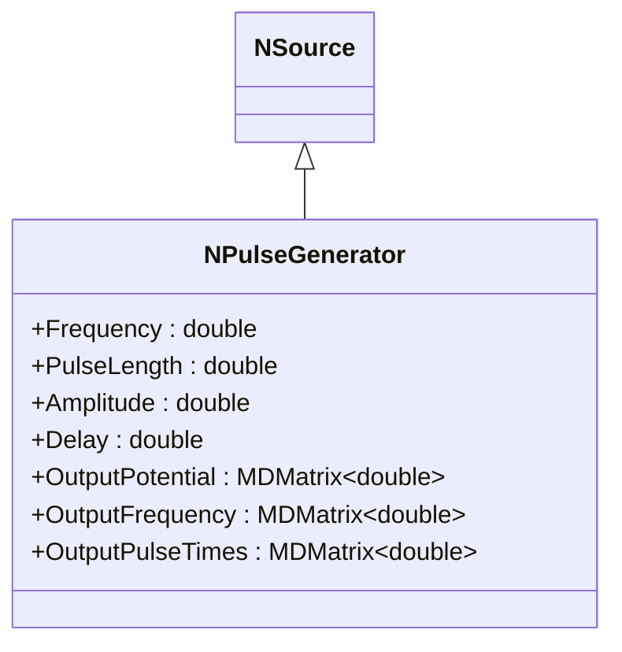
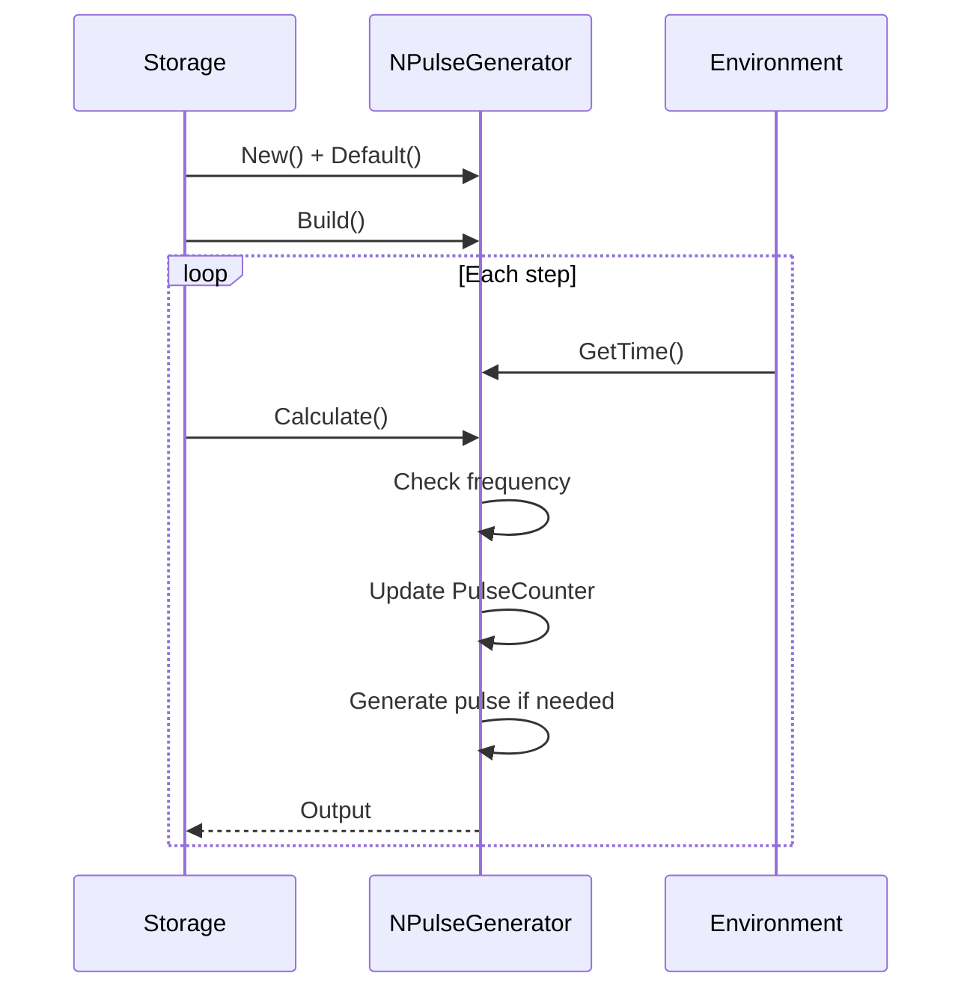
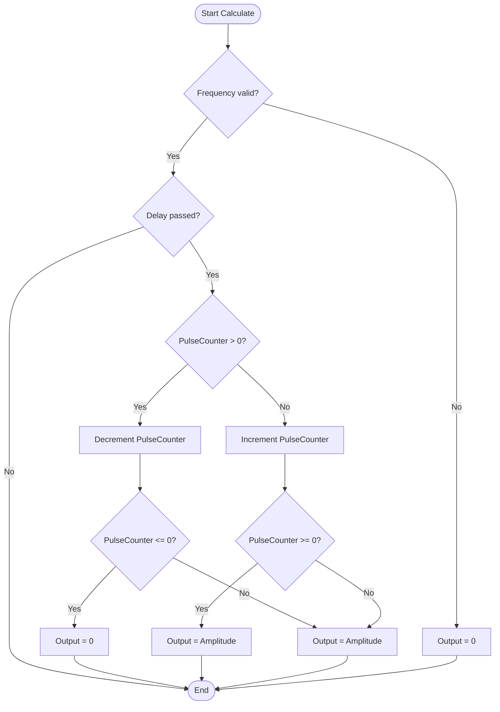

# NPulseGenerator — генератор импульсов

**Каталог компонентов:** [Component-Catalog.md](../Component-Catalog.md).

## RU

### Назначение

**Класс**: `NPulseGenerator` — генератор импульсов (спайков) с заданной частотой, амплитудой и длительностью.
**Регистрация**: `NPulseLibrary.cpp` → `UploadClass("NPulseGenerator", ...)`.
**Storage-инстансы**: `ClassName = "NPulseGenerator"` в `Bin/Configs/*/Model_*.xml`.

`NPulseGenerator` реализует генератор импульсов для создания входных сигналов в импульсных нейронных сетях. Наследуется от `NSource` и генерирует последовательность импульсов с заданными параметрами: частотой (`Frequency`), длительностью (`PulseLength`), амплитудой (`Amplitude`), задержкой (`Delay`) и отклонением частоты (`FrequencyDeviation`).

**Использование:** `Bin/Configs/SpikeSamples/STDP/STDP-Simple-01/`, `Bin/Configs/SpikeSamples/NM-Neurons/`, `Bin/Configs/SpikeSamples/StructTrain/`; генерация входных импульсов для нейронных сетей, создание тестовых сигналов

### UML-диаграмма классов



**Иерархия наследования:**
- `UNet` — базовая сеть Rdk Framework
- `NSource` — базовый источник сигналов
- `NPulseGenerator` — генератор импульсов

### UML-диаграмма последовательности



**Жизненный цикл:**
1. **Инициализация**: Установка параметров по умолчанию (`Frequency = 0.0`, `PulseLength = 0.001`, `Amplitude = 1.0`, `Delay = 0.0`)
2. **Сброс**: Инициализация счетчиков, запись времени сброса
3. **Расчет**: Генерация импульсов на основе частоты и длительности

### UML-диаграмма состояний

```mermaid
stateDiagram-v2
    [*] --> Uninitialized: New()
    Uninitialized --> Defaulted: Default()
    Defaulted --> Built: Build()
    Built --> Ready: Ready = true
    Ready --> Resetting: Reset()
    Resetting --> InitCounters: Инициализация счетчиков
    InitCounters --> Ready: Состояния сброшены
    Ready --> Calculating: Calculate()
    Calculating --> CheckDelay{Время < Delay?}
    CheckDelay -->|Да| Ready: Ожидание задержки
    CheckDelay -->|Нет| CheckFrequency{Frequency > 0?}
    CheckFrequency -->|Нет| ZeroOutput: Output = 0
    CheckFrequency -->|Да| CheckPulseCounter{PulseCounter > 0?}
    CheckPulseCounter -->|Да| PulseActive: Output = Amplitude
    CheckPulseCounter -->|Нет| Waiting: Output = 0
    PulseActive --> DecrementCounter: PulseCounter--
    DecrementCounter --> CheckEndPulse{PulseCounter <= 0?}
    CheckEndPulse -->|Да| StartWaiting: PulseCounter = -int(TimeStep/Frequency) + PulseLength*TimeStep
    CheckEndPulse -->|Нет| Ready: Шаг завершен
    StartWaiting --> Ready
    Waiting --> IncrementCounter: PulseCounter++
    IncrementCounter --> CheckStartPulse{PulseCounter >= 0?}
    CheckStartPulse -->|Да| StartPulse: PulseCounter = PulseLength*TimeStep
    CheckStartPulse -->|Нет| Ready: Шаг завершен
    StartPulse --> RecordTime: Запись времени в AvgFrequencyCounter
    RecordTime --> Ready
    ZeroOutput --> Ready
```

### UML-диаграмма активности



**Алгоритм расчета:**
1. Проверка частоты (если слишком мала, выход = 0)
2. Проверка задержки (если время < Delay, выход = 0)
3. Обновление счетчика импульсов (`PulseCounter`)
4. Генерация импульса при `PulseCounter >= 0`
5. Обновление выходных сигналов и времен спайков

### UML-диаграмма компонентов



### Свойства

#### Параметры (ptPubParameter)

- **`Frequency`** (double) — частота генерации импульсов (Гц). Значение по умолчанию: 0.0

- **`PulseLength`** (double) — длительность импульса (сек). Значение по умолчанию: 0.001 (1 мс)

- **`Amplitude`** (double) — амплитуда импульса. Значение по умолчанию: 1.0

- **`Delay`** (double) — задержка начала генерации импульсов (сек). Значение по умолчанию: 0.0

- **`FrequencyDeviation`** (double) — отклонение частоты (диапазон случайных значений). Если > 0, частота будет случайной в диапазоне `[Frequency - FrequencyDeviation, Frequency + FrequencyDeviation]`. Значение по умолчанию: 0.0

- **`AvgInterval`** (double) — интервал усреднения частоты (сек). Используется для расчета средней частоты. Значение по умолчанию: 5.0

#### Выходные свойства (ptOutput | ptPubState)

- **`Output`** (MDMatrix<double>) — выходной сигнал генератора. При активном импульсе равен `Amplitude`, иначе 0.

- **`OutputPotential`** (MDMatrix<double>) — выходной потенциал (аналогичен `Output`). Значение по умолчанию: 0.0

- **`OutputFrequency`** (MDMatrix<double>) — выходная частота. Равна `Frequency` (или `RandomFrequency`, если используется отклонение). Значение по умолчанию: 0.0

- **`OutputPulseTimes`** (MDMatrix<double>) — времена генерации спайков. Содержит список времен последних спайков в интервале `AvgInterval`. Значение по умолчанию: 0.0

#### Состояния (ptPubState)

- **`PulseCounter`** (int) — счетчик шагов для управления длительностью импульса. Положительное значение означает активный импульс, отрицательное — ожидание следующего импульса. Начальное значение: 0

- **`RandomFrequency`** (double) — случайная частота (используется при `FrequencyDeviation > 0`). Начальное значение: `Frequency`

- **`AvgFrequencyCounter`** (list<double>) — список времен спайков для расчета средней частоты. Содержит времена спайков в интервале `AvgInterval`.

**Наследуемые свойства от NSource:**
- `ActionPeriod` (UTime) — период действия источника
- `ActionCounter` (UTime) — счетчик действия

### Методы

#### Публичные методы

- **`New()`** → `NPulseGenerator*` — создает новый экземпляр класса.

#### Защищенные методы жизненного цикла

- **`ADefault()`** → `bool` — инициализирует параметры по умолчанию. Устанавливает `Frequency = 0.0`, `PulseLength = 0.001`, `Amplitude = 1.0`, `Delay = 0.0`, `FrequencyDeviation = 0.0`, `AvgInterval = 5.0`, `PulseCounter = 0`, инициализирует выходные матрицы.

- **`ABuild()`** → `bool` — строит структуру генератора. Очищает `AvgFrequencyCounter`.

- **`AReset()`** → `bool` — сбрасывает состояния генератора. Инициализирует генератор случайных чисел, устанавливает `PulseCounter = 0`, `RandomFrequency = Frequency`, очищает `AvgFrequencyCounter`, записывает время сброса в `ResetTime`.

- **`ACalculate()`** → `bool` — выполняет расчет генератора на одном шаге:
  1. Проверяет частоту (если слишком мала, выход = 0)
  2. Проверяет задержку
  3. Обновляет счетчик импульсов
  4. Генерирует импульс при необходимости
  5. Обновляет выходные сигналы и времена спайков

#### Методы установки параметров

- **`SetFrequency(const double &value)`** → `bool` — устанавливает частоту генерации импульсов.

- **`SetPulseLength(const double &value)`** → `bool` — устанавливает длительность импульса.

- **`SetAmplitude(const double &value)`** → `bool` — устанавливает амплитуду импульса.

- **`SetDelay(const double &value)`** → `bool` — устанавливает задержку начала генерации.

- **`SetFrequencyDeviation(const double &value)`** → `bool` — устанавливает отклонение частоты.

### Примеры использования

#### Пример 1: Создание генератора в коде C++

```cpp
// Создание генератора импульсов
auto generator = storage->CreateComponent<NPulseGenerator>();
generator->SetName("PulseGen");

// Инициализация
generator->Default();

// Настройка параметров
generator->Frequency = 10.0;           // 10 Гц
generator->PulseLength = 0.001;        // 1 мс
generator->Amplitude = 1.0;
generator->Delay = 0.0;
generator->FrequencyDeviation = 0.0;   // Регулярная частота
generator->AvgInterval = 5.0;

// Сборка
generator->Build();
```

#### Пример 2: Конфигурация XML

```xml
<Generator1 Class="NPulseGenerator">
    <Parameters>
        <Frequency>10.0</Frequency>
        <PulseLength>0.001</PulseLength>
        <Amplitude>1.0</Amplitude>
        <Delay>0.0</Delay>
        <FrequencyDeviation>0.0</FrequencyDeviation>
        <AvgInterval>5.0</AvgInterval>
    </Parameters>
</Generator1>
```

### Использование в конфигурациях

`NPulseGenerator` используется для генерации входных сигналов в нейронных сетях:

- Генерация тестовых сигналов
- Создание входных паттернов для обучения
- Моделирование сенсорных входов

**Особенности:**
- Поддержка регулярной и случайной частоты
- Отслеживание времен спайков
- Расчет средней частоты

## Источники

См. [Literature-References.md](../Literature-References.md): **14**, **25**.

### См. также

- [`NSource`](NSource.md) — базовый источник сигналов
- [`NPulseGeneratorTransit`](NPulseGeneratorTransit.md) — генератор с транзитным сигналом
- [`NPulseGeneratorMulti`](NPulseGeneratorMulti.md) — многоканальный генератор
- [`NPulseGeneratorDelay`](NPulseGeneratorDelay.md) — генератор с задержкой
- [`NPGenerator`](NPGenerator.md) — алиас для NPulseGenerator
- [Architecture.md](../Architecture.md) — архитектура библиотеки

---

## EN

### Purpose

**Class**: `NPulseGenerator` — pulse (spike) generator with specified frequency, amplitude, and duration.
**Registration**: `NPulseLibrary.cpp` → `UploadClass("NPulseGenerator", ...)`.
**Instances**: `ClassName = "NPulseGenerator"` in `Bin/Configs/*/Model_*.xml`.

`NPulseGenerator` implements pulse generator for creating input signals in spiking neural networks. Inherits from `NSource` and generates pulse sequence with specified parameters: frequency (`Frequency`), duration (`PulseLength`), amplitude (`Amplitude`), delay (`Delay`), and frequency deviation (`FrequencyDeviation`).

**Usage:** Generating input pulses for neural networks, creating test signals

### UML Class Diagram



### UML Sequence Diagram



### UML State Diagram

```mermaid
stateDiagram-v2
    [*] --> Uninitialized: New()
    Uninitialized --> Defaulted: Default()
    Defaulted --> Built: Build()
    Built --> Ready: Ready = true
    Ready --> Calculating: Calculate()
    Calculating --> CheckFrequency{Frequency > 0?}
    CheckFrequency -->|No| ZeroOutput: Output = 0
    CheckFrequency -->|Yes| CheckPulseCounter{PulseCounter > 0?}
    CheckPulseCounter -->|Yes| PulseActive: Output = Amplitude
    CheckPulseCounter -->|No| Waiting: Output = 0
    PulseActive --> DecrementCounter: PulseCounter--
    DecrementCounter --> CheckEndPulse{PulseCounter <= 0?}
    CheckEndPulse -->|Yes| StartWaiting: Start waiting
    CheckEndPulse -->|No| Ready: Step completed
    StartWaiting --> Ready
    Waiting --> IncrementCounter: PulseCounter++
    IncrementCounter --> CheckStartPulse{PulseCounter >= 0?}
    CheckStartPulse -->|Yes| StartPulse: Start pulse
    CheckStartPulse -->|No| Ready: Step completed
    StartPulse --> Ready
    ZeroOutput --> Ready
    Ready --> Resetting: Reset()
    Resetting --> Ready
```

### UML Activity Diagram



### UML Component Diagram

```mermaid
graph TB
    subgraph NSource["NSource Base"]
        BaseSource[NSource]
    end

    subgraph NPulseGenerator["NPulseGenerator"]
        GeneratorModel[Generator Model]
        PulseCounter[Pulse Counter]
        FrequencyController[Frequency Controller]
    end

    subgraph External["External Components"]
        Environment[Environment]
        OutputTarget[Target Component]
    end

    BaseSource -->|inherits| NPulseGenerator
    NPulseGenerator -->|implements| GeneratorModel
    NPulseGenerator -->|uses| PulseCounter
    NPulseGenerator -->|uses| FrequencyController
    Environment -->|GetTime()| NPulseGenerator
    NPulseGenerator -->|Output| OutputTarget
```

### Properties

- `Frequency` — частота генерации импульсов (Гц)
- `PulseLength` — длительность импульса (сек)
- `Amplitude` — амплитуда импульса
- `Delay` — задержка начала генерации (сек)
- `FrequencyDeviation` — отклонение частоты (для случайной генерации)
- `AvgInterval` — средний интервал между импульсами (сек)
- `Output` — выходной сигнал (генерируемый импульс)
- `OutputPotential` — выходной потенциал
- `OutputFrequency` — выходная частота
- `OutputPulseTimes` — времена спайков

### Methods

- `ADefault()` — установка параметров по умолчанию
- `ABuild()` — сборка структуры генератора
- `AReset()` — сброс состояния генератора (инициализация счетчиков)
- `ACalculate()` — выполнение шага генерации (проверка частоты, генерация импульса при необходимости)

### Usage in configurations

`NPulseGenerator` is used for generating input pulses for neural networks:

- **Input signal generation**: `Bin/Configs/*/Model_*.xml` (where input pulse generation is required)
- **Test signals**: creating test signals for network testing
- **Training patterns**: generating input patterns for network training

**Features:**
- Regular and random frequency: supports regular and random frequency generation
- Spike timing tracking: tracks spike times for analysis
- Average frequency calculation: calculates average frequency automatically

**Typical parameter values:**
- **Frequency**: 0.0-100.0 Hz (pulse generation frequency)
- **PulseLength**: 0.001 sec (pulse duration)
- **Amplitude**: 1.0 (pulse amplitude)
- **Delay**: 0.0 sec (generation start delay)

### References

See [Literature-References.md](../Literature-References.md): **14**, **25**.

### See Also

- [`NSource`](NSource.md) — base signal source
- [`NPulseGeneratorTransit`](NPulseGeneratorTransit.md) — generator with transit signal
- [`NPulseGeneratorMulti`](NPulseGeneratorMulti.md) — multi-channel generator
- [`NPulseGeneratorDelay`](NPulseGeneratorDelay.md) — generator with delay
- [`NPGenerator`](NPGenerator.md) — alias for NPulseGenerator
- [Architecture.md](../Architecture.md) — library architecture
