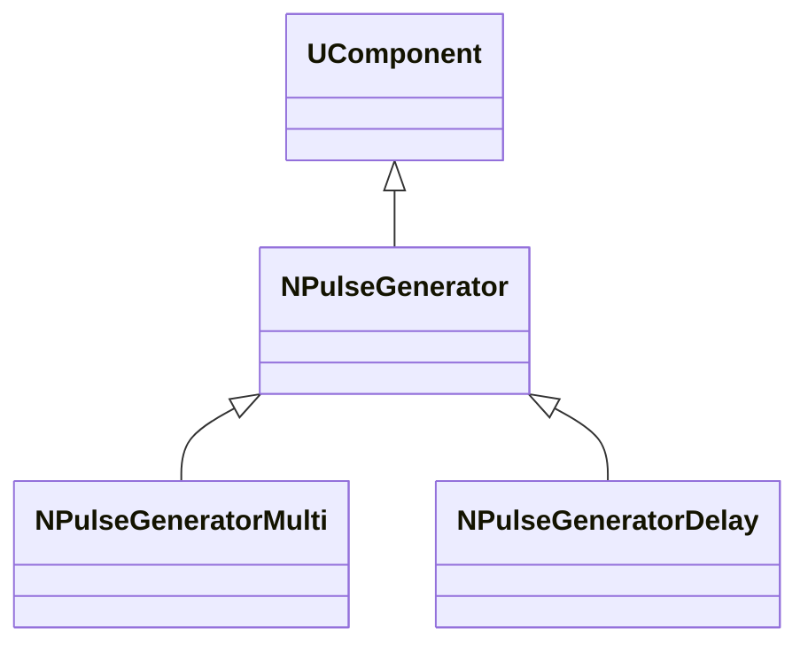
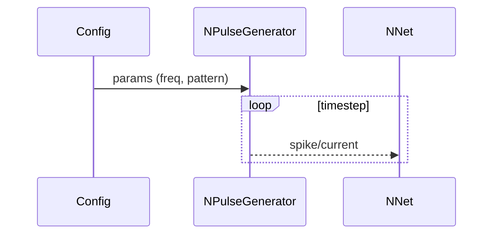

## NPulseGenerator — генератор импульсов

**Класс**: `NPulseGenerator` (и варианты Multi/Delay) — формирует входные токи/спайки.  
**Регистрация**: `NPulseLibrary.cpp` → `UploadClass("NPulseGenerator", ...)`, `"NPulseGeneratorMulti"`, `"NPulseGeneratorDelay"`.  
**Storage-инстансы**: `ClassName = "NPulseGenerator*"`; параметры частоты, амплитуды, паттерна, задержек.

### Входы/выходы
- Вход: (опционально) управление частотой/паттерном.
- Выход: последовательность импульсов (спайков) или токов.

Пояснение: блок-схема показывает поток данных/сигналов (входы → компонент → выходы).

Пояснение: диаграмма последовательности показывает типовой сценарий взаимодействия и порядок вызовов.

---

## NPulseGenerator — pulse generator

Produces spike/current patterns (single, multi-channel, delayed) to drive SNN inputs.
