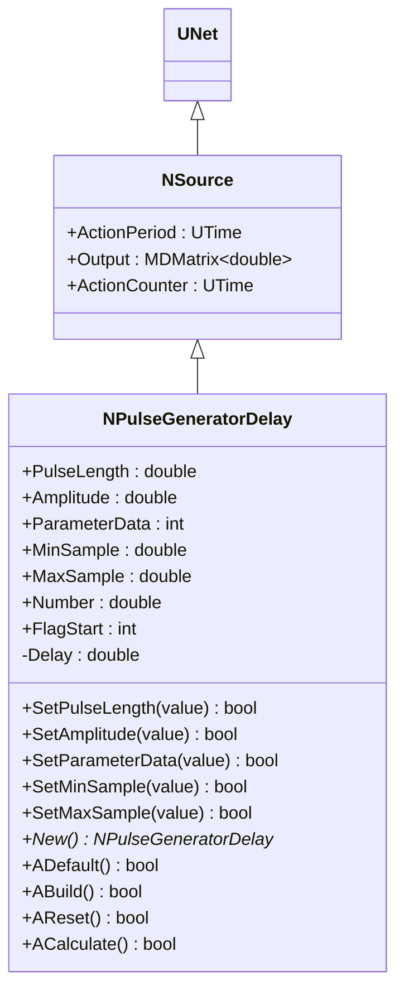
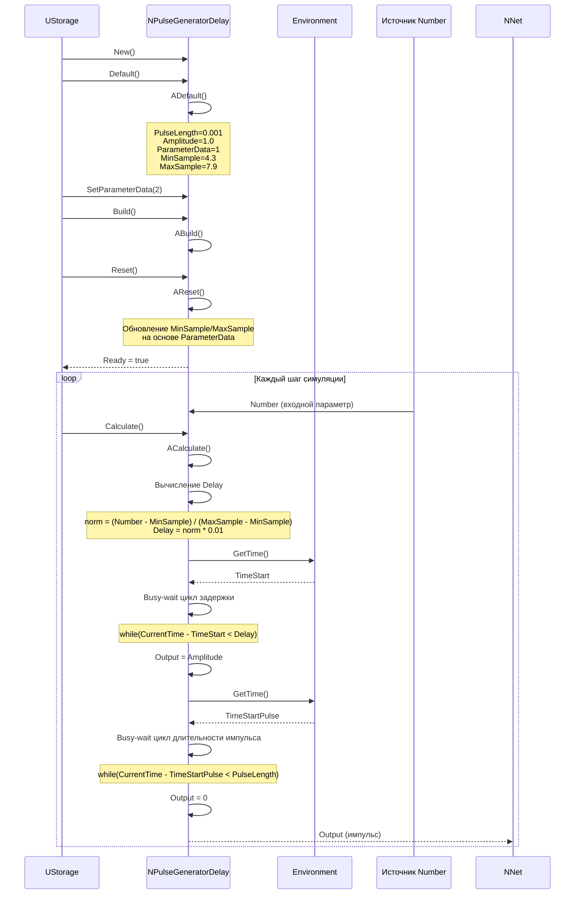
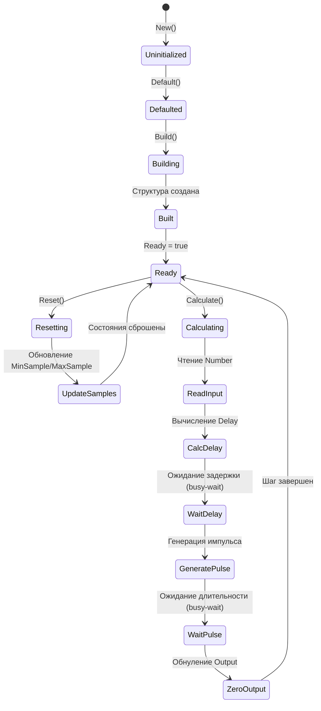
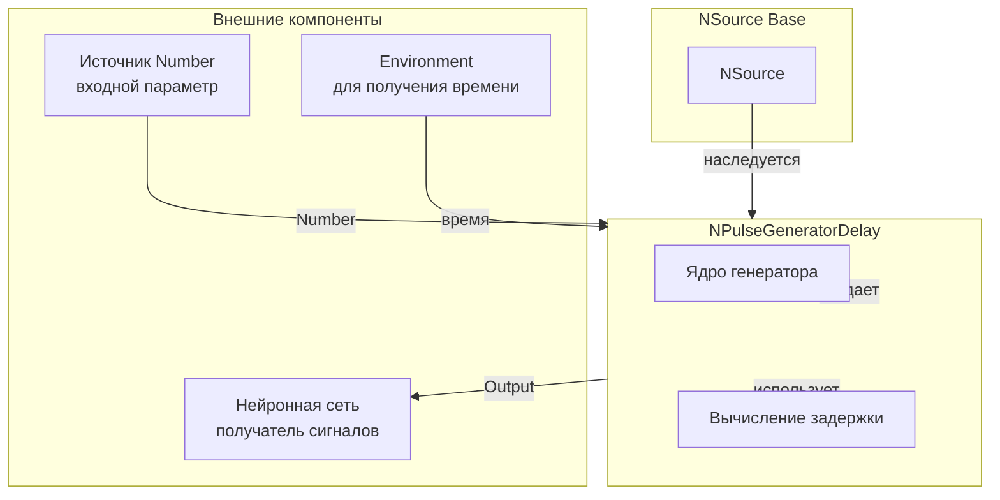
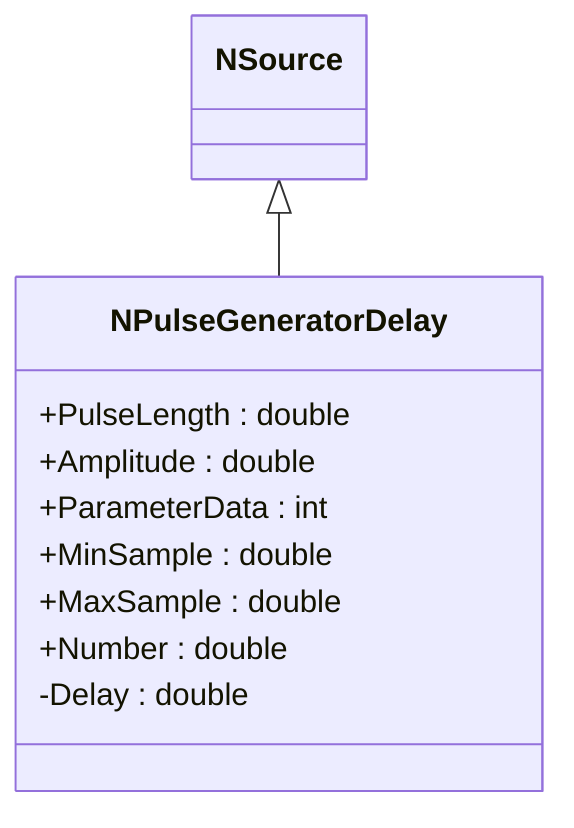
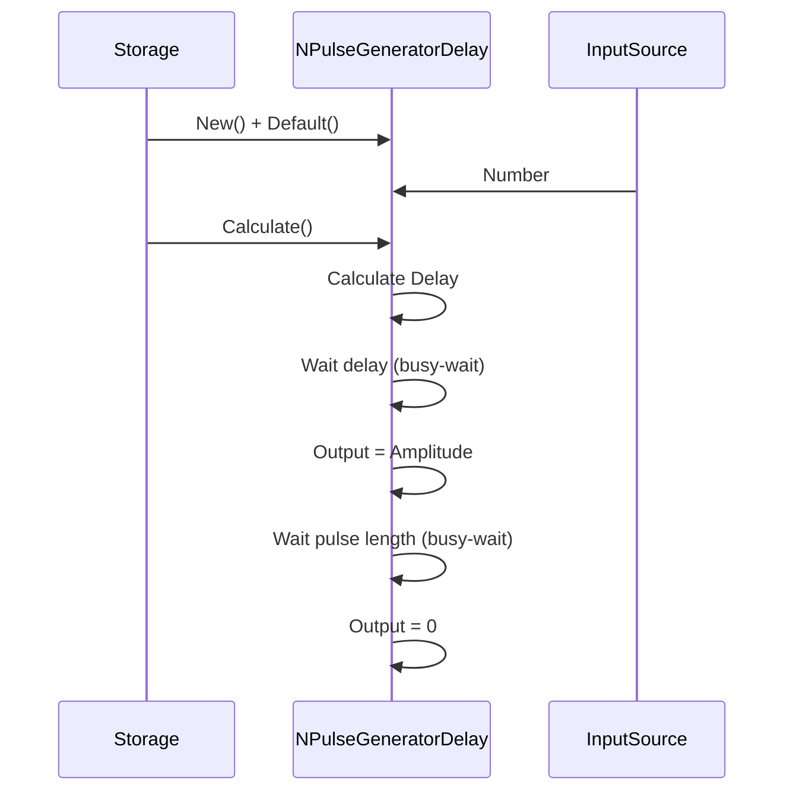
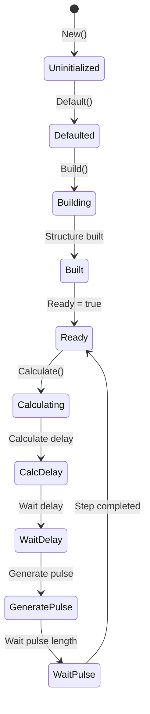
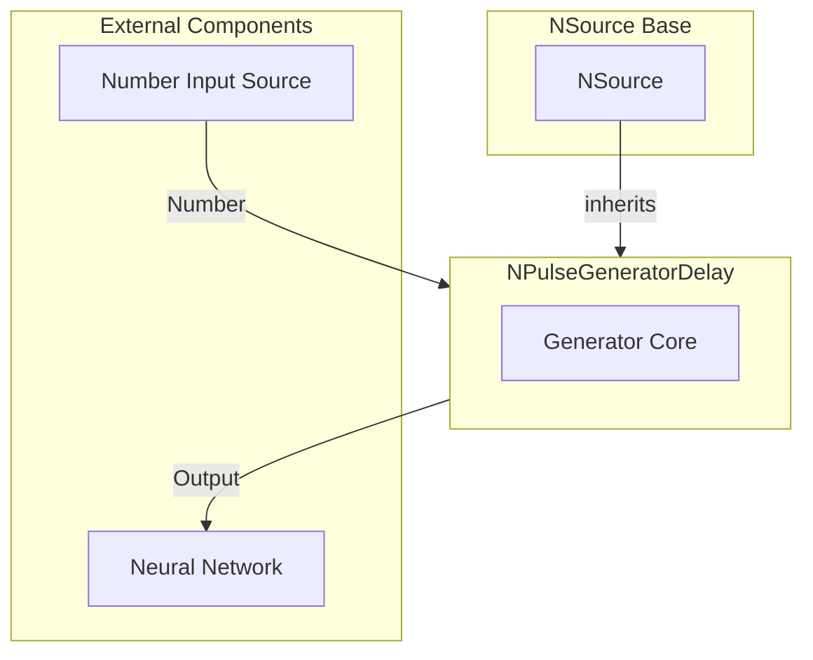

# NPulseGeneratorDelay — генератор импульсов с задержкой

## RU

### Назначение

**Класс**: `NPulseGeneratorDelay` — генератор импульсов с динамической задержкой, вычисляемой на основе входного параметра.  
**Регистрация**: `NPulseLibrary.cpp` → `UploadClass("NPGeneratorDelay", ...)`.  
**Storage-инстансы**: `ClassName = "NPGeneratorDelay"` в `Bin/Configs/*/Model_*.xml`.

`NPulseGeneratorDelay` реализует генератор импульсов, который вычисляет задержку на основе входного параметра `Number` и выдает импульс с этой задержкой. Задержка вычисляется как нормализованное значение между `MinSample` и `MaxSample`. Наследуется от `NSource`.

**Использование:** Генерация импульсов с динамической задержкой, моделирование задержек на основе входных данных

### UML-диаграмма классов



**Иерархия наследования:**
- `UNet` — базовая сеть Rdk Framework
- `NSource` — базовый источник сигналов
- `NPulseGeneratorDelay` — генератор импульсов с задержкой

**Ключевые свойства:**
- Параметры генерации: `PulseLength`, `Amplitude`
- Параметры задержки: `Number` (вход), `MinSample`, `MaxSample`, `ParameterData`
- Внутренняя задержка: `Delay` (вычисляется динамически)

### UML-диаграмма последовательности



**Жизненный цикл:**
1. **Инициализация**: Установка параметров по умолчанию
2. **Сброс**: Обновление `MinSample` и `MaxSample` на основе `ParameterData`
3. **Расчет**: Вычисление задержки на основе входного `Number`, ожидание задержки, генерация импульса

### UML-диаграмма состояний



**Состояния:**
- **Uninitialized** — создан, но не инициализирован
- **Defaulted** — параметры установлены по умолчанию
- **Building** — выполняется сборка структуры
- **Built** — структура генератора построена
- **Ready** — готов к выполнению расчетов
- **Resetting** — выполняется сброс состояний
- **UpdateSamples** — обновление MinSample/MaxSample на основе ParameterData
- **Calculating** — выполняется расчет генератора
- **ReadInput** — чтение входного параметра Number
- **CalcDelay** — вычисление задержки
- **WaitDelay** — ожидание задержки (busy-wait цикл)
- **GeneratePulse** — генерация импульса
- **WaitPulse** — ожидание длительности импульса (busy-wait цикл)
- **ZeroOutput** — обнуление выходного сигнала

### UML-диаграмма активности

```mermaid
flowchart TD
    Start([Start ACalculate]) --> ReadNumber[Чтение Number из входа]
    ReadNumber --> CalcNorm[Вычисление norm = (Number - MinSample) / (MaxSample - MinSample)]
    CalcNorm --> CalcDelay[Delay = norm * 0.01]
    CalcDelay --> GetTimeStart[TimeStart = GetTime()]
    GetTimeStart --> WaitDelay{CurrentTime - TimeStart < Delay?}
    WaitDelay -->|Да| WaitDelay
    WaitDelay -->|Нет| SetOutput[Output = Amplitude]
    SetOutput --> GetTimePulse[TimeStartPulse = GetTime()]
    GetTimePulse --> WaitPulse{CurrentTime - TimeStartPulse < PulseLength?}
    WaitPulse -->|Да| WaitPulse
    WaitPulse -->|Нет| ZeroOutput[Output = 0]
    ZeroOutput --> End([End])
```

**Алгоритм расчета:**
1. Чтение входного параметра `Number`
2. Вычисление нормализованного значения: `norm = (Number - MinSample) / (MaxSample - MinSample)`
3. Вычисление задержки: `Delay = norm * 0.01`
4. Ожидание задержки (busy-wait цикл)
5. Установка выходного сигнала: `Output = Amplitude`
6. Ожидание длительности импульса (busy-wait цикл)
7. Обнуление выходного сигнала: `Output = 0`

**Примечание:** Использование busy-wait циклов в `ACalculate()` может блокировать выполнение. Это следует учитывать при использовании компонента.

### UML-диаграмма компонентов



**Зависимости:**
- **Базовый класс**: `NSource`
- **Внешние компоненты**: источник входного параметра `Number`, `Environment` (для получения времени), нейронная сеть (получатель сигналов)

### Свойства

#### Параметры (ptPubParameter)

- **`PulseLength`** (double) — длительность импульса (сек). Значение по умолчанию: 0.001

- **`Amplitude`** (double) — амплитуда импульса. Значение по умолчанию: 1.0

- **`ParameterData`** (int) — параметр данных (1-4), определяющий диапазон `MinSample`/`MaxSample`:
  - 1: MinSample=4.3, MaxSample=7.9
  - 2: MinSample=2.0, MaxSample=4.4
  - 3: MinSample=1.0, MaxSample=6.9
  - 4: MinSample=0.1, MaxSample=2.5
  Значение по умолчанию: 1

- **`MinSample`** (double) — минимальное значение в семпле (для нормализации `Number`). Значение по умолчанию: 4.3 (зависит от `ParameterData`)

- **`MaxSample`** (double) — максимальное значение в семпле (для нормализации `Number`). Значение по умолчанию: 7.9 (зависит от `ParameterData`)

#### Входы (ptPubInput)

- **`Number`** (double) — входной параметр для вычисления задержки. Используется для нормализации и вычисления `Delay`.

- **`FlagStart`** (int) — флаг запуска (в текущей реализации не используется активно).

#### Выходы (ptOutput | ptPubState)

- **`Output`** (MDMatrix<double>) — выходной импульс. Устанавливается в `Amplitude` на время `PulseLength` после задержки `Delay`.

### Методы

#### Публичные методы

- **`New()`** → `NPulseGeneratorDelay*` — создает новый экземпляр класса.

#### Защищенные методы жизненного цикла

- **`ADefault()`** → `bool` — инициализирует параметры по умолчанию:
  - `PulseLength = 0.001`
  - `Amplitude = 1.0`
  - `ParameterData = 1`
  - `MinSample = 4.3`
  - `MaxSample = 7.9`
  - `Delay = 0`
  - Инициализация выходов

- **`ABuild()`** → `bool` — строит структуру генератора. В текущей реализации просто возвращает `true`.

- **`AReset()`** → `bool` — сбрасывает состояния генератора:
  - Обновляет `MinSample` и `MaxSample` на основе `ParameterData`
  - Обнуляет выходы

- **`ACalculate()`** → `bool` — выполняет расчет генератора:
  1. Читает входной параметр `Number`
  2. Вычисляет нормализованное значение: `norm = (Number - MinSample) / (MaxSample - MinSample)`
  3. Вычисляет задержку: `Delay = norm * 0.01`
  4. Ожидает задержку (busy-wait цикл)
  5. Устанавливает `Output = Amplitude`
  6. Ожидает длительность импульса (busy-wait цикл)
  7. Обнуляет `Output`

#### Методы установки параметров

- **`SetPulseLength(const double &value)`** → `bool` — устанавливает длительность импульса. Если `value <= 0`, возвращает `false`.

- **`SetAmplitude(const double &value)`** → `bool` — устанавливает амплитуду импульса.

- **`SetParameterData(const int &value)`** → `bool` — устанавливает параметр данных. Если `value <= 0` или `value >= 5`, возвращает `false`.

- **`SetMinSample(const double &value)`** → `bool` — устанавливает минимальное значение в семпле.

- **`SetMaxSample(const double &value)`** → `bool` — устанавливает максимальное значение в семпле.

### Примеры использования

#### Пример 1: Создание генератора с задержкой в коде C++

```cpp
// Создание генератора импульсов с задержкой
auto generator = storage->CreateComponent<NPulseGeneratorDelay>();
generator->SetName("PulseGenDelay");

// Инициализация
generator->Default();

// Настройка параметров
generator->PulseLength = 0.002;    // 2 мс
generator->Amplitude = 1.5;        // Амплитуда 1.5
generator->ParameterData = 2;      // Диапазон: MinSample=2.0, MaxSample=4.4
generator->MinSample = 2.0;
generator->MaxSample = 4.4;

// Подключение входа Number
// generator->Number.Connect(...);

// Сборка
generator->Build();

// Использование
for (int step = 0; step < 1000; step++) {
    generator->Calculate();
    // Output содержит импульс с задержкой, вычисленной на основе Number
}
```

#### Пример 2: Конфигурация XML

```xml
<PulseGenDelay1 Class="NPGeneratorDelay">
    <Parameters>
        <PulseLength>0.002</PulseLength>
        <Amplitude>1.5</Amplitude>
        <ParameterData>2</ParameterData>
        <MinSample>2.0</MinSample>
        <MaxSample>4.4</MaxSample>
    </Parameters>
    <Inputs>
        <Number>3.0</Number>
    </Inputs>
</PulseGenDelay1>
```

### Использование в конфигурациях

`NPulseGeneratorDelay` используется в экспериментах, требующих генерации импульсов с динамической задержкой:

- **Динамические задержки**: `Bin/Configs/!OldConfigs/*/Model_*.xml` (где требуется задержка на основе входных данных)
- **Моделирование задержек**: эксперименты с переменными задержками передачи

**Типичные значения параметров:**
- **PulseLength**: 0.001-0.01 сек (длительность импульса)
- **Amplitude**: 0.1-10.0 (амплитуда импульса)
- **ParameterData**: 1-4 (выбор диапазона для MinSample/MaxSample)
- **Number**: значение в диапазоне [MinSample, MaxSample] (для вычисления задержки)

**Особенности:**
- Динамическая задержка: задержка вычисляется на основе входного параметра `Number`
- Busy-wait реализация: использует busy-wait циклы для задержки (может блокировать выполнение)
- Нормализация: входной параметр нормализуется между MinSample и MaxSample

**Предупреждение:** Использование busy-wait циклов в `ACalculate()` может блокировать выполнение симуляции. Рекомендуется использовать альтернативные компоненты для задержек, если требуется неблокирующая реализация.

## Источники

См. [Literature-References.md](../Literature-References.md): **14**, **25**.

### См. также

- [`NPulseGenerator`](NPulseGenerator.md) — базовый генератор импульсов
- [`NPulseGeneratorMulti`](NPulseGeneratorMulti.md) — генератор множественных импульсов
- [`NPGeneratorDelay`](NPGeneratorDelay.md) — алиас для NPulseGeneratorDelay
- [`NPDelay`](NPDelay.md) — компонент задержки сигналов
- [`NSource`](NSource.md) — базовый источник сигналов
- [Architecture.md](../Architecture.md) — архитектура библиотеки

---

## EN

### Purpose

**Class**: `NPulseGeneratorDelay` — pulse generator with dynamic delay computed from input parameter.  
**Registration**: `NPulseLibrary.cpp` → `UploadClass("NPGeneratorDelay", ...)`.  
**Instances**: `ClassName = "NPGeneratorDelay"` in `Bin/Configs/*/Model_*.xml`.

`NPulseGeneratorDelay` implements pulse generator that computes delay based on input parameter `Number` and outputs pulse with that delay. Delay is computed as normalized value between `MinSample` and `MaxSample`. Inherits from `NSource`.

**Usage:** Generating pulses with dynamic delay, modeling delays based on input data

### UML Class Diagram



### UML Sequence Diagram



### UML State Diagram



### UML Activity Diagram

```mermaid
flowchart TD
    Start([Start ACalculate]) --> ReadNumber[Read Number]
    ReadNumber --> CalcNorm[Calculate norm]
    CalcNorm --> CalcDelay[Calculate Delay]
    CalcDelay --> WaitDelay[Wait delay (busy-wait)]
    WaitDelay --> SetOutput[Output = Amplitude]
    SetOutput --> WaitPulse[Wait pulse length (busy-wait)]
    WaitPulse --> ZeroOutput[Output = 0]
    ZeroOutput --> End([End])
```

### UML Component Diagram



### Properties

- **`PulseLength`** (`double`) — pulse duration (sec). Default: 0.001
- **`Amplitude`** (`double`) — pulse amplitude. Default: 1.0
- **`ParameterData`** (`int`) — data parameter (1-4) determining MinSample/MaxSample range. Default: 1
- **`MinSample`** (`double`) — minimum sample value. Default: 4.3 (depends on ParameterData)
- **`MaxSample`** (`double`) — maximum sample value. Default: 7.9 (depends on ParameterData)
- **`Number`** (`double`) — input parameter for delay calculation
- **`Output`** (`MDMatrix<double>`) — output pulse

### Methods

- **`ADefault()`** → `bool` — initializes default parameters.
- **`ABuild()`** → `bool` — builds generator structure.
- **`AReset()`** → `bool` — resets generator states (updates MinSample/MaxSample based on ParameterData).
- **`ACalculate()`** → `bool` — performs generator calculation:
  - reads input `Number`
  - calculates delay: `Delay = norm * 0.01` where `norm = (Number - MinSample) / (MaxSample - MinSample)`
  - waits delay (busy-wait loop)
  - sets `Output = Amplitude`
  - waits pulse length (busy-wait loop)
  - zeros `Output`

### Usage in configurations

`NPulseGeneratorDelay` is used in experiments requiring pulse generation with dynamic delay:

- **Dynamic delays**: `Bin/Configs/!OldConfigs/*/Model_*.xml`
- **Delay modeling**: experiments with variable transmission delays

**Warning:** Use of busy-wait loops in `ACalculate()` may block simulation execution. Consider alternative delay components for non-blocking implementation.

### References

See [Literature-References.md](../Literature-References.md): **14**, **25**.

### See Also

- [`NPulseGenerator`](NPulseGenerator.md) — base pulse generator
- [`NPulseGeneratorMulti`](NPulseGeneratorMulti.md) — multiple pulse generator
- [`NPGeneratorDelay`](NPGeneratorDelay.md) — alias for NPulseGeneratorDelay
- [`NPDelay`](NPDelay.md) — signal delay component
- [Architecture.md](../Architecture.md) — library architecture
