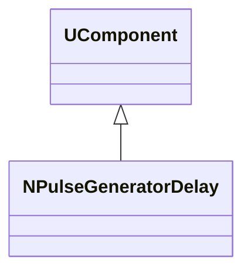
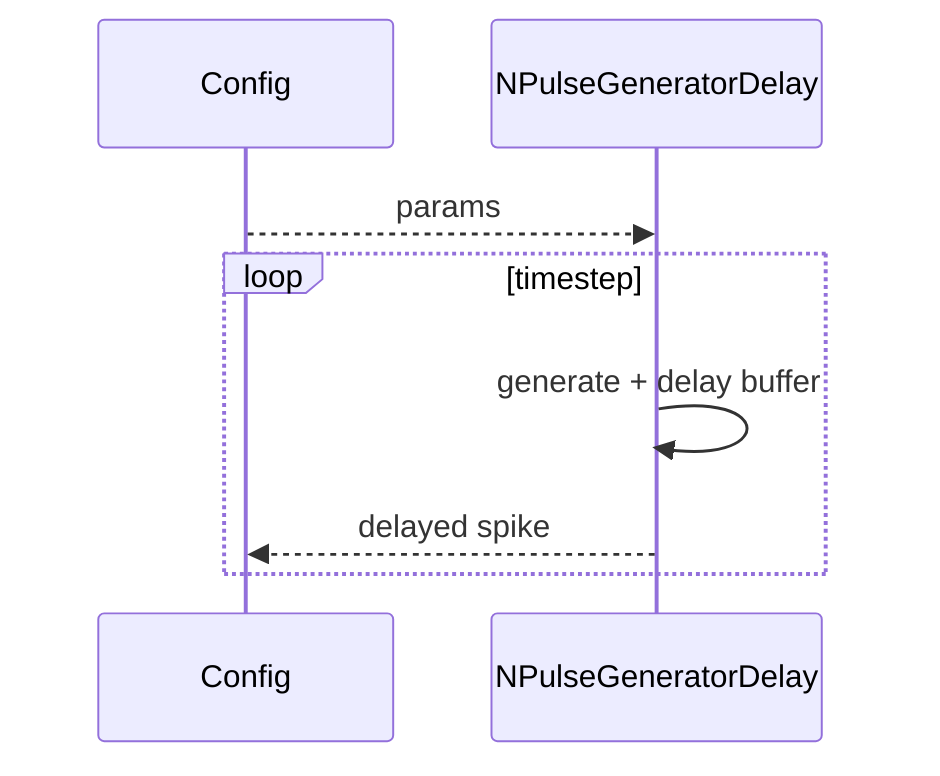
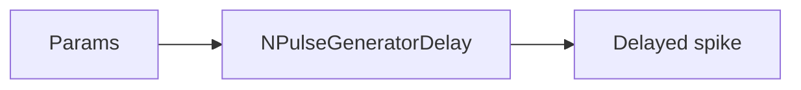
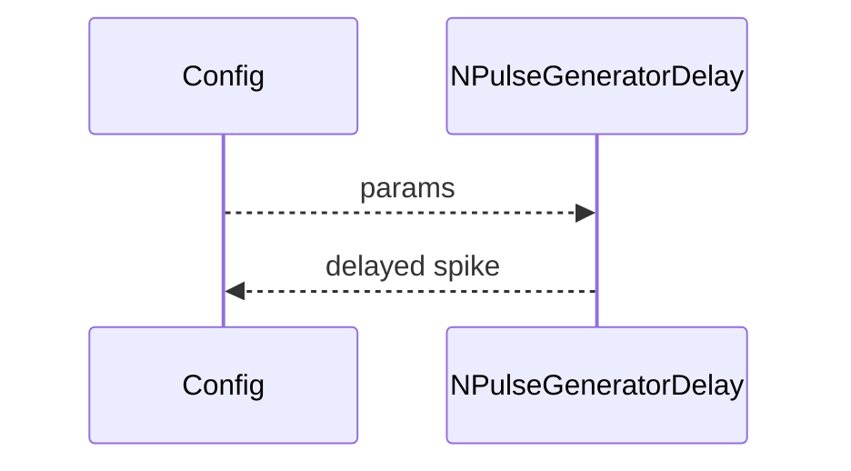

## NPulseGeneratorDelay — генератор импульсов с задержкой (Nmsdk-PulseLib)

**Класс**: `NPulseGeneratorDelay` — вариант генератора импульсов с задержкой выдачи.  
**Регистрация**: `NPulseLibrary.cpp` → `UploadClass("NPulseGeneratorDelay", ...)`.  
**Storage**: `ClassName = "NPulseGeneratorDelay"`.

### Lifecycle
- **ADefault**: параметры паттерна импульсов и задержки.
- **ABuild**: подготовка буфера задержки/состояния.
- **AReset**: сброс буфера.
- **ACalculate**: генерация импульса и выдача с задержкой.

### I/O (UProperty)
- Вход: (опционально) параметры управления генерацией.
- Выход: задержанный спайк/импульс.



Пояснение: диаграмма классов показывает место компонента в иерархии и ключевые связи.



Пояснение: диаграмма последовательности показывает типовой сценарий взаимодействия и порядок вызовов.



Пояснение: блок-схема показывает поток данных/сигналов (входы → компонент → выходы).

### Config snippet

```ini
[Component]
ClassName = NPulseGeneratorDelay
Name = PulseGenDelay1
```

---

## NPulseGeneratorDelay — delayed pulse generator (EN)

Generates pulse patterns and outputs them with a configured delay.


Description: this class diagram shows the component position in the type hierarchy and key relations.



Description: this sequence diagram shows a typical runtime interaction and call order.


Description: this flowchart shows the data/signal flow (inputs → component → outputs).
