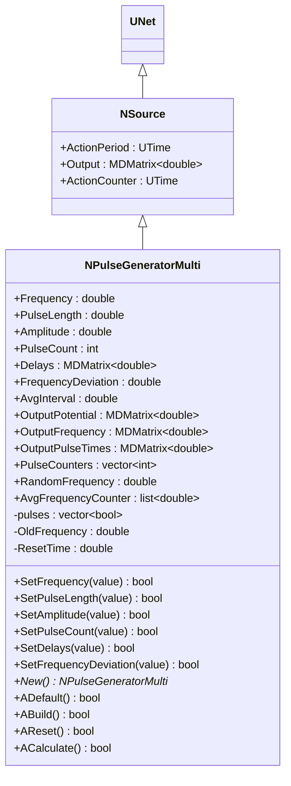
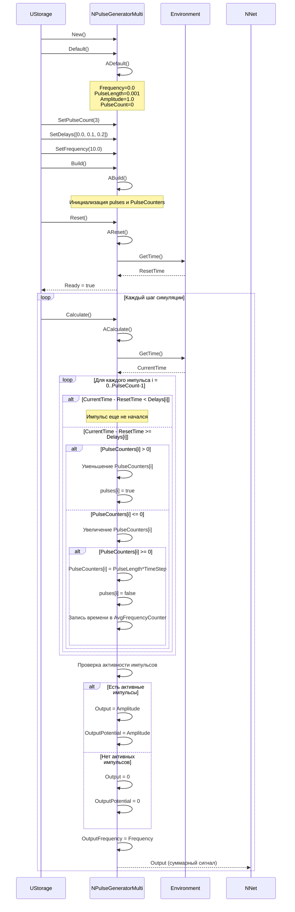
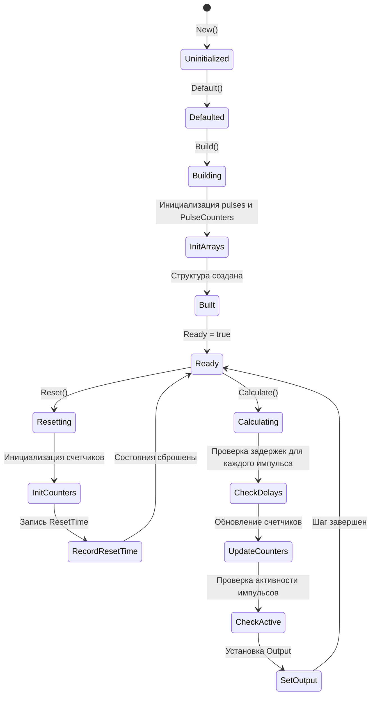
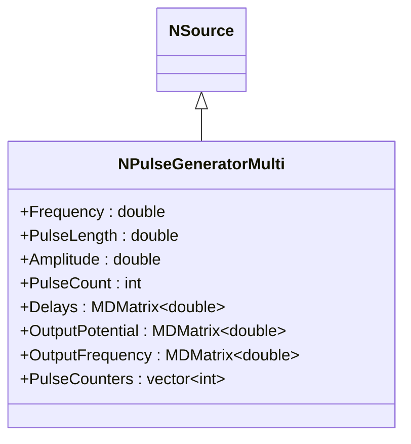
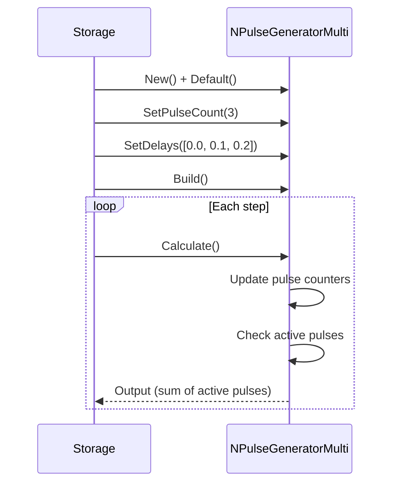
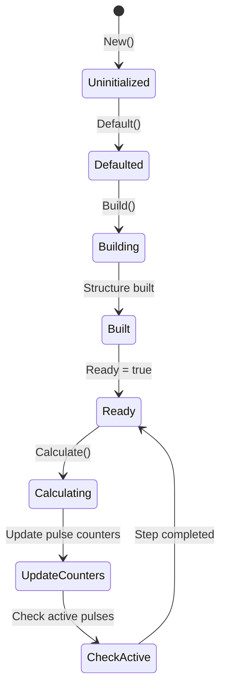
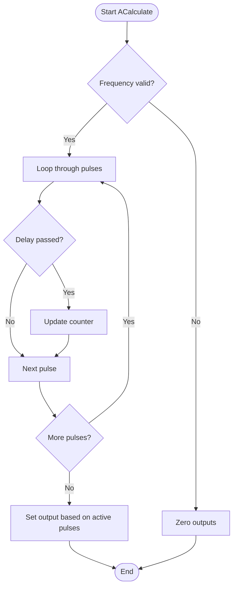
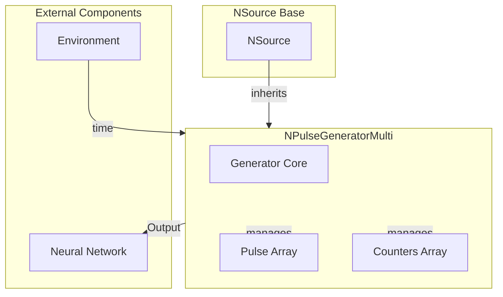

# NPulseGeneratorMulti — генератор множественных импульсов

## RU

### Назначение

**Класс**: `NPulseGeneratorMulti` — генератор множественных импульсов с индивидуальными задержками для каждого импульса.  
**Регистрация**: `NPulseLibrary.cpp` → `UploadClass("NPulseGeneratorMulti", ...)`.  
**Storage-инстансы**: `ClassName = "NPulseGeneratorMulti"` в `Bin/Configs/*/Model_*.xml`.

`NPulseGeneratorMulti` реализует генератор, который может генерировать несколько независимых импульсов одновременно, каждый со своей задержкой запуска. Наследуется от `NSource` и позволяет задать количество импульсов (`PulseCount`), задержки для каждого импульса (`Delays`), общую частоту (`Frequency`), длительность (`PulseLength`) и амплитуду (`Amplitude`).

**Использование:** Генерация сложных паттернов импульсов, моделирование множественных входных сигналов, создание тестовых последовательностей

### UML-диаграмма классов



**Иерархия наследования:**
- `UNet` — базовая сеть Rdk Framework
- `NSource` — базовый источник сигналов
- `NPulseGeneratorMulti` — генератор множественных импульсов

**Ключевые свойства:**
- Параметры генерации: `Frequency`, `PulseLength`, `Amplitude`, `PulseCount`
- Задержки: `Delays` — матрица задержек для каждого импульса
- Состояния: `PulseCounters` — счетчики для каждого импульса, `pulses` — флаги активности импульсов

### UML-диаграмма последовательности



**Жизненный цикл:**
1. **Инициализация**: Установка параметров по умолчанию
2. **Настройка**: Установка количества импульсов и задержек
3. **Сборка**: Инициализация массивов `pulses` и `PulseCounters`
4. **Сброс**: Инициализация счетчиков, запись времени сброса
5. **Расчет**: Генерация множественных импульсов с индивидуальными задержками

### UML-диаграмма состояний



**Состояния:**
- **Uninitialized** — создан, но не инициализирован
- **Defaulted** — параметры установлены по умолчанию
- **Building** — выполняется сборка структуры
- **InitArrays** — инициализация массивов импульсов
- **Built** — структура генератора построена
- **Ready** — готов к выполнению расчетов
- **Resetting** — выполняется сброс состояний
- **InitCounters** — инициализация счетчиков импульсов
- **RecordResetTime** — запись времени сброса
- **Calculating** — выполняется расчет генератора
- **CheckDelays** — проверка задержек для каждого импульса
- **UpdateCounters** — обновление счетчиков импульсов
- **CheckActive** — проверка активности импульсов
- **SetOutput** — установка выходного сигнала

### UML-диаграмма активности

```mermaid
flowchart TD
    Start([Start ACalculate]) --> CheckFrequency{Frequency < 1e-8?}
    CheckFrequency -->|Да| ZeroOutputs[Обнуление всех выходов]
    ZeroOutputs --> End([End])
    CheckFrequency -->|Нет| CheckFreqChange{Frequency изменилась?}
    CheckFreqChange -->|Да| UpdateCounters[Обновление счетчиков при изменении частоты]
    UpdateCounters --> LoopPulses
    CheckFreqChange -->|Нет| LoopPulses[Цикл по импульсам i = 0..PulseCount-1]
    LoopPulses --> CheckDelay{CurrentTime - ResetTime >= Delays[i]?}
    CheckDelay -->|Нет| NextPulse[Следующий импульс]
    CheckDelay -->|Да| CheckCounter{PulseCounters[i] > 0?}
    CheckCounter -->|Да| DecrementCounter[Уменьшение PulseCounters[i]]
    DecrementCounter --> SetActive[pulses[i] = true]
    SetActive --> CheckEnd{PulseCounters[i] <= 0?}
    CheckEnd -->|Да| SetInactive[pulses[i] = false]
    CheckEnd -->|Нет| NextPulse
    SetInactive --> NextPulse
    CheckCounter -->|Нет| IncrementCounter[Увеличение PulseCounters[i]]
    IncrementCounter --> CheckStart{PulseCounters[i] >= 0?}
    CheckStart -->|Да| StartPulse[PulseCounters[i] = PulseLength*TimeStep]
    StartPulse --> RecordTime[Запись времени в AvgFrequencyCounter]
    RecordTime --> NextPulse
    CheckStart -->|Нет| NextPulse
    NextPulse --> CheckMore{Есть еще импульсы?}
    CheckMore -->|Да| LoopPulses
    CheckMore -->|Нет| CheckAnyActive{Есть активные импульсы?}
    CheckAnyActive -->|Да| SetOutput[Output = Amplitude]
    CheckAnyActive -->|Нет| ZeroOutput[Output = 0]
    SetOutput --> SetFrequency[OutputFrequency = Frequency]
    ZeroOutput --> SetFrequency
    SetFrequency --> End
```

**Алгоритм расчета:**
1. Проверка частоты (если слишком мала, выходы обнуляются)
2. Обновление счетчиков при изменении частоты
3. Для каждого импульса:
   - Проверка задержки (если время еще не наступило, пропуск)
   - Обновление счетчика импульса
   - Управление состоянием импульса (активен/неактивен)
4. Проверка активности всех импульсов
5. Установка выходного сигнала (если есть активные импульсы, Output = Amplitude)

### UML-диаграмма компонентов

```mermaid
graph TB
    subgraph NSource["NSource Base"]
        BaseSource[NSource]
    end
    
    subgraph NPulseGeneratorMulti["NPulseGeneratorMulti"]
        GeneratorCore[Ядро генератора]
        PulseArray[Массив импульсов<br/>pulses[0..PulseCount-1]]
        CountersArray[Счетчики<br/>PulseCounters[0..PulseCount-1]]
    end
    
    subgraph External["Внешние компоненты"]
        Environment[Environment<br/>для получения времени]
        Network[Нейронная сеть<br/>получатель сигналов]
    end
    
    BaseSource -->|наследуется| NPulseGeneratorMulti
    NPulseGeneratorMulti -->|создает| GeneratorCore
    NPulseGeneratorMulti -->|управляет| PulseArray
    NPulseGeneratorMulti -->|управляет| CountersArray
    Environment -->|время| NPulseGeneratorMulti
    NPulseGeneratorMulti -->|Output| Network
```

**Зависимости:**
- **Базовый класс**: `NSource`
- **Внутренние структуры**: массивы `pulses` и `PulseCounters` для управления множественными импульсами
- **Внешние компоненты**: `Environment` (для получения времени), нейронная сеть (получатель сигналов)

### Свойства

#### Параметры (ptPubParameter)

- **`Frequency`** (double) — частота генерации импульсов (Гц). Определяет интервал между импульсами. Значение по умолчанию: 0.0

- **`PulseLength`** (double) — длительность одного импульса (сек). Значение по умолчанию: 0.001

- **`Amplitude`** (double) — амплитуда импульсов. Значение по умолчанию: 1.0

- **`PulseCount`** (int) — количество независимых импульсов. При установке автоматически изменяет размер `Delays`. Значение по умолчанию: 0

- **`Delays`** (MDMatrix<double>) — матрица задержек для каждого импульса (размер: 1 × PulseCount). Каждый элемент определяет задержку запуска соответствующего импульса относительно времени сброса. Значение по умолчанию: матрица 1×1 с нулем

- **`FrequencyDeviation`** (double) — отклонение частоты (диапазон, не стандартное отклонение). Используется для случайной вариации частоты. Значение по умолчанию: 0

- **`AvgInterval`** (double) — интервал для усреднения частоты. Значение по умолчанию: 5

#### Выходы (ptOutput | ptPubState)

- **`Output`** (MDMatrix<double>) — выходной сигнал (суммарный сигнал всех активных импульсов). Если хотя бы один импульс активен, равен `Amplitude`, иначе 0.

- **`OutputPotential`** (MDMatrix<double>) — выходной потенциал (аналогичен `Output`).

- **`OutputFrequency`** (MDMatrix<double>) — выходная частота (текущая частота генерации).

- **`OutputPulseTimes`** (MDMatrix<double>) — времена импульсов (для анализа).

#### Состояния (ptPubState)

- **`PulseCounters`** (vector<int>) — счетчики для каждого импульса. Положительные значения означают активный импульс, отрицательные — ожидание следующего импульса.

- **`RandomFrequency`** (double) — случайная частота (при использовании `FrequencyDeviation`).

- **`AvgFrequencyCounter`** (list<double>) — список времен для усреднения частоты.

### Методы

#### Публичные методы

- **`New()`** → `NPulseGeneratorMulti*` — создает новый экземпляр класса.

#### Защищенные методы жизненного цикла

- **`ADefault()`** → `bool` — инициализирует параметры по умолчанию:
  - `Frequency = 0.0`
  - `PulseLength = 0.001`
  - `Amplitude = 1.0`
  - `Delays` — матрица 1×1 с нулем
  - `FrequencyDeviation = 0`
  - `AvgInterval = 5`
  - Инициализация выходов

- **`ABuild()`** → `bool` — строит структуру генератора:
  - Инициализирует массивы `pulses` и `PulseCounters` размером `PulseCount`
  - Очищает `AvgFrequencyCounter`

- **`AReset()`** → `bool` — сбрасывает состояния генератора:
  - Инициализирует все счетчики в 0
  - Устанавливает все флаги `pulses` в `false`
  - Записывает время сброса (`ResetTime`)
  - Обнуляет выходы

- **`ACalculate()`** → `bool` — выполняет расчет генератора:
  1. Проверяет частоту (если слишком мала, обнуляет выходы)
  2. Обновляет счетчики при изменении частоты
  3. Для каждого импульса:
     - Проверяет задержку
     - Обновляет счетчик
     - Управляет состоянием импульса
  4. Устанавливает выходной сигнал на основе активности импульсов

#### Методы установки параметров

- **`SetFrequency(const double &value)`** → `bool` — устанавливает частоту. Если `value < 0`, возвращает `false`.

- **`SetPulseLength(const double &value)`** → `bool` — устанавливает длительность импульса. Если `value <= 0`, возвращает `false`.

- **`SetAmplitude(const double &value)`** → `bool` — устанавливает амплитуду импульсов.

- **`SetPulseCount(const int &value)`** → `bool` — устанавливает количество импульсов. Если `value < 0`, возвращает `false`. Автоматически изменяет размер `Delays`.

- **`SetDelays(const MDMatrix<double> &value)`** → `bool` — устанавливает задержки для импульсов. Если `value.GetCols() <= 0` или `value.GetRows() != 1`, возвращает `false`. Автоматически изменяет размер `PulseCounters`.

- **`SetFrequencyDeviation(const double &value)`** → `bool` — устанавливает отклонение частоты. Если `value < 0`, возвращает `false`.

### Примеры использования

#### Пример 1: Создание генератора множественных импульсов в коде C++

```cpp
// Создание генератора множественных импульсов
auto generator = storage->CreateComponent<NPulseGeneratorMulti>();
generator->SetName("PulseGenMulti");

// Инициализация
generator->Default();

// Настройка параметров
generator->Frequency = 10.0;        // 10 Гц
generator->PulseLength = 0.001;     // 1 мс
generator->Amplitude = 1.0;         // Амплитуда 1.0
generator->PulseCount = 3;           // 3 импульса

// Настройка задержек для каждого импульса
MDMatrix<double> delays(1, 3);
delays(0, 0) = 0.0;   // Первый импульс без задержки
delays(0, 1) = 0.1;   // Второй импульс с задержкой 0.1 сек
delays(0, 2) = 0.2;   // Третий импульс с задержкой 0.2 сек
generator->Delays = delays;

// Сборка
generator->Build();

// Использование
for (int step = 0; step < 1000; step++) {
    generator->Calculate();
    // Output содержит суммарный сигнал всех активных импульсов
    double output = generator->Output(0, 0);
}
```

#### Пример 2: Конфигурация XML

```xml
<PulseGenMulti1 Class="NPulseGeneratorMulti">
    <Parameters>
        <Frequency>10.0</Frequency>
        <PulseLength>0.001</PulseLength>
        <Amplitude>1.0</Amplitude>
        <PulseCount>3</PulseCount>
        <Delays>
            <Row>
                <Col>0.0</Col>
                <Col>0.1</Col>
                <Col>0.2</Col>
            </Row>
        </Delays>
        <FrequencyDeviation>0.0</FrequencyDeviation>
    </Parameters>
</PulseGenMulti1>
```

### Использование в конфигурациях

`NPulseGeneratorMulti` используется в экспериментах, требующих сложных паттернов импульсов:

- **Множественные входные сигналы**: `Bin/Configs/!OldConfigs/*/Model_*.xml` (где требуется несколько независимых входных сигналов)
- **Тестовые последовательности**: создание сложных паттернов для тестирования нейронных сетей

**Типичные значения параметров:**
- **Frequency**: 1-100 Гц (частота генерации)
- **PulseLength**: 0.001-0.01 сек (длительность импульса)
- **Amplitude**: 0.1-10.0 (амплитуда импульсов)
- **PulseCount**: 1-10 (количество импульсов)
- **Delays**: массив задержек от 0.0 до нескольких секунд

**Особенности:**
- Независимые импульсы: каждый импульс имеет свою задержку и счетчик
- Суммарный выход: выходной сигнал равен амплитуде, если хотя бы один импульс активен
- Гибкая настройка: можно задать любое количество импульсов с индивидуальными задержками

## Источники

См. [Literature-References.md](../Literature-References.md): **14**, **25**.

### См. также

- [`NPulseGenerator`](NPulseGenerator.md) — базовый генератор импульсов
- [`NPulseGeneratorDelay`](NPulseGeneratorDelay.md) — генератор импульсов с задержкой
- [`NPulseGeneratorTransit`](NPulseGeneratorTransit.md) — генератор переходных импульсов
- [`NSource`](NSource.md) — базовый источник сигналов
- [Architecture.md](../Architecture.md) — архитектура библиотеки

---

## EN

### Purpose

**Class**: `NPulseGeneratorMulti` — generator of multiple pulses with individual delays for each pulse.  
**Registration**: `NPulseLibrary.cpp` → `UploadClass("NPulseGeneratorMulti", ...)`.  
**Instances**: `ClassName = "NPulseGeneratorMulti"` in `Bin/Configs/*/Model_*.xml`.

`NPulseGeneratorMulti` implements generator that can generate multiple independent pulses simultaneously, each with its own start delay. Inherits from `NSource` and allows setting number of pulses (`PulseCount`), delays for each pulse (`Delays`), common frequency (`Frequency`), duration (`PulseLength`) and amplitude (`Amplitude`).

**Usage:** Generating complex pulse patterns, modeling multiple input signals, creating test sequences

### UML Class Diagram



### UML Sequence Diagram



### UML State Diagram



### UML Activity Diagram



### UML Component Diagram



### Properties

- **`Frequency`** (`double`) — pulse generation frequency (Hz). Default: 0.0
- **`PulseLength`** (`double`) — pulse duration (sec). Default: 0.001
- **`Amplitude`** (`double`) — pulse amplitude. Default: 1.0
- **`PulseCount`** (`int`) — number of independent pulses. Default: 0
- **`Delays`** (`MDMatrix<double>`) — delay matrix for each pulse (size: 1 × PulseCount). Default: 1×1 matrix with zero
- **`Output`** (`MDMatrix<double>`) — output signal (sum of all active pulses)
- **`OutputPotential`** (`MDMatrix<double>`) — output potential
- **`PulseCounters`** (`vector<int>`) — counters for each pulse

### Methods

- **`ADefault()`** → `bool` — initializes default parameters.
- **`ABuild()`** → `bool` — builds generator structure (initializes pulse arrays).
- **`AReset()`** → `bool` — resets generator states (initializes counters, records reset time).
- **`ACalculate()`** → `bool` — performs generator calculation:
  - updates pulse counters for each pulse
  - checks delays
  - manages pulse states
  - sets output based on active pulses

### Usage in configurations

`NPulseGeneratorMulti` is used in experiments requiring complex pulse patterns:

- **Multiple input signals**: `Bin/Configs/!OldConfigs/*/Model_*.xml`
- **Test sequences**: creating complex patterns for neural network testing

**Typical parameter values:**
- **Frequency**: 1-100 Hz
- **PulseLength**: 0.001-0.01 sec
- **Amplitude**: 0.1-10.0
- **PulseCount**: 1-10

### References

See [Literature-References.md](../Literature-References.md): **14**, **25**.

### See Also

- [`NPulseGenerator`](NPulseGenerator.md) — base pulse generator
- [`NPulseGeneratorDelay`](NPulseGeneratorDelay.md) — pulse generator with delay
- [`NSource`](NSource.md) — base signal source
- [Architecture.md](../Architecture.md) — library architecture
