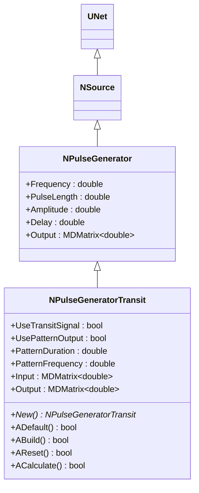
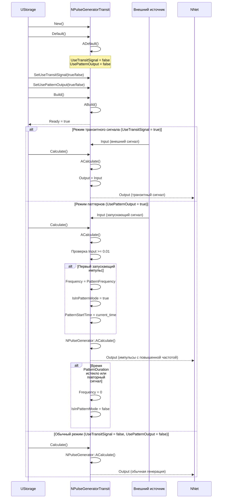
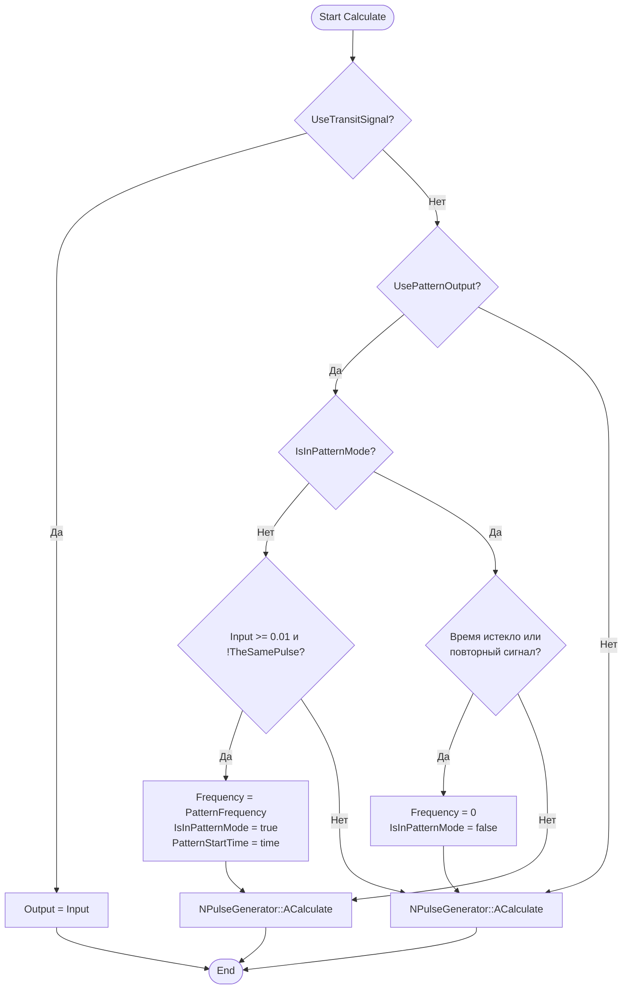
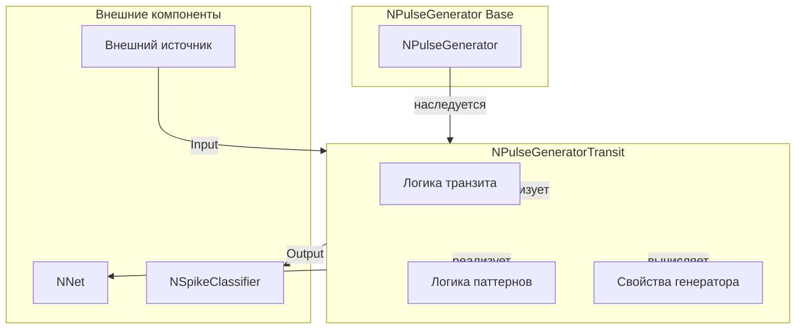
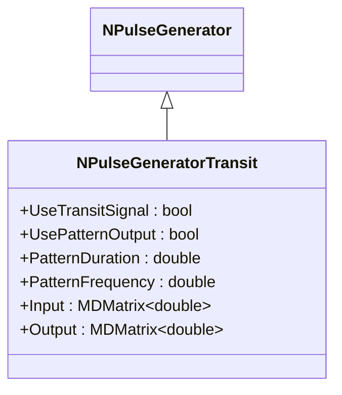
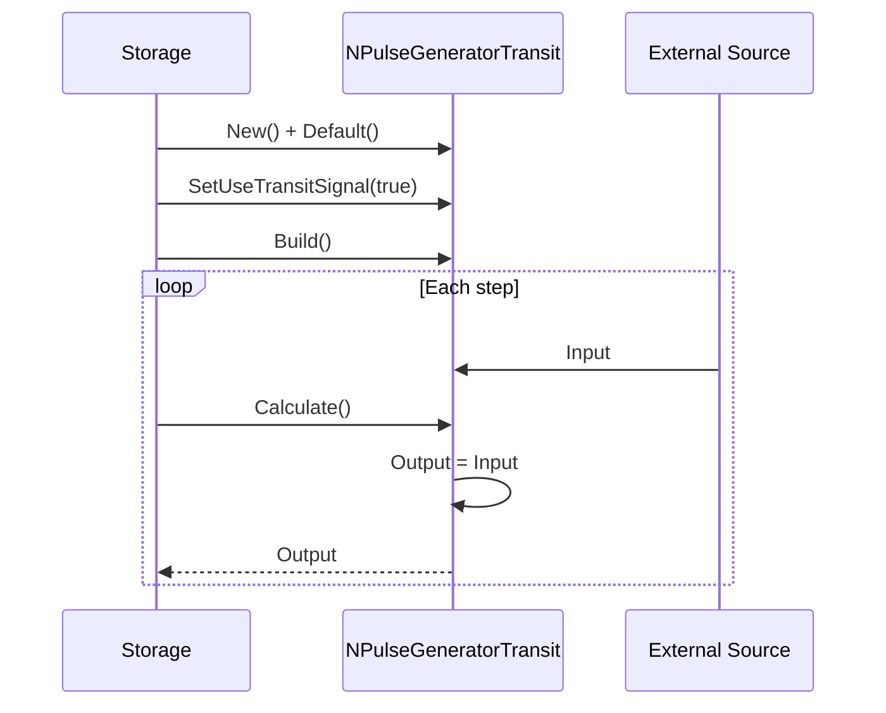
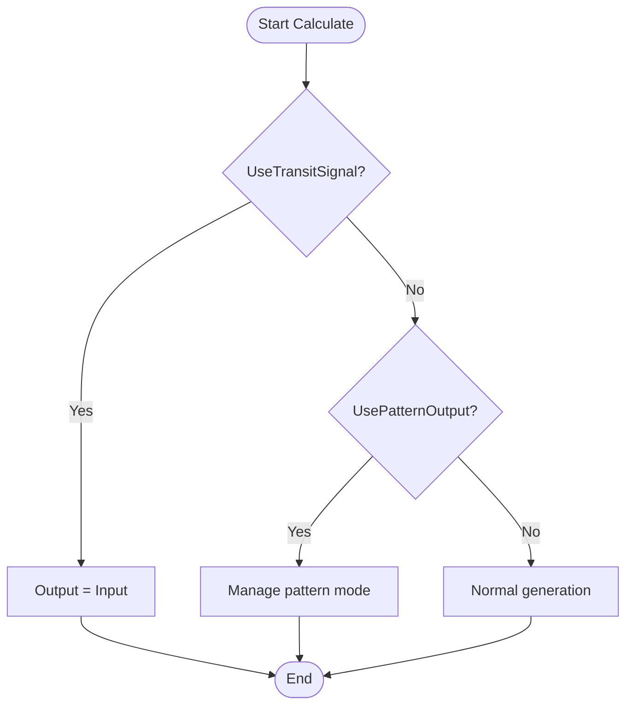
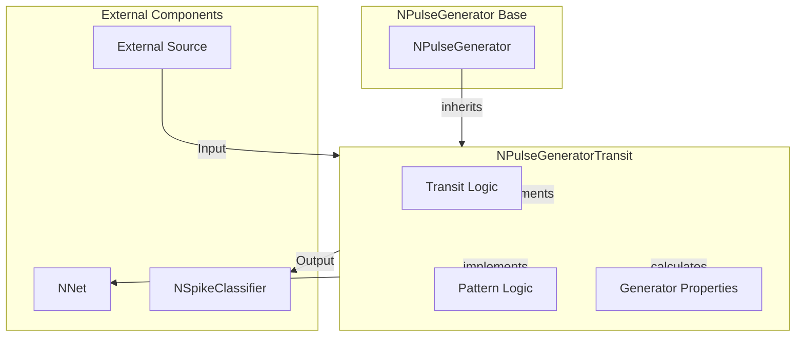

# NPulseGeneratorTransit — транзитный генератор импульсов

## RU

### Назначение

**Класс**: `NPulseGeneratorTransit` — генератор импульсов с поддержкой транзитного сигнала и паттернов.  
**Регистрация**: `NPulseLibrary.cpp` → `UploadClass("NPulseGeneratorTransit", ...)`.  
**Storage-инстансы**: `ClassName = "NPulseGeneratorTransit"` в `Bin/Configs/*/Model_*.xml`.

`NPulseGeneratorTransit` расширяет `NPulseGenerator` возможностью использования внешнего транзитного сигнала (`UseTransitSignal`) и режимом генерации паттернов с повышенной частотой (`UsePatternOutput`). Может работать в трех режимах:
1. Обычный генератор (как `NPulseGenerator`)
2. Транзитный режим: передача входного сигнала напрямую на выход
3. Режим паттернов: генерация с повышенной частотой при получении входного сигнала

**Использование:** Генерация входных импульсов с внешним управлением, когнитивная навигация (`Bin/Configs/User/CognitiveNavigation/`)

### UML-диаграмма классов



**Иерархия наследования:**
- `UNet` — базовая сеть Rdk Framework
- `NSource` — базовый источник сигналов
- `NPulseGenerator` — генератор импульсов
- `NPulseGeneratorTransit` — транзитный генератор импульсов

**Ключевые свойства:**
- `UseTransitSignal` (bool) — использовать транзитный сигнал (передача Input → Output)
- `UsePatternOutput` (bool) — использовать режим паттернов (повышенная частота)
- `PatternDuration` (double) — длительность паттерна (секунды)
- `PatternFrequency` (double) — частота генерации в режиме паттерна (Гц)
- `Input` (MDMatrix<double>) — входной сигнал для управления генератором

### UML-диаграмма последовательности



**Жизненный цикл:**
1. **Инициализация**: Установка параметров по умолчанию
2. **Выбор режима**: Установка `UseTransitSignal` или `UsePatternOutput`
3. **Транзитный режим**: Прямая передача `Input → Output`
4. **Режим паттернов**: Генерация с повышенной частотой при получении входного сигнала
5. **Обычный режим**: Стандартная генерация импульсов

### UML-диаграмма состояний

```mermaid
stateDiagram-v2
    [*] --> Uninitialized: New()
    Uninitialized --> Defaulted: Default()
    Defaulted --> Built: Build()
    Built --> Ready: Ready = true
    Ready --> CheckMode{Режим работы?}
    CheckMode -->|UseTransitSignal| TransitMode: Транзитный режим
    CheckMode -->|UsePatternOutput| PatternMode: Режим паттернов
    CheckMode -->|Обычный| NormalMode: Обычный режим
    TransitMode --> ProcessingTransit: Output = Input
    ProcessingTransit --> Ready: Шаг завершен
    PatternMode --> WaitingSignal: Ожидание входного сигнала
    WaitingSignal -->|Input >= 0.01| PatternActive: Генерация паттерна
    PatternActive --> Generating: Frequency = PatternFrequency
    Generating --> CheckPatternEnd: Проверка окончания
    CheckPatternEnd -->|Время истекло| PatternEnd: Frequency = 0
    CheckPatternEnd -->|Повторный сигнал| PatternEnd
    CheckPatternEnd -->|Продолжение| Generating
    PatternEnd --> WaitingSignal
    NormalMode --> GeneratingNormal: Обычная генерация
    GeneratingNormal --> Ready
    Ready --> Resetting: Reset()
    Resetting --> Ready: IsInPatternMode = false
```

**Состояния:**
- **Uninitialized** — создан, но не инициализирован
- **Defaulted** — параметры установлены по умолчанию
- **Built** — структура генератора построена
- **Ready** — готов к работе
- **TransitMode** — режим транзитного сигнала
- **ProcessingTransit** — обработка транзитного сигнала
- **PatternMode** — режим паттернов
- **WaitingSignal** — ожидание входного сигнала для запуска паттерна
- **PatternActive** — активный паттерн (генерация с повышенной частотой)
- **Generating** — генерация импульсов
- **CheckPatternEnd** — проверка условий окончания паттерна
- **PatternEnd** — окончание паттерна
- **NormalMode** — обычный режим генерации
- **GeneratingNormal** — обычная генерация импульсов
- **Resetting** — выполняется сброс состояний

### UML-диаграмма активности



**Алгоритм расчета:**
1. Проверка режима транзитного сигнала: если `UseTransitSignal = true`, то `Output = Input`
2. Проверка режима паттернов: если `UsePatternOutput = true`:
   - При получении входного сигнала (`Input >= 0.01`) запускается генерация с частотой `PatternFrequency`
   - Генерация продолжается в течение `PatternDuration` или до получения повторного сигнала
3. Обычный режим: вызов `NPulseGenerator::ACalculate()` для стандартной генерации

### UML-диаграмма компонентов



**Зависимости:**
- **Базовый класс**: `NPulseGenerator`
- **Внешние компоненты**: внешний источник (источник `Input`), сеть (получатель `Output`), классификатор (получатель `Output`)

### Свойства

#### Параметры (ptPubParameter)

- **`UseTransitSignal`** (bool) — использовать транзитный сигнал. Если `true`, генератор передает входной сигнал напрямую на выход (`Output = Input`). Значение по умолчанию: `false`

- **`UsePatternOutput`** (bool) — использовать режим генерации паттернов. Если `true`, генератор переходит в режим повышенной частоты при получении входного сигнала. Значение по умолчанию: `false`

- **`PatternDuration`** (double) — длительность паттерна (секунды). Время, в течение которого генератор работает с повышенной частотой `PatternFrequency`. Значение по умолчанию: `0.0`

- **`PatternFrequency`** (double) — частота генерации в режиме паттерна (Гц). Используется вместо обычной `Frequency` при активном паттерне. Значение по умолчанию: `0.0`

#### Входные свойства (ptInput | ptPubState)

- **`Input`** (MDMatrix<double>) — входной сигнал для управления генератором. Используется в транзитном режиме или для запуска паттернов. Размер матрицы: 1x1

#### Выходные свойства (ptOutput | ptPubState)

- **`Output`** (MDMatrix<double>) — выходной сигнал генератора. В транзитном режиме равен `Input`, в остальных режимах — результат генерации импульсов. Размер матрицы: 1x1

**Наследуемые свойства от NPulseGenerator:**
- `Frequency` (double) — частота генерации импульсов
- `PulseLength` (double) — длина импульса
- `Amplitude` (double) — амплитуда импульса
- `Delay` (double) — задержка начала генерации
- `OutputPotential`, `OutputFrequency`, `OutputPulseTimes` (MDMatrix<double>) — дополнительные выходные данные

### Методы

#### Публичные методы

- **`New()`** → `NPulseGeneratorTransit*` — создает новый экземпляр класса. Используется системой Rdk для создания компонентов.

#### Защищенные методы жизненного цикла

- **`ADefault()`** → `bool` — инициализирует параметры по умолчанию. Устанавливает `UseTransitSignal=false`, `UsePatternOutput=false`, `PatternFrequency=0`, `PatternDuration=0`, инициализирует `Input`.

- **`ABuild()`** → `bool` — строит структуру генератора. Вызывает `NPulseGenerator::ABuild()`.

- **`AReset()`** → `bool` — сбрасывает состояния генератора. Устанавливает `IsInPatternMode=false`, `TheSamePulse=false`, вызывает `NPulseGenerator::AReset()`.

- **`ACalculate()`** → `bool` — выполняет расчет генератора на одном шаге:
  - Если `UseTransitSignal = true`: `Output = Input`
  - Если `UsePatternOutput = true`: управление генерацией паттернов
  - Иначе: вызов `NPulseGenerator::ACalculate()` для обычной генерации

### Примеры использования

#### Пример 1: Транзитный режим

```cpp
// Создание транзитного генератора
auto generator = storage->CreateComponent<NPulseGeneratorTransit>();
generator->SetName("TransitGen1");

// Инициализация
generator->Default();

// Настройка транзитного режима
generator->UseTransitSignal = true;

// Сборка
generator->Build();

// Использование: входной сигнал передается напрямую на выход
for (int step = 0; step < 1000; step++) {
    // Установка входного сигнала (например, от другого компонента)
    // generator->Input(0, 0) = inputSignal;
    
    generator->Calculate();
    double output = generator->Output(0, 0);
    // output == inputSignal (в транзитном режиме)
}
```

#### Пример 2: Режим паттернов

```cpp
// Создание генератора с паттернами
auto generator = storage->CreateComponent<NPulseGeneratorTransit>();
generator->SetName("PatternGen1");

// Инициализация
generator->Default();

// Настройка режима паттернов
generator->UsePatternOutput = true;
generator->PatternFrequency = 10.0;  // 10 Гц при активации
generator->PatternDuration = 1.0;     // 1 секунда
generator->Frequency = 1.0;           // Обычная частота: 1 Гц

// Сборка
generator->Build();

// Использование: при получении входного сигнала генерация переходит на повышенную частоту
```

#### Пример 3: Конфигурация XML

```xml
<Generator1 Class="NPulseGeneratorTransit">
    <Parameters>
        <UseTransitSignal>0</UseTransitSignal>
        <UsePatternOutput>1</UsePatternOutput>
        <PatternFrequency>10.0</PatternFrequency>
        <PatternDuration>1.0</PatternDuration>
        <Frequency>1.0</Frequency>
        <PulseLength>0.001</PulseLength>
        <Amplitude>1.0</Amplitude>
        <Delay>0.0</Delay>
    </Parameters>
</Generator1>
```

### Использование в конфигурациях

`NPulseGeneratorTransit` используется в экспериментах с управляемой генерацией импульсов:

- **Когнитивная навигация**: `Bin/Configs/User/CognitiveNavigation/*/Model_*.xml` (входные сигналы Forward, Back, Left, Right)
- **Классификация**: `Bin/Configs/!OldConfigs/SpikeClassifier/*/Model_*.xml` (генерация паттернов для обучения)

**Типичные значения параметров:**
- **UseTransitSignal**: false (обычно используется режим паттернов)
- **UsePatternOutput**: true (для управляемой генерации)
- **PatternFrequency**: 5.0-20.0 Гц (частота при активации паттерна)
- **PatternDuration**: 0.5-2.0 сек (длительность паттерна)

## Источники

См. [Literature-References.md](../Literature-References.md): **14**, **25**.

### См. также

- [`NPulseGenerator`](NPulseGenerator.md) — базовый генератор импульсов
- [`NPGenerator`](NPGenerator.md) — генератор импульсов
- [`NFileGenerator`](NFileGenerator.md) — генератор из файла
- [`NSpikeClassifier`](NSpikeClassifier.md) — классификатор (использует транзитные генераторы)
- [Architecture.md](../Architecture.md) — архитектура библиотеки

---

## EN

### Purpose

**Class**: `NPulseGeneratorTransit` — pulse generator with transit signal and pattern support.  
**Registration**: `NPulseLibrary.cpp` → `UploadClass("NPulseGeneratorTransit", ...)`.  
**Instances**: `ClassName = "NPulseGeneratorTransit"` in `Bin/Configs/*/Model_*.xml`.

`NPulseGeneratorTransit` extends `NPulseGenerator` with the ability to use external transit signal (`UseTransitSignal`) and pattern generation mode with increased frequency (`UsePatternOutput`). Can work in three modes:
1. Normal generator (like `NPulseGenerator`)
2. Transit mode: direct transmission of input signal to output
3. Pattern mode: generation with increased frequency when receiving input signal

**Usage:** Input pulse generation with external control, cognitive navigation (`Bin/Configs/User/CognitiveNavigation/`)

### UML Class Diagram



### UML Sequence Diagram



### UML State Diagram

```mermaid
stateDiagram-v2
    [*] --> Uninitialized: New()
    Uninitialized --> Defaulted: Default()
    Defaulted --> Built: Build()
    Built --> Ready: Ready = true
    Ready --> CheckMode{Mode?}
    CheckMode -->|Transit| TransitMode: Transit mode
    CheckMode -->|Pattern| PatternMode: Pattern mode
    CheckMode -->|Normal| NormalMode: Normal mode
    TransitMode --> Ready: Step completed
    PatternMode --> WaitingSignal: Wait for signal
    WaitingSignal --> PatternActive: Signal received
    PatternActive --> Generating: Generate pattern
    Generating --> PatternEnd: Pattern ended
    PatternEnd --> WaitingSignal
    NormalMode --> Ready: Step completed
```

### UML Activity Diagram



### UML Component Diagram



### Usage in configurations

`NPulseGeneratorTransit` is used in controlled pulse generation experiments:

- **Cognitive navigation**: `Bin/Configs/User/CognitiveNavigation/*/Model_*.xml` (input signals Forward, Back, Left, Right)
- **Classification**: `Bin/Configs/!OldConfigs/SpikeClassifier/*/Model_*.xml` (pattern generation for training)

**Typical parameter values:**
- **UseTransitSignal**: false (usually pattern mode is used)
- **UsePatternOutput**: true (for controlled generation)
- **PatternFrequency**: 5.0-20.0 Hz (frequency when pattern is activated)
- **PatternDuration**: 0.5-2.0 sec (pattern duration)

### References

See [Literature-References.md](../Literature-References.md): **14**, **25**.

### See Also

- [`NPulseGenerator`](NPulseGenerator.md) — base pulse generator
- [`NPGenerator`](NPGenerator.md) — pulse generator
- [`NFileGenerator`](NFileGenerator.md) — file generator
- [`NSpikeClassifier`](NSpikeClassifier.md) — classifier (uses transit generators)
- [Architecture.md](../Architecture.md) — library architecture
