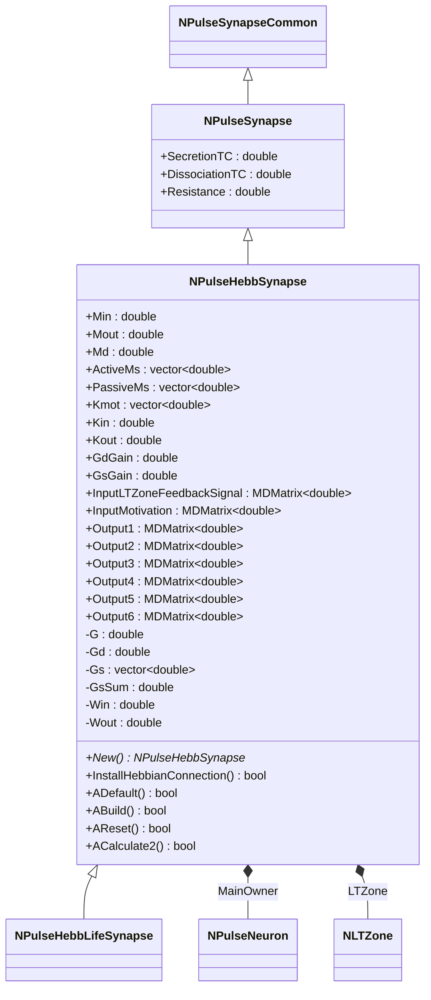
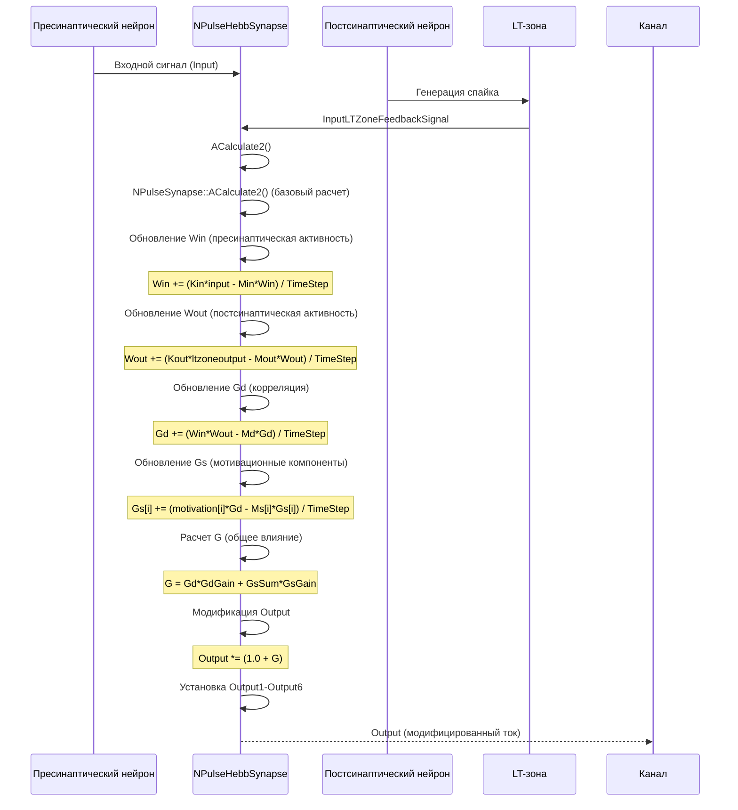
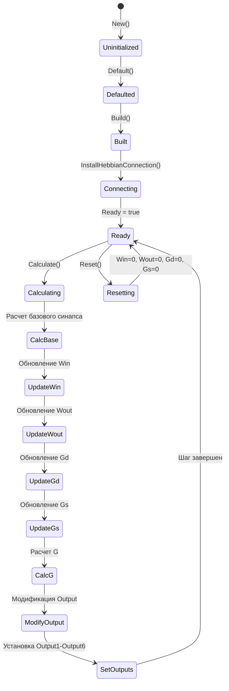
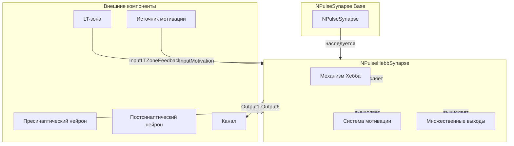
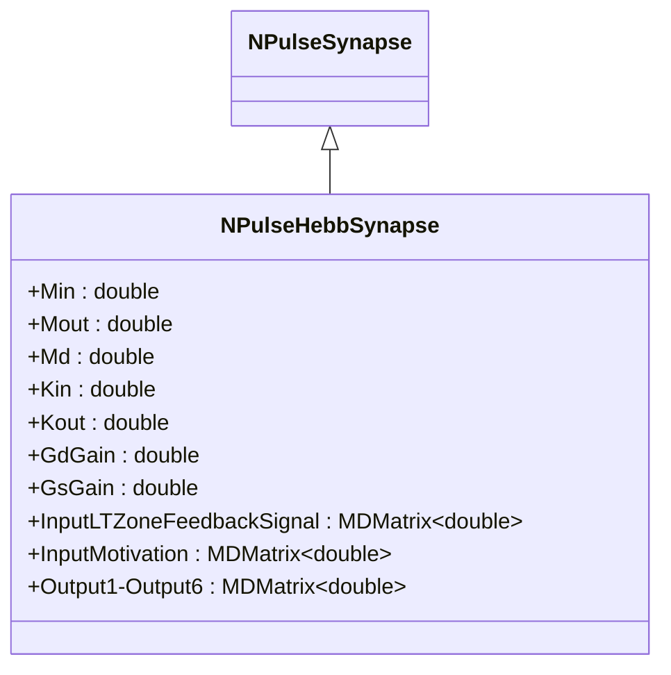
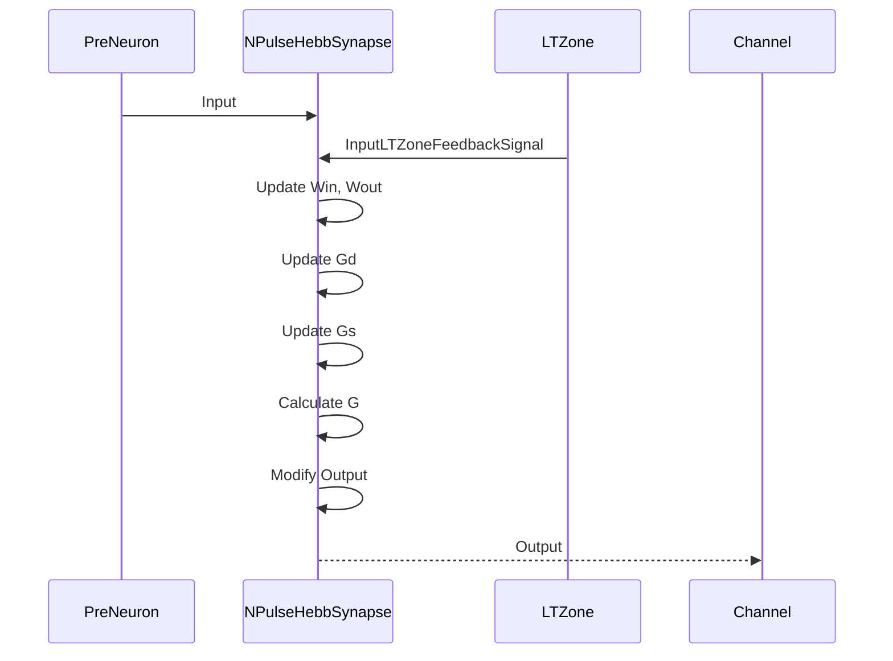

# NPulseHebbSynapse — импульсный синапс с механизмом Хебба

## RU

### Назначение

**Класс**: `NPulseHebbSynapse` — импульсный синапс с механизмом обучения Хебба и множественными выходами.  
**Регистрация**: `NPulseLibrary.cpp` → `UploadClass("NPHebbSynapse", ...)` (как алиас).  
**Storage-инстансы**: `ClassName = "NPulseHebbSynapse"` или `"NPHebbSynapse"` в `Bin/Configs/*/Model_*.xml`.

`NPulseHebbSynapse` реализует импульсный синапс с механизмом обучения Хебба, который модифицирует вес синапса на основе корреляции между пресинаптической активностью (`Win`) и постсинаптической активностью (`Wout`). Синапс имеет несколько выходов (`Output1`-`Output6`) для различных компонентов механизма Хебба и поддерживает мотивационные сигналы.

**Использование:** Моделирование синаптической пластичности по правилу Хебба, обучение нейросетей, эксперименты с мотивационными сигналами

### UML-диаграмма классов



**Иерархия наследования:**
- `NPulseSynapseCommon` — общий импульсный синапс
- `NPulseSynapse` — импульсный синапс с моделью медиатора
- `NPulseHebbSynapse` — импульсный синапс с механизмом Хебба
- `NPulseHebbLifeSynapse` — импульсный синапс Хебба с поддержкой жизнеобеспечения

**Ключевые свойства:**
- Параметры механизма Хебба: `Min`, `Mout`, `Md`, `Kin`, `Kout`
- Мотивационные параметры: `ActiveMs`, `PassiveMs`, `Kmot`
- Множественные выходы: `Output1`-`Output6` для различных компонентов

### UML-диаграмма последовательности



**Жизненный цикл:**
1. **Инициализация**: Установка параметров механизма Хебба по умолчанию
2. **Сборка**: Вызов `NPulseSynapse::ABuild()`
3. **Подключение**: Автоматическое подключение к LT-зоне нейрона (`InstallHebbianConnection()`)
4. **Расчет**: Обновление компонентов механизма Хебба и модификация выходного тока
5. **Сброс**: Обнуление состояний (`Win`, `Wout`, `Gd`, `Gs`)

### UML-диаграмма состояний



### UML-диаграмма активности

```mermaid
flowchart TD
    Start([Start Calculate]) --> CallBase[NPulseSynapse::ACalculate2]
    CallBase --> CheckInputs{Input и InputLTZoneFeedbackSignal подключены?}
    CheckInputs -->|Нет| End([End])
    CheckInputs -->|Да| GetInputs[Получение input и ltzoneoutput]
    GetInputs --> GetMotivation{InputMotivation подключен?}
    GetMotivation -->|Да| ApplyMotivation[Применение мотивационных сигналов]
    GetMotivation -->|Нет| InitMotivation[motivation = 0]
    ApplyMotivation --> UpdateWin[Win += (Kin*input - Min*Win) / TimeStep]
    InitMotivation --> UpdateWin
    UpdateWin --> UpdateWout[Wout += (Kout*ltzoneoutput - Mout*Wout) / TimeStep]
    UpdateWout --> UpdateGd[Gd += (Win*Wout - Md*Gd) / TimeStep]
    UpdateGd --> LoopGs[Цикл по Gs]
    LoopGs --> CheckMotivation{motivation[i] > 0?}
    CheckMotivation -->|Да| UpdateGsActive[Gs[i] += (motivation[i]*Gd - ActiveMs[i]*Gs[i]) / TimeStep]
    CheckMotivation -->|Нет| UpdateGsPassive[Gs[i] += (motivation[i]*Gd - PassiveMs[i]*Gs[i]) / TimeStep]
    UpdateGsActive --> CheckMoreGs{Еще элементы?}
    UpdateGsPassive --> CheckMoreGs
    CheckMoreGs -->|Да| LoopGs
    CheckMoreGs -->|Нет| SumGs[GsSum = сумма Gs]
    SumGs --> CalcG[G = Gd*GdGain + GsSum*GsGain]
    CalcG --> ModifyOutput[Output *= (1.0 + G)]
    ModifyOutput --> SetOutput1[Output1 = Output]
    SetOutput1 --> SetOutput2[Output2 = G]
    SetOutput2 --> SetOutput3[Output3 = Gd*GdGain]
    SetOutput3 --> SetOutput4[Output4 = GsSum*GsGain]
    SetOutput4 --> SetOutput5[Output5 = Win]
    SetOutput5 --> SetOutput6[Output6 = Wout]
    SetOutput6 --> End
```

**Алгоритм расчета механизма Хебба:**
1. Расчет базового синапса (`NPulseSynapse::ACalculate2()`)
2. Обновление пресинаптической активности: `Win += (Kin*input - Min*Win) / TimeStep`
3. Обновление постсинаптической активности: `Wout += (Kout*ltzoneoutput - Mout*Wout) / TimeStep`
4. Обновление корреляции: `Gd += (Win*Wout - Md*Gd) / TimeStep`
5. Обновление мотивационных компонентов: `Gs[i] += (motivation[i]*Gd - Ms[i]*Gs[i]) / TimeStep`
6. Расчет общего влияния: `G = Gd*GdGain + GsSum*GsGain`
7. Модификация выходного тока: `Output *= (1.0 + G)`

### UML-диаграмма компонентов



### Свойства

#### Параметры (ptPubParameter)

- **`Min`** (double) — постоянная распада пресинаптической активности. Определяет скорость уменьшения `Win` при отсутствии входного сигнала. Значение по умолчанию: 10.0

- **`Mout`** (double) — постоянная распада постсинаптической активности. Определяет скорость уменьшения `Wout` при отсутствии активности LT-зоны. Значение по умолчанию: 10.0

- **`Md`** (double) — постоянная распада корреляции. Определяет скорость уменьшения `Gd` при отсутствии корреляции. Значение по умолчанию: 0.001

- **`ActiveMs`** (vector<double>) — постоянные распада активных мотивационных компонентов. Определяют скорость уменьшения `Gs[i]` при положительной мотивации. Размер должен соответствовать размеру `Kmot`. Значение по умолчанию: [0.001, 0.001, 0.001, 0.001, 0.001]

- **`PassiveMs`** (vector<double>) — постоянные распада пассивных мотивационных компонентов. Определяют скорость уменьшения `Gs[i]` при отрицательной мотивации. Размер должен соответствовать размеру `Kmot`. Значение по умолчанию: [0.1, 0.1, 0.1, 0.1, 0.1]

- **`Kmot`** (vector<double>) — коэффициенты мотивации. Определяют влияние мотивационных сигналов на компоненты `Gs`. Значение по умолчанию: [1, 1, 10000, 100000, 100]

- **`Kin`** (double) — коэффициент усиления пресинаптической активности. Определяет скорость увеличения `Win` при наличии входного сигнала. Значение по умолчанию: 100.0

- **`Kout`** (double) — коэффициент усиления постсинаптической активности. Определяет скорость увеличения `Wout` при наличии активности LT-зоны. Значение по умолчанию: 100.0

- **`GdGain`** (double) — коэффициент усиления корреляционного компонента. Определяет влияние `Gd` на общее влияние `G`. Значение по умолчанию: 1.0

- **`GsGain`** (double) — коэффициент усиления мотивационного компонента. Определяет влияние `GsSum` на общее влияние `G`. Значение по умолчанию: 10.0

**Наследуемые параметры от NPulseSynapse:**
- Все параметры базового класса (`SecretionTC`, `DissociationTC`, `Resistance`, и т.д.)

#### Входные свойства (ptInput | ptPubState)

**Наследуемые от NPulseSynapse:**
- **`Input`** (MDMatrix<double>) — входной сигнал от пресинаптического нейрона

- **`InputLTZoneFeedbackSignal`** (MDMatrix<double>) — входной сигнал обратной связи от LT-зоны постсинаптического нейрона. Автоматически подключается методом `InstallHebbianConnection()`.

- **`InputMotivation`** (MDMatrix<double>) — входной сигнал мотивации. Опциональный вход для мотивационных сигналов, влияющих на компоненты `Gs`.

#### Выходные свойства (ptOutput | ptPubState)

**Наследуемые от NPulseSynapse:**
- **`Output`** (MDMatrix<double>) — выходной ток синапса. Модифицируется механизмом Хебба: `Output *= (1.0 + G)`.

- **`Output1`** (MDMatrix<double>) — копия модифицированного выходного тока (`Output`)

- **`Output2`** (MDMatrix<double>) — общее влияние механизма Хебба (`G`)

- **`Output3`** (MDMatrix<double>) — корреляционный компонент (`Gd * GdGain`)

- **`Output4`** (MDMatrix<double>) — мотивационный компонент (`GsSum * GsGain`)

- **`Output5`** (MDMatrix<double>) — пресинаптическая активность (`Win`)

- **`Output6`** (MDMatrix<double>) — постсинаптическая активность (`Wout`)

#### Состояния (ptPubState)

- **`Win`** (double) — пресинаптическая активность. Интегрируется согласно: `Win += (Kin*input - Min*Win) / TimeStep`. Начальное значение: 0.0

- **`Wout`** (double) — постсинаптическая активность. Интегрируется согласно: `Wout += (Kout*ltzoneoutput - Mout*Wout) / TimeStep`. Начальное значение: 0.0

- **`Gd`** (double) — корреляция между пресинаптической и постсинаптической активностью. Интегрируется согласно: `Gd += (Win*Wout - Md*Gd) / TimeStep`. Начальное значение: 0.0

- **`Gs`** (vector<double>) — мотивационные компоненты. Интегрируются согласно: `Gs[i] += (motivation[i]*Gd - Ms[i]*Gs[i]) / TimeStep`. Размер соответствует размеру `Kmot`. Начальное значение: все элементы 0.0

- **`GsSum`** (double) — сумма мотивационных компонентов. Рассчитывается как сумма всех элементов `Gs`. Начальное значение: 0.0

- **`G`** (double) — общее влияние механизма Хебба. Рассчитывается как: `G = Gd*GdGain + GsSum*GsGain`. Начальное значение: 0.0

### Методы

#### Публичные методы

- **`New()`** → `NPulseHebbSynapse*` — создает новый экземпляр класса.

#### Защищенные методы жизненного цикла

- **`ADefault()`** → `bool` — инициализирует параметры по умолчанию. Устанавливает значения для всех параметров механизма Хебба, вызывает `NPulseSynapse::ADefault()`.

- **`ABuild()`** → `bool` — строит структуру синапса. Вызывает `NPulseSynapse::ABuild()`.

- **`AReset()`** → `bool` — сбрасывает состояния синапса. Обнуляет `Win`, `Wout`, `Gd`, `Gs`, `GsSum`, `G`. Автоматически подключается к LT-зоне, если не подключен. Вызывает `NPulseSynapse::AReset()`.

- **`ACalculate2()`** → `bool` — выполняет расчет синапса на одном шаге. Вызывает `NPulseSynapse::ACalculate2()` для базового расчета, затем обновляет компоненты механизма Хебба и модифицирует выходной ток.

#### Защищенные методы подключения

- **`InstallHebbianConnection()`** → `bool` — подключает синапс к LT-зоне нейрона-владельца. Создает связь между `LTZone->Output` и `InputLTZoneFeedbackSignal`. Возвращает `false` только при ошибке установки связи.

### Примеры использования

#### Пример 1: Создание синапса в коде C++

```cpp
// Создание синапса Хебба
auto synapse = storage->CreateComponent<NPulseHebbSynapse>();
synapse->SetName("HebbSynapse");

// Инициализация
synapse->Default();

// Настройка параметров механизма Хебба
synapse->Min = 10.0;              // Постоянная распада пресинаптической активности
synapse->Mout = 10.0;             // Постоянная распада постсинаптической активности
synapse->Md = 0.001;              // Постоянная распада корреляции
synapse->Kin = 100.0;             // Коэффициент усиления пресинаптической активности
synapse->Kout = 100.0;            // Коэффициент усиления постсинаптической активности
synapse->GdGain = 1.0;            // Коэффициент усиления корреляционного компонента
synapse->GsGain = 10.0;           // Коэффициент усиления мотивационного компонента

// Настройка мотивационных параметров
synapse->Kmot->resize(5);
synapse->Kmot[0] = 1.0;
synapse->Kmot[1] = 1.0;
synapse->Kmot[2] = 10000.0;
synapse->Kmot[3] = 100000.0;
synapse->Kmot[4] = 100.0;

synapse->ActiveMs->resize(5, 0.001);
synapse->PassiveMs->resize(5, 0.1);

// Сборка
synapse->Build();

// Использование
for (int step = 0; step < 10000; step++) {
    synapse->Calculate();
    double output = synapse->Output(0, 0);
    double g = synapse->Output2(0, 0);
    double win = synapse->Output5(0, 0);
    double wout = synapse->Output6(0, 0);
    
    if (step % 1000 == 0) {
        std::cout << "Step " << step << ": Output = " << output 
                  << ", G = " << g << ", Win = " << win 
                  << ", Wout = " << wout << std::endl;
    }
}
```

#### Пример 2: Конфигурация XML

```xml
<Synapse1 Class="NPulseHebbSynapse">
    <Parameters>
        <Type>1</Type>
        <PulseAmplitude>1.0</PulseAmplitude>
        <Resistance>1.0e10</Resistance>
        <Weight>1.0</Weight>
        <SecretionTC>0.001</SecretionTC>
        <DissociationTC>0.01</DissociationTC>
        <Min>10</Min>
        <Mout>10</Mout>
        <Md>0.001</Md>
        <Kin>100</Kin>
        <Kout>100</Kout>
        <GdGain>1</GdGain>
        <GsGain>10</GsGain>
    </Parameters>
</Synapse1>
```

### Использование в конфигурациях

`NPulseHebbSynapse` используется в экспериментах с синаптической пластичностью:

- Моделирование обучения по правилу Хебба
- Эксперименты с мотивационными сигналами
- Изучение синаптической пластичности

**Типичные значения параметров:**

1. **Стандартный Хебб**: Min=10, Mout=10, Md=0.001, Kin=100, Kout=100
2. **Быстрое обучение**: Min=5, Mout=5, Md=0.01, Kin=200, Kout=200
3. **Медленное обучение**: Min=20, Mout=20, Md=0.0001, Kin=50, Kout=50

**Особенности:**
- Автоматически подключается к LT-зоне нейрона-владельца
- Поддерживает мотивационные сигналы для модуляции обучения
- Имеет множественные выходы для мониторинга компонентов механизма Хебба

### См. также

- [`NPulseSynapse`](NPulseSynapse.md) — импульсный синапс с моделью медиатора
- [`NPulseHebbLifeSynapse`](NPulseHebbLifeSynapse.md) — импульсный синапс Хебба с поддержкой жизнеобеспечения
- [`NPHebbSynapse`](NPHebbSynapse.md) — алиас для NPulseHebbSynapse
- [`NPulseNeuron`](NPulseNeuron.md) — импульсный нейрон
- [`NPulseLTZoneCommon`](NPulseLTZoneCommon.md) — общая импульсная LT-зона
- [Architecture.md](../Architecture.md) — архитектура библиотеки
- [Scientific-Background.md](../Scientific-Background.md) — научный фон (правило Хебба, синаптическая пластичность)

---

## EN

### Purpose

**Class**: `NPulseHebbSynapse` — spiking synapse with Hebbian learning mechanism and multiple outputs.  
**Registration**: `NPulseLibrary.cpp` → `UploadClass("NPHebbSynapse", ...)` (as alias).  
**Instances**: `ClassName = "NPulseHebbSynapse"` or `"NPHebbSynapse"` in `Bin/Configs/*/Model_*.xml`.

`NPulseHebbSynapse` implements a spiking synapse with Hebbian learning mechanism that modifies synapse weight based on correlation between presynaptic activity (`Win`) and postsynaptic activity (`Wout`). The synapse has multiple outputs (`Output1`-`Output6`) for various Hebbian mechanism components and supports motivational signals.

**Usage:** Modeling Hebbian synaptic plasticity, neural network learning, experiments with motivational signals

### UML Class Diagram



### UML Sequence Diagram



### See Also

- [`NPulseSynapse`](NPulseSynapse.md) — spiking synapse with neurotransmitter model
- [`NPulseHebbLifeSynapse`](NPulseHebbLifeSynapse.md) — Hebbian synapse with life support
- [`NPHebbSynapse`](NPHebbSynapse.md) — alias for NPulseHebbSynapse
- [`NPulseNeuron`](NPulseNeuron.md) — spiking neuron
- [`NPulseLTZoneCommon`](NPulseLTZoneCommon.md) — common spiking LT-zone
- [Architecture.md](../Architecture.md) — library architecture
- [Scientific-Background.md](../Scientific-Background.md) — scientific background (Hebb's rule, synaptic plasticity)
