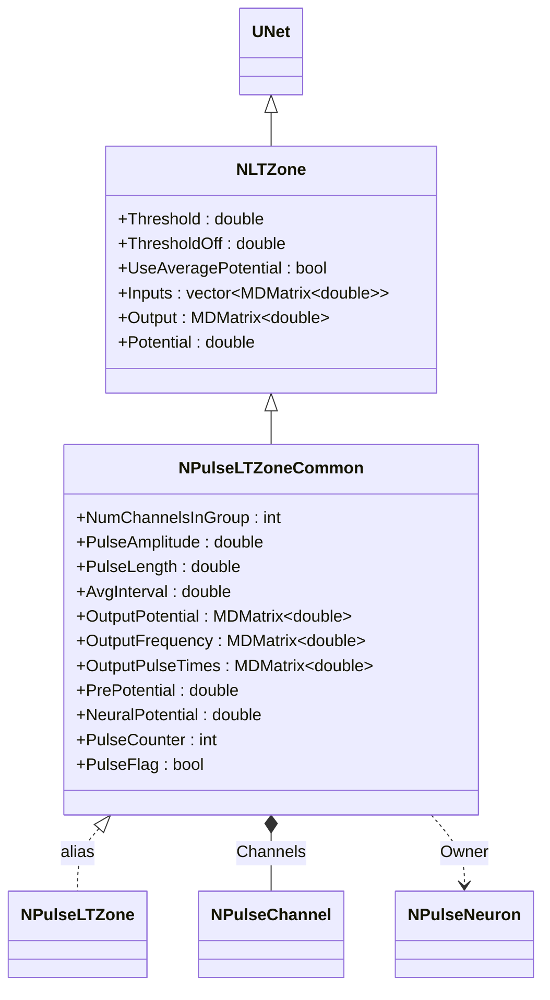
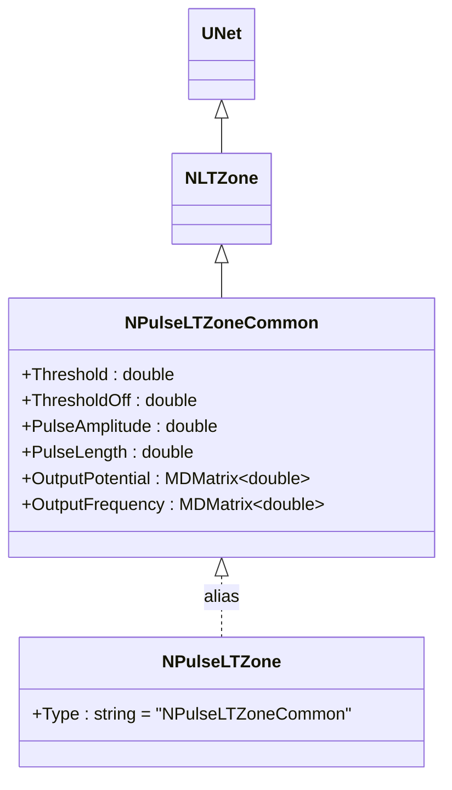
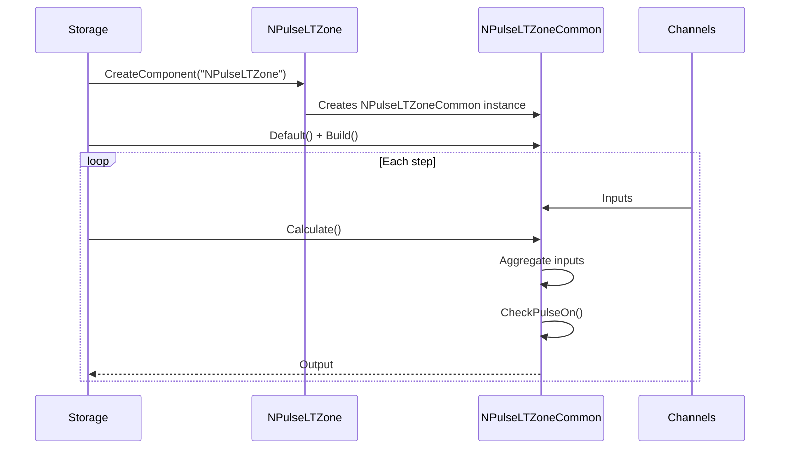
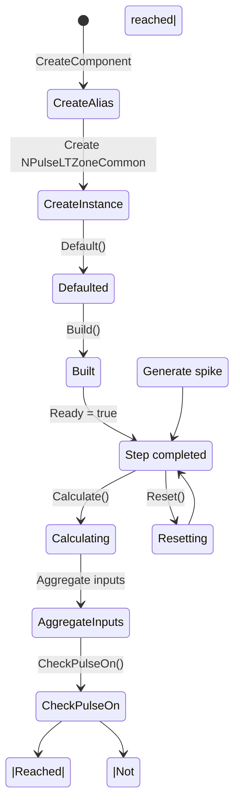
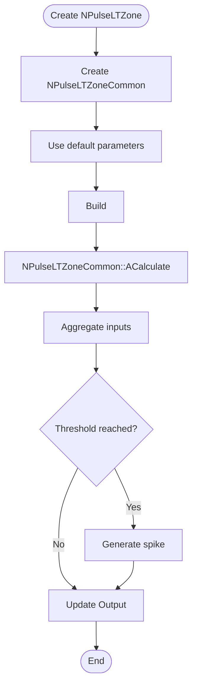
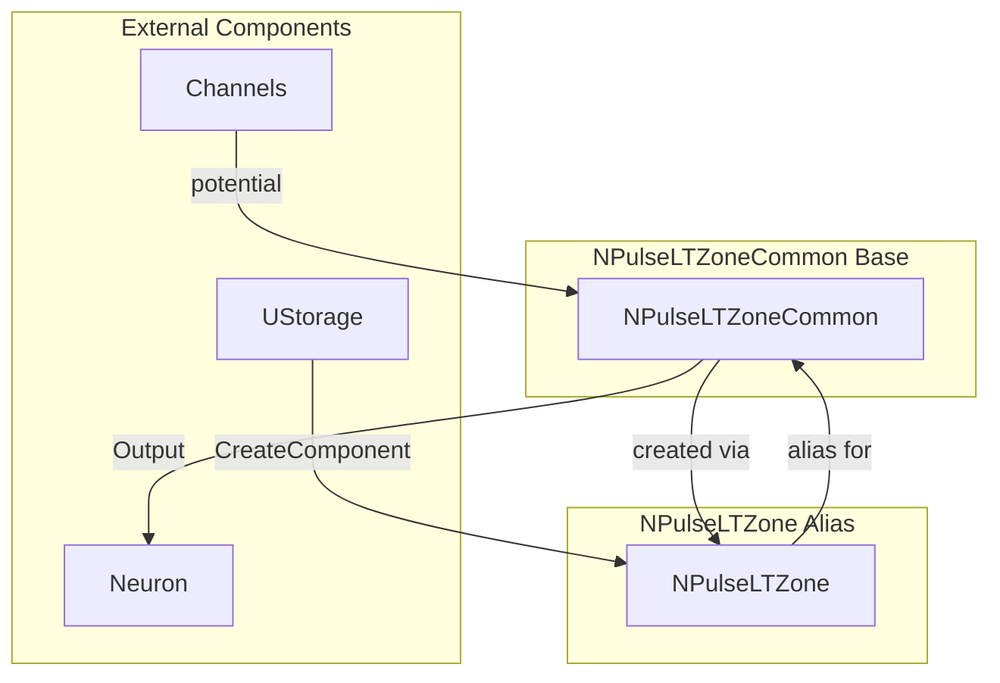

# NPulseLTZone — импульсная LT-зона

## RU

### Назначение

**Класс**: `NPulseLTZone` — базовая импульсная LT-зона (низкопороговая зона) для генерации спайков.  
**Регистрация**: `NPulseLibrary.cpp` → `UploadClass("NPulseLTZone", ...)`.  
**Storage-инстансы**: `ClassName = "NPulseLTZone"` в `Bin/Configs/*/Model_*.xml`.

`NPulseLTZone` является алиасом или конфигурационным вариантом базового класса `NPulseLTZoneCommon`. При создании компонента с `ClassName = "NPulseLTZone"` фактически создается экземпляр класса `NPulseLTZoneCommon` с параметрами по умолчанию.

`NPulseLTZoneCommon` реализует низкопороговую зону (LT-зона) для генерации спайков. Отслеживает входные потенциалы, определяет момент генерации спайка на основе пороговых значений (`Threshold`, `ThresholdOff`), и управляет генерацией импульсов с заданной амплитудой и длительностью.

**Использование:** Низкопороговая зона для генерации спайков, управление генерацией импульсов

### UML-диаграмма классов



**Иерархия наследования:**
- `UNet` — базовая сеть Rdk Framework
- `NLTZone` — базовая LT-зона
- `NPulseLTZoneCommon` — общая импульсная LT-зона
- `NPulseLTZone` — алиас для `NPulseLTZoneCommon`

### Свойства

`NPulseLTZone` использует все свойства класса `NPulseLTZoneCommon` с параметрами по умолчанию.

**Параметры:**
- `Threshold` — порог генерации спайка
- `ThresholdOff` — порог завершения генерации спайка
- `PulseAmplitude` — амплитуда импульса
- `PulseLength` — длительность импульса
- `AvgInterval` — интервал усреднения частоты

**Выходы:**
- `OutputPotential` — выходной потенциал
- `OutputFrequency` — выходная частота
- `OutputPulseTimes` — времена генерации спайков

### Методы

`NPulseLTZone` использует все методы класса `NPulseLTZoneCommon`.

### Примеры использования

#### Пример 1: Создание LT-зоны в коде C++

```cpp
// Создание импульсной LT-зоны
auto ltZone = storage->CreateComponent("NPulseLTZone");
ltZone->SetName("LTZone");

// Инициализация (использует параметры по умолчанию)
ltZone->Default();

// Использование
ltZone->Build();
```

### См. также

- [`NPulseLTZoneCommon`](NPulseLTZoneCommon.md) — общая импульсная LT-зона (базовый класс)
- [`NPulseLTZoneIzhikevich`](NPulseLTZoneIzhikevich.md) — LT-зона модели Ижикевича
- [`NPulseLTZoneIaF`](NPulseLTZoneIaF.md) — LT-зона модели IaF
- [`NPulseLTZoneThreshold`](NPulseLTZoneThreshold.md) — LT-зона с порогом
- [`NPulseNeuron`](NPulseNeuron.md) — импульсный нейрон
- [Architecture.md](../Architecture.md) — архитектура библиотеки

---

## EN

### Purpose

**Class**: `NPulseLTZone` — alias for `NPulseLTZoneCommon` class.  
**Registration**: `NPulseLibrary.cpp` → `UploadClass("NPulseLTZone", ...)`.  
**Instances**: `ClassName = "NPulseLTZone"` in `Bin/Configs/*/Model_*.xml`.

`NPulseLTZone` is an alias (synonym) for the `NPulseLTZoneCommon` class. When creating a component with `ClassName = "NPulseLTZone"`, an instance of `NPulseLTZoneCommon` with default parameters is actually created.

**Usage:** Low-threshold zone for spike generation, impulse generation management

### UML Class Diagram



### UML Sequence Diagram



### UML State Diagram



### UML Activity Diagram



### UML Component Diagram



### Properties

`NPulseLTZone` uses all properties of `NPulseLTZoneCommon` class with default parameters:

**Inherited from NPulseLTZoneCommon:**
- `Threshold` (double) — spike generation threshold
- `ThresholdOff` (double) — spike termination threshold
- `UseAveragePotential` (bool) — use averaging for potentials
- `Inputs` (vector<MDMatrix<double>>) — input signals from channels
- `Output` (MDMatrix<double>) — output signal (spike amplitude)
- `Potential` (double) — current LT-zone potential
- `NumChannelsInGroup` (int) — number of channels in group
- `PulseAmplitude` (double) — pulse amplitude
- `PulseLength` (double) — pulse length
- `AvgInterval` (double) — averaging interval for frequency
- `OutputPotential` (MDMatrix<double>) — output potential
- `OutputFrequency` (MDMatrix<double>) — output frequency
- `OutputPulseTimes` (MDMatrix<double>) — pulse times

### Methods

`NPulseLTZone` uses all methods of `NPulseLTZoneCommon` class:
- `SetPulseAmplitude(value)` → `bool` — set pulse amplitude
- `CheckPulseOn()` → `bool` — check if pulse should be generated
- `CheckPulseOff()` → `bool` — check if pulse should be terminated
- `ADefault()` → `bool` — initialize default parameters
- `ABuild()` → `bool` — build LT-zone structure
- `AReset()` → `bool` — reset LT-zone state
- `ACalculate()` → `bool` — perform one calculation step

### Usage in configurations

`NPulseLTZone` is used as an alias for `NPulseLTZoneCommon`:

- **LT-zone creation**: `Bin/Configs/!OldConfigs/*/Model_*.xml` (where `NPulseLTZone` is used instead of `NPulseLTZoneCommon`)
- **Spike generation**: Low-threshold zone for spike generation
- **Impulse management**: Manages impulse generation with specified amplitude and duration

**Typical parameter values:**
- All parameters are identical to `NPulseLTZoneCommon`:
  - **Threshold**: depends on implementation (spike generation threshold)
  - **ThresholdOff**: depends on implementation (spike termination threshold)
  - **PulseAmplitude**: depends on implementation (spike amplitude)
  - **PulseLength**: depends on implementation (spike duration)

**Features:**
- Alias: provides simplified naming for `NPulseLTZoneCommon`
- Default parameters: uses default parameters from `NPulseLTZoneCommon`
- Spike generation: generates spikes when threshold is reached
- Frequency tracking: tracks spike frequency and pulse times

### See Also

- [`NPulseLTZoneCommon`](NPulseLTZoneCommon.md) — common spiking LT-zone (base class)
- [`NPulseLTZoneIzhikevich`](NPulseLTZoneIzhikevich.md) — Izhikevich LT-zone
- [`NPulseLTZoneIaF`](NPulseLTZoneIaF.md) — IaF LT-zone
- [`NPulseLTZoneThreshold`](NPulseLTZoneThreshold.md) — threshold LT-zone
- [`NPulseNeuron`](NPulseNeuron.md) — spiking neuron
- [Architecture.md](../Architecture.md) — library architecture
