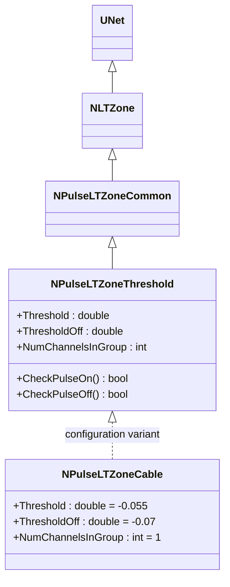
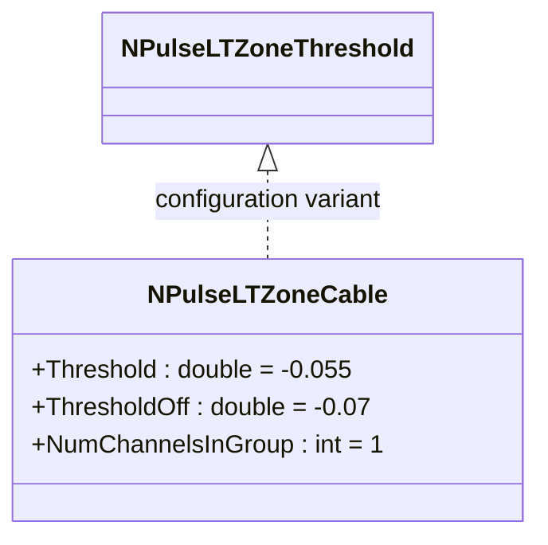
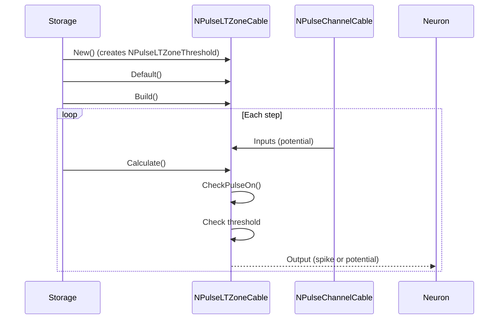
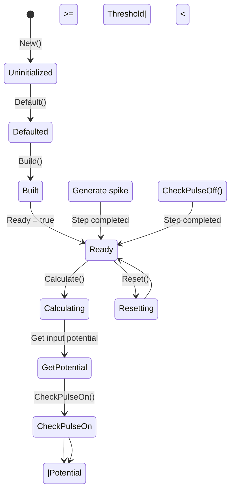
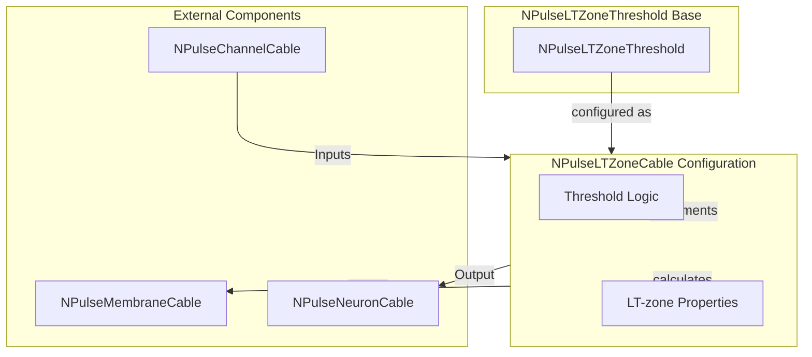

# NPulseLTZoneCable — кабельная импульсная LT-зона

## RU

### Назначение

**Класс**: `NPulseLTZoneCable` — конфигурационный вариант импульсной LT-зоны для кабельных моделей.  
**Регистрация**: `NPulseLibrary.cpp` → `UploadClass("NPulseLTZoneCable", ...)`.  
**Storage-инстансы**: `ClassName = "NPulseLTZoneCable"` в `Bin/Configs/*/Model_*.xml`.

`NPulseLTZoneCable` является конфигурационным вариантом класса `NPulseLTZoneThreshold` с параметрами для кабельных моделей. При создании компонента с `ClassName = "NPulseLTZoneCable"` создается экземпляр `NPulseLTZoneThreshold` с параметрами:
- `Threshold = -0.055` (-55 мВ) — порог генерации спайка
- `ThresholdOff = -0.07` (-70 мВ) — порог окончания спайка
- `NumChannelsInGroup = 1` — количество каналов в группе

**Использование:** Кабельная LT-зона, моделирование дендритов с кабельной моделью

### UML-диаграмма классов



**Иерархия наследования:**
- `UNet` — базовая сеть Rdk Framework
- `NLTZone` — базовая LT-зона
- `NPulseLTZoneCommon` — общая импульсная LT-зона
- `NPulseLTZoneThreshold` — базовая импульсная LT-зона с порогом
- `NPulseLTZoneCable` — конфигурационный вариант для кабельных моделей

**Параметры конфигурации:**
- `Threshold = -0.055` (-55 мВ) — порог генерации спайка
- `ThresholdOff = -0.07` (-70 мВ) — порог окончания спайка
- `NumChannelsInGroup = 1` — количество каналов в группе

### Свойства

`NPulseLTZoneCable` использует все свойства базового класса `NPulseLTZoneThreshold` с параметрами:
- `Threshold = -0.055` (-55 мВ)
- `ThresholdOff = -0.07` (-70 мВ)
- `NumChannelsInGroup = 1`

### Методы

`NPulseLTZoneCable` использует все методы базового класса `NPulseLTZoneThreshold`.

### Примеры использования

#### Пример 1: Создание кабельной LT-зоны в коде C++

```cpp
// Создание кабельной LT-зоны
auto ltZone = storage->CreateComponent("NPulseLTZoneCable");
ltZone->SetName("CableLTZone");

// Инициализация (использует параметры по умолчанию)
ltZone->Default();

// Использование
ltZone->Build();
```

### См. также

- [`NPulseLTZoneThreshold`](NPulseLTZoneThreshold.md) — базовая LT-зона с порогом (базовый класс)
- [`NPulseChannelCable`](NPulseChannelCable.md) — кабельный импульсный канал
- [`NPulseMembraneCable`](NPulseMembraneCable.md) — кабельная импульсная мембрана
- [Architecture.md](../Architecture.md) — архитектура библиотеки

---

## EN

### Purpose

**Class**: `NPulseLTZoneCable` — configuration variant of spiking LT-zone for cable models.  
**Registration**: `NPulseLibrary.cpp` → `UploadClass("NPulseLTZoneCable", ...)`.  
**Instances**: `ClassName = "NPulseLTZoneCable"` in `Bin/Configs/*/Model_*.xml`.

`NPulseLTZoneCable` is a configuration variant of `NPulseLTZoneThreshold` class with parameters for cable models. When creating a component with `ClassName = "NPulseLTZoneCable"`, an instance of `NPulseLTZoneThreshold` is created with parameters:
- `Threshold = -0.055` (-55 mV) — spike generation threshold
- `ThresholdOff = -0.07` (-70 mV) — spike termination threshold
- `NumChannelsInGroup = 1` — number of channels in group

**Usage:** Cable LT-zone, dendrite modeling with cable model

### UML Class Diagram



### UML Sequence Diagram



### UML State Diagram



### UML Activity Diagram

```mermaid
flowchart TD
    Start([Start Calculate]) --> GetPotential[Get input potential from channel]
    GetPotential --> CheckThreshold{Potential >= Threshold?}
    CheckThreshold -->|Yes| GenerateSpike[Generate spike]
    CheckThreshold -->|No| CheckPulseOff{CheckPulseOff()}
    GenerateSpike --> SetOutput[Output = PulseAmplitude]
    CheckPulseOff -->|PulseFlag| ClearPulse[Clear pulse flag]
    CheckPulseOff -->|!PulseFlag| SetOutputZero[Output = 0]
    ClearPulse --> SetOutputZero
    SetOutput --> End([End])
    SetOutputZero --> End
```

### UML Component Diagram



### Usage in configurations

`NPulseLTZoneCable` is used in cable model experiments:

- **Cable models**: `Bin/Configs/!OldConfigs/*/Model_*.xml` (where cable LT-zone is required)
- **Dendrite modeling**: Used with `NPulseChannelCable` and `NPulseMembraneCable`

**Typical parameter values:**
- **Threshold**: -0.055 (-55 mV) — spike generation threshold
- **ThresholdOff**: -0.07 (-70 mV) — spike termination threshold
- **NumChannelsInGroup**: 1 — number of channels in group

**Features:**
- Configuration variant of `NPulseLTZoneThreshold` with cable-optimized parameters
- Compatible with cable channels and membranes
- Optimized thresholds for cable model neurons

### See Also

- [`NPulseLTZoneThreshold`](NPulseLTZoneThreshold.md) — base LT-zone with threshold (base class)
- [`NPulseChannelCable`](NPulseChannelCable.md) — cable spiking channel
- [`NPulseMembraneCable`](NPulseMembraneCable.md) — cable spiking membrane
- [Architecture.md](../Architecture.md) — library architecture
