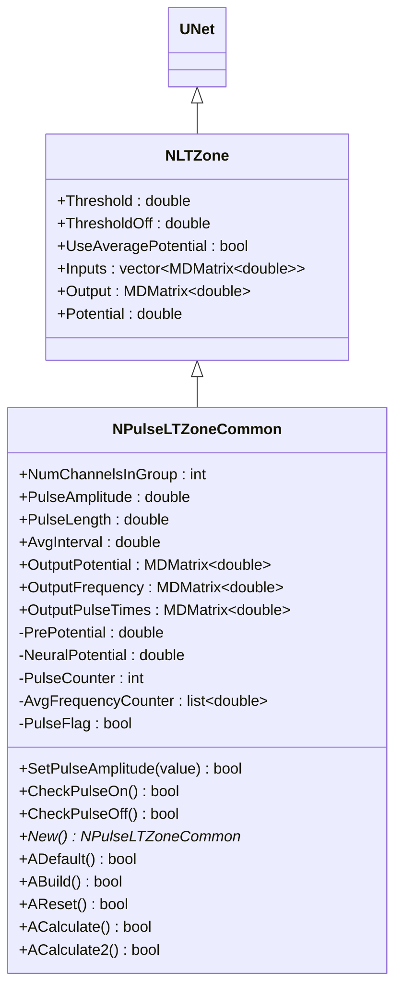
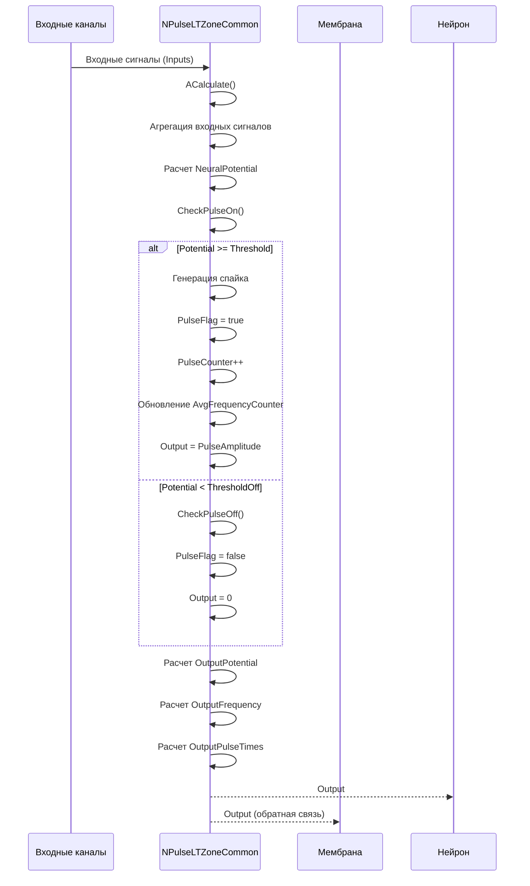
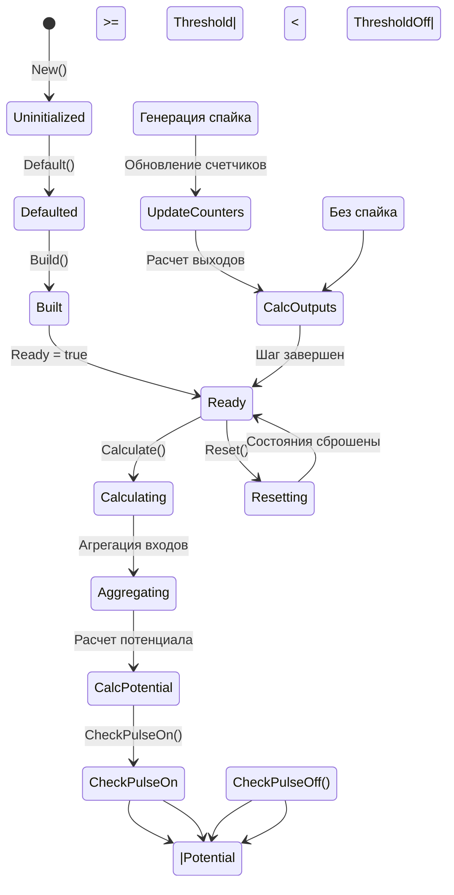
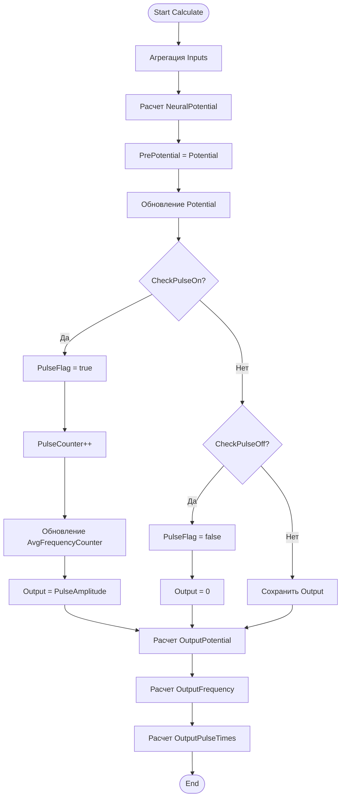
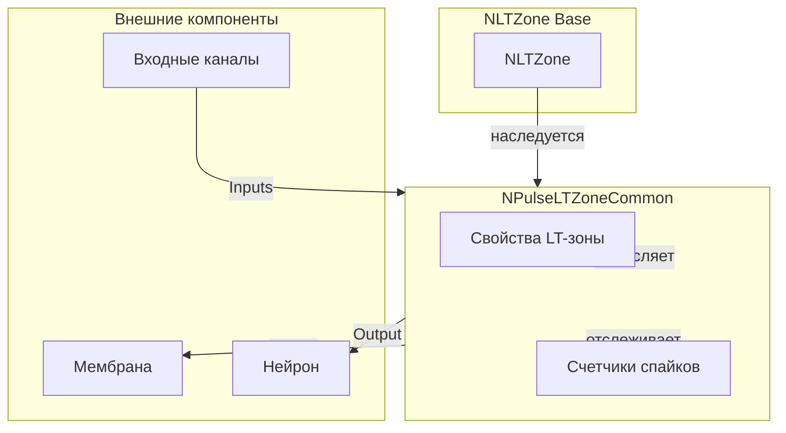
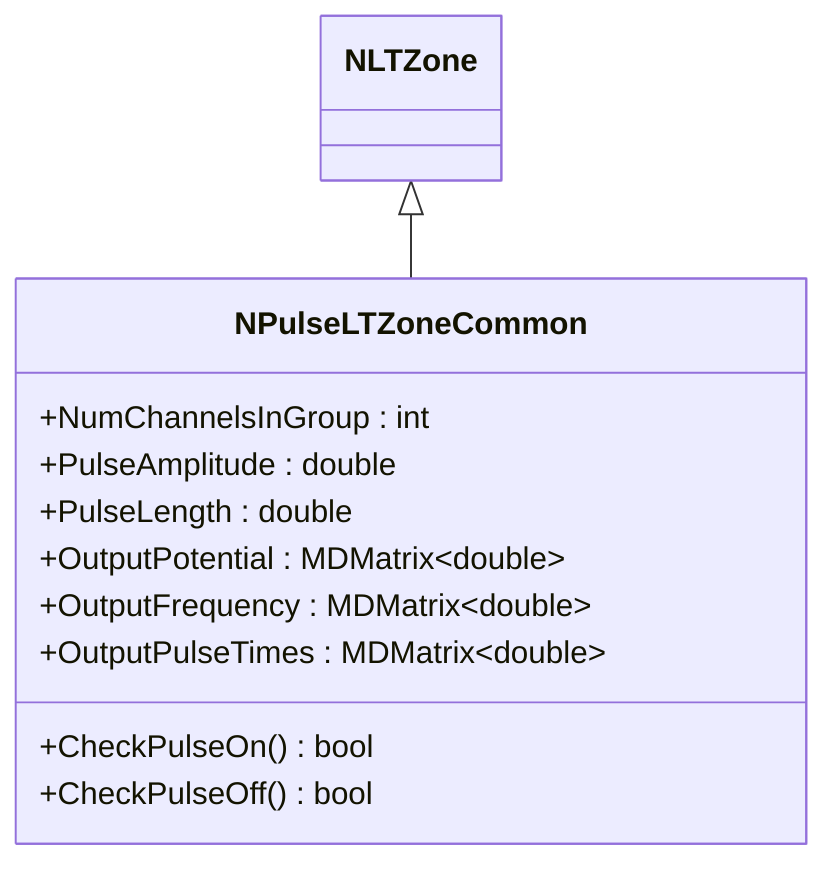
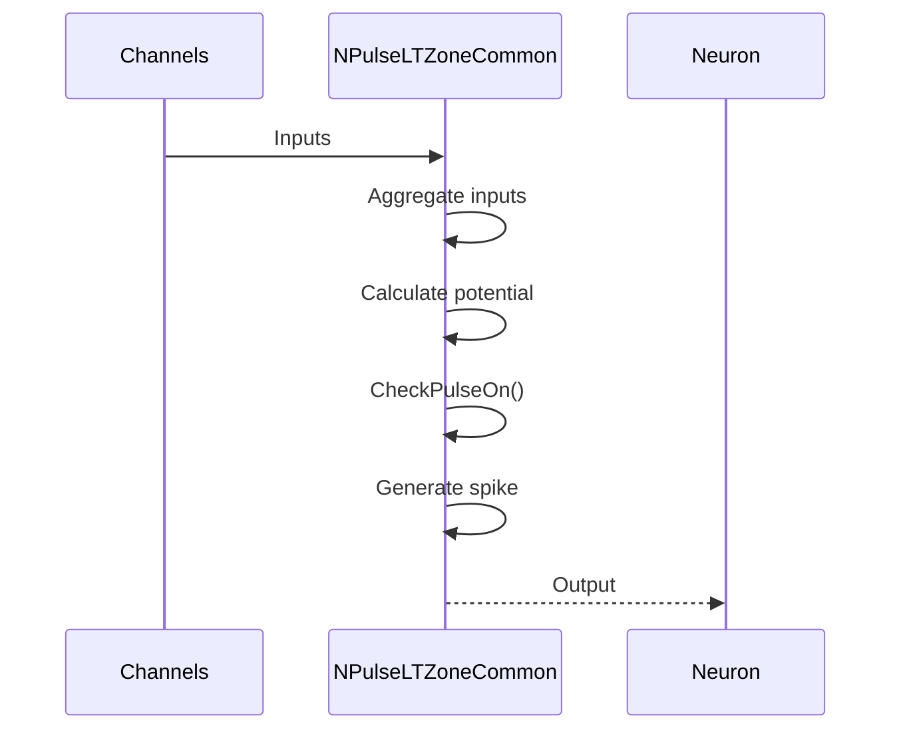
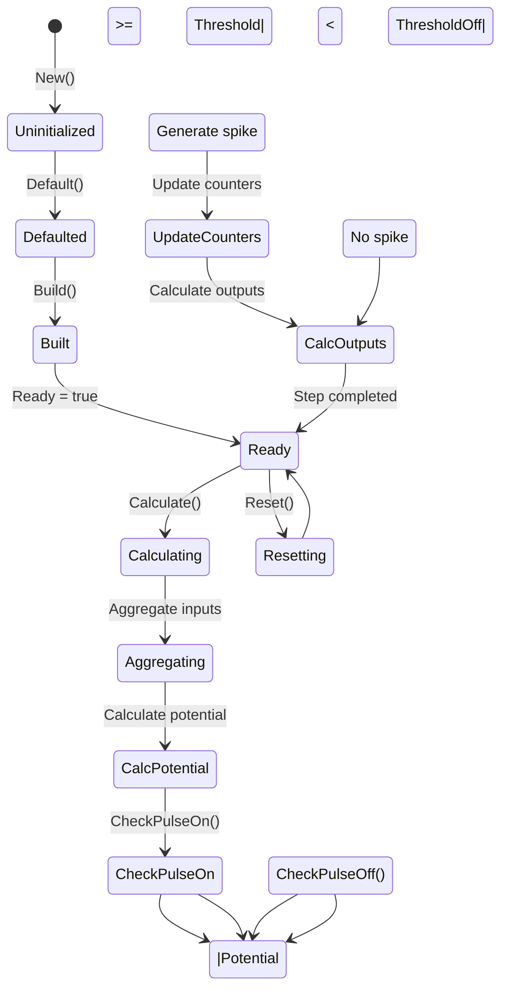
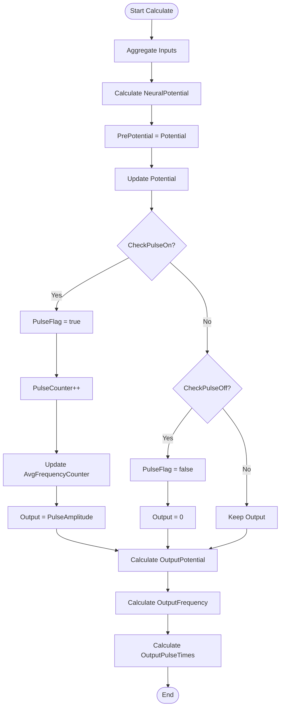
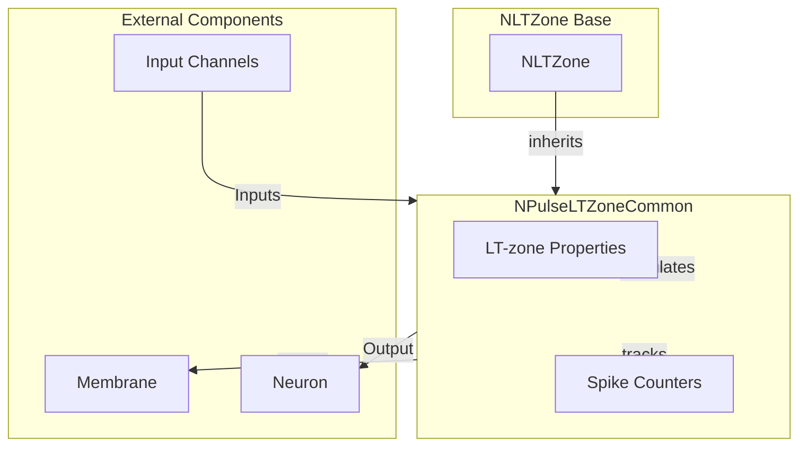

# NPulseLTZoneCommon — общая импульсная LT-зона

## RU

### Назначение

**Класс**: `NPulseLTZoneCommon` — базовая LT-зона (Low-Threshold Zone) для импульсных нейронов с общей функциональностью.  
**Аббревиатура**: `LT` — **L**ow **T**hreshold (низкопороговая зона).  
**Регистрация**: `NPulseLibrary.cpp` → `UploadClass("NPulseLTZoneCommon", ...)`.  
**Storage-инстансы**: `ClassName = "NPulseLTZoneCommon"` (обычно используется через наследников).

`NPulseLTZoneCommon` расширяет `NLTZone` функциональностью для работы с импульсными нейронами. LT-зона отвечает за генерацию спайков при достижении порога, отслеживание частоты спайков и управление пластичностью нейрона.

### UML-диаграмма классов



**Иерархия наследования:**
- `UNet` (Rdk) — базовый класс для сетей компонентов
- `NLTZone` — базовая LT-зона
- `NPulseLTZoneCommon` — общая импульсная LT-зона

**Ключевые свойства:**
- Параметры генерации: `NumChannelsInGroup`, `PulseAmplitude`, `PulseLength`, `AvgInterval`
- Выходные данные: `OutputPotential`, `OutputFrequency`, `OutputPulseTimes`
- Внутренние переменные: `PrePotential`, `NeuralPotential`, `PulseCounter`, `AvgFrequencyCounter`, `PulseFlag`

### UML-диаграмма последовательности



**Жизненный цикл:**
1. **Инициализация**: Установка параметров по умолчанию
2. **Сборка**: Построение структуры LT-зоны
3. **Расчет**: Агрегация входных сигналов, расчет потенциала, проверка порогов
4. **Генерация спайков**: При достижении порога генерируется спайк, обновляются счетчики
5. **Обновление выходов**: Расчет выходных данных (потенциал, частота, времена спайков)

### UML-диаграмма состояний



**Состояния:**
- **Uninitialized** — создан, но не инициализирован
- **Defaulted** — параметры установлены по умолчанию
- **Built** — структура LT-зоны построена
- **Ready** — готов к выполнению расчетов
- **Calculating** — выполняется расчет LT-зоны
- **Aggregating** — агрегация входных сигналов
- **CalcPotential** — расчет потенциала
- **CheckPulseOn** — проверка условия генерации спайка
- **Pulsing** — генерация спайка
- **UpdateCounters** — обновление счетчиков спайков
- **CheckPulseOff** — проверка условия окончания спайка
- **NotPulsing** — без спайка
- **CalcOutputs** — расчет выходных данных
- **Resetting** — выполняется сброс состояний

### UML-диаграмма активности



**Алгоритм расчета:**
1. Агрегация входных сигналов от каналов (`Inputs`)
2. Расчет нейронного потенциала (`NeuralPotential`)
3. Обновление предыдущего потенциала (`PrePotential`)
4. Проверка условия генерации спайка (`CheckPulseOn()`)
5. При генерации спайка: установка флага, инкремент счетчика, обновление частоты
6. Проверка условия окончания спайка (`CheckPulseOff()`)
7. Расчет выходных данных: `OutputPotential`, `OutputFrequency`, `OutputPulseTimes`

### UML-диаграмма компонентов



**Зависимости:**
- **Базовый класс**: `NLTZone`
- **Внешние компоненты**: входные каналы (источники `Inputs`), мембрана (получатель `Output` для обратной связи), нейрон (получатель `Output`)

### Свойства

#### Параметры (ptPubParameter)

**Наследуемые от NLTZone:**
- **`Threshold`** (double) — порог генерации спайка. При достижении этого порога генерируется спайк. Значение по умолчанию: зависит от реализации

- **`ThresholdOff`** (double) — порог окончания спайка. При снижении потенциала ниже этого порога спайк прекращается. Значение по умолчанию: зависит от реализации

- **`UseAveragePotential`** (bool) — использовать усреднение потенциалов. Если `true`, LT-зона использует усреднение входных потенциалов. Значение по умолчанию: `false`

**Собственные параметры:**
- **`NumChannelsInGroup`** (int) — количество каналов в группе. Используется для группировки входных сигналов. Значение по умолчанию: 2

- **`PulseAmplitude`** (double) — амплитуда импульса. Значение выходного сигнала при генерации спайка. Значение по умолчанию: зависит от реализации

- **`PulseLength`** (double) — длина импульса. Длительность спайка. Значение по умолчанию: зависит от реализации

- **`AvgInterval`** (double) — интервал усреднения частоты. Используется для расчета средней частоты спайков. Значение по умолчанию: зависит от реализации

#### Входные свойства (ptInput | ptPubState)

**Наследуемые от NLTZone:**
- **`Inputs`** (vector<MDMatrix<double>>) — вектор входных сигналов от каналов. Содержит сигналы от всех подключенных каналов.

#### Выходные свойства (ptOutput | ptPubState)

**Наследуемые от NLTZone:**
- **`Output`** (MDMatrix<double>) — выходной сигнал LT-зоны. Содержит амплитуду спайка при генерации или 0 в остальное время.

**Собственные выходы:**
- **`OutputPotential`** (MDMatrix<double>) — выходной потенциал (1). Текущий потенциал LT-зоны.

- **`OutputFrequency`** (MDMatrix<double>) — выходная частота (2). Средняя частота спайков за интервал `AvgInterval`.

- **`OutputPulseTimes`** (MDMatrix<double>) — времена спайков (3). Временные метки последних спайков.

#### Состояния (ptPubState)

**Наследуемые от NLTZone:**
- **`Potential`** (double) — текущий потенциал LT-зоны. Рассчитывается на основе входных сигналов.

**Собственные состояния:**
- **`PrePotential`** (double) — предыдущий потенциал. Используется для отслеживания изменений потенциала.

- **`NeuralPotential`** (double) — нейронный потенциал. Внутренняя переменная для расчета потенциала.

- **`PulseCounter`** (int) — счетчик спайков. Количество сгенерированных спайков.

- **`AvgFrequencyCounter`** (list<double>) — счетчик для усреднения частоты. Список временных меток спайков для расчета средней частоты.

- **`PulseFlag`** (bool) — флаг активного спайка. Устанавливается в `true` при генерации спайка, в `false` при его окончании.

### Методы

#### Публичные методы

- **`New()`** → `NPulseLTZoneCommon*` — создает новый экземпляр класса.

- **`SetPulseAmplitude(const double &value)`** → `bool` — устанавливает амплитуду импульса.

#### Защищенные методы жизненного цикла

- **`ADefault()`** → `bool` — инициализирует параметры по умолчанию. Вызывает `NLTZone::ADefault()`, устанавливает параметры импульсов.

- **`ABuild()`** → `bool` — строит структуру LT-зоны. Вызывает `NLTZone::ABuild()`.

- **`AReset()`** → `bool` — сбрасывает состояния LT-зоны. Вызывает `NLTZone::AReset()`, обнуляет счетчики и флаги.

- **`ACalculate()`** → `bool` — выполняет расчет LT-зоны на одном шаге. Агрегирует входные сигналы, рассчитывает потенциал, проверяет пороги, обновляет выходные данные.

- **`ACalculate2()`** → `bool` — виртуальный метод для дополнительных расчетов. Должен быть переопределен в производных классах.

- **`CheckPulseOn()`** → `bool` — проверяет условие генерации спайка. Возвращает `true`, если потенциал достиг порога `Threshold`. Виртуальный метод, может быть переопределен.

- **`CheckPulseOff()`** → `bool` — проверяет условие окончания спайка. Возвращает `true`, если потенциал снизился ниже порога `ThresholdOff`. Виртуальный метод, может быть переопределен.

### Примеры использования

#### Пример 1: Создание LT-зоны в коде C++

```cpp
// Создание LT-зоны
auto ltZone = storage->CreateComponent<NPulseLTZoneCommon>();
ltZone->SetName("LTZone1");

// Инициализация
ltZone->Default();

// Настройка параметров
ltZone->Threshold = 30.0;           // Порог генерации спайка
ltZone->ThresholdOff = 20.0;        // Порог окончания спайка
ltZone->PulseAmplitude = 1.0;       // Амплитуда импульса
ltZone->PulseLength = 1.0;          // Длина импульса (мс)
ltZone->AvgInterval = 100.0;        // Интервал усреднения частоты (мс)
ltZone->NumChannelsInGroup = 2;     // Количество каналов в группе
ltZone->UseAveragePotential = false;

// Подключение входных каналов
auto channel1 = storage->GetComponent("Channel1");
auto channel2 = storage->GetComponent("Channel2");

network->CreateLink("Channel1", "Output", "LTZone1", "Inputs");
network->CreateLink("Channel2", "Output", "LTZone1", "Inputs");

// Сборка
ltZone->Build();

// Использование
for (int step = 0; step < 1000; step++) {
    ltZone->Calculate();
    double output = ltZone->Output(0, 0);
    double frequency = ltZone->OutputFrequency(0, 0);
    std::cout << "Step " << step << ": Output = " << output 
              << ", Frequency = " << frequency << std::endl;
}
```

#### Пример 2: Конфигурация XML

```xml
<LTZone1 Class="NPulseLTZoneCommon">
    <Parameters>
        <Threshold>30.0</Threshold>
        <ThresholdOff>20.0</ThresholdOff>
        <UseAveragePotential>0</UseAveragePotential>
        <NumChannelsInGroup>2</NumChannelsInGroup>
        <PulseAmplitude>1.0</PulseAmplitude>
        <PulseLength>1.0</PulseLength>
        <AvgInterval>100.0</AvgInterval>
    </Parameters>
</LTZone1>
```

### Использование в конфигурациях

`NPulseLTZoneCommon` обычно не используется напрямую в конфигурациях. Вместо него используются специализированные классы:

- `NPulseLTZoneIzhikevich` — для LT-зон модели Ижикевича
- `NPulseLTZoneIaF` — для LT-зон модели IaF
- `NPulseLTZoneThreshold` — для LT-зон с порогом
- `NPLTZone` — для базовых LT-зон

## Источники

См. [Literature-References.md](../Literature-References.md): **[A]**, **4**, **25**, **29**.

### См. также

- [`NLTZone`](NPLTZone.md) — базовая LT-зона
- [`NPulseLTZoneIzhikevich`](NPulseLTZoneIzhikevich.md) — LT-зона модели Ижикевича
- [`NPulseLTZoneIaF`](NPulseLTZoneIaF.md) — LT-зона модели IaF
- [`NPulseNeuronCommon`](NPulseNeuronCommon.md) — общий нейрон
- [`NPulseChannelCommon`](NPulseChannelCommon.md) — общий канал
- [Architecture.md](../Architecture.md) — архитектура библиотеки

---

## EN

### Purpose

**Class**: `NPulseLTZoneCommon` — base LT-zone (Low-Threshold Zone) for spiking neurons with common functionality.  
**Registration**: `NPulseLibrary.cpp` → `UploadClass("NPulseLTZoneCommon", ...)`.  
**Instances**: `ClassName = "NPulseLTZoneCommon"` (typically used via derived classes).

`NPulseLTZoneCommon` extends `NLTZone` with functionality for working with spiking neurons. LT-zone is responsible for spike generation when threshold is reached, tracking spike frequency, and managing neuron plasticity.

### UML Class Diagram



### UML Sequence Diagram



### UML State Diagram



### UML Activity Diagram



### UML Component Diagram



### Properties

`NPulseLTZoneCommon` uses the following properties:

**Inherited from NLTZone:**
- `Threshold` (double) — spike generation threshold
- `ThresholdOff` (double) — spike termination threshold
- `UseAveragePotential` (bool) — use averaging for potentials
- `Inputs` (vector<MDMatrix<double>>) — input signals from channels
- `Output` (MDMatrix<double>) — output signal (spike amplitude)
- `Potential` (double) — current LT-zone potential

**Own parameters:**
- `NumChannelsInGroup` (int) — number of channels in group
- `PulseAmplitude` (double) — pulse amplitude
- `PulseLength` (double) — pulse length
- `AvgInterval` (double) — averaging interval for frequency

**Output properties:**
- `OutputPotential` (MDMatrix<double>) — output potential
- `OutputFrequency` (MDMatrix<double>) — output frequency
- `OutputPulseTimes` (MDMatrix<double>) — pulse times

**Internal states:**
- `PrePotential` (double) — previous potential
- `NeuralPotential` (double) — neural potential
- `PulseCounter` (int) — pulse counter
- `AvgFrequencyCounter` (list<double>) — average frequency counter
- `PulseFlag` (bool) — pulse flag

### Methods

`NPulseLTZoneCommon` uses the following methods:

- `SetPulseAmplitude(value)` → `bool` — set pulse amplitude
- `CheckPulseOn()` → `bool` — check if pulse should be generated
- `CheckPulseOff()` → `bool` — check if pulse should be terminated
- `ADefault()` → `bool` — initialize default parameters
- `ABuild()` → `bool` — build LT-zone structure
- `AReset()` → `bool` — reset LT-zone state
- `ACalculate()` → `bool` — perform one calculation step
- `ACalculate2()` → `bool` — additional calculations (virtual)

### Usage in configurations

`NPulseLTZoneCommon` is used as a base class for all spiking LT-zones:

- **Base class**: Used as base for all spiking LT-zone types
- **Spike generation**: Generates spikes when threshold is reached
- **Frequency tracking**: Tracks spike frequency and pulse times
- **Plasticity support**: Supports long-term plasticity mechanisms

**Features:**
- Threshold detection: detects when potential reaches threshold
- Spike generation: generates spikes with specified amplitude
- Frequency tracking: tracks average spike frequency
- Multiple outputs: provides potential, frequency, and pulse times

**Typical parameter values:**
- **Threshold**: depends on implementation
- **ThresholdOff**: depends on implementation
- **PulseAmplitude**: depends on implementation
- **NumChannelsInGroup**: 2 (default number of channels in group)
- **UseAveragePotential**: false (do not use averaging by default)

### References

See [Literature-References.md](../Literature-References.md): **[A]**, **4**, **25**, **29**.

### See Also

- [`NLTZone`](NPLTZone.md) — base LT-zone
- [`NPulseLTZoneIzhikevich`](NPulseLTZoneIzhikevich.md) — Izhikevich LT-zone
- [`NPulseLTZoneIaF`](NPulseLTZoneIaF.md) — IaF LT-zone
- [`NPulseNeuronCommon`](NPulseNeuronCommon.md) — common neuron
- [`NPulseChannelCommon`](NPulseChannelCommon.md) — common channel
- [Architecture.md](../Architecture.md) — library architecture
