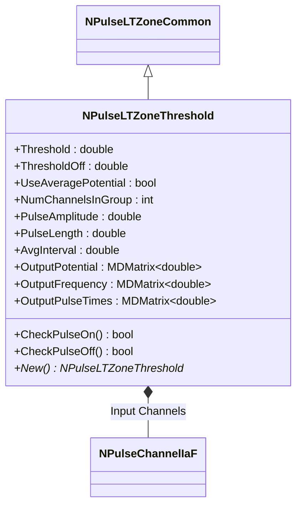
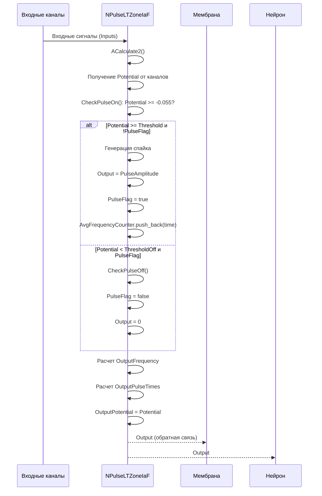
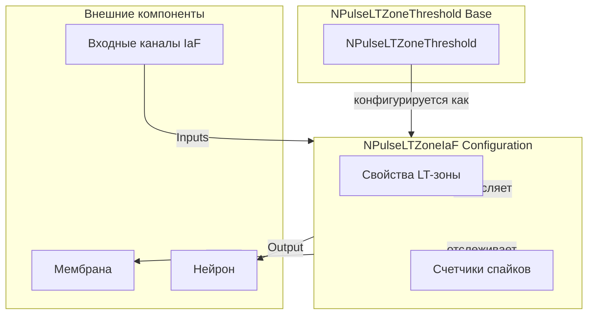
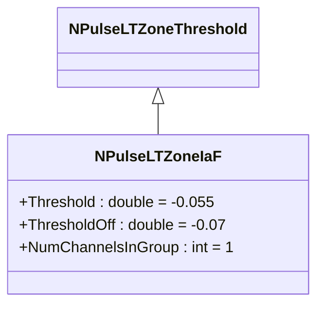
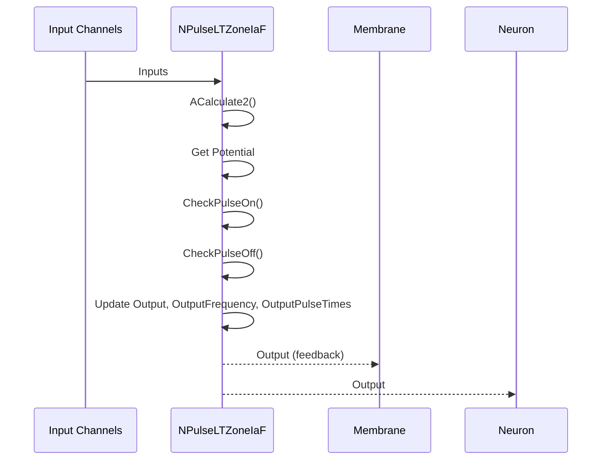
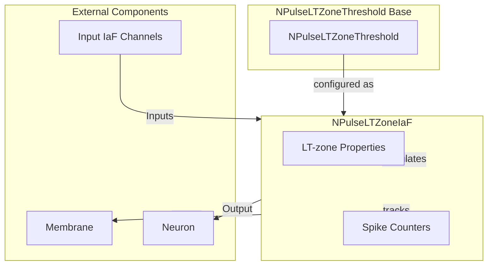

# NPulseLTZoneIaF — LT-зона модели IaF

## RU

### Назначение

**Класс**: `NPulseLTZoneIaF` — конфигурационный вариант LT-зоны для нейронов модели Integrate-and-Fire.
**Аббревиатуры**: `LT` — **L**ow **T**hreshold (низкопороговая зона); `IaF` — **I**ntegrate and **F**ire (интегрировать и стрелять).
**Регистрация**: `NPulseLibrary.cpp` → `UploadClass("NPulseLTZoneIaF", ...)`.
**Storage-инстансы**: `ClassName = "NPulseLTZoneIaF"` в `Bin/Configs/*/Model_*.xml`.

`NPulseLTZoneIaF` является конфигурационным вариантом базового класса `NPulseLTZoneThreshold` с предустановленными параметрами для модели IaF. Создается из `NPulseLTZoneThreshold` с настройками:
- `Threshold = -0.055` (-55 мВ) — порог генерации спайка
- `ThresholdOff = -0.07` (-70 мВ) — порог окончания спайка
- `NumChannelsInGroup = 1` — количество каналов в группе

Сравнение кабельной/сегментной модели (CSNM) с IaF приведено в [C].

**Использование:** Эксперименты с нейронами модели IaF, обучение нейросетей

### UML-диаграмма классов



**Иерархия наследования:**
- `NPulseLTZoneCommon` — общая импульсная LT-зона
- `NPulseLTZoneThreshold` — LT-зона с порогом
- `NPulseLTZoneIaF` — конфигурационный вариант для модели IaF

**Ключевые свойства:**
- Пороги: `Threshold = -0.055` (порог генерации), `ThresholdOff = -0.07` (порог окончания)
- Группировка: `NumChannelsInGroup = 1` (один канал в группе)

### UML-диаграмма последовательности



**Жизненный цикл:**
1. **Инициализация**: Установка параметров по умолчанию (`Threshold=-0.055`, `ThresholdOff=-0.07`, `NumChannelsInGroup=1`)
2. **Расчет**: Получение входного потенциала от каналов, проверка порогов
3. **Генерация спайков**: При достижении порога `-0.055` генерируется спайк, обновляются счетчики
4. **Окончание спайка**: При снижении потенциала ниже `-0.07` спайк прекращается
5. **Расчет частоты**: Вычисление средней частоты спайков за интервал `AvgInterval`
6. **Выход**: Генерация выходных данных (потенциал, частота, времена спайков)

### UML-диаграмма состояний

```mermaid
stateDiagram-v2
    [*] --> Uninitialized: New()
    Uninitialized --> Defaulted: Default()
    Defaulted --> Built: Build()
    Built --> Ready: Ready = true
    Ready --> Calculating: Calculate()
    Calculating --> GetPotential: Получение Potential
    GetPotential --> CheckPulseOn: CheckPulseOn()
    CheckPulseOn -->|Potential >= -0.055| GeneratingSpike: Генерация спайка
    CheckPulseOn -->|Potential < -0.055| CheckPulseOff: CheckPulseOff()
    GeneratingSpike --> Pulsing: PulseFlag = true
    Pulsing --> CheckPulseOff
    CheckPulseOff -->|Potential < -0.07| StopPulsing: PulseFlag = false
    CheckPulseOff -->|Potential >= -0.07| CalcFrequency
    StopPulsing --> CalcFrequency: Расчет частоты
    CalcFrequency --> UpdateOutputs: Обновление выходов
    UpdateOutputs --> Ready: Шаг завершен
    Ready --> Resetting: Reset()
    Resetting --> Ready: Состояния сброшены
```

### UML-диаграмма активности

```mermaid
flowchart TD
    Start([Start Calculate]) --> GetPotential[Получение Potential]
    GetPotential --> SetOutputPotential[OutputPotential = Potential]
    SetOutputPotential --> CheckPulseOn{Potential >= -0.055 и !PulseFlag?}
    CheckPulseOn -->|Да| GenerateSpike[Генерация спайка]
    CheckPulseOn -->|Нет| CheckPulseOff{Potential < -0.07 и PulseFlag?}
    GenerateSpike --> SetOutput[Output = PulseAmplitude]
    SetOutput --> SetPulseFlag[PulseFlag = true]
    SetPulseFlag --> AddToFreqCounter[AvgFrequencyCounter.push_back(time)]
    AddToFreqCounter --> UpdateFreqCounter
    CheckPulseOff -->|Да| ClearPulseFlag[PulseFlag = false]
    CheckPulseOff -->|Нет| UpdateFreqCounter
    ClearPulseFlag --> SetOutputZero[Output = 0]
    SetOutputZero --> UpdateFreqCounter[Обновление AvgFrequencyCounter]
    UpdateFreqCounter --> CalcFrequency[Расчет OutputFrequency]
    CalcFrequency --> CalcPulseTimes[Расчет OutputPulseTimes]
    CalcPulseTimes --> UpdateActiveOutputs[Обновление NumActiveOutputs]
    UpdateActiveOutputs --> End([End])
```

### UML-диаграмма компонентов



### Свойства

`NPulseLTZoneIaF` использует все свойства базового класса `NPulseLTZoneThreshold` с предустановленными значениями:

**Наследуемые свойства от NPulseLTZoneThreshold:**
- `Threshold` (double) — порог генерации спайка. Установлено в `-0.055` (-55 мВ)
- `ThresholdOff` (double) — порог окончания спайка. Установлено в `-0.07` (-70 мВ)
- `UseAveragePotential` (bool) — использовать усреднение потенциалов
- `NumChannelsInGroup` (int) — количество каналов в группе. Установлено в `1`

**Наследуемые свойства от NPulseLTZoneCommon:**
- `PulseAmplitude` (double) — амплитуда импульса
- `PulseLength` (double) — длина импульса
- `AvgInterval` (double) — интервал усреднения частоты
- `OutputPotential` (MDMatrix<double>) — выходной потенциал
- `OutputFrequency` (MDMatrix<double>) — выходная частота
- `OutputPulseTimes` (MDMatrix<double>) — времена спайков
- `PrePotential` (double) — предыдущий потенциал
- `NeuralPotential` (double) — нейронный потенциал
- `PulseCounter` (int) — счетчик длительности спайка
- `AvgFrequencyCounter` (list<double>) — счетчик для усреднения частоты
- `PulseFlag` (bool) — флаг активного спайка

**Наследуемые свойства от NLTZone:**
- `Inputs` (vector<MDMatrix<double>>) — вектор входных сигналов от каналов
- `Output` (MDMatrix<double>) — выходной сигнал LT-зоны
- `Potential` (double) — текущий потенциал LT-зоны

### Методы

`NPulseLTZoneIaF` использует все методы базового класса `NPulseLTZoneThreshold`:

**Наследуемые методы от NPulseLTZoneThreshold:**
- `New()` → `NPulseLTZoneThreshold*` — создает новый экземпляр класса
- `CheckPulseOn()` → `bool` — проверяет условие генерации спайка. Возвращает `true`, если `Potential >= Threshold` (-0.055)
- `CheckPulseOff()` → `bool` — проверяет условие окончания спайка. Возвращает `true`, если `Potential < ThresholdOff` (-0.07)

**Наследуемые методы жизненного цикла:**
- `ADefault()` → `bool` — инициализирует параметры по умолчанию
- `ABuild()` → `bool` — строит структуру LT-зоны
- `AReset()` → `bool` — сбрасывает состояния LT-зоны
- `ACalculate2()` → `bool` — выполняет расчет LT-зоны на одном шаге

### Примеры использования

#### Пример 1: Создание LT-зоны в коде C++

```cpp
// Создание LT-зоны IaF
auto ltZone = storage->CreateComponent<NPulseLTZoneThreshold>();
ltZone->SetName("IaFLTZone");

// Инициализация
ltZone->Default();

// Настройка параметров для модели IaF
ltZone->Threshold = -0.055;        // Порог генерации спайка (-55 мВ)
ltZone->ThresholdOff = -0.07;     // Порог окончания спайка (-70 мВ)
ltZone->NumChannelsInGroup = 1;    // Количество каналов в группе
ltZone->PulseAmplitude = 1.0;     // Амплитуда импульса
ltZone->PulseLength = 1.0;        // Длина импульса (мс)
ltZone->AvgInterval = 100.0;      // Интервал усреднения частоты (мс)
ltZone->UseAveragePotential = false;

// Подключение входных каналов
auto channel = storage->GetComponent("IaFChannel");
network->CreateLink("IaFChannel", "Output", "IaFLTZone", "Inputs");

// Сборка
ltZone->Build();

// Использование
for (int step = 0; step < 1000; step++) {
    ltZone->Calculate();
    double output = ltZone->Output(0, 0);
    double frequency = ltZone->OutputFrequency(0, 0);
    double potential = ltZone->OutputPotential(0, 0);
    std::cout << "Step " << step << ": Output = " << output
              << ", Frequency = " << frequency
              << ", Potential = " << potential << std::endl;
}
```

#### Пример 2: Конфигурация XML

```xml
<LTZone1 Class="NPulseLTZoneIaF">
    <Parameters>
        <Threshold>-0.055</Threshold>
        <ThresholdOff>-0.07</ThresholdOff>
        <UseAveragePotential>0</UseAveragePotential>
        <NumChannelsInGroup>1</NumChannelsInGroup>
        <PulseAmplitude>1.0</PulseAmplitude>
        <PulseLength>1.0</PulseLength>
        <AvgInterval>100.0</AvgInterval>
    </Parameters>
</LTZone1>
```

### Использование в конфигурациях

`NPulseLTZoneIaF` используется в нейронах модели IaF:

- Эксперименты с нейронами модели IaF
- Обучение нейросетей с простой моделью нейрона
- Сравнение различных моделей нейронов

**Особенности:**
- Пороги настроены для модели IaF: `Threshold=-0.055`, `ThresholdOff=-0.07`
- Работает с одним каналом в группе (`NumChannelsInGroup=1`)
- Интегрируется с мембраной `NPulseMembraneIaF` для обратной связи

## Источники

См. [Literature-References.md](../Literature-References.md): **[C]** (сравнение с кабельной/сегментной моделью); **25**, **29**, **30**.

### См. также

- [`NPulseLTZoneThreshold`](NPulseLTZoneThreshold.md) — LT-зона с порогом
- [`NPulseLTZoneCommon`](NPulseLTZoneCommon.md) — общая импульсная LT-зона
- [`NLTZone`](NLTZone.md) — базовая LT-зона
- [`NPulseNeuronIaF`](NPulseNeuronIaF.md) — нейрон модели IaF
- [`NPulseMembraneIaF`](NPulseMembraneIaF.md) — мембрана модели IaF
- [`NPulseChannelIaF`](NPulseChannelIaF.md) — канал модели IaF
- [Architecture.md](../Architecture.md) — архитектура библиотеки
- [Scientific-Background.md](../Scientific-Background.md) — научный фон (модель IaF)

---

## EN

### Purpose

**Class**: `NPulseLTZoneIaF` — configuration variant of LT-zone for Integrate-and-Fire model neurons.
**Registration**: `NPulseLibrary.cpp` → `UploadClass("NPulseLTZoneIaF", ...)`.
**Instances**: `ClassName = "NPulseLTZoneIaF"` in `Bin/Configs/*/Model_*.xml`.

`NPulseLTZoneIaF` is a configuration variant of the base class `NPulseLTZoneThreshold` with preset parameters for the IaF model. Created from `NPulseLTZoneThreshold` with settings:
- `Threshold = -0.055` (-55 mV) — spike generation threshold
- `ThresholdOff = -0.07` (-70 mV) — spike termination threshold
- `NumChannelsInGroup = 1` — number of channels in group

**Usage:** Experiments with IaF model neurons, neural network training

### UML Class Diagram



### UML Sequence Diagram



### UML State Diagram

```mermaid
stateDiagram-v2
    [*] --> Uninitialized: New()
    Uninitialized --> Defaulted: Default()
    Defaulted --> Built: Build()
    Built --> Ready: Ready = true
    Ready --> Calculating: Calculate()
    Calculating --> GetPotential: Get Potential
    GetPotential --> CheckPulseOn: CheckPulseOn()
    CheckPulseOn -->|Potential >= -0.055| GeneratingSpike: Generate spike
    CheckPulseOn -->|Potential < -0.055| CheckPulseOff: CheckPulseOff()
    GeneratingSpike --> Pulsing: PulseFlag = true
    Pulsing --> CheckPulseOff
    CheckPulseOff -->|Potential < -0.07| StopPulsing: PulseFlag = false
    CheckPulseOff -->|Potential >= -0.07| CalcFrequency
    StopPulsing --> CalcFrequency
    CalcFrequency --> UpdateOutputs: Update outputs
    UpdateOutputs --> Ready: Step completed
    Ready --> Resetting: Reset()
    Resetting --> Ready
```

### UML Activity Diagram

```mermaid
flowchart TD
    Start([Start Calculate]) --> GetPotential[Get Potential]
    GetPotential --> SetOutputPotential[OutputPotential = Potential]
    SetOutputPotential --> CheckPulseOn{Potential >= -0.055 and !PulseFlag?}
    CheckPulseOn -->|Yes| GenerateSpike[Generate spike]
    CheckPulseOn -->|No| CheckPulseOff{Potential < -0.07 and PulseFlag?}
    GenerateSpike --> SetOutput[Output = PulseAmplitude]
    SetOutput --> SetPulseFlag[PulseFlag = true]
    SetPulseFlag --> AddToFreqCounter[AvgFrequencyCounter.push_back(time)]
    AddToFreqCounter --> UpdateFreqCounter
    CheckPulseOff -->|Yes| ClearPulseFlag[PulseFlag = false]
    CheckPulseOff -->|No| UpdateFreqCounter
    ClearPulseFlag --> SetOutputZero[Output = 0]
    SetOutputZero --> UpdateFreqCounter[Update AvgFrequencyCounter]
    UpdateFreqCounter --> CalcFrequency[Calculate OutputFrequency]
    CalcFrequency --> CalcPulseTimes[Calculate OutputPulseTimes]
    CalcPulseTimes --> End([End])
```

### UML Component Diagram



### Usage in configurations

`NPulseLTZoneIaF` is used inside IaF model neurons:

- Experiments with IaF neurons
- Simple neural network training with IaF neurons
- Comparisons of different neuron models

**Typical settings:**
- **Threshold**: -0.055 (spike generation threshold)
- **ThresholdOff**: -0.07 (spike termination threshold)
- **NumChannelsInGroup**: 1

### References

See [Literature-References.md](../Literature-References.md): **[C]** (comparison with cable/segment model); **25**, **29**, **30**.

### See Also

- [`NPulseLTZoneThreshold`](NPulseLTZoneThreshold.md) — LT-zone with threshold
- [`NPulseNeuronIaF`](NPulseNeuronIaF.md) — IaF model neuron
- [`NPulseMembraneIaF`](NPulseMembraneIaF.md) — IaF membrane
- [`NPulseChannelIaF`](NPulseChannelIaF.md) — IaF channel
- [Architecture.md](../Architecture.md) — library architecture
- [Scientific-Background.md](../Scientific-Background.md) — scientific background (IaF model)

