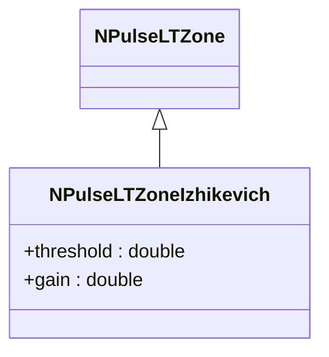
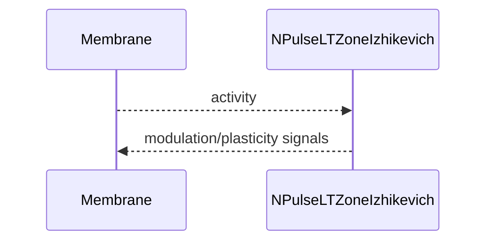

## NPulseLTZoneIzhikevich — LT-зона (Ижикевич)

**Класс**: `NPulseLTZoneIzhikevich` — зона длительной пластичности/порогов для нейронов Ижикевича.  
**Регистрация**: `NPulseLibrary.cpp` → `UploadClass("NPulseLTZoneIzhikevich", ...)`.  
**Storage-инстансы**: `ClassName = "NPulseLTZoneIzhikevich"`; параметры порогов/усилений.

### Входы/выходы
- Вход: мембранные сигналы/активность.
- Выход: модифицированная активность (усиление/затухание), сигналы пластичности.

Пояснение: блок-схема показывает поток данных/сигналов (входы → компонент → выходы).

Пояснение: диаграмма последовательности показывает типовой сценарий взаимодействия и порядок вызовов.

---

## NPulseLTZoneIzhikevich — LT zone

Applies long-term modulation to membrane activity for Izhikevich neurons.
