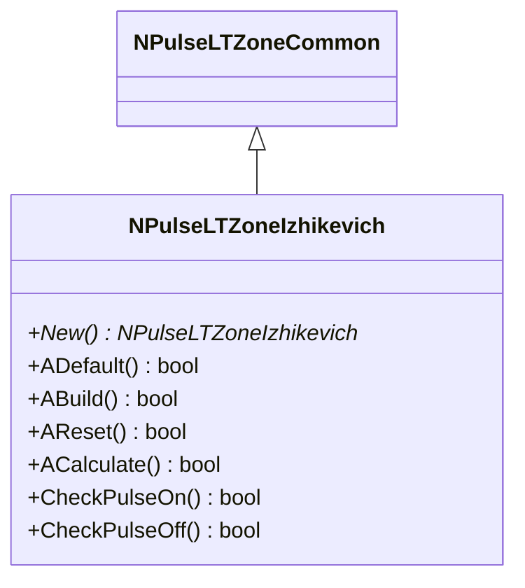
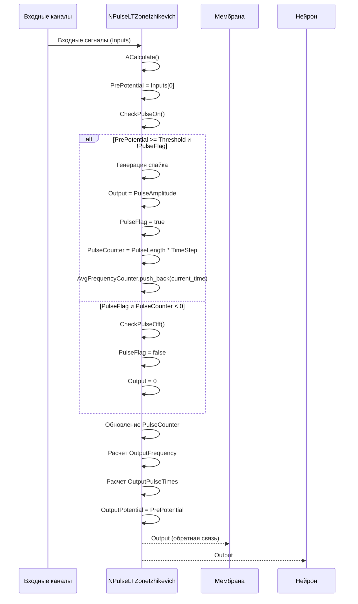
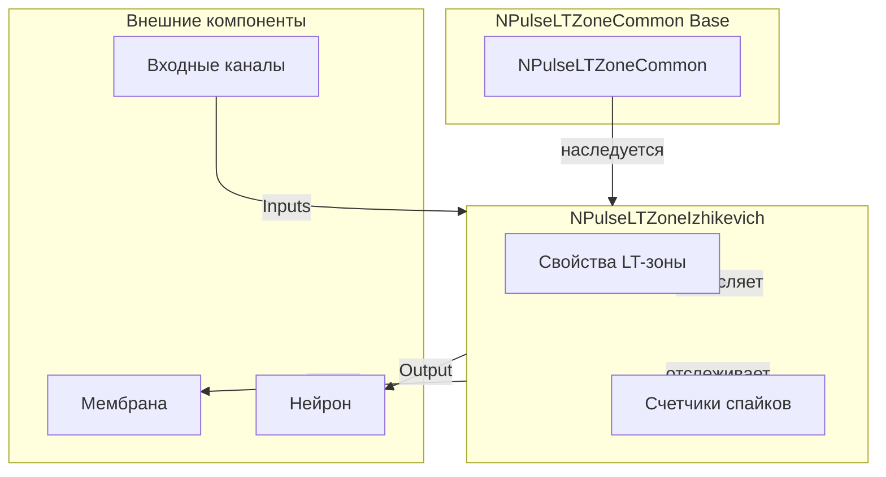
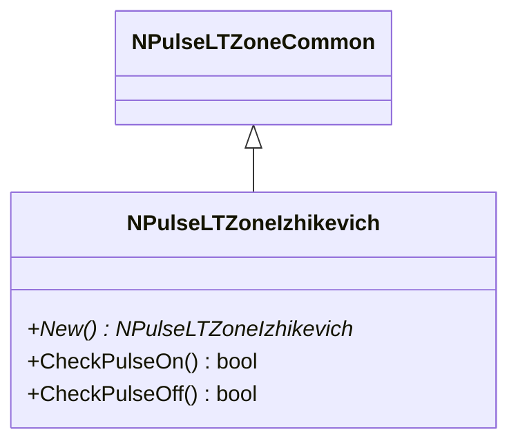
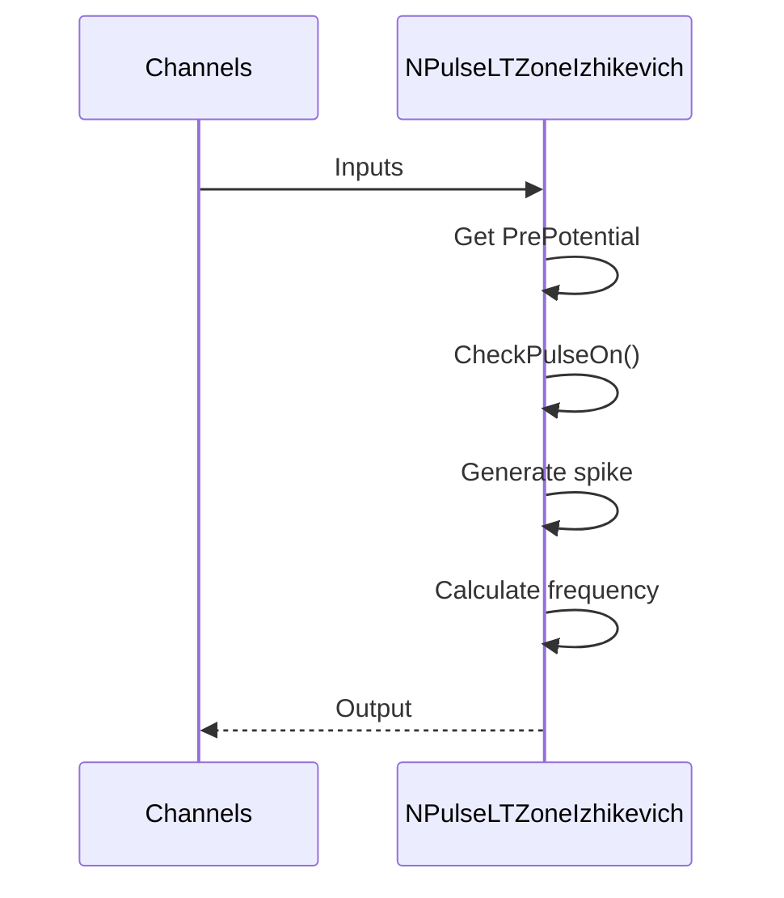
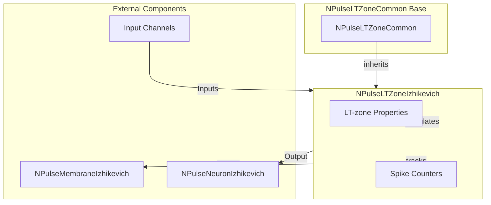

# NPulseLTZoneIzhikevich — LT-зона модели Ижикевича

## RU

### Назначение

**Класс**: `NPulseLTZoneIzhikevich` — LT-зона (Low-Threshold Zone) для нейронов модели Ижикевича.  
**Аббревиатура**: `LT` — **L**ow **T**hreshold (низкопороговая зона).  
**Регистрация**: `NPulseLibrary.cpp` → `UploadClass("NPulseLTZoneIzhikevich", ...)`.  
**Storage-инстансы**: `ClassName = "NPulseLTZoneIzhikevich"` в `Bin/Configs/*/Model_*.xml`.

`NPulseLTZoneIzhikevich` реализует LT-зону для нейронов модели Ижикевича. Отслеживает мембранный потенциал от каналов, генерирует спайки при достижении порога, рассчитывает частоту спайков и временные метки спайков.

**Использование:** `Bin/Configs/!OldConfigs/OldExperiments/IzhikevichTest/`, `Bin/Configs/User/CognitiveNavigation/`

### UML-диаграмма классов



**Иерархия наследования:**
- `NPulseLTZoneCommon` — общая импульсная LT-зона
- `NPulseLTZoneIzhikevich` — LT-зона модели Ижикевича

**Ключевые свойства:**
- Наследует все свойства от `NPulseLTZoneCommon`
- Порог генерации спайка: `Threshold = 30.0` (по умолчанию)
- Количество каналов в группе: `NumChannelsInGroup = 1` (по умолчанию)

### UML-диаграмма последовательности



**Жизненный цикл:**
1. **Инициализация**: Установка параметров по умолчанию (`Threshold=30.0`, `NumChannelsInGroup=1`)
2. **Расчет**: Получение входного потенциала от каналов, проверка порога
3. **Генерация спайков**: При достижении порога генерируется спайк, обновляются счетчики
4. **Расчет частоты**: Вычисление средней частоты спайков за интервал `AvgInterval`
5. **Выход**: Генерация выходных данных (потенциал, частота, времена спайков)

### UML-диаграмма состояний

```mermaid
stateDiagram-v2
    [*] --> Uninitialized: New()
    Uninitialized --> Defaulted: Default()
    Defaulted --> Built: Build()
    Built --> Ready: Ready = true
    Ready --> Calculating: Calculate()
    Calculating --> GetPotential: PrePotential = Inputs[0]
    GetPotential --> CheckPulseOn: CheckPulseOn()
    CheckPulseOn -->|PrePotential >= Threshold| GeneratingSpike: Генерация спайка
    CheckPulseOn -->|PrePotential < Threshold| CheckPulseOff: CheckPulseOff()
    GeneratingSpike --> Pulsing: PulseFlag = true
    Pulsing --> DecrementCounter: PulseCounter--
    DecrementCounter --> CheckCounter{PulseCounter < 0?}
    CheckCounter -->|Да| CheckPulseOff
    CheckCounter -->|Нет| CalcFrequency
    CheckPulseOff -->|PulseFlag| StopPulsing: PulseFlag = false
    CheckPulseOff -->|!PulseFlag| CalcFrequency
    StopPulsing --> CalcFrequency: Расчет частоты
    CalcFrequency --> UpdateOutputs: Обновление выходов
    UpdateOutputs --> Ready: Шаг завершен
    Ready --> Resetting: Reset()
    Resetting --> Ready: PulseCounter = 0
```

**Состояния:**
- **Uninitialized** — создан, но не инициализирован
- **Defaulted** — параметры установлены по умолчанию
- **Built** — структура LT-зоны построена
- **Ready** — готов к выполнению расчетов
- **Calculating** — выполняется расчет LT-зоны
- **GetPotential** — получение входного потенциала
- **CheckPulseOn** — проверка условия генерации спайка
- **GeneratingSpike** — генерация спайка
- **Pulsing** — активный спайк
- **DecrementCounter** — уменьшение счетчика длительности спайка
- **CheckCounter** — проверка счетчика
- **CheckPulseOff** — проверка условия окончания спайка
- **StopPulsing** — прекращение спайка
- **CalcFrequency** — расчет частоты спайков
- **UpdateOutputs** — обновление выходных данных
- **Resetting** — выполняется сброс состояний

### UML-диаграмма активности

```mermaid
flowchart TD
    Start([Start Calculate]) --> CheckInputs{Inputs.size() >= 2?}
    CheckInputs -->|Нет| End([End])
    CheckInputs -->|Да| GetPrePotential[PrePotential = Inputs[0]]
    GetPrePotential --> SetOutputPotential[OutputPotential = PrePotential]
    SetOutputPotential --> CheckPulseOn{PrePotential >= Threshold и !PulseFlag?}
    CheckPulseOn -->|Да| GenerateSpike[Генерация спайка]
    CheckPulseOn -->|Нет| CheckPulseOff{PulseFlag и PulseCounter < 0?}
    GenerateSpike --> SetOutput[Output = PulseAmplitude]
    SetOutput --> SetPulseFlag[PulseFlag = true]
    SetPulseFlag --> SetPulseCounter[PulseCounter = PulseLength * TimeStep]
    SetPulseCounter --> AddToFreqCounter[AvgFrequencyCounter.push_back(time)]
    AddToFreqCounter --> DecrementCounter
    CheckPulseOff -->|Да| ClearPulseFlag[PulseFlag = false]
    CheckPulseOff -->|Нет| DecrementCounter{PulseFlag?}
    ClearPulseFlag --> SetOutputZero[Output = 0]
    SetOutputZero --> UpdateFreqCounter
    DecrementCounter -->|Да| DecCounter[PulseCounter--]
    DecrementCounter -->|Нет| UpdateFreqCounter
    DecCounter --> UpdateFreqCounter[Обновление AvgFrequencyCounter]
    UpdateFreqCounter --> CalcFrequency[Расчет OutputFrequency]
    CalcFrequency --> CalcPulseTimes[Расчет OutputPulseTimes]
    CalcPulseTimes --> UpdateActiveOutputs[Обновление NumActiveOutputs]
    UpdateActiveOutputs --> End
```

**Алгоритм расчета:**
1. Проверка наличия входных сигналов (требуется минимум 2)
2. Получение входного потенциала (`PrePotential = Inputs[0]`)
3. Установка `OutputPotential = PrePotential`
4. Проверка условия генерации спайка (`CheckPulseOn()`)
5. При генерации: установка выходного сигнала, флага и счетчика
6. Обновление счетчика длительности спайка
7. Проверка условия окончания спайка (`CheckPulseOff()`)
8. Расчет частоты спайков на основе временных меток
9. Обновление выходных данных

### UML-диаграмма компонентов



**Зависимости:**
- **Базовый класс**: `NPulseLTZoneCommon`
- **Внешние компоненты**: входные каналы (источники `Inputs`), мембрана (получатель `Output` для обратной связи), нейрон (получатель `Output`)

### Свойства

#### Параметры (ptPubParameter)

**Наследуемые от NPulseLTZoneCommon:**
- **`Threshold`** (double) — порог генерации спайка. При достижении этого порога генерируется спайк. Значение по умолчанию: 30.0

- **`ThresholdOff`** (double) — порог окончания спайка. Наследуется от базового класса.

- **`UseAveragePotential`** (bool) — использовать усреднение потенциалов. Наследуется от базового класса.

- **`NumChannelsInGroup`** (int) — количество каналов в группе. Значение по умолчанию: 1

- **`PulseAmplitude`** (double) — амплитуда импульса. Наследуется от базового класса.

- **`PulseLength`** (double) — длина импульса. Наследуется от базового класса.

- **`AvgInterval`** (double) — интервал усреднения частоты. Наследуется от базового класса.

#### Входные свойства (ptInput | ptPubState)

**Наследуемые от NPulseLTZoneCommon:**
- **`Inputs`** (vector<MDMatrix<double>>) — вектор входных сигналов от каналов. Требуется минимум 2 элемента для корректной работы.

#### Выходные свойства (ptOutput | ptPubState)

**Наследуемые от NPulseLTZoneCommon:**
- **`Output`** (MDMatrix<double>) — выходной сигнал LT-зоны. Содержит амплитуду спайка при генерации или 0 в остальное время.

- **`OutputPotential`** (MDMatrix<double>) — выходной потенциал (1). Текущий потенциал LT-зоны (`PrePotential`).

- **`OutputFrequency`** (MDMatrix<double>) — выходная частота (2). Средняя частота спайков за интервал `AvgInterval`.

- **`OutputPulseTimes`** (MDMatrix<double>) — времена спайков (3). Временные метки последних спайков из `AvgFrequencyCounter`.

#### Состояния (ptPubState)

**Наследуемые от NPulseLTZoneCommon:**
- **`PrePotential`** (double) — предыдущий потенциал. Устанавливается в `Inputs[0]` на каждом шаге.

- **`PulseCounter`** (int) — счетчик длительности спайка. Уменьшается на каждом шаге, когда `PulseFlag=true`. Начальное значение: 0

- **`AvgFrequencyCounter`** (list<double>) — счетчик для усреднения частоты. Список временных меток спайков для расчета средней частоты.

- **`PulseFlag`** (bool) — флаг активного спайка. Устанавливается в `true` при генерации спайка, в `false` при его окончании.

### Методы

#### Публичные методы

- **`New()`** → `NPulseLTZoneIzhikevich*` — создает новый экземпляр класса.

#### Защищенные методы жизненного цикла

- **`ADefault()`** → `bool` — инициализирует параметры по умолчанию. Устанавливает `Threshold=30.0`, `NumChannelsInGroup=1`, вызывает `NPulseLTZoneCommon::ADefault()`.

- **`ABuild()`** → `bool` — строит структуру LT-зоны. Вызывает `NPulseLTZoneCommon::ABuild()`.

- **`AReset()`** → `bool` — сбрасывает состояния LT-зоны. Устанавливает `PulseCounter=0`, вызывает `NPulseLTZoneCommon::AReset()`.

- **`ACalculate()`** → `bool` — выполняет расчет LT-зоны на одном шаге. Получает входной потенциал, проверяет пороги, генерирует спайки, рассчитывает частоту и временные метки.

- **`CheckPulseOn()`** → `bool` — проверяет условие генерации спайка. Возвращает `true`, если `PrePotential >= Threshold`. Используется для определения момента генерации спайка.

- **`CheckPulseOff()`** → `bool` — проверяет условие окончания спайка. Возвращает `true`, если `PulseFlag=true` и `PulseCounter<0`. Используется для определения момента окончания спайка.

### Примеры использования

#### Пример 1: Создание LT-зоны в коде C++

```cpp
// Создание LT-зоны
auto ltZone = storage->CreateComponent<NPulseLTZoneIzhikevich>();
ltZone->SetName("IzhikevichLTZone");

// Инициализация
ltZone->Default();

// Настройка параметров
ltZone->Threshold = 30.0;           // Порог генерации спайка
ltZone->ThresholdOff = 20.0;       // Порог окончания спайка
ltZone->PulseAmplitude = 1.0;      // Амплитуда импульса
ltZone->PulseLength = 1.0;         // Длина импульса (мс)
ltZone->AvgInterval = 100.0;        // Интервал усреднения частоты (мс)
ltZone->NumChannelsInGroup = 1;     // Количество каналов в группе
ltZone->UseAveragePotential = false;

// Подключение входных каналов
auto channel1 = storage->GetComponent("Channel1");
auto channel2 = storage->GetComponent("Channel2");

network->CreateLink("Channel1", "Output", "IzhikevichLTZone", "Inputs");
network->CreateLink("Channel2", "Output", "IzhikevichLTZone", "Inputs");

// Сборка
ltZone->Build();

// Использование
for (int step = 0; step < 1000; step++) {
    ltZone->Calculate();
    double output = ltZone->Output(0, 0);
    double frequency = ltZone->OutputFrequency(0, 0);
    double potential = ltZone->OutputPotential(0, 0);
    std::cout << "Step " << step << ": Output = " << output 
              << ", Frequency = " << frequency 
              << ", Potential = " << potential << std::endl;
}
```

#### Пример 2: Конфигурация XML

```xml
<LTZone1 Class="NPulseLTZoneIzhikevich">
    <Parameters>
        <Threshold>30.0</Threshold>
        <ThresholdOff>20.0</ThresholdOff>
        <UseAveragePotential>0</UseAveragePotential>
        <NumChannelsInGroup>1</NumChannelsInGroup>
        <PulseAmplitude>1.0</PulseAmplitude>
        <PulseLength>1.0</PulseLength>
        <AvgInterval>100.0</AvgInterval>
    </Parameters>
</LTZone1>
```

### Использование в конфигурациях

`NPulseLTZoneIzhikevich` используется в нейронах модели Ижикевича:

- **Нейроны Ижикевича**: `Bin/Configs/!OldConfigs/OldExperiments/IzhikevichTest/`
- **Когнитивная навигация**: `Bin/Configs/User/CognitiveNavigation/*/Model_*.xml`

**Особенности:**
- Порог генерации спайка: 30.0 (стандартное значение для модели Ижикевича)
- Требуется минимум 2 входных сигнала для корректной работы
- Автоматически отслеживает частоту спайков и временные метки
- Интегрируется с мембраной `NPulseMembraneIzhikevich` для обратной связи

## Источники

См. [Literature-References.md](../Literature-References.md): **25**, **29**, **30**.

### См. также

- [`NPulseLTZoneCommon`](NPulseLTZoneCommon.md) — общая импульсная LT-зона
- [`NLTZone`](NPLTZone.md) — базовая LT-зона
- [`NPulseNeuronIzhikevich`](NPulseNeuronIzhikevich.md) — нейрон модели Ижикевича
- [`NPulseMembraneIzhikevich`](NPulseMembraneIzhikevich.md) — мембрана модели Ижикевича
- [`NPulseChannelIzhikevich`](NPulseChannelIzhikevich.md) — канал модели Ижикевича
- [Architecture.md](../Architecture.md) — архитектура библиотеки
- [Scientific-Background.md](../Scientific-Background.md) — научный фон (модель Ижикевича)

---

## EN

### Purpose

**Class**: `NPulseLTZoneIzhikevich` — LT-zone (Low-Threshold Zone) for Izhikevich model neurons.  
**Registration**: `NPulseLibrary.cpp` → `UploadClass("NPulseLTZoneIzhikevich", ...)`.  
**Instances**: `ClassName = "NPulseLTZoneIzhikevich"` in `Bin/Configs/*/Model_*.xml`.

`NPulseLTZoneIzhikevich` implements the LT-zone for Izhikevich model neurons. Tracks membrane potential from channels, generates spikes when threshold is reached, calculates spike frequency and timestamps.

**Usage:** `Bin/Configs/!OldConfigs/OldExperiments/IzhikevichTest/`, `Bin/Configs/User/CognitiveNavigation/`

### UML Class Diagram



### UML Sequence Diagram



### UML State Diagram

```mermaid
stateDiagram-v2
    [*] --> Uninitialized: New()
    Uninitialized --> Defaulted: Default()
    Defaulted --> Built: Build()
    Built --> Ready: Ready = true
    Ready --> Calculating: Calculate()
    Calculating --> GetPotential: PrePotential = Inputs[0]
    GetPotential --> CheckPulseOn: CheckPulseOn()
    CheckPulseOn -->|PrePotential >= Threshold| GeneratingSpike: Generate spike
    CheckPulseOn -->|PrePotential < Threshold| CheckPulseOff: CheckPulseOff()
    GeneratingSpike --> Pulsing: PulseFlag = true
    Pulsing --> DecrementCounter: PulseCounter--
    DecrementCounter --> CheckCounter{PulseCounter < 0?}
    CheckCounter -->|Yes| CheckPulseOff
    CheckCounter -->|No| CalcFrequency
    CheckPulseOff -->|PulseFlag| StopPulsing: PulseFlag = false
    CheckPulseOff -->|!PulseFlag| CalcFrequency
    StopPulsing --> CalcFrequency
    CalcFrequency --> UpdateOutputs: Update outputs
    UpdateOutputs --> Ready: Step completed
    Ready --> Resetting: Reset()
    Resetting --> Ready
```

### UML Activity Diagram

```mermaid
flowchart TD
    Start([Start Calculate]) --> CheckInputs{Inputs.size() >= 2?}
    CheckInputs -->|No| End([End])
    CheckInputs -->|Yes| GetPrePotential[PrePotential = Inputs[0]]
    GetPrePotential --> SetOutputPotential[OutputPotential = PrePotential]
    SetOutputPotential --> CheckPulseOn{PrePotential >= Threshold and !PulseFlag?}
    CheckPulseOn -->|Yes| GenerateSpike[Generate spike]
    CheckPulseOn -->|No| CheckPulseOff{PulseFlag and PulseCounter < 0?}
    GenerateSpike --> SetOutput[Output = PulseAmplitude]
    SetOutput --> SetPulseFlag[PulseFlag = true]
    SetPulseFlag --> SetPulseCounter[PulseCounter = PulseLength * TimeStep]
    SetPulseCounter --> AddToFreqCounter[AvgFrequencyCounter.push_back(time)]
    AddToFreqCounter --> DecrementCounter
    CheckPulseOff -->|Yes| ClearPulseFlag[PulseFlag = false]
    CheckPulseOff -->|No| DecrementCounter{PulseFlag?}
    ClearPulseFlag --> SetOutputZero[Output = 0]
    SetOutputZero --> UpdateFreqCounter
    DecrementCounter -->|Yes| DecCounter[PulseCounter--]
    DecrementCounter -->|No| UpdateFreqCounter
    DecCounter --> UpdateFreqCounter[Update AvgFrequencyCounter]
    UpdateFreqCounter --> CalcFrequency[Calculate OutputFrequency]
    CalcFrequency --> CalcPulseTimes[Calculate OutputPulseTimes]
    CalcPulseTimes --> End
```

### UML Component Diagram



### Usage in configurations

`NPulseLTZoneIzhikevich` is used in Izhikevich model neurons:

- **Izhikevich neurons**: `Bin/Configs/!OldConfigs/OldExperiments/IzhikevichTest/`
- **Cognitive navigation**: `Bin/Configs/User/CognitiveNavigation/*/Model_*.xml`

**Features:**
- Spike generation threshold: 30.0 (standard for Izhikevich model)
- Requires at least 2 input signals for correct operation
- Automatically tracks spike frequency and timestamps
- Integrates with `NPulseMembraneIzhikevich` for feedback

### References

See [Literature-References.md](../Literature-References.md): **25**, **29**, **30**.

### See Also

- [`NPulseLTZoneCommon`](NPulseLTZoneCommon.md) — common spiking LT-zone
- [`NPulseNeuronIzhikevich`](NPulseNeuronIzhikevich.md) — Izhikevich model neuron
- [`NPulseMembraneIzhikevich`](NPulseMembraneIzhikevich.md) — Izhikevich membrane
- [`NPulseChannelIzhikevich`](NPulseChannelIzhikevich.md) — Izhikevich channel
- [Architecture.md](../Architecture.md) — library architecture
- [Scientific-Background.md](../Scientific-Background.md) — scientific background (Izhikevich model)

