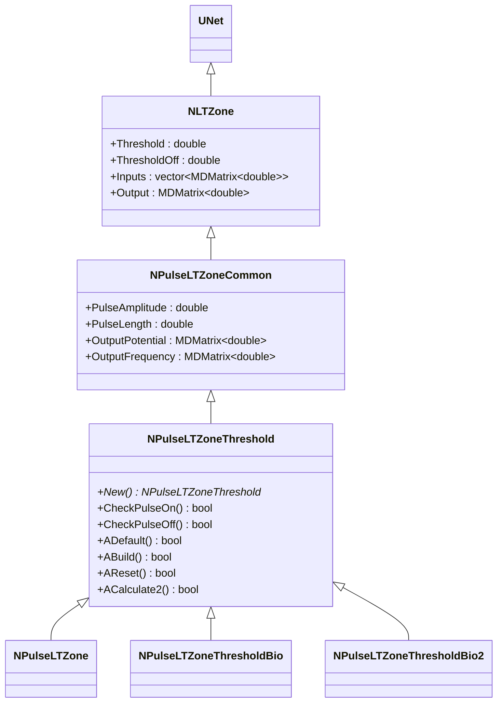
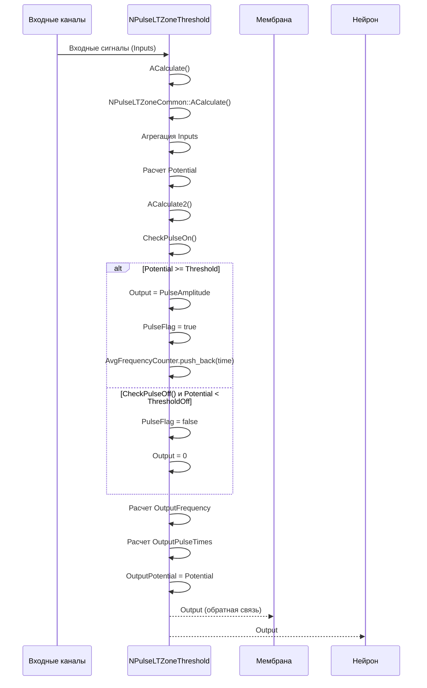
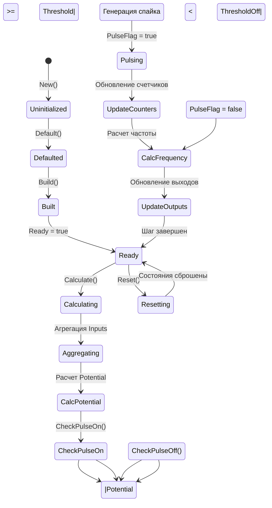
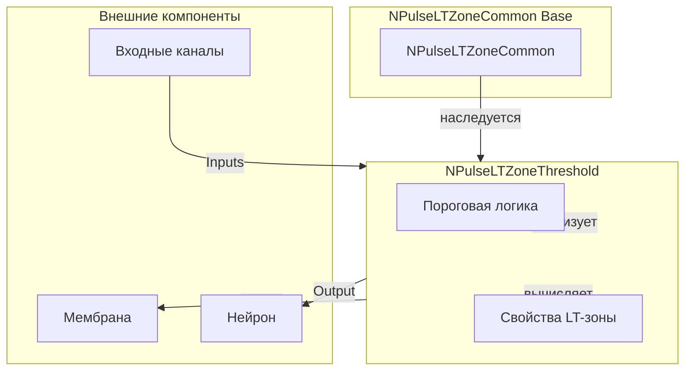
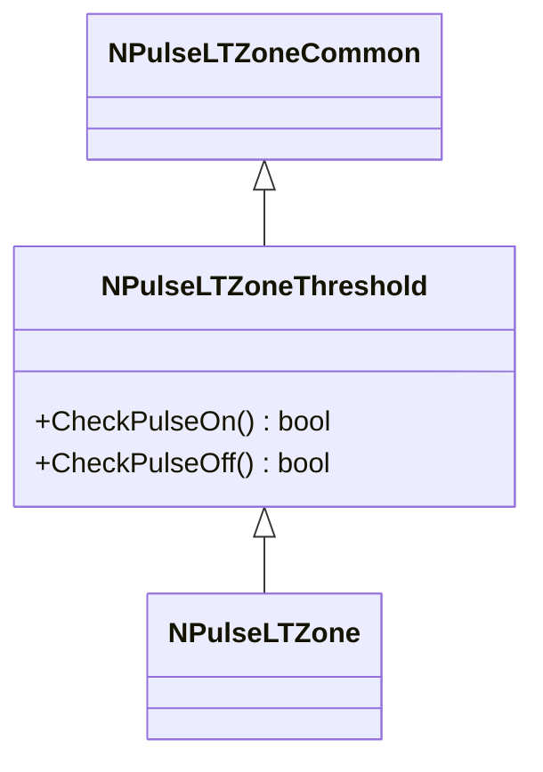
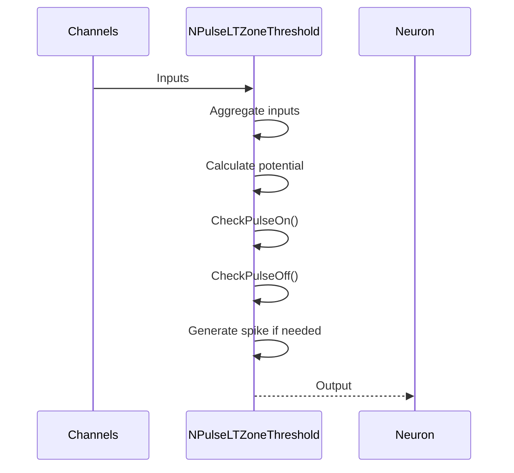
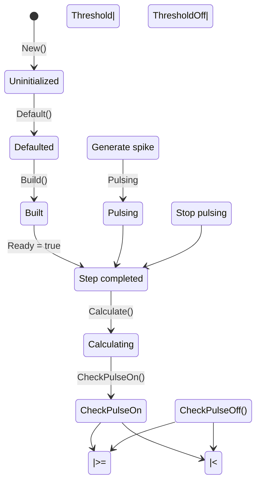
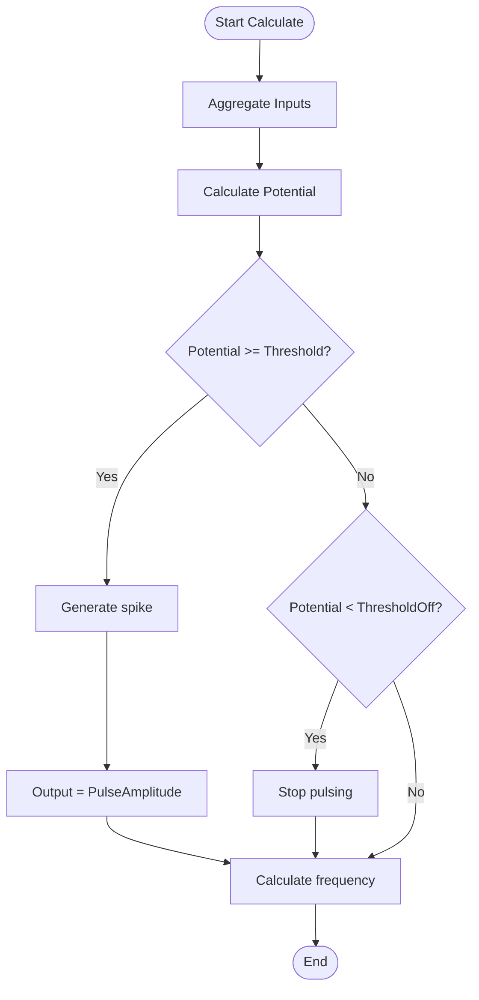

# NPulseLTZoneThreshold — импульсная LT-зона с порогом

## RU

### Назначение

**Класс**: `NPulseLTZoneThreshold` — базовая импульсная LT-зона с пороговой логикой генерации спайков.  
**Аббревиатура**: `LT` — **L**ow **T**hreshold (низкопороговая зона).  
**Регистрация**: `NPulseLibrary.cpp` → `UploadClass("NPulseLTZoneThreshold", ...)`.  
**Storage-инстансы**: `ClassName = "NPulseLTZoneThreshold"` в `Bin/Configs/*/Model_*.xml`.

`NPulseLTZoneThreshold` является базовым классом для LT-зон с пороговой логикой. Наследуется от `NPulseLTZoneCommon` и реализует проверку условий генерации и окончания спайков через методы `CheckPulseOn()` и `CheckPulseOff()`. Этот класс служит базой для других LT-зон, таких как `NPulseLTZone`.

**Использование:** Базовая LT-зона с пороговой логикой, генерация спайков по порогам

### UML-диаграмма классов



**Иерархия наследования:**
- `UNet` — базовая сеть Rdk Framework
- `NLTZone` — базовая LT-зона
- `NPulseLTZoneCommon` — общая импульсная LT-зона
- `NPulseLTZoneThreshold` — базовая импульсная LT-зона с порогом

**Ключевые методы:**
- `CheckPulseOn()` — проверяет условие генерации спайка: `Potential >= Threshold`
- `CheckPulseOff()` — проверяет условие окончания спайка: `Potential < ThresholdOff`

### UML-диаграмма последовательности



**Жизненный цикл:**
1. **Инициализация**: Установка параметров по умолчанию (Threshold, ThresholdOff, PulseAmplitude)
2. **Расчет**: Агрегация входных сигналов, расчет потенциала
3. **Проверка порогов**: Вызов `CheckPulseOn()` и `CheckPulseOff()` для определения состояния спайка
4. **Генерация спайков**: При достижении порога генерируется спайк, обновляются счетчики
5. **Расчет частоты**: Вычисление средней частоты спайков за интервал `AvgInterval`
6. **Выход**: Генерация выходных данных (потенциал, частота, времена спайков)

### UML-диаграмма состояний



**Состояния:**
- **Uninitialized** — создан, но не инициализирован
- **Defaulted** — параметры установлены по умолчанию
- **Built** — структура LT-зоны построена
- **Ready** — готов к выполнению расчетов
- **Calculating** — выполняется расчет LT-зоны
- **Aggregating** — агрегация входных сигналов
- **CalcPotential** — расчет потенциала
- **CheckPulseOn** — проверка условия генерации спайка
- **GeneratingSpike** — генерация спайка
- **Pulsing** — активный спайк
- **UpdateCounters** — обновление счетчиков спайков
- **CheckPulseOff** — проверка условия окончания спайка
- **StopPulsing** — прекращение спайка
- **CalcFrequency** — расчет частоты спайков
- **UpdateOutputs** — обновление выходных данных
- **Resetting** — выполняется сброс состояний

### UML-диаграмма активности

```mermaid
flowchart TD
    Start([Start Calculate]) --> AggregateInputs[Агрегация Inputs]
    AggregateInputs --> CalcPotential[Расчет Potential]
    CalcPotential --> CallACalculate2[ACalculate2]
    CallACalculate2 --> CheckPulseOn{CheckPulseOn?<br/>Potential >= Threshold?}
    CheckPulseOn -->|Да| GenerateSpike[Генерация спайка]
    CheckPulseOn -->|Нет| CheckPulseOff{CheckPulseOff?<br/>Potential < ThresholdOff?}
    GenerateSpike --> SetOutput[Output = PulseAmplitude]
    SetOutput --> SetPulseFlag[PulseFlag = true]
    SetPulseFlag --> AddToFreqCounter[AvgFrequencyCounter.push_back(time)]
    AddToFreqCounter --> CalcFrequency
    CheckPulseOff -->|Да| ClearPulseFlag[PulseFlag = false]
    CheckPulseOff -->|Нет| CalcFrequency[Расчет OutputFrequency]
    ClearPulseFlag --> SetOutputZero[Output = 0]
    SetOutputZero --> CalcFrequency
    CalcFrequency --> CleanOldTimes[Удаление старых времен]
    CleanOldTimes --> CalcPulseTimes[Расчет OutputPulseTimes]
    CalcPulseTimes --> SetOutputPotential[OutputPotential = Potential]
    SetOutputPotential --> End([End])
```

**Алгоритм расчета:**
1. Агрегация входных сигналов от каналов (`Inputs`)
2. Расчет потенциала (`Potential`)
3. Вызов `ACalculate2()` для пороговой логики
4. Проверка `CheckPulseOn()`: если `Potential >= Threshold`, генерируется спайк
5. Проверка `CheckPulseOff()`: если `Potential < ThresholdOff`, спайк прекращается
6. Обновление счетчиков и расчет частоты спайков
7. Расчет выходных данных: `OutputPotential`, `OutputFrequency`, `OutputPulseTimes`

### UML-диаграмма компонентов



**Зависимости:**
- **Базовый класс**: `NPulseLTZoneCommon`
- **Внешние компоненты**: входные каналы (источники `Inputs`), мембрана (получатель `Output` для обратной связи), нейрон (получатель `Output`)

### Свойства

`NPulseLTZoneThreshold` использует все свойства базовых классов `NPulseLTZoneCommon` и `NLTZone`:
- Пороги: `Threshold`, `ThresholdOff`
- Параметры импульсов: `PulseAmplitude`, `PulseLength`
- Входы/выходы: `Inputs`, `Output`, `OutputPotential`, `OutputFrequency`, `OutputPulseTimes`

### Методы

- **`CheckPulseOn()`** → `bool` — проверяет условие генерации спайка. Возвращает `true`, если потенциал достиг порога `Threshold`. Виртуальный метод, может быть переопределен в производных классах.

- **`CheckPulseOff()`** → `bool` — проверяет условие окончания спайка. Возвращает `true`, если потенциал снизился ниже порога `ThresholdOff`. Виртуальный метод, может быть переопределен в производных классах.

- **`ACalculate2()`** → `bool` — выполняет расчет пороговой логики. Вызывается из `ACalculate()` для проверки условий генерации/окончания спайков.

### Примеры использования

#### Пример 1: Создание LT-зоны с порогом в коде C++

```cpp
// Создание LT-зоны с порогом
auto ltZone = storage->CreateComponent("NPulseLTZoneThreshold");
ltZone->SetName("LTZoneThreshold");

// Инициализация
ltZone->Default();

// Настройка параметров
ltZone->Threshold = 30.0;
ltZone->ThresholdOff = 20.0;
ltZone->PulseAmplitude = 1.0;

// Использование
ltZone->Build();
```

### Использование в конфигурациях

`NPulseLTZoneThreshold` используется в экспериментах с пороговой логикой генерации спайков:

- **Когнитивная навигация**: `Bin/Configs/User/CognitiveNavigation/*/Model_*.xml`
- **Эксперименты с нейронами**: `Bin/Configs/!OldConfigs/NM-Neurons/*/Model.xml`

**Типичные значения параметров:**
- **Threshold**: 0.0117 - 30.0 (порог генерации спайка)
- **ThresholdOff**: 0.0 - 20.0 (порог окончания спайка)
- **PulseAmplitude**: 1.0 (амплитуда импульса)
- **PulseLength**: 0.001 - 0.01 (длина импульса в секундах)

### См. также

- [`NPulseLTZoneCommon`](NPulseLTZoneCommon.md) — общая импульсная LT-зона (базовый класс)
- [`NPulseLTZone`](NPulseLTZone.md) — импульсная LT-зона (расширенная)
- [`NPulseLTZoneIzhikevich`](NPulseLTZoneIzhikevich.md) — LT-зона модели Ижикевича
- [`NPulseLTZoneThresholdBio`](NPulseLTZoneThresholdBio.md) — биоинспирированная LT-зона с порогом
- [`NPulseLTZoneThresholdBio2`](NPulseLTZoneThresholdBio2.md) — биоинспирированная LT-зона с порогом (версия 2)
- [Architecture.md](../Architecture.md) — архитектура библиотеки

---

## EN

### Purpose

**Class**: `NPulseLTZoneThreshold` — base spiking LT-zone with threshold logic for spike generation.  
**Registration**: `NPulseLibrary.cpp` → `UploadClass("NPulseLTZoneThreshold", ...)`.  
**Instances**: `ClassName = "NPulseLTZoneThreshold"` in `Bin/Configs/*/Model_*.xml`.

`NPulseLTZoneThreshold` is the base class for LT-zones with threshold logic. Inherits from `NPulseLTZoneCommon` and implements checking conditions for spike generation and termination through `CheckPulseOn()` and `CheckPulseOff()` methods. This class serves as a base for other LT-zones such as `NPulseLTZone`.

**Usage:** Base LT-zone with threshold logic, spike generation by thresholds

### UML Class Diagram



### UML Sequence Diagram



### UML State Diagram



### UML Activity Diagram



### UML Component Diagram


### See Also

- [`NPulseLTZoneCommon`](NPulseLTZoneCommon.md) — common spiking LT-zone (base class)
- [`NPulseLTZone`](NPulseLTZone.md) — spiking LT-zone (extended)
- [`NPulseLTZoneIzhikevich`](NPulseLTZoneIzhikevich.md) — Izhikevich LT-zone
- [`NPulseLTZoneThresholdBio`](NPulseLTZoneThresholdBio.md) — bio LT-zone with threshold
- [`NPulseLTZoneThresholdBio2`](NPulseLTZoneThresholdBio2.md) — bio LT-zone with threshold (version 2)
- [Architecture.md](../Architecture.md) — library architecture
