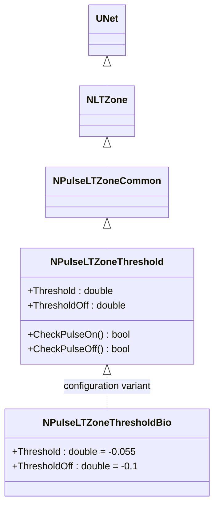
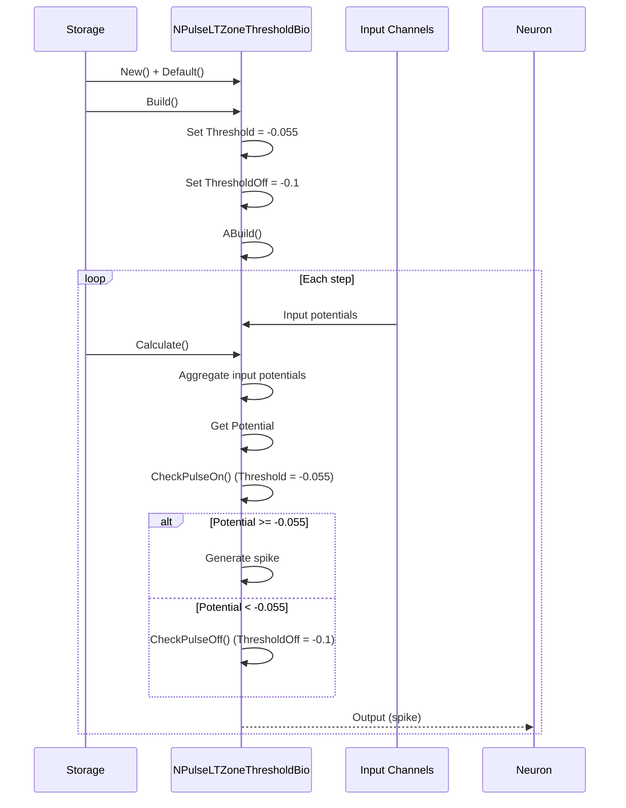
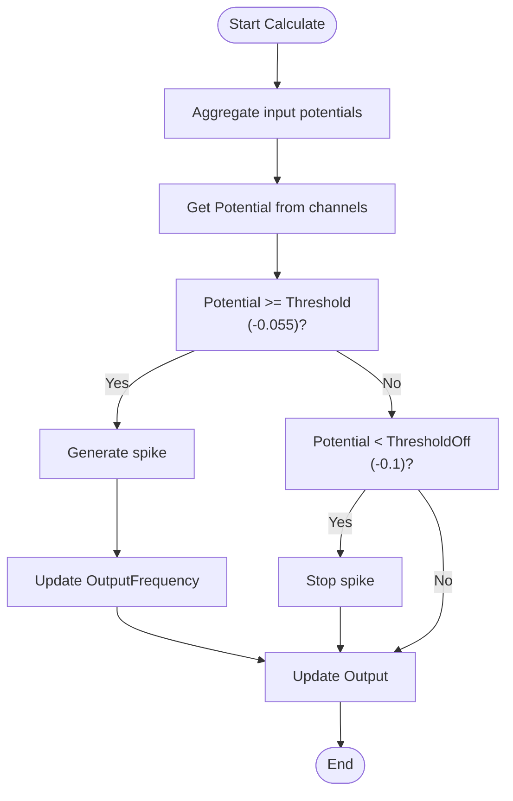
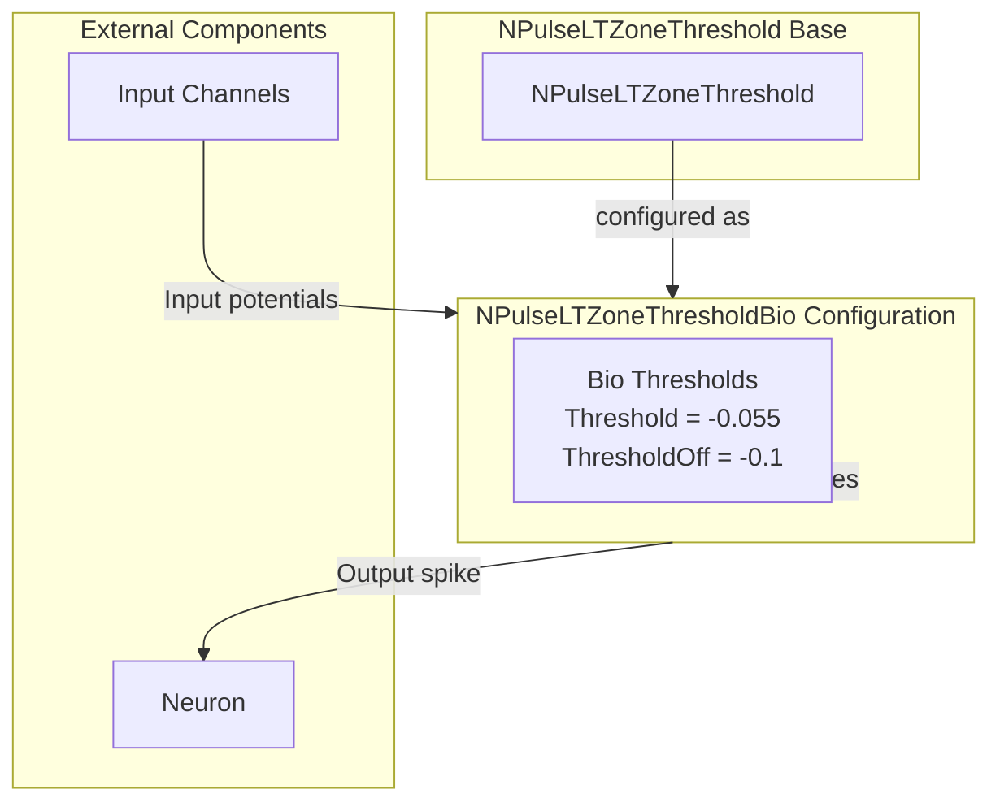

# NPulseLTZoneThresholdBio — биоинспирированная LT-зона с порогом

## RU

### Назначение

**Класс**: `NPulseLTZoneThresholdBio` — конфигурационный вариант импульсной LT-зоны с порогом для биологических моделей.  
**Аббревиатуры**: `LT` — **L**ow **T**hreshold (низкопороговая зона); `Bio` — **Bio**logical (биологическая модель).  
**Регистрация**: `NPulseLibrary.cpp` → `UploadClass("NPulseLTZoneThresholdBio", ...)`.  
**Storage-инстансы**: `ClassName = "NPulseLTZoneThresholdBio"` в `Bin/Configs/*/Model_*.xml`.

`NPulseLTZoneThresholdBio` является конфигурационным вариантом класса `NPulseLTZoneThreshold` с параметрами, оптимизированными для биологических моделей. При создании компонента с `ClassName = "NPulseLTZoneThresholdBio"` создается экземпляр `NPulseLTZoneThreshold` с параметрами:
- `Threshold = -0.055` (-55 мВ) — порог генерации спайка
- `ThresholdOff = -0.1` (-100 мВ) — порог окончания спайка

**Использование:** Биоинспирированная LT-зона с порогом, оптимизированные параметры для биологических моделей

### UML-диаграмма классов



**Иерархия наследования:**
- `UNet` — базовая сеть Rdk Framework
- `NLTZone` — базовая LT-зона
- `NPulseLTZoneCommon` — общая импульсная LT-зона
- `NPulseLTZoneThreshold` — базовая импульсная LT-зона с порогом
- `NPulseLTZoneThresholdBio` — конфигурационный вариант для биологических моделей

**Параметры конфигурации:**
- `Threshold = -0.055` (-55 мВ) — порог генерации спайка
- `ThresholdOff = -0.1` (-100 мВ) — порог окончания спайка

### Свойства

`NPulseLTZoneThresholdBio` использует все свойства базового класса `NPulseLTZoneThreshold` с параметрами:
- `Threshold = -0.055` (-55 мВ)
- `ThresholdOff = -0.1` (-100 мВ)

### Методы

`NPulseLTZoneThresholdBio` использует все методы базового класса `NPulseLTZoneThreshold`.

### Примеры использования

#### Пример 1: Создание LT-зоны в коде C++

```cpp
// Создание биоинспирированной LT-зоны с порогом
auto ltZone = storage->CreateComponent("NPulseLTZoneThresholdBio");
ltZone->SetName("LTZoneThresholdBio");

// Инициализация (использует параметры по умолчанию)
ltZone->Default();

// Использование
ltZone->Build();
```

## Источники

См. [Literature-References.md](../Literature-References.md): **26**, **29**, **30**.

### См. также

- [`NPulseLTZoneThreshold`](NPulseLTZoneThreshold.md) — базовая LT-зона с порогом (базовый класс)
- [`NPulseLTZoneThresholdBio2`](NPulseLTZoneThresholdBio2.md) — биоинспирированная LT-зона с порогом (версия 2)
- [`NPulseLTZoneCommon`](NPulseLTZoneCommon.md) — общая импульсная LT-зона
- [Architecture.md](../Architecture.md) — архитектура библиотеки

---

## EN

### Purpose

**Class**: `NPulseLTZoneThresholdBio` — configuration variant of spiking LT-zone with threshold for biological models.  
**Registration**: `NPulseLibrary.cpp` → `UploadClass("NPulseLTZoneThresholdBio", ...)`.  
**Instances**: `ClassName = "NPulseLTZoneThresholdBio"` in `Bin/Configs/*/Model_*.xml`.

`NPulseLTZoneThresholdBio` is a configuration variant of `NPulseLTZoneThreshold` class with parameters optimized for biological models. When creating a component with `ClassName = "NPulseLTZoneThresholdBio"`, an instance of `NPulseLTZoneThreshold` is created with parameters:
- `Threshold = -0.055` (-55 mV) — spike generation threshold
- `ThresholdOff = -0.1` (-100 mV) — spike termination threshold

**Usage:** Bio-inspired LT-zone with threshold, optimized parameters for biological models

### UML Class Diagram


### UML Sequence Diagram



### UML State Diagram

```mermaid
stateDiagram-v2
    [*] --> Uninitialized: New()
    Uninitialized --> Defaulted: Default()
    Defaulted --> SetThresholds: Set Threshold = -0.055, ThresholdOff = -0.1
    SetThresholds --> Building: Build()
    Building --> Built: Structure built
    Built --> Ready: Ready = true
    Ready --> Calculating: Calculate()
    Calculating --> AggregateInputs: Aggregate input potentials
    AggregateInputs --> GetPotential: Get Potential
    GetPotential --> CheckPulseOn: CheckPulseOn() (Threshold = -0.055)
    CheckPulseOn -->|Potential >= -0.055| GenerateSpike: Generate spike
    CheckPulseOn -->|Potential < -0.055| CheckPulseOff: CheckPulseOff() (ThresholdOff = -0.1)
    CheckPulseOff -->|Potential < -0.1| StopSpike: Stop spike
    CheckPulseOff -->|Potential >= -0.1| Ready: Step completed
    GenerateSpike --> UpdateFrequency: Update OutputFrequency
    UpdateFrequency --> Ready: Step completed
    StopSpike --> Ready
    Ready --> Resetting: Reset()
    Resetting --> Ready
```

### UML Activity Diagram



### UML Component Diagram



### Properties

`NPulseLTZoneThresholdBio` uses all properties of base class `NPulseLTZoneThreshold` with preset values:

**Configuration parameters:**
- `Threshold = -0.055` (-55 mV) — spike generation threshold
- `ThresholdOff = -0.1` (-100 mV) — spike termination threshold

**Inherited from NPulseLTZoneThreshold:**
- `Threshold` (double) — spike generation threshold (preset to -0.055)
- `ThresholdOff` (double) — spike termination threshold (preset to -0.1)

**Inherited from NPulseLTZoneCommon:**
- `PulseAmplitude`, `PulseLength` — pulse parameters
- `NumChannelsInGroup` — number of channels in group

### Methods

`NPulseLTZoneThresholdBio` uses all methods of base class `NPulseLTZoneThreshold`:
- `CheckPulseOn()` → `bool` — checks if potential >= Threshold (-0.055)
- `CheckPulseOff()` → `bool` — checks if potential < ThresholdOff (-0.1)

### Usage in configurations

`NPulseLTZoneThresholdBio` is used in bio-inspired neuron experiments:

- **Bio-inspired models**: `Bin/Configs/*/Model_*.xml` (where bio-optimized thresholds are required)
- **Biological realism**: Experiments with biologically realistic threshold values

**Features:**
- Automatically configured with bio-optimized thresholds (`Threshold = -0.055`, `ThresholdOff = -0.1`)
- Bio-optimized: Threshold values optimized for bio-inspired models
- Simplified configuration: Threshold values are preset

**Typical parameter values:**
- **Threshold**: -0.055 (-55 mV for bio-inspired models)
- **ThresholdOff**: -0.1 (-100 mV for bio-inspired models)

### References

See [Literature-References.md](../Literature-References.md): **26**, **29**, **30**.

### See Also

- [`NPulseLTZoneThreshold`](NPulseLTZoneThreshold.md) — base LT-zone with threshold (base class)
- [`NPulseLTZoneThresholdBio2`](NPulseLTZoneThresholdBio2.md) — bio LT-zone with threshold (version 2)
- [`NPulseLTZoneCommon`](NPulseLTZoneCommon.md) — common spiking LT-zone
- [Architecture.md](../Architecture.md) — library architecture
