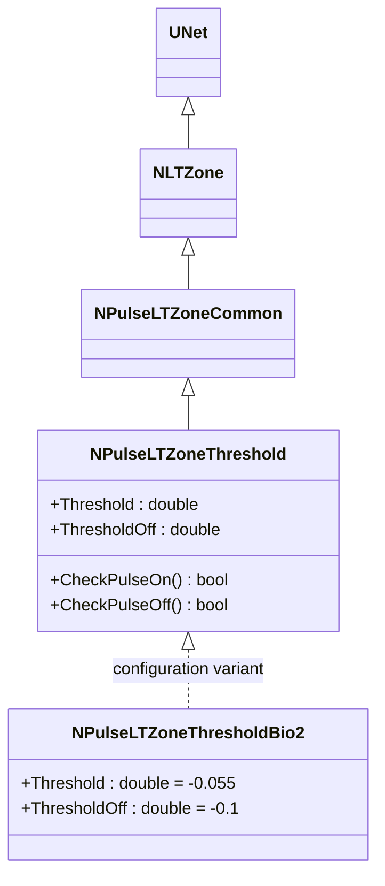
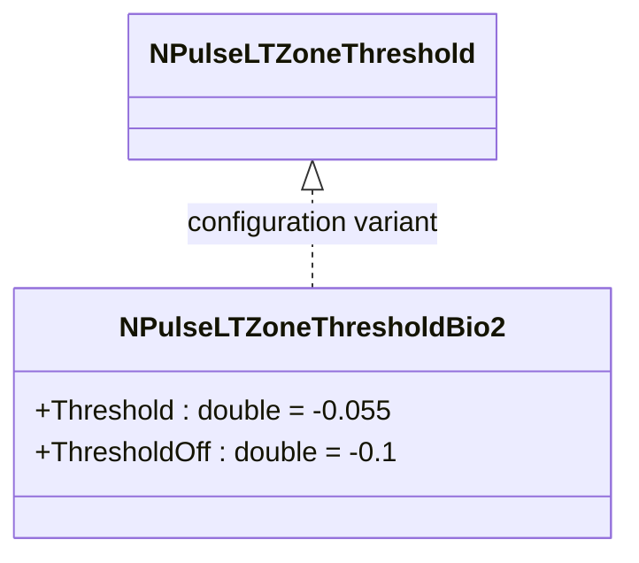

# NPulseLTZoneThresholdBio2 — биоинспирированная LT-зона с порогом (версия 2)

## RU

### Назначение

**Класс**: `NPulseLTZoneThresholdBio2` — конфигурационный вариант импульсной LT-зоны с порогом для биологических моделей (версия 2).  
**Регистрация**: `NPulseLibrary.cpp` → `UploadClass("NPulseLTZoneThresholdBio2", ...)`.  
**Storage-инстансы**: `ClassName = "NPulseLTZoneThresholdBio2"` в `Bin/Configs/*/Model_*.xml`.

`NPulseLTZoneThresholdBio2` является конфигурационным вариантом класса `NPulseLTZoneThreshold` с параметрами, оптимизированными для биологических моделей (версия 2). При создании компонента с `ClassName = "NPulseLTZoneThresholdBio2"` создается экземпляр `NPulseLTZoneThreshold` с параметрами:
- `Threshold = -0.055` (-55 мВ) — порог генерации спайка
- `ThresholdOff = -0.1` (-100 мВ) — порог окончания спайка

**Использование:** Биоинспирированная LT-зона с порогом (версия 2), улучшенные параметры для биологических моделей

### UML-диаграмма классов



**Иерархия наследования:**
- `UNet` — базовая сеть Rdk Framework
- `NLTZone` — базовая LT-зона
- `NPulseLTZoneCommon` — общая импульсная LT-зона
- `NPulseLTZoneThreshold` — базовая импульсная LT-зона с порогом
- `NPulseLTZoneThresholdBio2` — конфигурационный вариант для биологических моделей (версия 2)

**Параметры конфигурации:**
- `Threshold = -0.055` (-55 мВ) — порог генерации спайка
- `ThresholdOff = -0.1` (-100 мВ) — порог окончания спайка

### Свойства

`NPulseLTZoneThresholdBio2` использует все свойства базового класса `NPulseLTZoneThreshold` с параметрами:
- `Threshold = -0.055` (-55 мВ)
- `ThresholdOff = -0.1` (-100 мВ)

### Методы

`NPulseLTZoneThresholdBio2` использует все методы базового класса `NPulseLTZoneThreshold`.

### Примеры использования

#### Пример 1: Создание LT-зоны в коде C++

```cpp
// Создание биоинспирированной LT-зоны с порогом (версия 2)
auto ltZone = storage->CreateComponent("NPulseLTZoneThresholdBio2");
ltZone->SetName("LTZoneThresholdBio2");

// Инициализация (использует параметры по умолчанию)
ltZone->Default();

// Использование
ltZone->Build();
```

## Источники

См. [Literature-References.md](../Literature-References.md): **26**, **29**, **30**.

### См. также

- [`NPulseLTZoneThreshold`](NPulseLTZoneThreshold.md) — базовая LT-зона с порогом (базовый класс)
- [`NPulseLTZoneThresholdBio`](NPulseLTZoneThresholdBio.md) — биоинспирированная LT-зона с порогом (версия 1)
- [`NPulseLTZoneCommon`](NPulseLTZoneCommon.md) — общая импульсная LT-зона
- [Architecture.md](../Architecture.md) — архитектура библиотеки

---

## EN

### Purpose

**Class**: `NPulseLTZoneThresholdBio2` — configuration variant of spiking LT-zone with threshold for biological models (version 2).  
**Registration**: `NPulseLibrary.cpp` → `UploadClass("NPulseLTZoneThresholdBio2", ...)`.  
**Instances**: `ClassName = "NPulseLTZoneThresholdBio2"` in `Bin/Configs/*/Model_*.xml`.

`NPulseLTZoneThresholdBio2` is a configuration variant of `NPulseLTZoneThreshold` class with parameters optimized for biological models (version 2). When creating a component with `ClassName = "NPulseLTZoneThresholdBio2"`, an instance of `NPulseLTZoneThreshold` is created with parameters:
- `Threshold = -0.055` (-55 mV) — spike generation threshold
- `ThresholdOff = -0.1` (-100 mV) — spike termination threshold

**Usage:** Bio-inspired LT-zone with threshold (version 2), improved parameters for biological models

### UML Class Diagram



### References

See [Literature-References.md](../Literature-References.md): **26**, **29**, **30**.

### See Also

- [`NPulseLTZoneThreshold`](NPulseLTZoneThreshold.md) — base LT-zone with threshold (base class)
- [`NPulseLTZoneThresholdBio`](NPulseLTZoneThresholdBio.md) — bio LT-zone with threshold (version 1)
- [`NPulseLTZoneCommon`](NPulseLTZoneCommon.md) — common spiking LT-zone
- [Architecture.md](../Architecture.md) — library architecture
