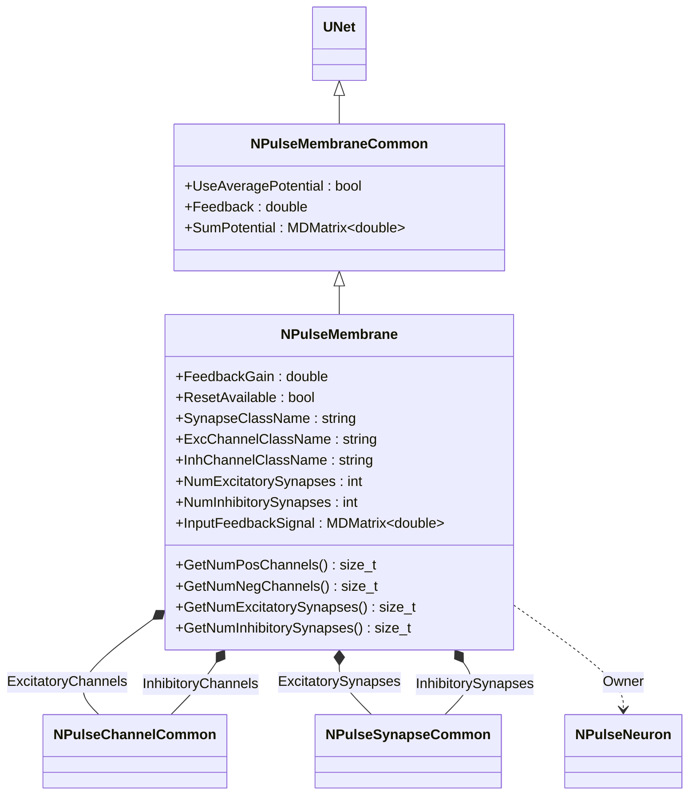
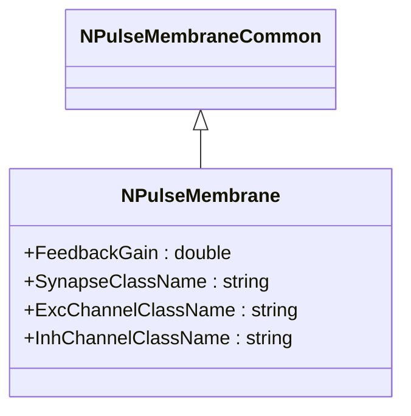
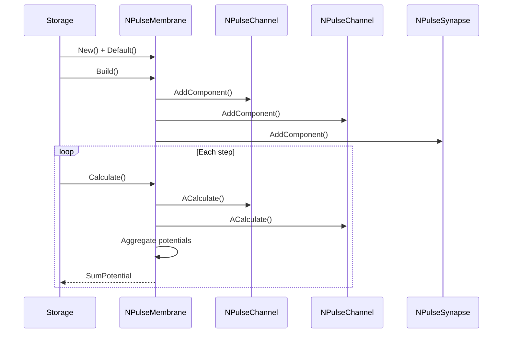
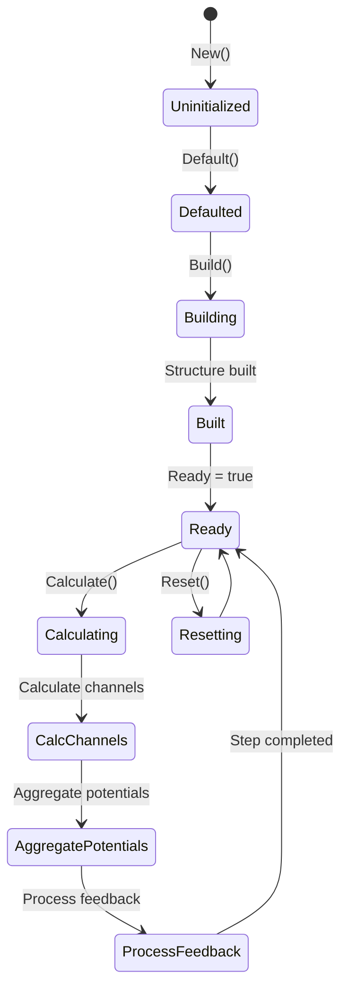
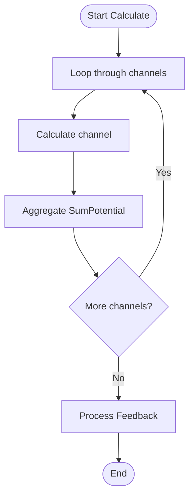
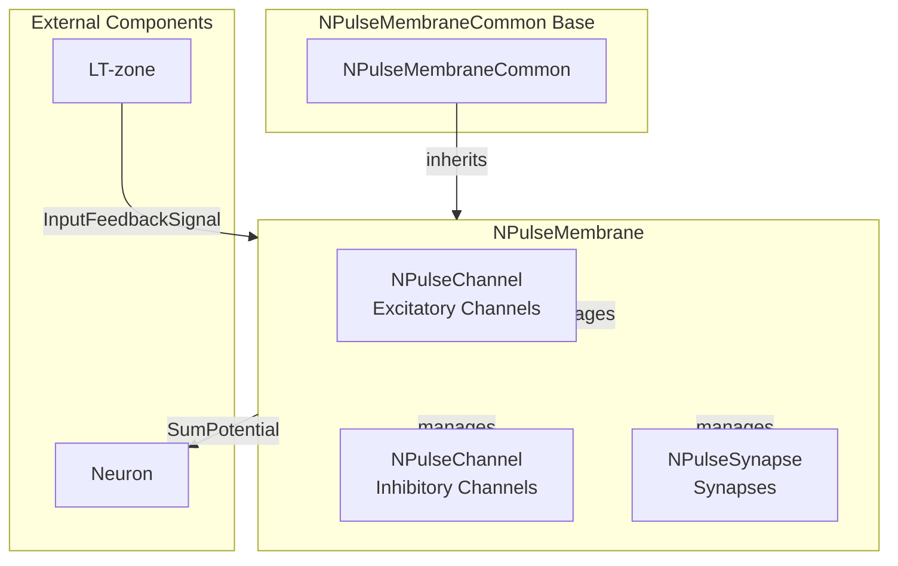

# NPulseMembrane — импульсная мембрана

## RU

### Назначение

**Класс**: `NPulseMembrane` — базовая импульсная мембрана с управлением каналами и синапсами.  
**Регистрация**: `NPulseLibrary.cpp` → `UploadClass("NPulseMembrane", ...)`.  
**Storage-инстансы**: `ClassName = "NPulseMembrane"` в `Bin/Configs/*/Model_*.xml`.

`NPulseMembrane` реализует базовую импульсную мембрану с управлением возбуждающими и тормозными каналами и синапсами. Наследуется от `NPulseMembraneCommon` и добавляет параметры для управления классами синапсов и каналов, а также обратной связью.

**Использование:** Базовая импульсная мембрана, управление каналами и синапсами

### UML-диаграмма классов

**Иерархия наследования:**
- `UNet` — базовая сеть Rdk Framework
- `NPulseMembraneCommon` — общая импульсная мембрана
- `NPulseMembrane` — базовая импульсная мембрана

### Свойства

#### Параметры (ptPubParameter)

- **`FeedbackGain`** (double) — коэффициент усиления обратной связи. Используется для расчета обратной связи мембраны. Значение по умолчанию: зависит от реализации

- **`ResetAvailable`** (bool) — флаг доступности сброса. Определяет, можно ли сбрасывать состояние мембраны. Значение по умолчанию: зависит от реализации

- **`SynapseClassName`** (string) — имя класса синапсов для автоматического создания. Значение по умолчанию: зависит от реализации

- **`ExcChannelClassName`** (string) — имя класса возбуждающих каналов для автоматического создания. Значение по умолчанию: зависит от реализации

- **`InhChannelClassName`** (string) — имя класса тормозных каналов для автоматического создания. Значение по умолчанию: зависит от реализации

- **`NumExcitatorySynapses`** (int) — количество возбуждающих синапсов для автоматического создания. Значение по умолчанию: зависит от реализации

- **`NumInhibitorySynapses`** (int) — количество тормозных синапсов для автоматического создания. Значение по умолчанию: зависит от реализации

#### Входные свойства (ptInput | ptPubState)

- **`InputFeedbackSignal`** (MDMatrix<double>) — входной сигнал обратной связи. Используется для расчета обратной связи мембраны.

### Методы

#### Публичные методы

- **`GetNumPosChannels()`** → `size_t` — возвращает количество возбуждающих каналов.

- **`GetPosChannel(size_t i)`** → `NPulseChannelCommon*` — возвращает возбуждающий канал по индексу. **Примечание:** Фактическое имя компонента канала — `"ExcChannel"` (Type=-1).

- **`GetNumNegChannels()`** → `size_t` — возвращает количество тормозных каналов.

- **`GetNegChannel(size_t i)`** → `NPulseChannelCommon*` — возвращает тормозной канал по индексу. **Примечание:** Фактическое имя компонента канала — `"InhChannel"` (Type=1).

- **`GetNumExcitatorySynapses()`** → `size_t` — возвращает количество возбуждающих синапсов.

- **`GetExcitatorySynapses(size_t i)`** → `NPulseSynapseCommon*` — возвращает возбуждающий синапс по индексу.

- **`GetNumInhibitorySynapses()`** → `size_t` — возвращает количество тормозных синапсов.

- **`GetInhibitorySynapses(size_t i)`** → `NPulseSynapseCommon*` — возвращает тормозной синапс по индексу.

- **`UpdateChannelData(UEPtr<NPulseChannelCommon> channel, UEPtr<UIPointer> pointer=0)`** → `bool` — обновляет данные канала.

- **`UpdateSynapseData(UEPtr<NPulseSynapseCommon> synapse, UEPtr<UIPointer> pointer=0)`** → `bool` — обновляет данные синапса.

### Использование в конфигурациях

`NPulseMembrane` используется в экспериментах с импульсными мембранами:

- **Базовые мембраны**: `Bin/Configs/!OldConfigs/NM-Neurons/` (эксперименты с нейронами)

**Типичные значения параметров:**
- **FeedbackGain**: коэффициент усиления обратной связи
- **SynapseClassName**: имя класса синапсов для автоматического создания
- **ExcChannelClassName**: имя класса возбуждающих каналов
- **InhChannelClassName**: имя класса тормозных каналов
- **NumExcitatorySynapses**: количество возбуждающих синапсов
- **NumInhibitorySynapses**: количество тормозных синапсов

**Особенности:**
- Управление каналами: автоматическое создание и управление возбуждающими и тормозными каналами
- Управление синапсами: автоматическое создание и управление синапсами
- Обратная связь: поддержка обратной связи от LT-зоны через `InputFeedbackSignal`

## Источники

См. [Literature-References.md](../Literature-References.md): **[A]**, **4**, **25**, **29**.

### См. также

- [`NPulseMembraneCommon`](NPulseMembraneCommon.md) — общая импульсная мембрана
- [`NPulseMembraneIzhikevich`](NPulseMembraneIzhikevich.md) — мембрана модели Ижикевича
- [`NPulseMembraneIaF`](NPulseMembraneIaF.md) — мембрана модели IaF
- [`NPulseChannel`](NPulseChannel.md) — импульсный канал
- [Architecture.md](../Architecture.md) — архитектура библиотеки

---

## EN

### Purpose

**Class**: `NPulseMembrane` — base spiking membrane with channel and synapse management.  
**Registration**: `NPulseLibrary.cpp` → `UploadClass("NPulseMembrane", ...)`.  
**Instances**: `ClassName = "NPulseMembrane"` in `Bin/Configs/*/Model_*.xml`.

`NPulseMembrane` implements base spiking membrane with management of excitatory and inhibitory channels and synapses. Inherits from `NPulseMembraneCommon` and adds parameters for managing synapse and channel classes, as well as feedback.

**Usage:** Base spiking membrane, channel and synapse management

### UML Class Diagram

### UML Sequence Diagram

### UML State Diagram

### UML Activity Diagram

### UML Component Diagram

### References

See [Literature-References.md](../Literature-References.md): **[A]**, **4**, **25**, **29**.

### See Also

- [`NPulseMembraneCommon`](NPulseMembraneCommon.md) — common spiking membrane
- [`NPulseMembraneIzhikevich`](NPulseMembraneIzhikevich.md) — Izhikevich membrane
- [`NPulseMembraneIaF`](NPulseMembraneIaF.md) — IaF membrane
- [`NPulseChannel`](NPulseChannel.md) — spiking channel
- [Architecture.md](../Architecture.md) — library architecture
