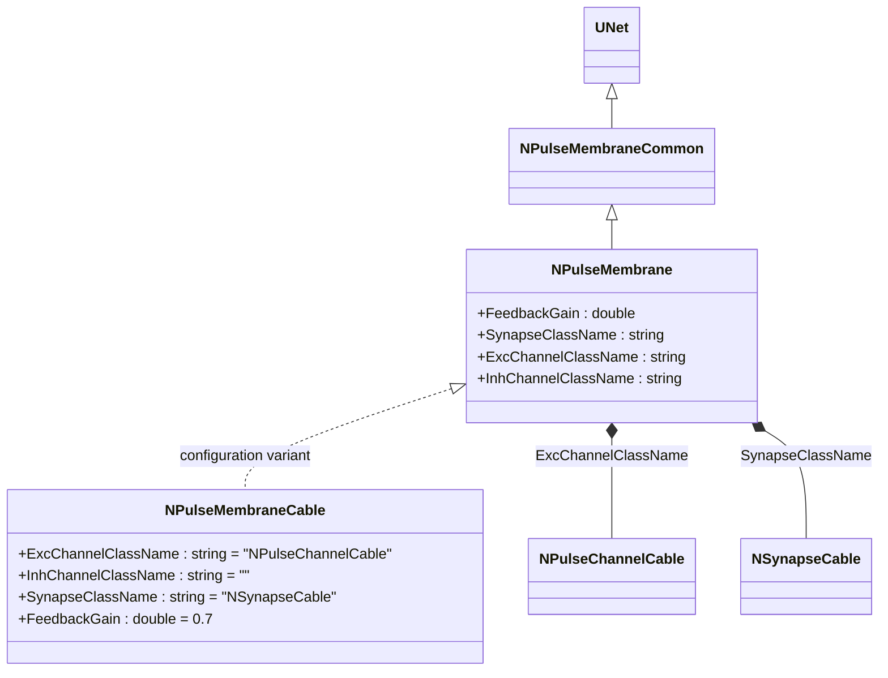
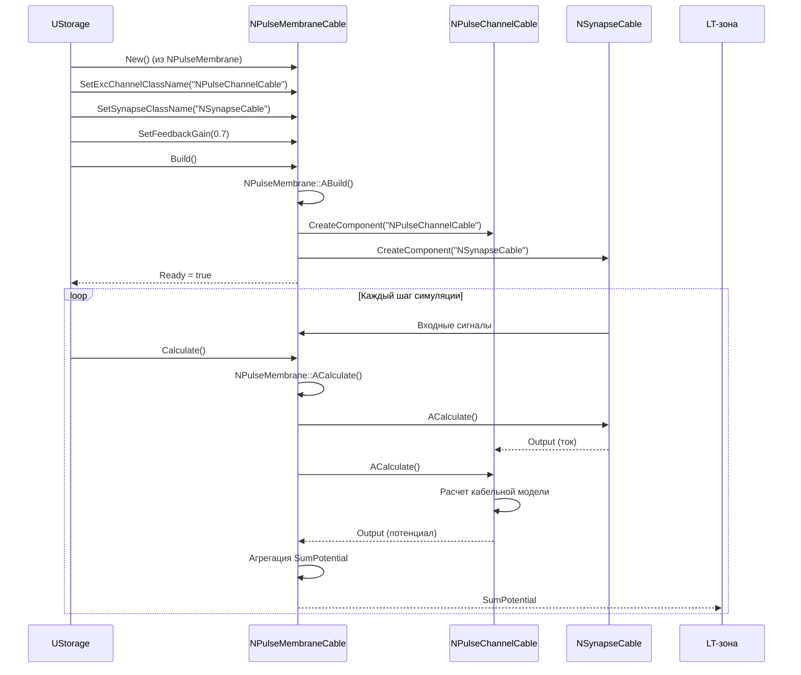
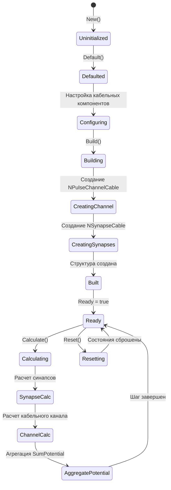
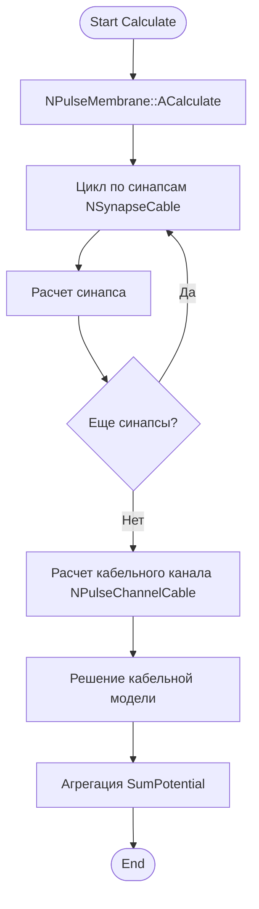
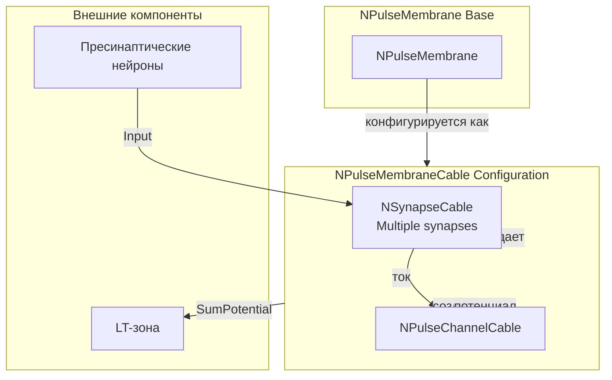
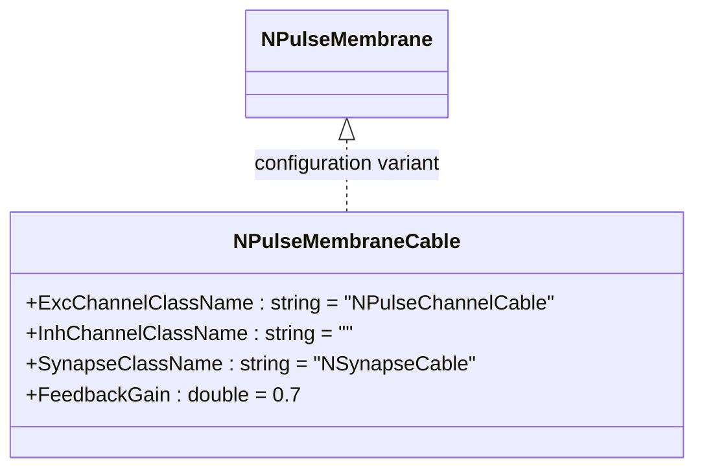
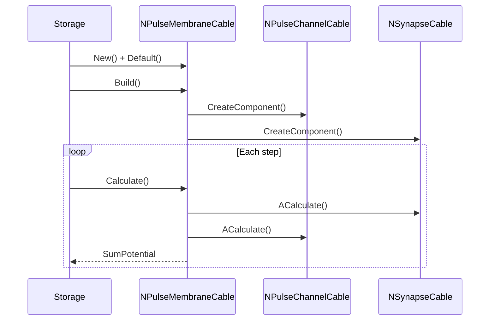
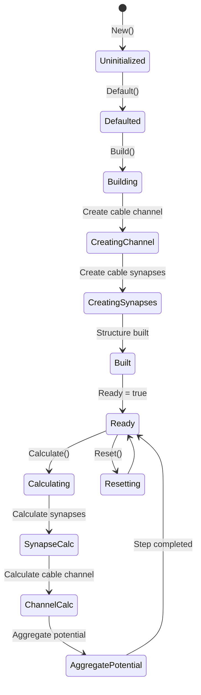
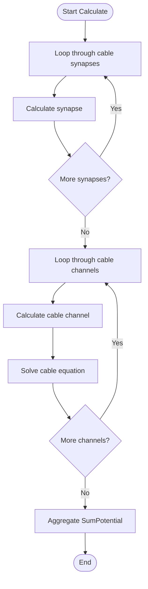
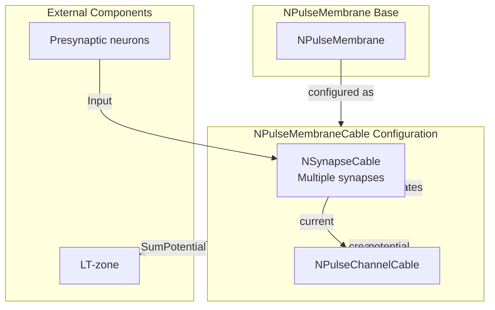

# NPulseMembraneCable — кабельная импульсная мембрана

## RU

### Назначение

**Класс**: `NPulseMembraneCable` — конфигурационный вариант импульсной мембраны для кабельных моделей.
**Регистрация**: `NPulseLibrary.cpp` → `UploadClass("NPulseMembraneCable", ...)`.
**Storage-инстансы**: `ClassName = "NPulseMembraneCable"` в `Bin/Configs/*/Model_*.xml`.

`NPulseMembraneCable` является конфигурационным вариантом класса `NPulseMembrane` с параметрами для кабельных моделей. При создании компонента с `ClassName = "NPulseMembraneCable"` создается экземпляр `NPulseMembrane` с параметрами:
- `ExcChannelClassName = "NPulseChannelCable"` — кабельный возбуждающий канал
- `InhChannelClassName = ""` — тормозной канал не используется
- `SynapseClassName = "NSynapseCable"` — кабельный синапс
- `FeedbackGain = 0.7` — коэффициент обратной связи

Сегмент мембраны в CSNM описывается кабельным уравнением; параметры r_i (внутреннее сопротивление), r_m (сопротивление мембраны) связаны с уравнениями (1.8)–(1.9) по [C].

**Использование:** Кабельная импульсная мембрана, моделирование дендритов с кабельной моделью

### UML-диаграмма классов



**Иерархия наследования:**
- `UNet` — базовая сеть Rdk Framework
- `NPulseMembraneCommon` — общая импульсная мембрана
- `NPulseMembrane` — базовая импульсная мембрана
- `NPulseMembraneCable` — конфигурационный вариант для кабельных моделей

**Параметры конфигурации:**
- `ExcChannelClassName = "NPulseChannelCable"` — кабельный возбуждающий канал
- `InhChannelClassName = ""` — тормозной канал не используется
- `SynapseClassName = "NSynapseCable"` — кабельный синапс
- `FeedbackGain = 0.7` — коэффициент обратной связи

### UML-диаграмма последовательности



**Жизненный цикл:**
1. **Создание**: `NPulseMembraneCable` создается из `NPulseMembrane` с настройкой параметров
2. **Настройка**: Устанавливаются кабельные канал и синапс
3. **Сборка**: Автоматически создаются кабельный канал и синапсы
4. **Расчет**: На каждом шаге рассчитываются синапсы и кабельный канал, агрегируются потенциалы

### UML-диаграмма состояний



**Состояния:**
- **Uninitialized** — создан, но не инициализирован
- **Defaulted** — параметры установлены по умолчанию
- **Configuring** — настройка кабельных компонентов
- **Building** — выполняется сборка
- **CreatingChannel** — создание кабельного канала
- **CreatingSynapses** — создание кабельных синапсов
- **Built** — структура мембраны построена
- **Ready** — готов к выполнению расчетов
- **Calculating** — выполняется расчет мембраны
- **SynapseCalc** — расчет кабельных синапсов
- **ChannelCalc** — расчет кабельного канала
- **AggregatePotential** — агрегация потенциалов
- **Resetting** — выполняется сброс состояний

### UML-диаграмма активности



**Алгоритм расчета:**
1. Вызов базового расчета (`NPulseMembrane::ACalculate()`)
2. Расчет всех кабельных синапсов (`NSynapseCable`)
3. Расчет кабельного канала (`NPulseChannelCable`): решение кабельной модели
4. Агрегация потенциалов от кабельного канала
5. Обновление выходного сигнала мембраны

### UML-диаграмма компонентов



**Зависимости:**
- **Базовый класс**: `NPulseMembrane` (конфигурационный вариант)
- **Внутренние компоненты**: `NPulseChannelCable` (кабельный канал), `NSynapseCable` (кабельные синапсы)
- **Внешние компоненты**: пресинаптические нейроны (источники входных сигналов), LT-зона (получатель выходного сигнала)

### Свойства

`NPulseMembraneCable` использует все свойства базового класса `NPulseMembrane` с параметрами:
- `ExcChannelClassName = "NPulseChannelCable"`
- `InhChannelClassName = ""`
- `SynapseClassName = "NSynapseCable"`
- `FeedbackGain = 0.7`

### Методы

`NPulseMembraneCable` использует все методы базового класса `NPulseMembrane`.

### Примеры использования

#### Пример 1: Создание мембраны в коде C++

```cpp
// Создание кабельной мембраны
auto membrane = storage->CreateComponent("NPulseMembraneCable");
membrane->SetName("PulseMembraneCable");

// Инициализация (использует параметры по умолчанию)
membrane->Default();

// Использование
membrane->Build();
```

### Использование в конфигурациях

`NPulseMembraneCable` используется в экспериментах с кабельной моделью:

- **Кабельная модель**: `Bin/Configs/!OldConfigs/*/Model_*.xml` (где требуется кабельная модель мембраны)

**Типичные значения параметров:**
- **ExcChannelClassName**: "NPulseChannelCable" (кабельный возбуждающий канал)
- **InhChannelClassName**: "" (тормозной канал не используется)
- **SynapseClassName**: "NSynapseCable" (кабельный синапс)
- **FeedbackGain**: 0.7 (коэффициент обратной связи)

### Использование в конфигурациях

`NPulseMembraneCable` используется в экспериментах с кабельной моделью:

- **Кабельная модель**: `Bin/Configs/!OldConfigs/*/Model_*.xml` (где требуется кабельная мембрана)

**Типичные значения параметров:**
- **ExcChannelClassName**: "NPulseChannelCable" (кабельный возбуждающий канал)
- **InhChannelClassName**: "" (тормозной канал не используется)
- **SynapseClassName**: "NSynapseCable" (кабельный синапс)
- **FeedbackGain**: 0.7 (коэффициент обратной связи)

## Источники

См. [Literature-References.md](../Literature-References.md): **[C]**, **7**, **5**, **6**.

### См. также

- [`NPulseMembrane`](NPulseMembrane.md) — базовая импульсная мембрана (базовый класс)
- [`NPulseMembraneCableMulti`](NPulseMembraneCableMulti.md) — многоканальная кабельная мембрана
- [`NPulseChannelCable`](NPulseChannelCable.md) — кабельный импульсный канал
- [`NSynapseCable`](NSynapseCable.md) — кабельный синапс
- [Architecture.md](../Architecture.md) — архитектура библиотеки

---

## EN

### Purpose

**Class**: `NPulseMembraneCable` — configuration variant of spiking membrane for cable models.
**Registration**: `NPulseLibrary.cpp` → `UploadClass("NPulseMembraneCable", ...)`.
**Instances**: `ClassName = "NPulseMembraneCable"` in `Bin/Configs/*/Model_*.xml`.

`NPulseMembraneCable` is a configuration variant of `NPulseMembrane` class with parameters for cable models. When creating a component with `ClassName = "NPulseMembraneCable"`, an instance of `NPulseMembrane` is created with parameters:
- `ExcChannelClassName = "NPulseChannelCable"` — cable excitatory channel
- `InhChannelClassName = ""` — inhibitory channel not used
- `SynapseClassName = "NSynapseCable"` — cable synapse
- `FeedbackGain = 0.7` — feedback gain

In CSNM, the membrane segment is described by the cable equation; parameters r_i (axial resistance) and r_m (membrane resistance) correspond to equations (1.8)–(1.9) in [C].

**Usage:** Cable spiking membrane, dendrite modeling with cable model

### UML Class Diagram



### UML Sequence Diagram



### UML State Diagram



### UML Activity Diagram



### UML Component Diagram



### Usage in configurations

`NPulseMembraneCable` is used in cable model experiments:

- **Cable model**: `Bin/Configs/!OldConfigs/*/Model_*.xml` (where cable membrane is required)

**Typical parameter values:**
- **ExcChannelClassName**: "NPulseChannelCable" (cable excitatory channel)
- **InhChannelClassName**: "" (inhibitory channel not used)
- **SynapseClassName**: "NSynapseCable" (cable synapse)
- **FeedbackGain**: 0.7 (feedback gain)

### References

See [Literature-References.md](../Literature-References.md): **[C]**, **7**, **5**, **6**.

### See Also

- [`NPulseMembrane`](NPulseMembrane.md) — base spiking membrane (base class)
- [`NPulseMembraneCableMulti`](NPulseMembraneCableMulti.md) — multi-channel cable membrane
- [`NPulseChannelCable`](NPulseChannelCable.md) — cable spiking channel
- [`NSynapseCable`](NSynapseCable.md) — cable synapse
- [Architecture.md](../Architecture.md) — library architecture
