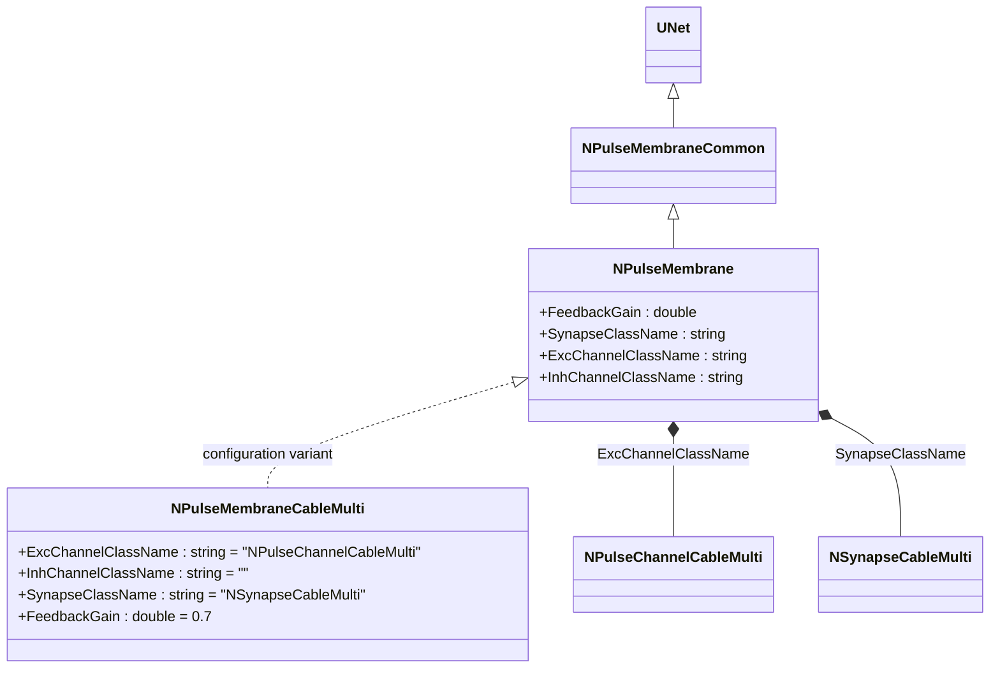
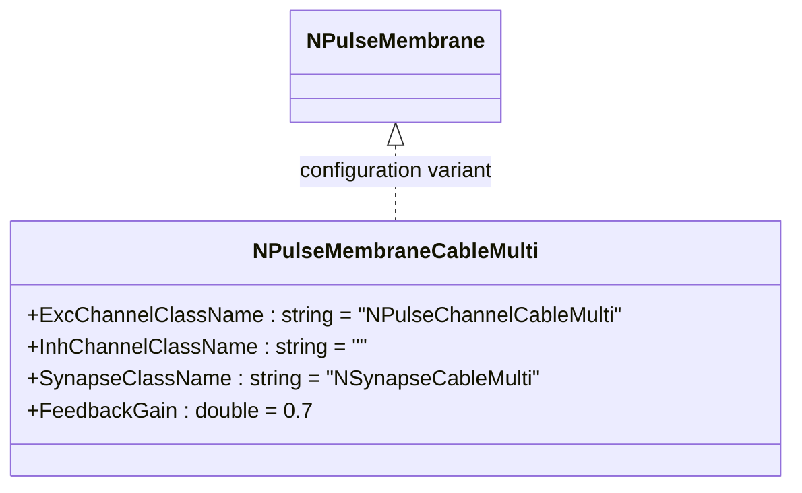
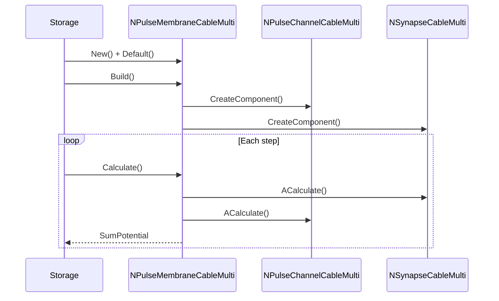
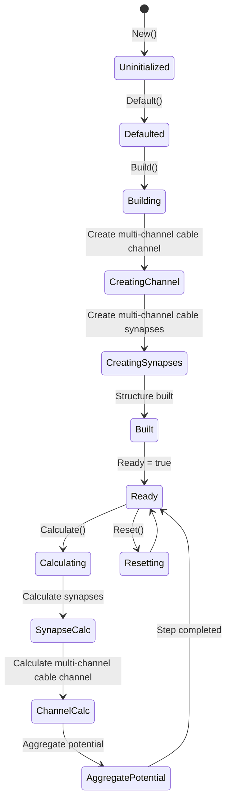
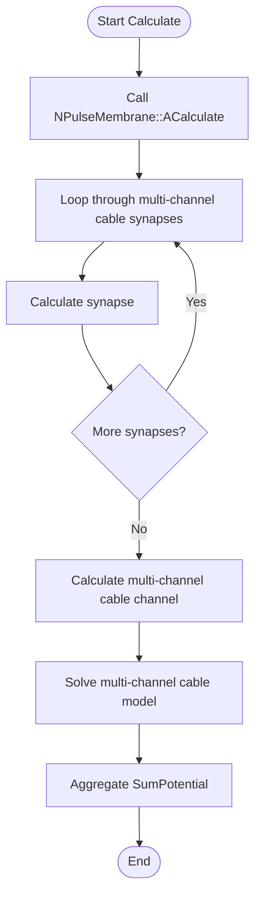
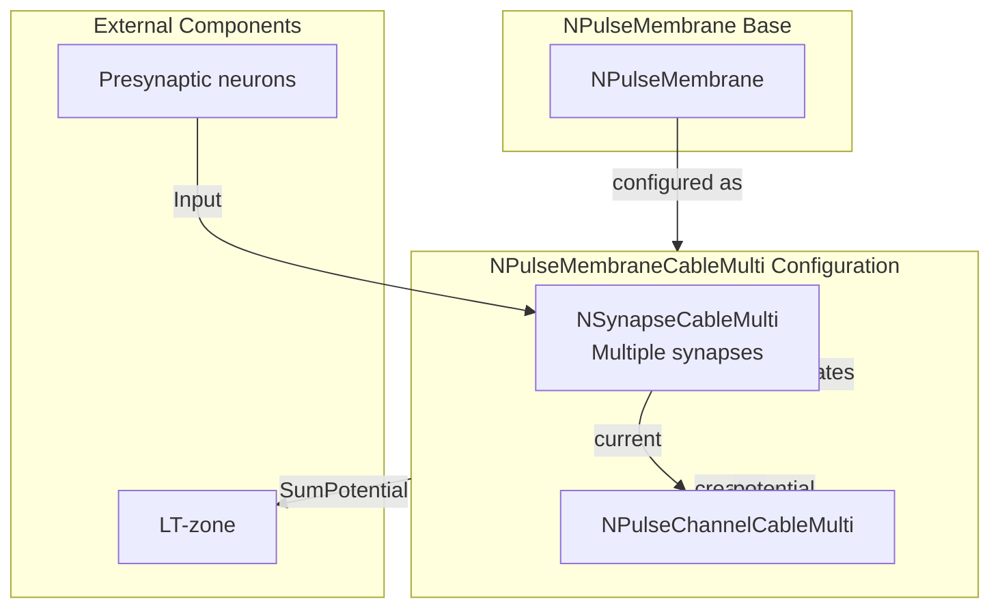

# NPulseMembraneCableMulti — многоканальная кабельная импульсная мембрана

## RU

### Назначение

**Класс**: `NPulseMembraneCableMulti` — конфигурационный вариант импульсной мембраны для многоканальных кабельных моделей.  
**Регистрация**: `NPulseLibrary.cpp` → `UploadClass("NPulseMembraneCableMulti", ...)`.  
**Storage-инстансы**: `ClassName = "NPulseMembraneCableMulti"` в `Bin/Configs/*/Model_*.xml`.

`NPulseMembraneCableMulti` является конфигурационным вариантом класса `NPulseMembrane` с параметрами для многоканальных кабельных моделей. При создании компонента с `ClassName = "NPulseMembraneCableMulti"` создается экземпляр `NPulseMembrane` с параметрами:
- `ExcChannelClassName = "NPulseChannelCableMulti"` — многоканальный кабельный возбуждающий канал
- `InhChannelClassName = ""` — тормозной канал не используется
- `SynapseClassName = "NSynapseCableMulti"` — многоканальный кабельный синапс
- `FeedbackGain = 0.7` — коэффициент обратной связи

**Использование:** Многоканальная кабельная импульсная мембрана, моделирование сложных дендритов

### UML-диаграмма классов



**Иерархия наследования:**
- `UNet` — базовая сеть Rdk Framework
- `NPulseMembraneCommon` — общая импульсная мембрана
- `NPulseMembrane` — базовая импульсная мембрана
- `NPulseMembraneCableMulti` — конфигурационный вариант для многоканальных кабельных моделей

**Параметры конфигурации:**
- `ExcChannelClassName = "NPulseChannelCableMulti"` — многоканальный кабельный возбуждающий канал
- `InhChannelClassName = ""` — тормозной канал не используется
- `SynapseClassName = "NSynapseCableMulti"` — многоканальный кабельный синапс
- `FeedbackGain = 0.7` — коэффициент обратной связи

### Свойства

`NPulseMembraneCableMulti` использует все свойства базового класса `NPulseMembrane` с параметрами:
- `ExcChannelClassName = "NPulseChannelCableMulti"`
- `InhChannelClassName = ""`
- `SynapseClassName = "NSynapseCableMulti"`
- `FeedbackGain = 0.7`

### Методы

`NPulseMembraneCableMulti` использует все методы базового класса `NPulseMembrane`.

### Примеры использования

#### Пример 1: Создание мембраны в коде C++

```cpp
// Создание многоканальной кабельной мембраны
auto membrane = storage->CreateComponent("NPulseMembraneCableMulti");
membrane->SetName("PulseMembraneCableMulti");

// Инициализация (использует параметры по умолчанию)
membrane->Default();

// Использование
membrane->Build();
```

### См. также

- [`NPulseMembrane`](NPulseMembrane.md) — базовая импульсная мембрана (базовый класс)
- [`NPulseMembraneCable`](NPulseMembraneCable.md) — кабельная импульсная мембрана
- [`NPulseChannelCableMulti`](NPulseChannelCableMulti.md) — многоканальный кабельный канал
- [`NSynapseCableMulti`](NSynapseCableMulti.md) — многоканальный кабельный синапс
- [Architecture.md](../Architecture.md) — архитектура библиотеки

---

## EN

### Purpose

**Class**: `NPulseMembraneCableMulti` — configuration variant of spiking membrane for multi-channel cable models.  
**Registration**: `NPulseLibrary.cpp` → `UploadClass("NPulseMembraneCableMulti", ...)`.  
**Instances**: `ClassName = "NPulseMembraneCableMulti"` in `Bin/Configs/*/Model_*.xml`.

`NPulseMembraneCableMulti` is a configuration variant of `NPulseMembrane` class with parameters for multi-channel cable models. When creating a component with `ClassName = "NPulseMembraneCableMulti"`, an instance of `NPulseMembrane` is created with parameters:
- `ExcChannelClassName = "NPulseChannelCableMulti"` — multi-channel cable excitatory channel
- `InhChannelClassName = ""` — inhibitory channel not used
- `SynapseClassName = "NSynapseCableMulti"` — multi-channel cable synapse
- `FeedbackGain = 0.7` — feedback gain

**Usage:** Multi-channel cable spiking membrane, complex dendrite modeling

### UML Class Diagram



### UML Sequence Diagram



### UML State Diagram



### UML Activity Diagram



### UML Component Diagram



### Usage in configurations

`NPulseMembraneCableMulti` is used in multi-channel cable model experiments:

- **Multi-channel cable model**: `Bin/Configs/!OldConfigs/*/Model_*.xml` (where multi-channel cable membrane is required)

**Typical parameter values:**
- **ExcChannelClassName**: "NPulseChannelCableMulti" (multi-channel cable excitatory channel)
- **InhChannelClassName**: "" (inhibitory channel not used)
- **SynapseClassName**: "NSynapseCableMulti" (multi-channel cable synapse)
- **FeedbackGain**: 0.7 (feedback gain)

### See Also

- [`NPulseMembrane`](NPulseMembrane.md) — base spiking membrane (base class)
- [`NPulseMembraneCable`](NPulseMembraneCable.md) — cable spiking membrane
- [`NPulseChannelCableMulti`](NPulseChannelCableMulti.md) — multi-channel cable channel
- [`NSynapseCableMulti`](NSynapseCableMulti.md) — multi-channel cable synapse
- [Architecture.md](../Architecture.md) — library architecture
